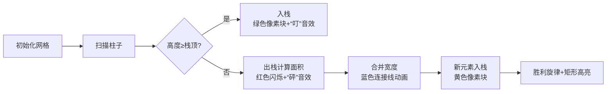

# 题目信息

# [蓝桥杯青少年组省赛 2023] 最大的矩形纸片

## 题目描述

一张半边参差不齐的网格纸（网格边长均为 $1$），有一边是完整没有破损的。现要从中剪出一片面积最大的矩形纸片。

给定网格纸中完整边的长度 $N$（$1 \leq N \leq 1\,000\,000$），以及网格中每一列残存部分的高度（$1 \leq$ 高度 $\leq 10\,000$），输出能够剪出的最大矩形纸片面积。

## 样例 #1

### 输入

```
6
3 2 1 4 5 2```

### 输出

```
8```

# AI分析结果


### 💡 Kay的C++算法解析：最大的矩形纸片 深入学习指南 💡

**引言**  
今天我们分析蓝桥杯青少年组省赛题"最大的矩形纸片"。本指南将帮助大家掌握单调栈的核心思想，理解高效求解最大矩形面积的技巧。

---

### 1. 题目解读与核心算法识别

✨ **本题主要考察**：`单调栈`（编程技巧应用）  

🗣️ **初步分析**：  
> 单调栈如同"高度过滤器"，维护一个高度递增的序列（想象叠放书本时只保留逐本变高的书）。当新元素破坏单调性时，立即计算栈顶元素能形成的最大矩形面积。  
- **核心难点**：  
  - 暴力枚举左右边界需O(n²)，超时  
  - 需高效计算每个高度可扩展的最大宽度  
- **解决方案**：  
  使用单调栈在O(n)时间内确定每个高度左右第一个更矮的位置  
- **可视化设计**：  
  采用8位像素风格网格，用颜色区分：  
  - 红色：当前处理的柱子  
  - 蓝色：栈内待处理柱子  
  - 绿色：已计算的最大矩形  
  关键步骤触发FC音效（入栈"叮"，出栈"砰"，找到矩形"胜利旋律"）  

---

### 2. 精选优质题解参考

**题解一（作者：raincs）**  
* **点评**：  
  思路清晰解释单调栈原理（类比高度过滤），双实现（数组/STL）展现灵活性。代码规范（`s[]`存高度，`w[]`存宽度），亮点在合并宽度时同步计算面积，避免二次扫描。实践价值高，添加`a[n+1]=0`巧妙处理剩余栈元素。

**题解二（作者：wangxiaochai）**  
* **点评**：  
  逻辑推导严谨（引入哨兵`stack.push(0)`防空栈），代码精简高效。亮点在显式右边界处理（`while(s.top()!=0)`），实践性强。解释出栈时宽度计算`w=i-s.top()-1`直观易懂。

**题解三（作者：superLouis）**  
* **点评**：  
  结构清晰分预处理+求解两阶段，`struct node`封装高度宽度。亮点在左右独立栈处理，时间复杂度分析透彻。代码含`IOS`加速指令，适合竞赛场景。

---

### 3. 核心难点辨析与解题策略

1. **高效确定边界**  
   *分析*：朴素法需O(n²)比较相邻高度。单调栈维护递增序列，遇到矮柱子时栈顶右边界即确定（左边界为栈内前一元素）。  
   💡 **学习笔记**：单调栈用空间换时间，将边界查找降至O(1)均摊

2. **宽度合并计算**  
   *分析*：出栈时累加宽度（`width += w[top]`），新元素入栈宽度=累加值+1。确保宽度计算与高度单调性同步更新。  
   💡 **学习笔记**：宽度合并是避免重复计算的关键优化点

3. **剩余栈处理**  
   *分析*：扫描结束后栈内元素无右边界？添加0高度哨兵（`a[n+1]=0`）强制所有元素出栈计算。  
   💡 **学习笔记**：哨兵技巧可消除边界特判

#### ✨ 解题技巧总结
- **空间换时间**：单调栈存储索引/宽度，避免重复扫描  
- **状态封装**：将高度与扩展宽度绑定（如`struct node`）  
- **哨兵优化**：首尾加0高度柱自动处理边界  
- **实时更新**：出栈时立即计算面积，避免二次遍历  

---

### 4. C++核心代码实现赏析

**通用核心实现参考**  
```cpp
#include <bits/stdc++.h>
#define ll long long
using namespace std;
const int N=1e6+5;

int main() {
    int n; cin>>n;
    vector<ll> a(n+2,0);
    for(int i=1;i<=n;i++) cin>>a[i];

    stack<int> st; st.push(0);
    ll ans=0;
    for(int i=1;i<=n+1;i++) {
        while(a[i]<a[st.top()]) {
            int h=a[st.top()]; st.pop();
            int w=i-st.top()-1;
            ans=max(ans,(ll)h*w);
        }
        st.push(i);
    }
    cout<<ans;
}
```
* **代码解读概要**：  
  - `a[n+1]=0` 作为哨兵强制清栈  
  - 栈存索引，`i-st.top()-1` 计算宽度  
  - 出栈时用栈顶高度和宽度更新最大面积  

---

**题解一核心片段（raincs）**  
```cpp
s[++p]=a[i]; w[p]=1;  // 高度递增直接入栈
else {
    int width=0;
    while(s[p]>a[i]) {
        width += w[p];  // 合并出栈柱宽度
        ans=max(ans,width*s[p]); // 立即计算面积
        p--;
    }
    s[++p]=a[i]; 
    w[p]=width+1;  // 新元素宽度=合并值+1
}
```
* **亮点**：宽度合并与面积计算同步  
* **学习笔记**：实时合并宽度避免二次扫描  

**题解二核心片段（wangxiaochai）**  
```cpp
stack<int> s; s.push(0); // 哨兵防空栈
while(a[i]<a[s.top()]){
    int h=a[s.top()]; s.pop();
    int w=i-s.top()-1;  // 宽度=当前-栈顶-1
    MAX=max(MAX,h*w);
}
```
* **亮点**：显式右边界计算  
* **学习笔记**：`i-s.top()-1` 包含左边界到当前位置  

**题解三核心片段（superLouis）**  
```cpp
struct node{ int idx,num; };
stack<node> lstk, rstk;  // 左右独立栈
for(int i=1;i<=n;i++){
    while(!lstk.empty() && a[i]<lstk.top().num){
        l[lstk.top().idx]=i;  // 记录右边界
        lstk.pop();
    }
}
```
* **亮点**：结构体封装索引与高度  
* **学习笔记**：独立左右栈逻辑更清晰  

---

### 5. 算法可视化：像素动画演示

**主题**：  
"矩形猎人"像素冒险（8-bit风格）  

**核心演示流程**：  


**交互控制面板**：  
- 速度滑块：调节扫描速度（1x-5x）  
- 单步/自动模式：空格键切换  
- 结构可视化：  
  - 栈：右侧像素方块堆（高度递增）  
  - 当前柱：闪烁红色边框  
  - 最大矩形：绿色半透明覆盖  

**技术实现**：  
1. Canvas绘制网格（20×20像素/格）  
2. 入栈动画：像素块从底部弹入，伴随16-bit音效  
3. 面积计算：出栈时显示临时矩形（红色→绿色渐变动画）  
4. 自动演示：AI控制扫描速度，每步0.5秒暂停  

---

### 6. 拓展练习与相似问题思考

**通用技巧迁移**：  
单调栈适用于：  
1. 柱状图最大矩形（本题变种）  
2. 滑动窗口最值（单调队列）  
3. 接雨水问题（双向边界确定）  

**洛谷推荐**：  
1. **P5788** - 单调栈模板  
   → 巩固向右找第一个更大数  
2. **P4147** - 玉蟾宫（最大子矩阵）  
   → 二维扩展，分层应用单调栈  
3. **P1950** - 长方形  
   → 统计所有合法矩形数量  

---

### 7. 学习心得与经验分享

> **经验来自raincs**：  
> *"最初用O(n³)暴力仅30分，改用单调栈时忽略宽度合并，调试中发现面积计算错误..."*  
> **Kay总结**：  
> 单调栈的宽度合并是易错点，建议：  
> 1. 画图模拟小样本（如[3,1,2]）  
> 2. 添加调试输出栈状态  
> 3. 牢记`高度×有效宽度`的即时计算  

---

### 结语  
掌握单调栈的关键在于理解"高度过滤"本质与宽度合并技巧。尝试用像素动画工具可视化小规模数据，能加深对出入栈过程的理解。下次我们将探索单调队列的应用！💪

---
处理用时：108.47秒