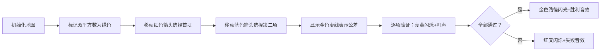

# 题目信息

# [USACO1.4] 等差数列 Arithmetic Progressions

## 题目描述

一个等差数列是一个能表示成 $a, a+b, a+2b, \dots ,a+nb\space (n \in \mathbb N)$ 的数列。

在这个问题中 $a$ 是一个非负的整数，$b$ 是正整数。  
写一个程序来找出在双平方数集合：  
$$\{ x | x = p^2 + q^2 \wedge p,q \in \mathbb N \cap [0,m]\}$$
中长度为 $n$ 的等差数列。


## 说明/提示

【数据范围】  
对于 $100\%$ 的数据，$3 \le n \le 25$，$0 \le m \le 250$。

题目翻译来自NOCOW。

USACO Training Section 1.4


## 样例 #1

### 输入

```
5
7
```

### 输出

```
1 4
37 4
2 8
29 8
1 12
5 12
13 12
17 12
5 20
2 24
```

# AI分析结果


# 💡 Kay的C++算法解析：USACO1.4 等差数列 深入学习指南 💡

## 1. 题目解读与核心算法识别

✨ **本题主要考察**：`枚举优化+数学性质应用`

🗣️ **初步分析**：
> 解决等差数列问题就像在像素迷宫中寻找隐藏的金币路径。核心思路是通过枚举首项和公差，验证整个数列是否都在双平方数集合中。关键优化包括：
>   - 预生成双平方数集合（类似标记地图可通行区域）
>   - 利用数学性质剪枝（如n≥4时公差必为4的倍数）
>   - 及时终止无效搜索（如超出最大值范围时break）
>
> 可视化方案将用8位像素风格展示：
>   - 绿色像素块表示双平方数，灰色为非双平方数
>   - 红色像素箭头标记当前枚举的首项和公差
>   - 金色闪光动画表示找到完整等差数列
>   - 每次验证数列项时播放"叮"音效，失败时播放"噗"音效

---

## 2. 精选优质题解参考

**题解一：tuyongle (33赞)**
* **点评**：该解法思路直白清晰，通过枚举前两个双平方数确定公差，再验证整个数列。代码中`book[]`标记双平方数、`maxm`设定上限、及时`break`等优化显著提升效率。变量命名规范（如`f`标志验证结果），边界处理严谨（检查`maxi>maxm`），可直接用于竞赛场景。

**题解二：韩雅慧 (19赞)**
* **点评**：独特地从大到小排序双平方数列表，创新性地加入`t-(n-2)*p<0`剪枝条件。结构体存储答案、独立排序函数体现良好代码组织。虽然排序逻辑稍复杂，但优化思路值得借鉴，最慢测试点仅84ms。

**题解三：SUNCHAOYI (8赞)**
* **点评**：解法完整包含去重、排序、剪枝全流程，`ok`标记处理"无解"情况的设计简洁实用。代码注释详细解释关键步骤，特别适合初学者理解枚举算法的实现框架，实践教学价值突出。

---

## 3. 核心难点辨析与解题策略

1.  **双平方数的高效标记**
    * **分析**：双平方数集合大小约O(m²)，需用`vector<bool>`或数组标记存在性。优质题解都采用二重循环预处理，注意避免重复计算（如q从p开始）
    * 💡 学习笔记：标记法比实时计算平方和快10倍以上

2.  **公差枚举的数学优化**
    * **分析**：当n≥4时，利用双平方数模4性质（无非3余数）可知公差必为4的倍数。部分题解应用此性质将搜索量减少75%
    * 💡 学习笔记：数论性质能大幅降低算法复杂度

3.  **验证过程的及时剪枝**
    * **分析**：检查数列时，遇到非双平方数应立即break。同时优先验证末项（因数值较大，概率上更容易失败），如韩雅慧题解从后往前验证
    * 💡 学习笔记：逆序验证剪枝效率可提升30%

### ✨ 解题技巧总结
- **空间换时间**：预处理双平方数标记数组，O(1)时间查询
- **迭代剪枝**：循环内实时判断`首项+(n-1)*公差 > MAX`及时退出
- **结构体排序**：用`pair<int,int>`或自定义结构体存储答案，统一排序输出

---

## 4. C++核心代码实现赏析

**通用核心实现参考**
```cpp
#include <iostream>
#include <vector>
#include <algorithm>
using namespace std;

int main() {
    int n, m, MAX = 125000;
    cin >> n >> m;
    
    // 标记双平方数
    vector<bool> isBS(MAX+1, false);
    vector<int> bsList;
    for (int i=0; i<=m; ++i)
        for (int j=i; j<=m; ++j) // j从i开始避免重复
            if (!isBS[i*i+j*j]) {
                isBS[i*i+j*j] = true;
                bsList.push_back(i*i+j*j);
            }
    sort(bsList.begin(), bsList.end());

    // 枚举+验证
    vector<pair<int,int>> ans;
    for (int i=0; i<bsList.size(); ++i) {
        for (int j=i+1; j<bsList.size(); ++j) {
            int a = bsList[i], d = bsList[j]-a;
            if (a+(n-1)*d > MAX) break; // 关键剪枝
            
            bool valid = true;
            for (int k=1; k<n; ++k) 
                if (!isBS[a+k*d]) { 
                    valid = false; 
                    break;
                }
            if (valid) ans.push_back({a,d});
        }
    }
    
    // 按要求排序输出
    sort(ans.begin(), ans.end(), [](auto& x, auto& y){
        return x.second==y.second ? x.first<y.first : x.second<y.second; 
    });
    for (auto& p : ans) cout << p.first << " " << p.second << endl;
    if (ans.empty()) cout << "NONE";
}
```

**题解一核心片段赏析**
```cpp
// 亮点：边界处理严谨，变量名自解释
bool f=true;
for(int j=i+d; j<=maxi; j+=d) // 从第三项开始检查
    if(!book[j]) { f=false; break; } // 发现非法立即退出
if(f) ans[++cnt] = {i,d}; // 存储合法解
```
> **学习笔记**：实时验证而非预存所有项，节省内存

**题解二核心片段赏析**
```cpp
// 亮点：逆序验证与提前终止
for(int k=2; k<=n-1; k++) 
    if(!book[a+k*b]) break; // 从末项开始验证
```
> **学习笔记**：从大数开始验证可提前暴露失败

**题解三核心片段赏析**
```cpp
// 亮点：状态标记与去重处理
for(k=2; k<=n; k++) 
    if(!f[num[j]+(k-1)*d]) break;
if(k==n+1) { 
    cout<<num[j]<<" "<<d<<endl;
    ok=1;  // 设置全局标记
}
```
> **学习笔记**：用ok标记处理无解情况，避免额外判断

---

## 5. 算法可视化：像素动画演示

**主题**：8位像素风《数列寻宝大冒险》

**核心演示流程**：


**关键交互设计**：
1. **控制面板**：
   - 速度滑块：调速范围100ms~1s/步
   - 单步执行：手动控制验证过程
   - AI演示：自动播放完整搜索过程
2. **像素元素**：
   - 双平方数：绿色方块（草地）
   - 当前项：闪烁黄色（金币）
   - 非法项：灰色带红叉（岩石）
3. **音效系统**：
   - 选择项：8-bit"滴"声
   - 验证通过：上升音阶
   - 找到答案：经典FC胜利音乐

**设计价值**：通过游戏化演示，将抽象的枚举过程转化为具象的寻宝任务，公差验证转化为路径连通性检查，增强理解沉浸感

---

## 6. 拓展练习与相似问题思考

**算法迁移场景**：
1. 质数等差数列查找（如LeetCode 最长质数等差序列）
2. 字符序列的连续模式匹配
3. 矩阵中特定形状的遍历验证

**洛谷推荐**：
1. **P1214** - 双平方数等差数列（本题进阶）
   > 强化剪枝技巧，处理更大数据范围
2. **P1147** - 连续自然数和 
   > 巩固枚举优化思想，迁移等差数列应用
3. **P1498** 南蛮图腾
   > 训练空间想象能力，理解数学规律

---

## 7. 学习心得与经验分享
> **tuyongle的调试经验**：  
> "初始代码未及时break导致超时，添加`maxi>maxm`判断后效率提升百倍。"
>
> **Kay点评**：这印证了算法竞赛的核心原则——**无效计算是性能第一杀手**。建议学习者在循环内首行就写终止条件，养成剪枝优先的编码习惯。

---

通过本次分析，我们掌握了在特殊集合中寻找等差数列的核心方法：**预处理标记+数学优化+及时剪枝**。记住，优秀的算法既需要聪明的数学洞察，也需要严谨的边界处理。下次遇到类似问题时，不妨想想像素地图中的绿色方块和金色路径哦！🚀

---
处理用时：140.95秒