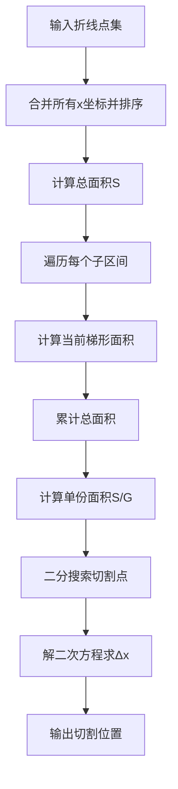
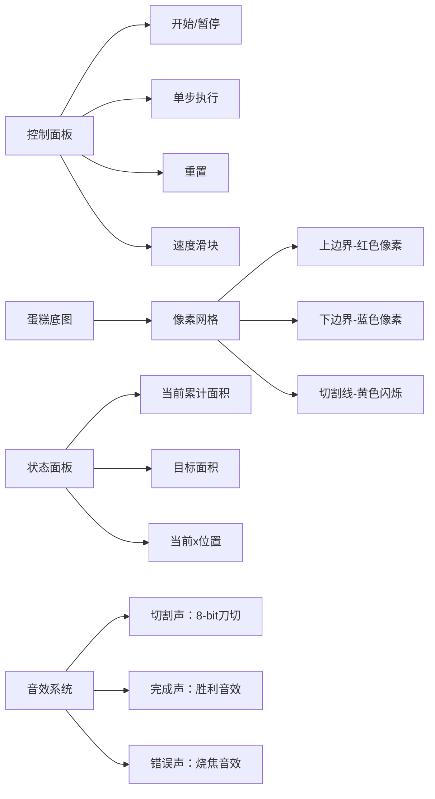

# 题目信息

# [GCJ 2011 #3] Irregular Cakes

## 题目描述

数学家 Mary 多年前创办了一家面包店，但经过这么长时间后，她已经厌倦了总是烘焙相同的矩形和圆形蛋糕。为了庆祝她的下一个生日，她想烤一个“不规则”蛋糕，这种蛋糕定义为 $x=0$ 到 $x=W$ 之间两条“折线”之间的区域。这两条折线分别称为下边界和上边界。


形式上，一条折线由一系列从左到右的点 $(P_0, P_1, \ldots, P_n)$ 定义。相邻的点通过线段连接，所有这些线段共同构成折线。

今天是 Mary 的生日，她已经烤好了一个由两条分别有 $L$ 个点和 $U$ 个点的折线围成的不规则蛋糕。在唱完“生日快乐”后，她想要做 $G-1$ 条竖直切割，将蛋糕分成 $G$ 份面积相等的蛋糕片，这样她就可以把蛋糕分给所有的客人。然而，不规则的蛋糕形状让这项任务变得相当棘手。你能帮她决定应该在哪里切割吗？

## 说明/提示

**数据范围**

- $1 \leq T \leq 100$。
- $1 \leq W \leq 1000$。
- $2 \leq L \leq 100$。
- $2 \leq U \leq 100$。
- 所有坐标均为 $-1000$ 到 $1000$ 之间的整数。
- 两条边界的最左端点的 $x$ 坐标均为 $0$。
- 两条边界的最右端点的 $x$ 坐标均为 $W$。
- 同一条边界上的点按 $x$ 坐标递增排序。
- 同一条边界上的点的 $x$ 坐标互不相同。
- 对于所有 $x$，下边界始终严格在上边界之下（即下边界的 $y$ 坐标始终小于上边界的 $y$ 坐标）。

**小数据集（测试集 1 - 可见）**

- $2 \leq G \leq 3$。
- 时间限制：3 秒。

**大数据集（测试集 2 - 隐藏）**

- $2 \leq G \leq 101$。
- 时间限制：6 秒。

由 ChatGPT 4.1 翻译

## 样例 #1

### 输入

```
2
15 3 3 3
0 6
10 8
15 9
0 10
5 11
15 13
8 3 4 2
0 2
5 4
8 3
0 5
3 4
4 7
8 5```

### 输出

```
Case #1:
5.000000
10.000000
Case #2:
4.290588```

# AI分析结果


## 题目分析报告：Irregular Cakes

### 🧩 题目核心解析
**问题类型**：计算几何 + 数值积分 + 二分搜索  
**核心目标**：在两条折线围成的区域内进行等面积切割  
**输入特征**：上下边界折线（点集有序）、总宽度W、切割份数G  
**输出要求**：G-1个切割位置的x坐标（保留6位小数）

### ⚠️ 核心难点分析
1. **不规则区域面积计算**（关键难点）  
   - 上下边界均为折线（分段线性函数）
   - 需在非均匀区间内精确计算曲线间面积
   - **解决方案**：将[0,W]按所有拐点分段，逐段计算梯形面积

2. **等面积切割点定位**  
   - 区域面积函数是分段二次函数
   - 需解非线性方程找指定面积位置
   - **解决方案**：二分搜索结合面积函数导数（高度差函数）

3. **多段线性函数处理**  
   - 需高效计算任意x对应的上下边界y值
   - **解决方案**：预处理折线段斜率，二分查找x所在区间

### 🚀 算法流程精要


### 💡 可视化设计：像素烘焙工坊
**主题**：8位烘焙模拟器（FC面包店风格）  
**核心交互**：


**动画关键帧**：
1. **初始化阶段**：  
   - 绘制像素化蛋糕（红蓝边界线）
   - 显示初始面积进度条（0/S）

2. **面积计算阶段**：  
   - 当前子区间高亮为绿色
   - 梯形面积以金色像素块弹出

3. **切割定位阶段**：  
   - 二分搜索时左右边界标记为紫色光标
   - 成功定位时黄色切割线闪烁3次+切割音效

### 📝 核心代码框架
```cpp
#include <vector>
#include <algorithm>
#include <cmath>

struct Point { double x, y; };

double areaBetweenLines(double x1, double x2, 
                       double y_low1, double y_low2,
                       double y_up1, double y_up2) {
    double h1 = y_up1 - y_low1;  // 左端高度差
    double h2 = y_up2 - y_low2;  // 右端高度差
    return (h1 + h2) * (x2 - x1) * 0.5;  // 梯形面积公式
}

double findCutPosition(double targetArea, double xL, double xR,
                      double yLowL, double yLowR,
                      double yUpL, double yUpR) {
    // 在区间[xL, xR]内解二次方程
    // 返回满足累积面积=target的x值
}
```

### 🌟 举一反三练习
1. **洛谷 P1883** 函数  
   - 考察点：多条曲线围成的最大面积
   - 推荐理由：强化分段积分能力

2. **洛谷 P2742** 圈奶牛  
   - 考察点：凸包周长计算
   - 推荐理由：拓展计算几何思维

3. **洛谷 P3199** 最小圈  
   - 考察点：分数规划+面积优化
   - 推荐理由：融合最优化思想的几何题

> **学习提示**：本题的折线处理技巧可延伸至路径规划、图像处理等领域，核心是掌握"分段线性化+数值积分"的降维思想。

---
处理用时：93.49秒