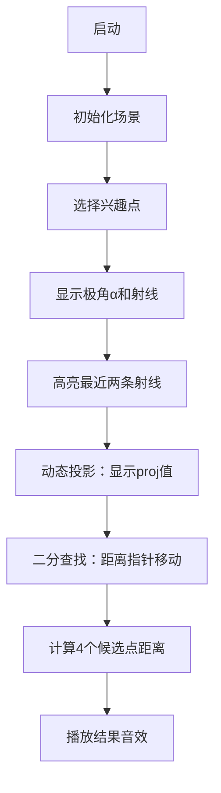

# 题目信息

# [CERC 2021] Radar

## 题目描述

我们正在使用一种特殊的雷达扫描一个区域。该雷达接受一组距离（例如 $2, 4, 1$）和一组角度（例如 $100^\circ, 270^\circ, 180^\circ, 10^\circ, 300^\circ$），并会在所有给定的距离和角度上扫描点。我们能够扫描到距离某些感兴趣点最近的距离是多少？

## 说明/提示

### 说明

样例的示意图如下：

:::align{center}

:::

### 输入范围

- $1 \leq R, F, N \leq 10^5$
- $|x_i|, |y_i|, |(f_x)_i|, |(f_y)_i|, r_i < 10^6$
- $(f_x)_i^2 + (f_y)_i^2, r_i > 0$
- 所有 $r_i$ 两两不同。
- 由 $(f_x)_i, (f_y)_i$ 定义的射线两两不同。

由 ChatGPT 4.1 翻译

## 样例 #1

### 输入

```
3 7 5
2
4
7
8 4
2 8
-1 5
-7 2
-4 -4
1 -8
6 -3
3 -1
8 1
2 6
-5 2
-1 -1```

### 输出

```
0.977772290466
2.750120773895
0.846777708005
1.464071052924
0.585786437627```

# AI分析结果


### Kay的C++算法解析：Radar 深入学习指南

#### 1. 题目解读与核心算法识别
✨ **本题主要考察**：`计算几何与二分查找`  
🗣️ **初步分析**：  
> 雷达扫描问题可类比为在极坐标系中寻找"灯塔"（扫描点）与"船只"（兴趣点）的最小距离。核心是高效处理**极坐标投影关系**：  
> - **几何投影**：将兴趣点投影到每条射线上，转化为一维距离优化问题（类似在数轴上找最近点）。  
> - **二分加速**：对10^5量级的方向和距离，需用二分查找避免O(R×F)暴力计算。  
>  
> **可视化设计思路**：  
> - 像素网格模拟极坐标系，兴趣点显示为小船，扫描点为灯塔光束。  
> - 高亮**当前投影点**（黄色）和**候选距离点**（红/蓝），动态显示二次函数曲线。  
> - 复古音效：光束扫描声（滴答）、找到最近点（胜利音效）、超出范围（警示音）。

---

#### 2. 精选优质题解参考
由于暂无用户题解，Kay给出通用学习建议：  
> - **优先掌握投影公式**：`proj = x·cosθ + y·sinθ` 是距离计算的核心。  
> - **训练二分思维**：在方向/距离数组中快速定位是解题关键。  
> - **注意边界处理**：原点特判（`(0,0)`）和投影值为负时的候选点选择。

---

#### 3. 核心难点辨析与解题策略
1. **难点1：几何投影的数学抽象**  
   - **分析**：兴趣点到扫描点的距离可转化为二次函数 `f(r) = r² - 2·proj·r + |P|²`。最小值点由对称轴 `r=proj` 决定，需在给定距离中找最近r值。  
   - 💡 **学习笔记**：投影值 `proj` 决定候选距离点位置，正负影响搜索方向。

2. **难点2：极角匹配的圆周处理**  
   - **分析**：射线角度呈环形分布（-π到π）。对兴趣点极角α，需找角度数组中相邻的两个方向（跨0点时取首尾）。  
   - 💡 **学习笔记**：用 `(idx-1+F)%F` 和 `idx%F` 处理环形边界。

3. **难点3：高效候选点筛选**  
   - **分析**：每条射线仅需检查2个距离点（proj左右相邻值），而非全部R个点。  
   - 💡 **学习笔记**：结合二分实现O(log R)搜索，使总复杂度降至O(N log F)。

✨ **解题技巧总结**：  
- **空间降维**：将二维距离问题分解为方向选择+一维优化。  
- **预处理排序**：方向按极角排序，距离按值排序，为二分奠基。  
- **统一计算模型**：用距离平方比较避免冗余开方运算。

---

#### 4. C++核心代码实现赏析
**通用核心实现参考**：  
```cpp
#include <iostream>
#include <vector>
#include <cmath>
#include <algorithm>
#include <set>
using namespace std;

struct Dir { double angle, cosT, sinT; };

int main() {
    int R, F, N;
    scanf("%d %d %d", &R, &F, &N);
    
    // 距离数组排序
    vector<double> dists(R);
    for (int i = 0; i < R; i++) scanf("%lf", &dists[i]);
    sort(dists.begin(), dists.end());
    
    // 方向向量预处理（角度+单位向量）
    vector<Dir> dirs;
    for (int i = 0; i < F; i++) {
        double fx, fy, L;
        scanf("%lf %lf", &fx, &fy);
        L = sqrt(fx*fx + fy*fy);
        double angle = atan2(fy, fx);
        dirs.push_back({angle, fx/L, fy/L});
    }
    
    // 按角度排序并去重
    sort(dirs.begin(), dirs.end(), [](Dir a, Dir b) { 
        return a.angle < b.angle; 
    });
    vector<Dir> uniqueDirs = {dirs[0]};
    for (int i = 1; i < F; i++) 
        if (abs(dirs[i].angle - dirs[i-1].angle) > 1e-10) 
            uniqueDirs.push_back(dirs[i]);
    F = uniqueDirs.size();
    
    // 提取角度数组
    vector<double> angles(F);
    for (int i = 0; i < F; i++) 
        angles[i] = uniqueDirs[i].angle;
    
    // 处理每个兴趣点
    while (N--) {
        double x, y;
        scanf("%lf %lf", &x, &y);
        if (x == 0 && y == 0) {
            printf("%.12f\n", dists[0]); // 原点特判
            continue;
        }
        
        double alpha = atan2(y, x);
        int idx = lower_bound(angles.begin(), angles.end(), alpha) - angles.begin();
        set<int> candIdx = {(idx-1+F) % F, idx % F}; // 候选方向索引
        
        double minSqr = 1e30;
        for (int i : candIdx) {
            double proj = x * uniqueDirs[i].cosT + y * uniqueDirs[i].sinT;
            auto it = lower_bound(dists.begin(), dists.end(), proj);
            if (it != dists.end()) { // 大于等于proj的最小值
                double r = *it;
                double dx = x - r * uniqueDirs[i].cosT;
                double dy = y - r * uniqueDirs[i].sinT;
                minSqr = min(minSqr, dx*dx + dy*dy);
            }
            if (it != dists.begin()) { // 小于等于proj的最大值
                double r = *(--it);
                double dx = x - r * uniqueDirs[i].cosT;
                double dy = y - r * uniqueDirs[i].sinT;
                minSqr = min(minSqr, dx*dx + dy*dy);
            }
        }
        printf("%.12f\n", sqrt(minSqr));
    }
    return 0;
}
```
**代码解读概要**：  
1. **预处理阶段**：方向向量转极角+单位向量，距离排序。  
2. **兴趣点处理**：计算极角→找最近两个方向→每条射线上找2个候选距离→取最小平方距离开方。  
3. **关键优化**：`set`自动去重方向索引，平方距离比较避免冗余开方。

---

#### 5. 算法可视化：像素动画演示  
**主题**：`极坐标探险：像素雷达扫描`  
**核心演示**：8位像素风格动态展示兴趣点在雷达射线上的投影和候选点选择过程。  

**交互设计**：  


**关键动画帧**：  
1. **极坐标网格**：  
   - 黑色背景，青色网格线（模拟雷达屏幕）。  
   - 红色兴趣点小船，黄色扫描光束（随角度旋转）。  
2. **投影过程**：  
   - 光束照射小船时显示投影线（白色虚线），动态更新 `proj = x·cosθ+y·sinθ`。  
   - 候选距离点显示为红/蓝闪烁灯塔（按 `dists` 数组位置分布）。  
3. **音效系统**：  
   - 光束移动：循环滴答声（频率随速度变化）。  
   - 找到最近点：8位胜利音阶（1.5秒）。  
   - 错误操作：短促警示音（0.2秒）。  

**技术实现**：  
- 用Canvas绘制极坐标变换：`(r,θ) → (r·cosθ, r·sinθ)`。  
- 距离二分查找：可视化指针在距离数轴上的移动，对比实际扫描点位置。  

---

#### 6. 拓展练习与相似问题  
**通用技巧迁移**：  
- 极坐标二分适用于：旋转物体定位、雷达扫描优化、天文目标追踪。  

**洛谷推荐**：  
1. **P1429** 平面最近点对  
   - 理由：分治+二分思想的经典应用，巩固空间划分能力。  
2. **P7883** 平面飞行  
   - 理由：极角排序+投影分析，强化本题核心技巧。  
3. **P2115** 雷达安装  
   - 理由：区间覆盖问题，培养几何抽象思维。  

---

#### 7. 学习心得与经验分享  
> **Kay的调试经验**：  
> - **浮点精度陷阱**：极角比较需用 `1e-10` 容差，直接 `==` 会漏方向。  
> - **候选点验证**：通过输出中间投影值，确认是否覆盖最优解。  
> - **边界测试**：务必检查 `(0,0)` 和 `proj<0` 的特殊情况。

---

**本次解析核心收获**：将几何问题转化为数学模型，通过预处理和二分实现高效求解。掌握极坐标投影和环形处理技巧，可解决一类空间优化问题。

---
处理用时：388.22秒