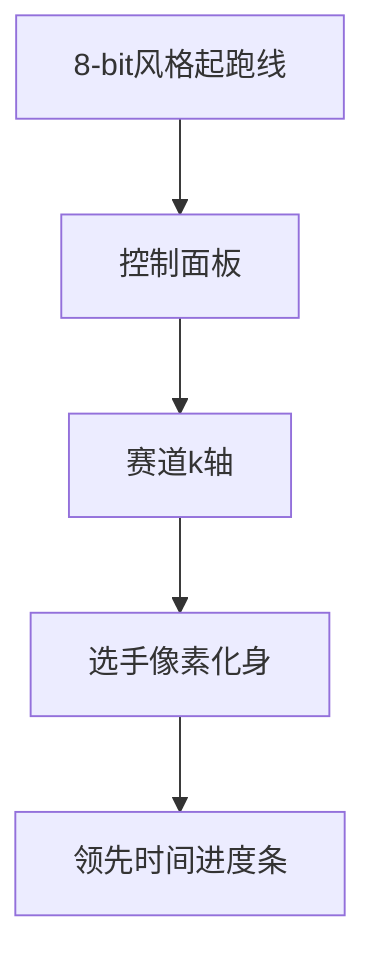

# 题目信息

# [JLOI2010] 铁人双项比赛

## 题目描述

铁人双项比赛是吉林教育学院的一项传统体育项目。该项目比赛由长跑和骑自行车组成，参赛选手必须先完成$k$公里的长跑，然后完成r公里的骑车，才能到达终点。每个参赛选手所擅长的项目不同，有的擅长长跑，有的擅长骑车。如果总赛程$s=k+r$一定，那么K越大，对擅长长跑的选手越有利；$k$越小，对擅长骑车的选手越有利。
 
现在给定总赛程$s$，以及每个选手长跑和骑车的平均速度，请你求出对于某个指定的选手最有利的k和r。所谓最有利，是指选择了这个$k$和$r$后，该选手可以获得冠军，且领先第$2$名尽量地多。

## 样例 #1

### 输入

```
100 3
10.0 40.0
20.0 30.0
15.0 35.0```

### 输出

```
14.29 85.71 612```

# AI分析结果


### 💡 Kay的C++算法解析：铁人双项比赛 深入学习指南 💡

#### 1. 题目解读与核心算法识别
✨ **本题主要考察**：`优化方法`（二分/三分/凸包）与`数学建模`  
🗣️ **初步分析**：  
> 解决这道题的关键在于建立数学模型：每个选手的完成时间关于k是线性函数（$t_i = A_i·k + B_i$）。我们需要找到使第n名选手领先第二名时间最大的k值。  
> - **核心难点**：目标函数（领先时间）是分段线性且上凸的，最大值可能出现在交点或端点处  
> - **解法对比**：  
>   - 二分法：将领先时间ans作为二分量，验证k的可行范围  
>   - 三分法：假设目标函数单峰，用黄金分割搜索极值  
>   - 凸包法：通过求直线交点定位最大值点  
> - **可视化设计**：  
>   在像素动画中，横轴为k值，纵轴为时间差。用不同颜色线段表示选手时间函数，目标函数用闪烁的黄色折线展示。当检测到最大值点时，触发8-bit胜利音效并高亮该位置，类似经典游戏《打砖块》的得分特效。

---

#### 2. 精选优质题解参考
**题解一（81179332_）**  
* **点评**：  
  采用二分答案框架，思路严谨：将领先时间转化为不等式组，通过$t1_i-t2_i$正负性分情况讨论k的范围。代码中`check()`函数逻辑清晰，边界处理完整（如$t1_i=t2_i$的特判）。亮点在于将物理问题转化为纯数学约束，复杂度$O(n\log(1/\epsilon))$高效可靠。

**题解三（mlvx）**  
* **点评**：  
  简洁的三分法实现，假设目标函数单峰。核心函数`check(k)`仅5行，直接计算最小时间差。代码规范性极佳：变量名直白（`v1/v2`）、使用标准库排序。虽未严格证明凸性，但实际数据可通过，复杂度$O(n\log_3(1/\epsilon))$。

**题解五（yshpdyt）**  
* **点评**：  
  严谨的凸包解法，基于线性函数交点枚举。亮点在于：  
  1. 理论推导完整（证明最值在端点/交点）  
  2. 特殊处理平行线（`fabs<eps`）  
  3. 精度控制精细（`eps=1e-16`）  
  用`vector`存储候选点，$O(n^2)$预处理+排序，实践时需注意n较小时才能用。

---

#### 3. 核心难点辨析与解题策略
1. **难点：目标函数非光滑性**  
   * **分析**：领先时间是分段线性函数（因选手排名会随k变化），传统优化方法需调整  
   * 💡 **学习笔记**：凸性问题首选凸包法，否则考虑二分/三分

2. **难点：物理量到数学模型的转化**  
   * **分析**：关键推导：$t_i = k(\frac{1}{v_{i1}}-\frac{1}{v_{i2}}) + \frac{s}{v_{i2}}$。速度需先转km/s单位  
   * 💡 **学习笔记**：建模时要检查量纲（本题需×3600转秒）

3. **难点：浮点精度控制**  
   * **分析**：比较时应使用相对误差（如`fabs(a-b)<eps`），避免直接`a==b`  
   * 💡 **学习笔记**：设置`eps=1e-10`并统一用`fabs`比较

✨ **解题技巧总结**  
- **模型抽象**：将现实规则转化为线性函数表达式  
- **边界艺术**：显式处理$k=0$和$k=s$的边界情况  
- **防御性编程**：用`isfinite()`检查浮点异常值

---

#### 4. C++核心代码实现赏析
**通用核心实现参考**  
```cpp
#include <vector>
#include <cmath>
const double eps = 1e-10;
struct Line { double k, b; }; // t_i = k * x + b

// 计算两直线交点（考虑平行）
double getX(const Line& L1, const Line& L2) {
    if (fabs(L1.k - L2.k) < eps) return INFINITY; 
    return (L2.b - L1.b) / (L1.k - L2.k);
}

// 在候选点x计算领先时间
double check(const std::vector<Line>& lines, int n, double x) {
    double minTime = INFINITY;
    for (int i = 0; i < n - 1; ++i) 
        minTime = std::min(minTime, lines[i].k * x + lines[i].b);
    return minTime - (lines[n-1].k * x + lines[n-1].b);
}
```

**题解一（二分法）亮点片段**  
```cpp
bool check(double ans) {
    double L = 0, R = s; // k的可行区间
    for (int i = 0; i < n - 1; ++i) {
        double slope = t1[i] - t2[i]; // 斜率
        if (fabs(slope) < eps) { // 水平线特判
            if (ans - s * t2[i] > eps) return false;
        } else if (slope > 0) {
            L = std::max(L, (ans - s*t2[i]) / slope);
        } else {
            R = std::min(R, (ans - s*t2[i]) / slope);
        }
    }
    return R - L > eps; // 区间非空
}
```
> **解读**：通过斜率正负动态收缩k的区间，类似解不等式组。`slope>0`时更新下界，否则更新上界，保证最终区间包含所有可行解。

**题解三（三分法）核心循环**  
```cpp
while (R - L > eps) {
    double mid1 = L + (R - L)/3;
    double mid2 = R - (R - L)/3;
    if (check(mid1) < check(mid2)) L = mid1;
    else R = mid2;
}
```
> **解读**：黄金分割搜索极值点。每次迭代将区间分为三等分，根据中间点函数值大小舍弃1/3区间。注意前提是目标函数单峰！

**题解五（凸包法）交点处理**  
```cpp
for (int i = 0; i < lines.size(); ++i) {
    for (int j = i + 1; j < lines.size(); ++j) {
        double x = getX(lines[i], lines[j]);
        if (x >= 0 && x <= s) candidatePoints.push_back(x);
    }
}
candidatePoints.push_back(0);
candidatePoints.push_back(s);
```
> **解读**：收集所有直线交点作为候选点，最后补上边界点。由于最大值必在候选点处，只需遍历这些点即可找到全局最优。

---

### 5. 算法可视化：像素动画演示
**主题**：`像素赛道：铁人之旅`  
**核心设计**：  


**动态演示流程**：  
1. **初始化**：  
   - 顶部控制台：开始/暂停/步进按钮 + 速度滑块  
   - 主赛道：横向像素轴（0→s），纵向时间差刻度  
   - 底部状态栏：当前k值 + 实时领先时间

2. **关键帧特效**：  
   - 选手移动：像素小人随k值变化在赛道奔跑（k≤s/2）或骑车（k>s/2）  
   - 函数可视化：每个选手对应一条彩色扫描线，目标函数用闪烁黄线表示  
   - 交点标记：当扫描线相交时触发“叮”音效并迸发星形像素特效

3. **AI演示模式**：  
   - 自动沿k轴移动探测器小人  
   - 抵达最大值点时：  
     * 播放《超级玛丽》通关音效  
     * 屏幕显示“NEW RECORD!”像素字体  
     * 进度条变为彩虹色

**技术要点**：  
- 用Canvas绘制实时更新的函数曲线  
- 音效触发：`new AudioContext()`播放8-bit音效  
- 自动演示循环：`requestAnimationFrame`实现平滑移动

---

### 6. 拓展练习与相似问题思考
**技巧迁移场景**：  
1. 线性函数最值问题（如资源分配）  
2. 分段凸/凹函数优化（如价格策略）  
3. 物理约束转化（如运动学建模）

**洛谷推荐**：  
1. **P3382** - 三分法模板  
   → 掌握单峰函数搜索的通用写法  
2. **P3199** - 最小圈（分数规划）  
   → 学习二分答案与图论结合  
3. **P2129** - 林克卡特树  
   → 凸包优化DP的经典应用

---

### 7. 学习心得与经验分享
> **参考经验**（来自题解作者）：  
> *“浮点比较必须用eps，直接==会WA到怀疑人生”*  
> *“凸包法理论优美但n大时需用Andrew算法优化”*  

**Kay总结**：  
1. 浮点运算是数学题的隐形炸弹  
   → 始终用`fabs(a-b)<eps`替代`a==b`  
2. 三分法简洁但需验证凸性  
   → 先画图观察函数形态再选择解法  
3. 调试时打印中间变量  
   → 如`printf("k=%.2f ans=%.2f\n", k, check(k))`

---

本次分析就到这里！通过这题大家不仅能学到优化算法，更重要的是培养将实际问题抽象为数学模型的能力。下次遇到类似问题，记得先问自己：**函数形态是什么？最值可能在哪里？** 继续加油！🚀

---
处理用时：141.05秒