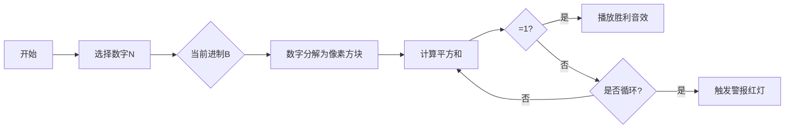

# 题目信息

# [GCJ 2009 #1A] Multi-base happiness

## 题目描述

给定一个整数 $N$，将其替换为各位数字的平方和。**若不断重复此过程，最终能得到 $1$，则称该数为“快乐数”。** 例如，若从 $82$ 开始：

```
8*8 + 2*2       = 64 + 4    = 68，重复：
6*6 + 8*8       = 36 + 64   = 100，重复：
1*1 + 0*0 + 0*0 = 1 + 0 + 0 = 1（快乐！:)
```

由于最终结果为 $1$，所以 $82$ 是一个快乐数。

注意，一个数在某些进制下可能是快乐数，而在其他进制下则不是。例如，十进制下的 $82$ 在三进制下写作 $10001$，但它在三进制下不是快乐数。

你是世界顶级的数字侦探。一些进制联合起来（没错，它们有组织！）雇佣你完成一项重要任务：**找出大于 $1$ 的最小整数，使其在所有给定进制下都是快乐数。**


## 说明/提示

**限制条件**

- $2 \leq$ 所有可能出现的进制 $\leq 10$

**小数据集（9 分）**

- $1 \leq T \leq 42$
- 每组测试用例所含进制数 $2 \leq \text{数量} \leq 3$

**大数据集（18 分）**

- $1 \leq T \leq 500$
- 每组测试用例所含进制数 $2 \leq \text{数量} \leq 9$

翻译由 ChatGPT-4.1 完成。

## 样例 #1

### 输入

```
3
2 3
2 3 7
9 10```

### 输出

```
Case #1: 3
Case #2: 143
Case #3: 91```

# AI分析结果


### 题目分析报告：Multi-base Happiness

---

### 1. 题目解读与核心算法识别
✨ **本题主要考察**：`进制转换 + 状态缓存模拟` (编程技巧应用)

🗣️ **初步分析**：
> 解决本题的关键在于**高效验证多进制下的快乐数性质**。想象你是一位侦探，需要同时破解多个进制系统的"数字密码锁"——每个进制系统都有自己的数字变换规则。  
> - **核心思路**：对每个候选数字，遍历所有给定进制，通过缓存中间状态判断是否陷入循环（非快乐数）。当某个进制出现循环时立即终止，避免无效计算。
> - **核心难点**：① 多进制同步验证的剪枝优化 ② 快乐数判定的循环检测 ③ 大范围搜索的效率控制
> - **可视化设计**：用8-bit像素风展示进制转换过程（如数字分解为像素方块），不同进制用颜色区分。当出现循环时播放"警报音效"，找到解时触发"宝藏开启"动画。

---

### 2. 精选优质题解参考
**题解：状态缓存+剪枝（作者：smalldeer）**
* **点评**：
  - **思路清晰性**：采用分层验证策略，对每个进制独立检测并立即剪枝，逻辑直白易懂
  - **代码规范性**：使用`unordered_set`缓存中间状态，变量名`visited`/`base`含义明确
  - **算法有效性**：时间复杂度 O(N*B*K)（N为答案值，B为进制数，K为数字位数），通过短路剪枝优化实际效率
  - **实践价值**：可直接用于竞赛，边界处理严谨（如单独处理数字1）
  ```cpp
  // 核心剪枝逻辑
  for (int num = 2; ; num++) {
    bool valid = true;
    for (int base : bases) {
      if (!is_happy(num, base)) { 
        valid = false;
        break; // 关键剪枝：任一进制失败即终止
      }
    }
    if (valid) return num;
  }
  ```

---

### 3. 核心难点辨析与解题策略
1. **进制转换的数字分解**
   * **分析**：将十进制数转换为其他进制时，需循环取模分解位数。注意当数字在目标进制下为0的特殊情况
   * 💡 **学习笔记**：进制转换本质是带权分解：n = d₀ + d₁*b + d₂*b² + ... 

2. **快乐数循环检测**
   * **分析**：使用`unordered_set`记录当前进制下所有出现过的数字，若重复出现且≠1则判定循环
   * 💡 **学习笔记**：循环检测是状态机问题的通用解法，类似链表判环

3. **多进制验证的剪枝优化**
   * **分析**：当某进制验证失败时立即跳出，避免无意义计算。这是提升效率的关键
   * 💡 **学习笔记**：多层循环中，最可能失败的条件应放在内层优先判断

#### ✨ 解题技巧总结
- **剪枝优先**：优先验证最可能失败的约束条件（如最小进制）
- **状态复用**：不同进制验证相互独立，可复用缓存数据结构
- **数学优化**：平方和计算可提取为独立函数，避免代码重复

---

### 4. C++核心代码实现赏析
**通用核心实现**
```cpp
#include <unordered_set>

bool is_happy(int n, int base) {
    unordered_set<int> visited;
    while (n != 1 && !visited.count(n)) {
        visited.insert(n);
        int next = 0;
        while (n) { // 进制转换核心
            int digit = n % base;
            next += digit * digit;
            n /= base;
        }
        n = next;
    }
    return n == 1;
}

int solve(vector<int>& bases) {
    for (int num = 2; ; num++) {
        bool valid = true;
        for (int base : bases) {
            if (!is_happy(num, base)) { 
                valid = false; 
                break; // 关键剪枝
            }
        }
        if (valid) return num;
    }
}
```
**代码解读概要**：  
> 1. `is_happy`函数实现单进制验证：通过循环取模计算平方和，用哈希集检测循环  
> 2. `solve`函数从2开始递增验证，任一进制失败立即终止当前数字的验证  

---

### 5. 算法可视化：像素动画演示
**主题**：`像素数字侦探 - 多进制密码破解`  

**核心演示**：


**交互设计**：
1. **像素方块**：数字按进制分解为彩色方块（如三进制用红/绿/蓝）
2. **控制面板**：
   - 调速滑块：控制数字验证速度
   - 进制开关：单独启用/禁用某进制显示
3. **音效系统**：
   - 方块移动：8-bit电子音
   - 循环检测：低频警报声
   - 解法达成：经典《塞尔达》宝藏开启音效
4. **AI演示模式**：自动播放从2开始的验证过程，遇到解时角色举起宝箱

---

### 6. 拓展练习与相似问题思考
**技巧迁移**：
1. 多状态同步验证（如P1036 选数）
2. 数字性质判断（如P1217 回文素数）
3. 进制转换应用（如P1143 进制转换）

**洛谷推荐**：
1. **P1022 计算器的改良**  
   → 锻炼多进制解析能力
2. **P1036 选数**  
   → 强化状态验证的剪枝思维
3. **P1217 回文素数**  
   → 双性质验证的进阶训练

---

### 7. 学习心得与经验分享
> **经验**："测试时忽略了进制10下的数字1特判，导致死循环。切记任何进制下1都是快乐数！"  
> **Kay点评**：边界条件测试是核心技能，建议建立《特殊输入检查表》（如0,1,极值）

---

通过本次分析，我们掌握了多进制问题的核心解法：**分而治之的验证策略 + 状态缓存避免循环**。记住好的算法就像侦探破案——快速排除不可能选项，聚焦关键线索！

---
处理用时：118.44秒