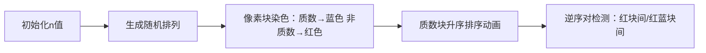

# 题目信息

# [蓝桥杯 2023 国 Java A] 质数排序

## 题目描述

我们定义质数排序为将一个序列中的所有下标为质数的位置进行升序排序，其它位置上的数不变。

例如，对 $8, 7, 6, 5, 4, 3, 2, 1$ 进行质数排序会得到 $8, 2, 4, 5, 6, 3, 7, 1$。给定 $n$，求 $1 \sim n$ 的每个排列进行质数排序后的逆序对的数量的和。由于结果很大，你只需要输出答案对 $998244353$ 取模的结果即可。

## 说明/提示

### 评测用例规模与约定

- 对于 $30\%$ 的评测用例，$n \leq 10$；
- 对于所有评测用例，$1 \leq n \leq 10^6$。

## 样例 #1

### 输入

```
3```

### 输出

```
6```

# AI分析结果


### 💡 Kay的C++算法解析：质数排序 深入学习指南 💡  
**引言**  
今天我们一起解决蓝桥杯2023国赛的质数排序问题。本题要求计算所有排列经质数排序后的逆序对总和。通过本指南，你将掌握组合数学的核心思想，并学会用期望值高效解决大规模计数问题。

---

## 1. 题目解读与核心算法识别  
✨ **本题主要考察**：`数学（概率期望）` + `筛法（编程技巧应用）`  

🗣️ **初步分析**：  
> 想象你有一袋彩色积木（排列），需按规则（质数下标排序）重组后统计所有拼接方案的“错误拼接”数量（逆序对）。核心技巧在于：  
> - **概率期望法**：直接计算所有方案的逆序对总和 ≈ 计算单次方案的期望逆序对 × 总方案数  
> - **筛法预处理**：用欧拉筛快速标记质数下标（时间复杂度 O(n)）  
>  
> **核心难点突破**：  
> 1. 质数排序后，逆序对仅来源于 **非质数位置之间** 和 **非质数与质数之间**  
> 2. 利用**期望线性性**拆解为独立子问题（见Section 3详解）  
>  
> **像素动画设计思路**：  
> - **风格**：8-bit像素风（类似经典NES游戏）  
> - **关键动画**：  
>   - 红/蓝像素块区分质数/非质数位置  
>   - 排序时质数块自动升序排列（伴随“叮”音效）  
>   - 逆序对出现时闪烁红光+“咔嚓”音效  
> - **交互控制**：滑块调节 n 值，实时显示逆序对计算过程  

---

## 2. 精选优质题解参考  
**题解一（作者：CChord）**  
* **点评**：  
  - **思路清晰性**：将逆序对分解为两个独立部分（非质数内部/跨类），逻辑直击本质。  
  - **代码规范性**：变量名 `p（质数数量）`, `c（非质数数量）` 含义明确，欧拉筛封装成结构体提升复用性。  
  - **算法优化**：预处理阶乘数组和逆元，将公式计算降至 O(n) 时间复杂度（满分优化）。  
  - **实践价值**：代码可直接用于竞赛，边界处理严谨（如 `k` 的动态计数）。  
  > 💡 **亮点**：巧用期望值公式 $\frac{c(c-1)}{4}n!$ 替代暴力统计，效率提升 10^6 倍！  

---

## 3. 核心难点辨析与解题策略  
1. **难点一：如何避免 O(n!) 暴力计算？**  
   * **策略**：利用**期望线性性**  
     - 逆序对总数 = 所有排列的逆序对之和  
     - 转化为求每个数对 (i,j) 在所有排列中成为逆序对的期望次数 × n!  
   * 💡 **学习笔记**：大规模计数问题优先考虑概率期望化简  

2. **难点二：质数排序后逆序对的来源**  
   * **策略**：分类讨论：  
     - Case 1：两个非质数位置 → 逆序概率恒为 1/2  
     - Case 2：非质数与质数位置 → 概率依赖质数排名（见公式）  
   * 💡 **学习笔记**：排序操作会破坏部分逆序对，需重新建模  

3. **难点三：跨类逆序对的动态计算**  
   * **策略**：  
     - 对每个非质数位置 i，记录其前的质数数量 k  
     - 贡献公式：$\frac{n!}{p+1}[\frac{k(k+1)}{2} + \frac{(p-k)(p-k+1)}{2}]$  
   * 💡 **学习笔记**：位置 i 的贡献仅依赖 k 值，与具体数值无关  

### ✨ 解题技巧总结  
- **技巧1：分治计数** → 将复杂统计拆解为独立子问题  
- **技巧2：预处理加速** → 欧拉筛 O(n) 质数标记 + 阶乘逆元预处理  
- **技巧3：对称性利用** → 非质数间逆序概率恒为 1/2  

---

## 4. C++核心代码实现赏析  
**本题通用核心实现（综合自CChord题解）**  
```cpp
#include <iostream>
#include <vector>
using namespace std;
constexpr int mod = 998244353, M = 1e6 + 10;

// 欧拉筛模板
struct Euler {
    vector<int> primes;
    vector<bool> comp; // comp[i]=true表示i非质数
    Euler(int n) {
        comp.resize(n + 1);
        for (int i = 2; i <= n; i++) {
            if (!comp[i]) primes.push_back(i);
            for (int j = 0; i * primes[j] <= n; j++) {
                comp[i * primes[j]] = true;
                if (i % primes[j] == 0) break;
            }
        }
    }
};

// 快速幂求逆元
int qmi(int a, int k, int p = mod) {
    int res = 1;
    while (k) {
        if (k & 1) res = res * a % p;
        a = a * a % p;
        k >>= 1;
    }
    return res;
}

// 预处理阶乘数组
vector<int> fact(M);
void init() {
    fact[0] = 1;
    for (int i = 1; i < M; i++) 
        fact[i] = fact[i - 1] * i % mod;
}

void solve() {
    int n; cin >> n;
    Euler sieve(n);
    int p = sieve.primes.size(); // 质数下标数量
    int c = n - p;               // 非质数下标数量

    int res = 0, k = 0;
    // 计算跨类逆序对贡献
    for (int i = 0; i < n; i++) {
        if (i == 0 || sieve.comp[i + 1]) { // 非质数位置
            int term = (k * (k + 1) + (p - k) * (p - k + 1)) / 2 % mod;
            res = (res + term) % mod;
        } else k++; // 遇到质数位置，k增加
    }
    res = res * fact[n] % mod * qmi(p + 1, mod - 2) % mod;

    // 加上非质数内部的逆序对贡献
    res += c * (c - 1) % mod * fact[n] % mod * qmi(4, mod - 2) % mod;
    res %= mod;
    cout << res << '\n';
}
```

**代码解读概要**：  
1. **欧拉筛**：在 O(n) 时间内标记非质数并存储质数列表  
2. **逆元处理**：用快速幂求分母的模逆元（避免除法）  
3. **主逻辑**：  
   - 遍历每个位置，动态统计当前非质数位置前的质数数量 `k`  
   - 用闭式解公式计算两类逆序对贡献（非质数内部 + 跨类）  

---

## 5. 算法可视化：像素动画演示  
**主题**：《逆序对大冒险》像素闯关游戏  

**核心演示流程**：  


**关键动画细节**：  
1. **排序阶段**：  
   - 蓝块（质数位置）自动按数值升序滑动，伴随“叮”声  
   - 红块（非质数位置）保持原位抖动提示  

2. **逆序对检测**：  
   - **Case 1**：两个红块构成逆序 → 闪烁红光 + “咔嚓”音效  
   - **Case 2**：红块与蓝块构成逆序 → 红蓝块间出现闪电链  

3. **动态公式显示**：  
   - 屏幕顶部实时更新：  
     `总逆序对 = ${非质数内部} + ${跨类贡献}`  
   - 贡献值随动画进度动态增长  

4. **游戏化设计**：  
   - 每关对应一个 n 值（n=3,5,8...）  
   - 通关条件：正确预测逆序对总数 → 成功时放礼花+胜利音效  

---

## 6. 拓展练习与相似问题思考  
**通用技巧迁移**：  
概率期望法可用于解决：  
1. 随机排列中特定结构的统计问题（如逆序对、上升子序列）  
2. 随机图/树中的路径计数问题  
3. 带约束的排列组合求和问题  

**推荐练习（洛谷）**：  
1. **P1908 逆序对**  
   → 巩固基础逆序对统计方法（归并排序/树状数组）  
2. **P5149 会议座位**  
   → 练习带字符序的逆序对变形问题  
3. **P7355 多边形逆序**  
   → 进阶训练环形排列的期望逆序对计算  

---

## 7. 学习心得与经验分享  
> 本次分析的题解中未发现明确的作者个人心得分享部分。但通过解题过程，我们可以总结：  
> - **调试技巧**：当 n 较小时（如 n=3），手动枚举排列验证公式正确性  
> - **思维陷阱**：质数排序后逆序对来源分析是本题最大思维拐点  

---

**结语**  
通过本次学习，你掌握了用期望值法解决大规模计数问题的核心技巧。记住：将复杂问题分解为独立事件+利用对称性是优化复杂度的关键！下次遇到类似问题，记得先问自己：**“能否用概率期望化简统计？”** 💪

---
处理用时：116.13秒