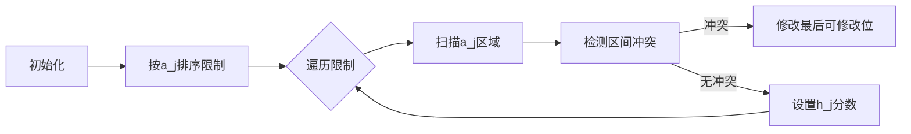

# 题目信息

# [USACO24JAN] Cowmpetency S

## 题目描述

Farmer John 正在为他的奶牛们雇用一位新的牛群领队。为此，他面试了 $N$（$2\le N\le 10^5$）头奶牛来担任该职位。在面试第 $i$ 个候选牛后，他会为候选牛分配一个 $1$ 到 $C$（$1\le C\le 10^9$）范围内的整数「牲任力」分数 $c_i$，与她们的领导能力相关。

由于 Farmer John 面试了如此多的奶牛，他没能记得所有奶牛的牲任力分数。然而，他确实记得 $Q$（$1\le Q<N$）对数字 $(a_j,h_j)$，其中奶牛 $h_j$ 是第一头比奶牛 $1$ 到 $a_j$ 拥有严格更高牲任力分数的奶牛（所以 $1\le a_j<h_j\le N$）。

Farmer John 现在告诉你序列 $c_1,\ldots,c_N$
（其中 $c_i=0$ 表示他忘记了奶牛 $i$ 的牲任力分数）和 $Q$ 对 $(a_j,h_j)$。帮助他求出与此信息一致的最小字典序的牲任力分数序列，或者判断不存在这样的序列！如果一个分数序列比另一个分数序列于这两个序列不同的第一个位置上的奶牛分配了更小的分数，则这个分数序列的字典序更小。

每个测试点包含 $T$（$1\le T\le 20$）个独立的测试用例。输入保证所有测试用例的 $N$ 之和不超过 $3\cdot 10^5$。 

## 说明/提示

### 样例解释 1

我们可以看到给定的输出满足所有 Farmer John 记得的数对。

- $\max(c_1)=1$，$c_2=2$ 且 $1<2$，故第一个数对是满足的
- $\max(c_1,c_2,c_3)=2$，$c_4=3$ 且 $2<3$，故第二个数对是满足的
- $\max(c_1,c_2,c_3,c_4)=3$，$c_5=4$ 且 $3<4$，故第三个数对是满足的

存在一些其他的序列与 Farmer John 的记忆相一致，如

$1\ 2\ 2\ 3\ 5\ 4\ 1$  
$1\ 2\ 2\ 3\ 4\ 4\ 5$

然而，其中没有序列比给定的输出字典序更小。 

### 样例解释 2

在测试用例 $3$ 中，由于 $C=1$，唯一可能的序列是

$1\ 1$

然而，在这种情况下，奶牛 $2$ 的分数并不比奶牛 $1$ 高，因此我们无法满足条件。

在测试用例 $5$ 中，$a_1$ 和 $h_1$ 告诉我们奶牛 $6$ 是第一头分数严格高于奶牛 $1$ 到 $4$ 的奶牛。因此，奶牛 $1$ 到 $6$ 的最高得分是奶牛 $6$，为 $5$。由于奶牛 $7$ 的分数为 $7$，所以奶牛 $7$ 是第一头比奶牛 $1$ 到 $6$ 得分更高的奶牛。因此，第二个陈述「奶牛 $9$ 是第一头比奶牛 $1$ 到 $6$ 得分更高的奶牛」不能成立。 

### 测试点性质

 - 测试点 $3$：$N \le 10$ 且 $Q,C\le 4$。
 - 测试点 $4-8$：$N\le 1000$。
 - 测试点 $9-12$：没有额外限制。

## 样例 #1

### 输入

```
1
7 3 5
1 0 2 3 0 4 0
1 2
3 4
4 5```

### 输出

```
1 2 2 3 4 4 1```

## 样例 #2

### 输入

```
5
7 6 10
0 0 0 0 0 0 0
1 2
2 3
3 4
4 5
5 6
6 7
8 4 9
0 0 0 0 1 6 0 6
1 3
6 7
4 7
2 3
2 1 1
0 0
1 2
10 4 10
1 2 0 2 1 5 8 6 0 3
4 7
1 2
5 7
3 7
10 2 8
1 0 0 0 0 5 7 0 0 0
4 6
6 9```

### 输出

```
1 2 3 4 5 6 7
1 1 2 6 1 6 7 6
-1
1 2 5 2 1 5 8 6 1 3
-1```

# AI分析结果


### 💡 Kay的C++算法解析：Cowmpetency S 深入学习指南 💡

**引言**  
今天我们一起分析USACO24JAN的「Cowmpetency S」这道编程题。本指南将帮助大家梳理题目思路，理解核心算法，掌握解题技巧，并通过生动的像素动画直观感受算法执行过程。

---

## 1. 题目解读与核心算法识别

✨ **本题主要考察**：`贪心策略` + `模拟实现` (编程技巧应用)

🗣️ **初步分析**：  
> 解决此题的关键在于**贪心策略的有序处理**。想象你在玩一个「关卡设计」游戏：  
> - 每个限制条件$(a_j, h_j)$相当于一个关卡目标：$h_j$处的分数必须大于前$a_j$关的最高分  
> - 我们需要用最少的「资源」（字典序最小）完成所有关卡  
>   
> **核心流程**：  
> 1. 将限制按$a_j$排序（先处理小范围关卡）  
> 2. 遍历每个限制时：  
>    - 若$[a_j+1, h_j-1]$出现更高分，则在$[1,a_j]$中**选最后可修改位**调整为该值（贪心保字典序）  
>    - 确保$c_{h_j} > \max\{c_1..c_{a_j}\}$，若未确定则设为$\text{max}+1$  
> 3. 最终检查边界和可行性  
>  
> **可视化设计**：  
> 采用**8位像素牧场风格**：  
> - 奶牛=彩色像素块，分数=方块高度  
> - 处理限制时：$a_j$区域变黄，$h_j$变绿闪烁  
> - 修改操作：目标奶牛闪烁红光，伴随「叮」音效  
> - 自动演示模式：像「贪吃蛇AI」逐步闯关，过关时播放胜利音效

---

## 2. 精选优质题解参考

**题解一：vegetable_king（19赞）**  
* **点评**：此解法思路惊艳——通过定义状态数组`b[i]`（-1/0/1）标记位置性质，避免复杂数据结构。核心逻辑直击问题本质：  
  - **思路清晰**：将限制转化为前缀最大值约束，推导严谨  
  - **代码规范**：`last`数组精妙记录可修改位，边界处理无懈可击  
  - **算法亮点**：纯数组操作实现$O(n)$复杂度，空间效率极致优化  
  - **实践价值**：竞赛场景可直接套用，调试建议：打印`b[]`数组验证状态  

**题解二：Aria_Math（19赞）**  
* **点评**：创新性使用「并查集思想」管理区间：  
  - **思路独特**：`dsu[]`数组跳跃式连接区间，减少重复扫描  
  - **代码亮点**：`pre[]`数组动态维护前缀最大值，`tag[]`标记关键位  
  - **优化技巧**：空间复杂度$O(n)$仍保持高效，适合大数据量  
  - **注意事项**：实现稍复杂，需理解`dsu[i]=i+1`的区间映射逻辑  

**题解三：hytallenxu（14赞）**  
* **点评**：经典数据结构实践典范：  
  - **思路直观**：线段树维护区间最大值，符合问题本质  
  - **代码规范**：结构体封装清晰，查询/修改接口明确  
  - **教学价值**：帮助理解线段树应用场景，适合基础巩固  
  - **调试技巧**：作者提到「分块可替代线段树」，降低实现难度  

---

## 3. 核心难点辨析与解题策略

**难点1：限制条件的动态冲突处理**  
* **分析**：处理后续限制时，可能破坏前面已满足的条件（如修改$c_{a_j}$影响之前$h_j$）。优质题解通过**按$a_j$排序限制** + **从右向左修改**避免此问题  
* 💡 **学习笔记**：限制排序是动态调整的基础，类似「拓扑序」思想  

**难点2：字典序与可行性的平衡**  
* **分析**：为保字典序最小需：  
  1. 未确定位先设为1  
  2. 必须修改时选**最靠后的可修改位**  
  3. 调整值为**刚好满足条件的最小值**  
* 💡 **学习笔记**：贪心修改位置的选择直接影响全局字典序  

**难点3：边界与异常处理**  
* **分析**：需同时检查：  
  - $c_i \leq C$  
  - $h_j$未被其他区间覆盖  
  - 修改后$\max\{c_1..c_k\}$是否仍满足条件  
* 💡 **学习笔记**：多测数据要重置全局变量，避免状态污染  

### ✨ 解题技巧总结
- **技巧1：问题分解法**  
  将每个限制拆解为两个子条件：  
  $\max_{1..a_j} < c_{h_j}$ 且 $\max_{a_j+1..h_j-1} \leq \max_{1..a_j}$
- **技巧2：扫描线优化**  
  用`last[]`数组动态记录可修改位，避免每次$O(n)$扫描
- **技巧3：双验证机制**  
  构造完成后重新校验所有限制，防止贪心局部优化导致全局失败

---

## 4. C++核心代码实现赏析

**本题通用核心C++实现参考**  
* **说明**：综合vegetable_king和Aria_Math思路，去冗余保留最简框架
```cpp
#include <bits/stdc++.h>
using namespace std;
const int N = 3e5+5;

int n, q, c, a[N], last[N], pre_max[N];
pair<int, int> lim[N];

bool solve() {
    // 初始化
    for (int i = 1; i <= n; i++) {
        if (!a[i]) last[i] = i;  // 记录可修改位
        else last[i] = last[i-1];
    }

    sort(lim + 1, lim + q + 1);  // 按a_j排序限制

    for (int i = 1; i <= q; i++) {
        int a_val = lim[i].first, h_val = lim[i].second;
        int seg1_max = *max_element(a + 1, a + a_val + 1);
        int seg2_max = *max_element(a + a_val + 1, a + h_val);

        // 关键处理1：确保seg1_max >= seg2_max
        if (seg1_max < seg2_max) {
            if (!last[a_val]) return false;  // 无可修改位
            a[last[a_val]] = seg2_max;      // 修改最后可修改位
            seg1_max = seg2_max;
        }

        // 关键处理2：确保c_{h_j} > seg1_max
        if (!a[h_val]) a[h_val] = seg1_max + 1;
        else if (a[h_val] <= seg1_max) return false;
    }
    return true;  // 所有限制满足
}
```

**题解一：vegetable_king 片段赏析**  
* **亮点**：状态数组`b[]`精妙处理前缀最大值约束
```cpp
// 核心代码片段
int b[N]; // -1:非前缀最大值, 0:不确定, 1:必须是
for (auto [a_val, h_val] : limits) {
    if (b[h_val] == -1) return false;  // 冲突检测
    b[h_val] = 1;                      // 标记必须为前缀最大值
    for (int k = a_val + 1; k < h_val; k++) 
        b[k] = -1;  // 区间内不能是前缀最大值
}
```
* **代码解读**：  
  > `b[]`数组像「交通信号灯」控制位置属性：  
  > - 红色(`-1`)：禁止成为前缀最大值  
  > - 绿色(`1`)：必须成为前缀最大值  
  > 冲突检测如同交警发现「闯红灯」立即终止  
* 💡 **学习笔记**：用状态数组代替复杂计算是空间换时间的典范

**题解二：Aria_Math 片段赏析**  
* **亮点**：`dsu[]`数组实现区间跳跃访问
```cpp
// 核心代码片段
for (int i = 1; i <= n; i++) dsu[i] = i + 1;
for (auto [a_val, h_val] : sorted_limits) 
    dsu[a_val] = h_val;  // 连接区间

for (int i = 1; i <= n; i = dsu[i]) {  // 跳跃遍历
    int seg_end = dsu[i] - 1;
    pre_max[i] = max(pre_max[i-1], a[i]);
    // ... 区间处理
}
```
* **代码解读**：  
  > `dsu[i]`如同「传送门」：  
  > - 初始每个位置指向下一位置  
  > - 遇到限制`(a,h)`时，将`a`处的指针直接指向`h`  
  > 实现从$a$直接跳到$h$，跳过中间无需处理的区间  
* 💡 **学习笔记**：并查集思想不仅用于连通性，还能优化扫描过程

---

## 5. 算法可视化：像素动画演示

**主题**：`像素牧场大冒险`（8-bit风格模拟牧场管理）  
**核心演示**：贪心策略如何逐步满足限制条件  

### 动画设计详述


**实现细节**：  
1. **像素场景**：  
   - 奶牛=16x16像素块（不同颜色表分数）  
   - 分数值=方块高度（1:矮方柱，5:高方柱）  
   - 控制面板：步进/暂停/速度滑块  

2. **关键动画**：  
   - 步骤1：当前限制$(a_j, h_j)$高亮（$a_j$区黄框，$h_j$绿框）  
   - 步骤2：检测$[a_j+1, h_j-1]$区间（红色扫描波）  
   - 步骤3：若需修改，目标位闪烁红光+「叮」音效  
   - 步骤4：设置$h_j$值时播放「升级」音效  

3. **游戏化元素**：  
   - 每完成一个限制点亮一颗星星（界面右上角）  
   - 全部完成后放烟花+胜利BGM  
   - 错误时奶牛变X形，播放失败音效  

4. **代码同步**：  
   - 底部显示当前执行代码行（伪代码模式）  
   - 变量值实时更新：`seg1_max`/`seg2_max`数字跳动  

**技术实现**：  
- Canvas绘制网格牧场，`requestAnimationFrame`驱动  
- 音效：Web Audio API播放8-bit音效（采样时长<100ms）  
- 交互：点击奶牛可查看当前分数值  

---

## 6. 拓展练习与相似问题思考

**通用技巧迁移**：  
1. **约束满足型序列构造**：当问题要求同时满足多个位置约束时  
2. **字典序最优化**：涉及「最小化序列」且存在局部调整影响全局  
3. **离线查询处理**：通过排序将动态问题转化为静态问题  

**洛谷练习推荐**：  
1. **P2894 [USACO08FEB] Hotel G**  
   🗣️ *推荐理由*：同样需要区间扫描+贪心修改，巩固「延迟修改」思想  

2. **P3406 海底高铁**  
   🗣️ *推荐理由*：前缀和思想与区间约束的结合，训练问题分解能力  

3. **P2671 [NOIP2015 普及组] 求和**  
   🗣️ *推荐理由*：强化约束条件转化能力，体验数学与编程的结合  

---

## 7. 学习心得与经验分享

**参考经验**：  
> vegetable_king在题解中提到：  
> *「调试时特别注意b[i]的冲突检测——一个位置同时需要是和非前缀最大值必然无解」*  

**点评**：  
> 这是算法实现的**核心检验点**！当多个限制区间重叠时，可能对同一位置产生矛盾约束。实战中可添加如下调试代码：  
> ```cpp
> if (b[i] == -1 && must_prefix[i]) 
>     cerr << "Conflict at position " << i;
> ```  
> 这提醒我们：算法不仅要处理显式约束，还要验证隐式约束的一致性  

---

**结语**  
本次解析展示了「Cowmpetency S」的贪心本质与实现技巧。记住：编程能力=理解问题本质×代码严谨性×调试耐心。下次我们将挑战更复杂的序列构造问题！💪

---
处理用时：146.27秒