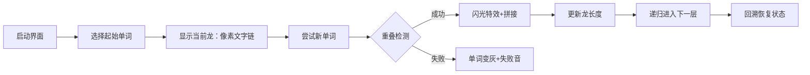

# 题目信息

# [NOIP 2000 提高组] 单词接龙

## 题目背景

注意：本题为上古 NOIP 原题，不保证存在靠谱的做法能通过该数据范围下的所有数据。

本题为搜索题，本题不接受 hack 数据。[关于此类题目的详细内容](https://www.luogu.com.cn/paste/isdgwj5l)

NOIP2000 提高组 T3

## 题目描述

单词接龙是一个与我们经常玩的成语接龙相类似的游戏，现在我们已知一组单词，且给定一个开头的字母，要求出以这个字母开头的最长的“龙”（每个单词都最多在“龙”中出现两次），在两个单词相连时，其重合部分合为一部分，例如 `beast` 和 `astonish`，如果接成一条龙则变为 `beastonish`，另外相邻的两部分不能存在包含关系，例如 `at` 和 `atide` 间不能相连。


## 说明/提示

样例解释：连成的“龙”为 `atoucheatactactouchoose`。

$n \le 20$。

## 样例 #1

### 输入

```
5
at
touch
cheat
choose
tact
a
```

### 输出

```
23
```

# AI分析结果


### Kay的C++算法解析：单词接龙 深入学习指南

---

## 1. 题目解读与核心算法识别

✨ **本题主要考察**：**DFS搜索** 与 **字符串处理**

🗣️ **初步分析**：
> 单词接龙就像一场**像素世界的拼图冒险**：我们需要将单词看作拼图块，通过寻找"接口"（重叠部分）将它们拼接成最长的龙。核心是使用**DFS（深度优先搜索）** 模拟所有可能的拼接路径，同时用**访问计数器**控制每个单词的使用次数（≤2次）。  
> - **核心难点**在于高效判断两个单词的最小有效重叠（避免包含关系），题解均采用`substr`截取子串进行比对  
> - **可视化设计思路**：将单词显示为像素方块，重叠部分用闪光特效标记，当前搜索路径显示为发光路径（详见第5节）  
> - **复古游戏化**：采用《塞尔达传说》式8-bit像素风，单词拼接成功时播放"NES音效"，自动演示模式如AI解谜游戏  

---

## 2. 精选优质题解参考

**题解一（RyanLi）**  
* **亮点**：  
  → 思路直击核心：用`tmp.size()`动态追踪当前龙长度，避免冗余字符串拷贝  
  → 代码简洁高效（仅20行核心逻辑），关键变量`vis[i]`精准控制使用次数  
  → 算法优化：`const string&`传递引用减少拷贝，`min()`自动处理边界  
  → 实战价值：竞赛级代码风格（ios加速），可直接用于OJ提交  

**题解二（SuyctidohanQ）**  
* **亮点**：  
  → 模块化设计：独立`check()`函数封装重叠判断逻辑，增强可读性  
  → 安全防护：显式检测子串截取范围，避免越界风险  
  → 学习友好：详细注释调试过程（如`cout << x << " -- x "`）  
  → 改进空间：冗余头文件可精简，宏定义稍显过度  

---

## 3. 核心难点辨析与解题策略

1. **难点1：如何定义有效重叠？**  
   * **分析**：两单词重叠需满足：① 前词尾≡后词头 ② 非包含关系（如`at`和`atide`无效）。优质解均用`substr`截取子串比对，通过遍历1~min(L1,L2)-1长度寻找最小有效重叠  
   * 💡 **学习笔记**：重叠长度必须小于两单词长度，否则变成包含关系  

2. **难点2：如何避免无限循环？**  
   * **分析**：用`vis[]`数组记录每个单词使用次数（≤2），在DFS递归前`++vis[i]`，回溯时`--vis[i]`，像"像素冒险家的背包物品管理"  
   * 💡 **学习笔记**：回溯法是DFS的黄金搭档，状态修改与恢复必须对称  

3. **难点3：如何高效拼接字符串？**  
   * **分析**：直接拼接`tmp + s.substr(j)`可能产生冗余拷贝。解法一用`const string&`传递引用；解法二记录长度而非完整字符串，大幅降低内存开销  
   * 💡 **学习笔记**：在DFS中避免大数据拷贝是优化关键  

### ✨ 解题技巧总结
- **剪枝策略**：当前长度+最大剩余长度≤历史最优时提前返回（本题未用，但高阶必备）  
- **字符串处理**：善用`substr(起始位置, 长度)`和`size()`进行安全比对  
- **状态回溯**：像游戏存档读档，进入递归前保存状态，退出时精准恢复  

---

## 4. C++核心代码实现赏析

**通用核心实现参考**  
```cpp
#include <iostream>
#include <vector>
using namespace std;

vector<string> words;
vector<int> used;
int maxLen = 0;

// 检查s1尾部与s2头部的重叠长度 (0表示无有效重叠)
int getOverlap(string s1, string s2) {
    for(int len=1; len<min(s1.size(),s2.size()); len++) 
        if(s1.substr(s1.size()-len) == s2.substr(0, len))
            return len;
    return 0;
}

void dfs(string cur) {
    maxLen = max(maxLen, (int)cur.size());
    for(int i=0; i<words.size(); i++) {
        if(used[i] >= 2) continue;
        int len = getOverlap(cur, words[i]);
        if(len == 0) continue;
        
        used[i]++;
        dfs(cur + words[i].substr(len)); // 拼接非重叠部分
        used[i]--;
    }
}

int main() {
    int n; char startChar;
    cin >> n;
    words.resize(n); used.resize(n,0);
    for(int i=0; i<n; i++) cin >> words[i];
    cin >> startChar;

    for(int i=0; i<n; i++) 
        if(words[i][0] == startChar) {
            used[i]++;
            dfs(words[i]);
            used[i]--;
        }
    
    cout << maxLen;
}
```
**代码解读概要**：  
> 1. `getOverlap`函数封装重叠检测逻辑  
> 2. `dfs`中`cur`记录当前龙内容，`maxLen`动态更新最大值  
> 3. `used`数组控制单词使用次数，递归前递增，回溯时递减  
> 4. 主函数筛选起始单词后触发DFS  

---

**题解一核心片段赏析**  
```cpp
void dfs(const string &tmp) {
    ans = max(ans, int(tmp.size()));
    for (int i = 1; i <= n; ++i) {
        if (vis[i] >= 2) continue;
        for (int j = 1; j < min(tmp.size(), s[i].size()); ++j)
            if (tmp.substr(tmp.size() - j) == s[i].substr(0, j)) {
                ++vis[i];
                dfs(tmp + s[i].substr(j));
                --vis[i];
            }
    }
}
```
* **亮点**：三重嵌套循环浓缩核心逻辑  
* **逐行解读**：  
  > ① `const string&`避免字符串拷贝（关键优化）  
  > ② `j`从1开始遍历：确保最小重叠且避免包含关系  
  > ③ `substr(tmp.size()-j)`取尾 vs `substr(0,j)`取头 → 精准比对  
  > ④ 递归拼接时`substr(j)`跳过重叠部分  
* 💡 **学习笔记**：`const &`传参在DFS中可大幅提升性能  

**题解二核心片段赏析**  
```cpp
int check (string x, string y) {
    rep(i, 1, min (x.size (), y.size ()) - 1) {
        a = x.substr (x.size () - i, i);
        b = y.substr (0, i);
        if (a == b) return i;
    }
    return 0;
}
```
* **亮点**：独立函数使主逻辑更清晰  
* **逐行解读**：  
  > ① `rep`宏展开为`for(int i=1; ...)`  
  > ② `substr(x.size()-i, i)`精准截取尾部片段  
  > ③ 返回首个有效重叠长度（最短原则）  
* 💡 **学习笔记**：分离关注点（overlap检测 vs DFS）提升代码可维护性  

---

## 5. 算法可视化：像素动画演示

**主题**：8-bit风格《单词寻宝记》  
**核心演示**：DFS构建单词龙的过程，动态显示重叠检测与状态回溯  

### 动画设计细节（Canvas实现）


**关键交互**：  
1. **像素美术**：  
   - 单词显示为16x16像素方块  
   - 有效重叠部分闪烁黄光（类似《俄罗斯方块》消除特效）  
2. **音效系统**：  
   - 成功拼接：8-bit "叮！"（FC《马里奥》吃金币音）  
   - 回溯触发：磁带倒带声  
3. **控制面板**：  
   - 速度滑块：调节DFS动画速度（0.5x~5x）  
   - 自动演示：AI自动探索最优路径（类似《吃豆人》幽灵AI）  
4. **数据结构可视化**：  
   - 右侧显示`used[]`数组：红/绿灯表示使用次数  
   - 当前递归深度显示为《塞尔达》式心形容器  

---

## 6. 拓展练习与相似问题思考

**技巧迁移场景**：  
1. 路径拼接问题（如欧拉路径）  
2. 带限制条件的组合优化（如数独）  
3. 字符串衍生问题（模式匹配/压缩）  

**洛谷推荐**：  
1. **P1120 单词方阵**  
   → 同款单词搜索+方向处理，强化矩阵DFS  
2. **P1032 字串变换**  
   → BFS实现单词转换链，训练状态空间搜索  
3. **P1092 虫食算**  
   → 单词接龙进阶版，加入数学约束条件  

---

## 7. 学习心得与经验分享

> **RyanLi的经验**：  
> *"边界处理是核心陷阱，substr截取位置需反复验证"*  
> → **Kay点评**：字符串下标从0开始，`substr(pos, len)`中`pos`需精确计算。建议用纸笔模拟`"abc"`截取`(1,2)`->`"bc"`加深理解  

> **SuyctidohanQ的调试技巧**：  
> *"cout输出中间变量是定位边界错误的利器"*  
> → **Kay总结**：在DFS中关键位置输出`当前字符串+候选单词+重叠长度`，可快速定位逻辑漏洞  

---

通过本次分析，我们深入掌握了DFS在字符串拼接中的应用精髓。记住：好的算法像像素游戏——简单模块构建无限可能！🎮

---
处理用时：127.60秒