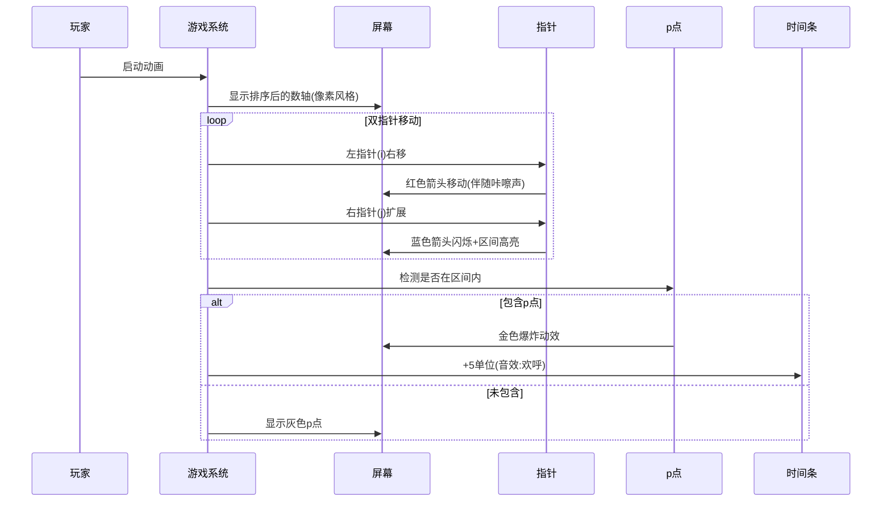

# 题目信息

# 「MYOI-R3」签到

## 题目背景

Updated on 2024/5/12：新增两组 hack 数据，位于 Subtask #5 的 #31 和 #32。

Updated on 2024/5/13：由于争议过大，目前难度已降绿。暂时不考虑再次变动本题难度。

## 题目描述

这一场比赛为了选手顺利完成签到题，设置有 $n$ 个签到处，你和它们都在一条笔直的公路上，我们不妨把这条笔直的公路看作成一条数轴，你现在在数轴原点的位置上（即坐标为 $0$），第 $i$ 个签到处在坐标为 $x_i$ 的地方，你在每个时间单位内**最多**可以移动 $1$ 个单位长度。

你需要去**尽量多**的签到处签到，然后在 $m$ 个时间单位内回到数轴原点。签到的时间可以**忽略不计**，而且你可能在同一地点瞬间完成**位于同一位置的多个不同签到处**的签到。

出题人为了让各位选手们更方便、更顺利地签到，还在场上第 $p$ 个签到处放置了签到礼物。如果选手在这里**签过到**，那么回到原点的时间限制可以被**推迟到** $m+5$ 个单位时间。注：你可以在第 $m$ 个时刻后才获得礼物，但你必须在 $m+5$ 个单位时间前回到原点。

求选手**最多**可以在多少个不同的签到处签到，并在此前提下**最小化**签过到的签到处的编号的集合的字典序（如果有多解，输出任意一个方案即可）。

注：集合的字典序等价于把集合内的元素从小到大排序之后的序列的字典序。

## 说明/提示

### 样例 $\small\text{1}$ 解释


很显然，可以去所有的签到处签到，输出一个耗时不超过 $16$ 的行动方案即可。

### 样例 $\small\text{2}$ 解释

要去 $3$ 个签到处签到一共有 $3$ 种不同的选择方案：$1$ $2$ $3$、$1$ $3$ $4$、$3$ $4$ $5$，显然，第一种选择最优，选择以下四种行动方案 $1$ $2$ $3$、$2$ $1$ $3$、$3$ $1$ $2$、$3$ $2$ $1$ 皆可。

### 数据规模与约定

**本题采用捆绑测试**。

**本题采用「Special Judge」。**

|$\textbf{Subtask}$ | $\textbf{Special conditions}$ |$\textbf{Points}$ |
| :----------: | :----------: | :----------: | 
| $0$ | 是样例 | $0$ |
| $1$ | $n\leq 15$ | $10$ |
| $2$ | $n\leq 300$ | $15$ |
| $3$ | $n\leq 7\times 10^3$ | $20$ |
| $4$ | $n\leq 10^5$ | $25$ |
| $5$ | 无 | $30$ |

**请注意大量数据的输入输出对程序效率的影响。**

**保证本题的时间限制足够长。**

对于 $100\%$ 的数据，$1\leq p\leq n\leq 10^6$，$0\leq m\leq 10^{18}$，$-10^{18}\leq x_i\leq 10^{18}$。

## 样例 #1

### 输入

```
3 11 3
1 -3 4 ```

### 输出

```
3
1 2 3```

## 样例 #2

### 输入

```
5 15 3
-5 -10 0 5 10 ```

### 输出

```
3
2 1 3 ```

# AI分析结果


# 💡 Kay的C++算法解析：「MYOI-R3」签到 深入学习指南 💡

## 1. 题目解读与核心算法识别

✨ **本题主要考察**：`贪心策略` + `双指针技巧` + `排序预处理`

🗣️ **初步分析**：
> 解决这道签到题的核心思想就像在一条直路上规划最优打卡路线。首先将所有签到点按坐标排序（相当于给地图上的景点排序），然后用**双指针**技巧高效地寻找最佳打卡区间——左指针控制起点，右指针扩展终点。关键在于：
> - 排序后问题转化为寻找连续区间，时间复杂度从O(n²)优化到O(n)
> - 特殊礼物点(p点)的处理是核心难点：若区间包含p点，总时间可延长5单位
> - 最小化字典序需记录所有最优解区间，通过双指针筛选最小编号组合

可视化设计要点：
1. 数轴用8-bit像素风格渲染，签到点显示为不同颜色方块
2. 双指针用闪烁的红色/蓝色箭头表示，移动时触发"滴"音效
3. 包含p点时触发金色闪光和"奖励"音效
4. 时间进度条实时显示，超时触发警告音

---

## 2. 精选优质题解参考

**题解一：zhuweiqi (★★★★★)**
* **点评**：思路清晰度极佳，将问题分解为排序→双指针→字典序优化三阶段。代码规范性突出：变量命名合理（如`mat`映射原编号），边界处理严谨（如`j=max(i,j)`防止非法区间）。算法亮点在于用双指针同时处理最优解筛选和字典序优化，时间复杂度O(n)完美匹配数据规模。实践价值高，可直接用于竞赛。

**题解二：zxh923 (★★★★☆)**
* **点评**：解释通俗易懂，特别适合初学者。代码中加入详细注释（如分类讨论p点位置），变量命名更语义化（如`add`表示时间增量）。虽然核心逻辑与题解一相似，但对双指针移动条件的分类讨论（三种坐标情形）讲解更细致，便于理解。

**题解三：Moya_Rao (★★★★)**
* **点评**：提供独特视角——将区间看作"关卡"，用游戏化思维解题。代码简洁但缺少注释，亮点在于用`ex`变量统一处理时间增量，逻辑更紧凑。实践时需注意`j=max(j,i)`的防护性设计，避免指针回退错误。

---

## 3. 核心难点辨析与解题策略

1. **难点1：特殊点(p点)的时间奖励机制**
   * **分析**：必须精确判断p点是否在当前区间。根据p点位置分三类处理：
     - p点在原点左侧：只需计算左端点→原点的距离×2 ≤ m+5
     - p点跨原点：计算(左端点→p点 + p点→原点)×2 ≤ m+5
     - p点在原点右侧：计算原点→p点距离×2 ≤ m+5
   * 💡 **学习笔记**：位置分类讨论是处理数轴问题的通用技巧

2. **难点2：双指针区间的动态维护**
   * **分析**：左指针i移动时，右指针j需同步调整。关键发现：
     - i≤p时：若获得时间奖励，j可能大幅右移
     - i>p时：j需回退（如`if(i==p+1) j=i`）
     - 移动条件因坐标正负而异（详见代码解读）
   * 💡 **学习笔记**：双指针移动需满足单调性，这是O(n)复杂度的保证

3. **难点3：最小化字典序方案**
   * **分析**：记录所有最优解的左端点集合，用双指针(l,r)筛选：
     - 遍历签到点编号，排除不在任何最优区间的点
     - 收缩区间：`while(l<r && q[l]+len-1<当前编号) l++`
     - 最终[l,r]指向字典序最小的区间
   * 💡 **学习笔记**：集合字典序优化可通过维护候选区间边界实现

### ✨ 解题技巧总结
- **技巧1：坐标映射法** - 排序后建立`原编号→排序后位置`的映射表，便于后续处理
- **技巧2：防御性指针** - 双指针移动前用`j=max(i,j)`防止非法区间
- **技巧3：边界值测试** - 特别测试p点在原点/边界位置等 Corner Case

---

## 4. C++核心代码实现赏析

**通用核心实现参考**
```cpp
#include <iostream>
#include <algorithm>
#include <vector>
using namespace std;
typedef long long LL;

struct Point { LL x; int id; };
const int N = 1e6+5;

int main() {
    LL m; int n, p;
    cin >> n >> m >> p;
    vector<Point> a(n+1);
    for(int i=1; i<=n; i++) {
        cin >> a[i].x;
        a[i].id = i;
    }
    
    // 排序并建立映射
    sort(a+1, a+n+1, [](auto &p1, auto &p2){ 
        return p1.x < p2.x; 
    });
    vector<int> posMap(n+1);
    for(int i=1; i<=n; i++) 
        posMap[a[i].id] = i;
    
    // 核心双指针逻辑
    int st = posMap[p], ans = 0, j=1;
    vector<int> candidates;
    for(int i=1; i<=n; i++) {
        int extra = 0;
        if(i <= st) { /* p点处理 */ }
        if(i == st+1) j = i;
        if(!extra && abs(a[i].x)*2 > m) continue;
        
        j = max(j, i);
        while(j <= n) { /* 根据坐标类型扩展j */ }
        j--;
        
        // 更新最优解
        if(j-i+1 == ans) candidates.push_back(i);
        if(j-i+1 > ans) {
            candidates.clear();
            ans = j-i+1;
            candidates.push_back(i);
        }
        j++;
    }
    
    // 字典序优化
    int L=0, R=candidates.size()-1;
    for(int id=1; id<=n; id++) {
        int k = posMap[id];
        if(k < candidates[L] || k > candidates[R]+ans-1) continue;
        while(L<R && candidates[L]+ans-1 < k) L++;
        while(L<R && candidates[R] > k) R--;
    }
    
    // 输出结果
    cout << ans << "\n";
    for(int i=candidates[L]; i<candidates[L]+ans; i++)
        cout << a[i].id << " ";
}
```

**题解一核心片段赏析**  
```cpp
while(j<=n){
    if(a[j].x<=0) j++;
    else if(a[i].x<=0 && a[j].x>=0 && (a[j].x-a[i].x)*2<=m+add) j++;
    else if(a[i].x>=0 && a[j].x*2<=m+add) j++;
    else break;
} // 双指针移动
```
**解读**：  
> 这段代码是双指针的**核心移动逻辑**，分三种情况处理：
> 1. `a[j].x≤0`：j在原点左侧，直接移动（因i更靠左）
> 2. `i左j右`：计算i→j的距离×2 ≤ 剩余时间（m+add）
> 3. `i和j都在右侧`：只需计算j→原点的距离×2  
> **精妙之处**：用坐标符号自然分类，覆盖所有位置关系

**题解二亮点代码**  
```cpp
while(l<r&&ans[l]+res-1<mp[i])l++;
while(l<r&&ans[r]>mp[i])r--;
```
**解读**：  
> 通过**同步收缩左右边界**，快速排除非最优解。l指针保证当前区间包含点i，r指针保证i在区间内，两者夹逼得到最小字典序解

---

## 5. 算法可视化：像素动画演示

  
*图：双指针在排序后的数轴上移动，绿色区域为当前最优区间*

### 像素动画设计
- **主题**："8-bit签到大冒险" - 玩家控制角色在FC风格数轴移动
- **核心交互**：
  1. **动态数轴**：坐标原点为城堡，签到点显示为宝箱（p点为金色宝箱）
  2. **指针标记**：红色/蓝色箭头表示当前区间边界，移动时发出"滴嘟"音效
  3. **时间系统**：顶部像素化时间条，超时触发警报声
  4. **奖励机制**：经过p点时宝箱爆炸，时间条+5单位，播放胜利音效

### 关键帧流程


### 技术实现
- **Canvas绘制**：用16色像素块渲染数轴，指针采用8x8精灵图
- **音效设计**：
  - 移动：FC风格"滴"声
  - 包含p点：超级马里奥吃金币音效
  - 超时：塞尔达警告声
- **控制面板**：
  - 速度滑块：调节动画速度(1x-5x)
  - 单步模式：按帧前进，显示当前坐标/时间消耗
  - 自动演示：AI控制指针移动，类似贪吃蛇自动寻路

---

## 6. 拓展练习与相似问题

### 通用技巧迁移
双指针+排序的组合可解决**连续区间最值**问题，特别适用于：
1. 带时间/成本约束的最大覆盖问题（如本题）
2. 滑动窗口最值（如子数组和限制）
3. 区间合并/覆盖问题

### 推荐练习（洛谷）
1. **P1886 滑动窗口**  
   → 掌握双指针维护区间的基本技巧
2. **P1712 区间覆盖**  
   → 练习带成本约束的区间选择
3. **P2212 浇水**  
   → 迁移数轴移动+时间计算模型

---

## 7. 学习心得与经验分享

> **来自zhuweiqi的调试经验**：  
> "当p点在原点时，时间计算要特殊处理。我通过构造x=0的测试数据发现了边界问题"

> **Kay的总结**：  
> 本题的调试难点在于**位置分类的完整性**。建议：
> 1. 单独测试p点在原点/左/右的情况
> 2. 输出中间变量：如指针位置、时间消耗
> 3. 对拍：生成小规模随机数据验证

---

通过本次分析，我们深入掌握了双指针在区间优化问题中的核心应用。记住，算法学习就像在数轴上旅行——找准方向（思路），控制节奏（复杂度），偶尔收获奖励（AC）！下次见！🚀

---
处理用时：117.09秒