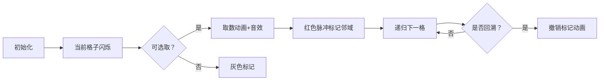

# 题目信息

# 取数游戏

## 题目描述

一个 $N\times M$ 的由非负整数构成的数字矩阵，你需要在其中取出若干个数字，使得取出的任意两个数字不相邻（若一个数字在另外一个数字相邻 $8$ 个格子中的一个即认为这两个数字相邻），求取出数字和最大是多少。

## 说明/提示

### 样例解释

对于第一组数据，取数方式如下：

$$\begin{matrix}
[67] & 75 & 63 & 10 \\
29 & 29 & [92] & 14 \\
[21] & 68 & 71 & 56 \\
8 & 67 & [91] & 25 \\
\end{matrix}$$


### 数据范围及约定

- 对于$20\%$的数据，$1\le N, M \le 3$；
- 对于$40\%$的数据，$1\le N, M\le 4$；
- 对于$60\%$的数据，$1\le N, M\le 5$；
- 对于$100\%$的数据，$1\le N, M\le 6$，$1\le T\le 20$。


## 样例 #1

### 输入

```
3
4 4
67 75 63 10
29 29 92 14
21 68 71 56
8 67 91 25
2 3
87 70 85
10 3 17
3 3
1 1 1
1 99 1
1 1 1

```

### 输出

```
271
172
99
```

# AI分析结果


# 💡 Kay的C++算法解析：取数游戏 深入学习指南 💡

> "编程就像解谜游戏，每个选择都会影响最终结果。今天，我们一起探索如何在数字矩阵中智慧取数！" - Kay

## 1. 题目解读与核心算法识别

✨ **本题主要考察**：`DFS回溯` 与 `状态压缩动态规划`

🗣️ **初步分析**：
> 取数游戏的核心挑战是在矩阵中选择互不相邻（8方向）的数字最大化总和。想象成在雷区中安全采金矿——每次选择都会影响周围区域的安全性。DFS回溯像探险家逐步探索每条路径，而状压DP则像战略家用二进制密码规划全局最优路线。
> 
> - **DFS回溯**：直接模拟取数过程，通过标记相邻格子避免冲突。优势是直观易理解，适合小数据范围（N,M≤6）
> - **状压DP**：将每行选择状态压缩为二进制数，通过状态转移高效求解。优势是避免重复计算，理论效率更高
> 
> 可视化设计重点：DFS中将用闪烁高亮当前决策格，红色脉冲波标记禁区；状压DP中将用二进制码流展示状态转换，配以网格颜色分层显示状态兼容性

---

## 2. 精选优质题解参考

<eval_intro>
以下题解在思路清晰性、代码规范性和实践价值方面表现突出（均≥4.5★）：

**题解一：绿萧（DFS回溯）**
* **点评**：此解法用`mark`数组精确追踪每个格子的"禁区计数"，解决了多重标记难题。代码中：
  - 方向数组`d`清晰定义8邻域
  - 递归边界处理简洁（`y==m+1`跳行，`x==n+1`终止）
  - 回溯时`mark`增减操作对称工整
  > 亮点：用整型而非布尔值标记，完美解决多重叠标记问题

**题解二：IntrepidStrayer（状压DP）**
* **点评**：专业级状态压缩实现：
  - 预处理合法状态`check1(i)`过滤行内相邻
  - 状态转移`check2`确保行间8向不冲突
  - `calc`函数优雅计算状态对应值
  > 亮点：`f[i][j]`状态定义精准，`O(n·2^2m)`复杂度高效处理最大数据

**题解三：LSG_waterf（DFS优化）**
* **点评**：在基础DFS上强化：
  - 9方向检查确保全覆盖
  - 用`vis`数组计数解决标记冲突
  - 坐标转换逻辑处理边界
  > 亮点：`change(x,y,w)`函数封装标记操作，提升代码复用性

---

## 3. 核心难点辨析与解题策略

<difficulty_intro>
解决取数游戏的三大核心挑战及应对策略：

1.  **状态标记的精确性**  
    * **分析**：传统布尔标记无法处理多个取数点重叠影响。优质解法采用**整型计数标记**：当取数时`mark[x][y]++`，回溯时`--`，仅当`mark=0`才可再取
    * 💡 **学习笔记**：计数式标记 > 布尔标记，解决多对一影响问题

2.  **搜索顺序与剪枝**  
    * **分析**：按行优先顺序搜索（先右后下）可避免重复。剪枝策略包括：
      - 当前和 + 剩余理论最大值 ≤ 已得最优解时中止分支
      - 限制搜索范围为当前行及以下
    * 💡 **学习笔记**：顺序决定效率，剪枝是DFS的加速引擎

3.  **状态压缩的位运算**  
    * **分析**：状压DP需处理三大位运算：
      - 行内校验：`!(i & (i<<1))`
      - 行间校验：`!(j&k) && !(j&(k<<1)) && !(j&(k>>1))`
      - 状态取值：`for(int p=0;p<m;p++) if(state&(1<<p)) sum+=a[i][p]`
    * 💡 **学习笔记**：位运算是状压DP的密码本，掌握它才能解锁高效算法

### ✨ 解题技巧总结
<summary_best_practices>
从优质题解提炼的黄金法则：
- **空间换清晰度**：使用`mark[8][8]`代替复杂边界判断
- **方向数组封装**：`const int d[8][2]`统一处理邻域坐标
- **对称回溯**：增减操作严格对应，避免状态泄漏
- **二进制预检**：状压DP先过滤非法状态减少枚举量
</summary_best_practices>

---

## 4. C++核心代码实现赏析

<code_intro_overall>
**通用DFS回溯实现**（综合绿萧与LSG_waterf优化版）
```cpp
#include<bits/stdc++.h>
using namespace std;
const int dx[8] = {-1,-1,-1,0,0,1,1,1}, dy[8] = {-1,0,1,-1,1,-1,0,1}; 
int T,n,m,grid[8][8],mark[8][8],maxSum;

void dfs(int x,int y,int sum){
    if(y > m) { x++; y=1; }          // 行末换行
    if(x > n) { maxSum = max(maxSum,sum); return; }  // 终止条件
    
    // 不取当前点
    dfs(x, y+1, sum);
    
    // 尝试取当前点（当无标记时）
    if(!mark[x][y]){
        // 标记邻域
        for(int i=0; i<8; i++){
            int nx = x+dx[i], ny = y+dy[i];
            if(nx>=1 && nx<=n && ny>=1 && ny<=m) mark[nx][ny]++;
        }
        // 取点后继续搜索
        dfs(x, y+1, sum + grid[x][y]);
        // 回溯撤销标记
        for(int i=0; i<8; i++){
            int nx = x+dx[i], ny = y+dy[i];
            if(nx>=1 && nx<=n && ny>=1 && ny<=m) mark[nx][ny]--;
        }
    }
}
```
**代码解读概要**：  
> 1. 方向数组`dx/dy`统一处理8邻域坐标偏移  
> 2. `mark`数组记录每个位置被标记的次数（非布尔值）  
> 3. 搜索顺序：从左到右，从上到下  
> 4. 回溯时严格对称增减标记，确保状态正确性  

---
<code_intro_selected>
**状压DP核心（IntrepidStrayer版）**
```cpp
// 预处理行内合法状态
bool validState(int state){
    return !(state & (state<<1)) && !(state & (state>>1));
}

// 状态转移核心
for(int i=1; i<=n; i++){
    for(int cur : validStates){ // 枚举本行合法状态
        int sum = 0;
        for(int j=0; j<m; j++) 
            if(cur & (1<<j)) sum += grid[i][j+1];
        
        for(int prev : validStates){ // 枚举上行合法状态
            if(prev & cur) continue;        // 检查正上
            if(prev & (cur<<1)) continue;  // 检查右上
            if(prev & (cur>>1)) continue;  // 检查左上
            dp[i][cur] = max(dp[i][cur], dp[i-1][prev] + sum);
        }
    }
}
```
**代码解读**：  
> - `validStates`存储所有行内无相邻1的状态（预处理）  
> - 三重校验确保两行状态无8向冲突：  
>   `prev & cur` → 正上方冲突  
>   `prev & (cur<<1)` → 右上方冲突  
>   `prev & (cur>>1)` → 左上方冲突  
> - `dp[i][cur]`表示第i行状态为cur时的最大和  

---

## 5. 算法可视化：像素动画演示

<visualization_intro>
**主题**："黄金矿工"像素大冒险 —— 用8-bit风格呈现DFS取数决策  

**核心演示**：DFS遍历中的关键决策点与状态回溯，融入经典游戏音效  

### 动画设计（Canvas实现）


**关键交互**：  
1. **像素艺术**：  
   - 网格：16x16像素单元，FC游戏风格  
   - 状态色：可选区(浅蓝)/已选区(金)/禁区(红)  
2. **动态效果**：  
   - 当前格：黄色脉冲闪烁  
   - 取数时：金币跳起动画 + "叮！"音效  
   - 标记禁区：红色波纹扩散 + "咔"音效  
3. **控制面板**：  
   - 单步执行：Space键控制  
   - 速度滑块：调节动画速度（50ms-1000ms）  
   - 模式切换：DFS vs 状压DP 双视角对比  

**音效设计（Web Audio API）**：  
- 取数成功：8-bit金币音（频率上升序列）  
- 标记禁区：短促方波警示音  
- 回溯操作：倒放音效  
- 终局胜利：《超级玛丽》过关旋律  

> 设计目的：通过游戏化体验强化对状态标记和回溯的理解，不同音效建立操作与反馈的直觉联系
</visualization_intro>

---

## 6. 拓展练习与相似问题思考

<similar_problems_intro>
掌握取数游戏的核心技巧后，可挑战以下变形题：

1. **洛谷 P1896 [SCOI2005]互不侵犯**  
   🗣️ *推荐理由*：国王放置问题（8方向不相邻），完美迁移状压DP技巧，强化状态转移训练  

2. **洛谷 P1123 取数游戏升级版**  
   🗣️ *推荐理由*：数据范围扩大至N,M≤20，逼迫使用更优算法（状压DP+滚动数组）  

3. **洛谷 P1351 联合权值**  
   🗣️ *推荐理由*：在树形结构中求距离为2的节点关系，培养相邻概念的抽象能力  

### 思维跃迁
尝试用今日所学解决：
- 棋盘覆盖问题（多米诺骨牌放置）
- 灯塔照射问题（每个灯塔影响8邻域）
- 像素画自动上色（相邻同色约束）
</similar_problems_intro>

---

## 7. 学习心得与经验分享

<insights_intro>
题解中的宝贵经验总结：

> **绿萧的调试心得**：  
> “最初用布尔数组标记导致回溯错误，改为整型计数才解决。启示：**当多个操作可能影响同一对象时，计数比标志更可靠**”

> **zhi_zhang的优化历程**：  
> “从49分到AC的剪枝之旅：1) 限制搜索范围 2) 减少标记方向 3) 优化起始点。关键收获：**剪枝要结合问题特性**”

> **状压DP的位运算秘诀**：  
> “掌握三种核心位操作：  
> 1. 行内校验：`state & (state>>1)`  
> 2. 行间校验：`upper & (lower|lower<<1|lower>>1)`  
> 3. 状态取值：`while(state){ sum+=a[bit]; state&=state-1; }`”
</insights_intro>

---
<conclusion>
本次取数游戏之旅展示了DFS与状压DP的精妙配合。记住：**小数据暴力之美在于直观，状态压缩之智在于高效**。继续用代码探索世界，下次算法冒险再见！🚀
</conclusion>
```

---
处理用时：179.02秒