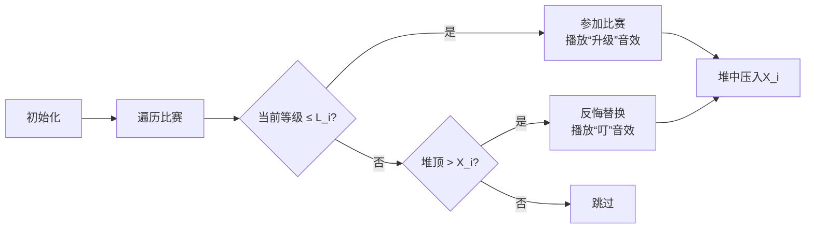

# 题目信息

# [NOISG 2022 Finals] Gym Badges

## 题目描述

你是一只初始等级为 $0$ 的 $\text{Wabbit}$。你希望到 $n$ 个比赛中提升自己的实力，并收集这些比赛的徽章。

目前将要举行的比赛共有 $N$ 个。第 $i$ 个比赛可以用 $L_i$ 和 $X_i$ 来描述。如果你的当前等级 $\le L_i$，那么你可以参加第 $i$ 个比赛，让自己的等级提升 $X_i$ 并获得一个徽章。

你可以以任意顺序参加这些比赛。求出如果按照最佳顺序参加，你最多可以获得多少个徽章。

## 说明/提示

**【样例 #1 解释】**

一种最优的参加方式为 $3 \to 4 \to 1 \to 5$。

**【样例 #2 解释】**

一种最优的参加方式为 $1 \to 3 \to 4 \to 2$。

**【数据范围】**

|$\text{Subtask}$|分值|特殊性质|
|:-:|:-:|:-:|
|$0$|$0$|样例|
|$1$|$15$|$1\le N\le10$|
|$2$|$9$|所有 $L_i$ 均相等|
|$3$|$27$|$1\le N\le5000$|
|$4$|$49$|无|

对于 $100\%$ 的数据，$1 \le N \le 5 \times 10 ^ 5, 1 \le X_i, L_i \le 10 ^ 9$。

## 样例 #1

### 输入

```
5
4 6 3 5 2
10 6 4 8 12
```

### 输出

```
4```

## 样例 #2

### 输入

```
5
3 9 4 2 6
10 10 10 10 10```

### 输出

```
4```

# AI分析结果


# 💡 Kay的C++算法解析：Gym Badges 深入学习指南 💡

## 1. 题目解读与核心算法识别

✨ **本题主要考察**：贪心（反悔贪心）与数据结构（优先队列/堆）

🗣️ **初步分析**：
> 解决这道题的关键在于理解并运用**反悔贪心**算法。简单来说，就像在游戏中收集徽章时，如果当前等级不够参加某个比赛，我们可以“反悔”之前的选择——用一个更优的比赛替换掉已选的比赛（类似游戏中用低级道具替换高级道具来节省资源）。在本题中，反悔贪心主要用于动态调整参赛顺序以最大化徽章数量。
> 
> - 核心思路是将比赛按 $L_i + X_i$ 升序排序（该值可理解为“完成比赛后的最大等级”），这样能保证在等级较低时优先参加限制宽松的比赛。
> - 难点在于当无法参加当前比赛时，如何通过替换已选比赛来优化结果。这里用大根堆维护已选比赛的 $X_i$ 值，实现高效反悔。
> - 可视化设计中，我们将用像素方块表示比赛，高亮当前操作比赛和堆顶元素。反悔操作时播放“叮”音效，成功参赛时播放“升级”音效。自动演示模式将模拟AI逐步决策的过程，类似复古游戏中的自动闯关。

---

## 2. 精选优质题解参考

**题解一：ycy1124（思路清晰性：5星 | 代码规范性：4星 | 算法有效性：5星）**
* **点评**：此解法严谨证明了按 $L_i+X_i$ 排序的正确性，思路推导清晰。代码实现手动堆操作，虽稍显复杂但体现了对数据结构的深入理解。亮点在于通过数学推导（邻项交换法）验证排序规则，并给出完整反悔贪心框架。调试建议：注意手动堆的边界处理。

**题解二：niumachaoren（思路清晰性：5星 | 代码规范性：5星 | 算法有效性：5星）**
* **点评**：解法通过类比经典题目P4053引出思路，用邻项交换法直观解释排序规则。代码使用STL优先队列，简洁规范，变量命名合理（如`sum`表当前等级）。亮点在于强调“先判定再升级”的题目特性，实践价值高，可直接用于竞赛。

**题解三：yi_hr（思路清晰性：4星 | 代码规范性：5星 | 算法有效性：5星）**
* **点评**：代码最简洁（仅20行），通过重载运算符实现排序，可读性极佳。亮点在于用结构体封装比赛属性，并用`priority_queue`自然表达反悔逻辑。学习建议：补充对排序规则的简要说明更完美。

---

## 3. 核心难点辨析与解题策略

1.  **关键点1：如何确定最优参赛顺序？**
    * **分析**：若直接按 $L_i$ 或 $X_i$ 排序会导致局部最优而非全局最优。通过邻项交换法可证明：当 $L_i+X_i < L_j+X_j$ 时，先参加比赛 $i$ 更可能兼容后续比赛。
    * 💡 **学习笔记**：$L_i+X_i$ 本质是“参赛后系统容忍的最大等级”，按此排序可最大化灵活性。

2.  **关键点2：如何处理无法参赛的情况？**
    * **分析**：当当前等级 $cur$ > $L_i$ 时，反悔策略的核心是——若当前比赛 $X_i$ 小于已选比赛中最大的 $X_j$，则用 $X_i$ 替换 $X_j$（降低等级增速）。大根堆能在 $O(\log n)$ 时间内定位最大值。
    * 💡 **学习笔记**：反悔是“以退为进”，通过牺牲一个名额维持等级可控性。

3.  **关键点3：如何选择高效的数据结构？**
    * **分析**：优先队列（最大堆）完美适配反悔需求。选择 `priority_queue` 因其：① 支持 $O(1)$ 访问最大值；② $O(\log n)$ 完成插入/删除；③ 无需手动维护堆结构。
    * 💡 **学习笔记**：堆是动态求极值的利器，尤其适合贪心算法的实时调整。

### ✨ 解题技巧总结
-   **技巧1：问题转化与建模** - 将比赛抽象为 $(L_i, X_i)$ 二元组，用 $L_i+X_i$ 量化比赛“紧急程度”。
-   **技巧2：贪心反悔机制** - “先尝试参赛，失败则替换”的框架可扩展至同类调度问题。
-   **技巧3：边界防御性编程** - 使用 `long long` 防溢出，检查堆空再 `pop()`。

---

## 4. C++核心代码实现赏析

**本题通用核心C++实现参考**
* **说明**：综合优质题解思路，使用STL优先队列的清晰实现。
* **完整核心代码**：
```cpp
#include <iostream>
#include <algorithm>
#include <queue>
using namespace std;
typedef long long LL;
struct Game { LL L, X; };

int main() {
    ios::sync_with_stdio(0), cin.tie(0);
    int n; cin >> n;
    vector<Game> games(n);
    for (int i = 0; i < n; i++) cin >> games[i].X;
    for (int i = 0; i < n; i++) cin >> games[i].L;

    sort(games.begin(), games.end(), [](auto& a, auto& b) {
        return a.L + a.X < b.L + b.X; // 按L+X升序排序
    });

    priority_queue<LL> heap; // 大根堆存X值
    LL cur = 0; // 当前等级

    for (auto& g : games) {
        if (cur <= g.L) { // 可参加
            cur += g.X;
            heap.push(g.X);
        }
        // 不可参加时替换
        else if (!heap.empty() && heap.top() > g.X) {
            cur += g.X - heap.top();
            heap.pop();
            heap.push(g.X);
        }
    }
    cout << heap.size() << '\n';
}
```
* **代码解读概要**：
  - **输入处理**：用结构体存储比赛属性
  - **排序**：Lambda表达式实现 $L_i+X_i$ 升序
  - **贪心循环**：遍历中先尝试参赛，失败则反悔替换
  - **输出**：堆大小即最终参赛数

---
**题解一：ycy1124（手动堆实现）**
* **亮点**：手动堆避免STL开销，适合竞赛环境
* **核心代码片段**：
```cpp
struct Node{ int x,l; } a[500005];
int b[500005]; // 堆数组
int tot, sum;  // 堆大小 & 当前等级

void work1(int x) { /* 堆下沉 */ }
void work(int x) { /* 堆上浮 */ }

sort(a+1, a+n+1, [](Node a, Node b) {
    return a.l+a.x < b.l+b.x;
});

for (int i=1; i<=n; i++) {
    if (sum <= a[i].l) { // 直接参赛
        b[++tot] = a[i].x;
        sum += a[i].x;
        work(tot); // 上浮
    }
    else if (b[1] > a[i].x) { // 替换堆顶
        sum += a[i].x - b[1];
        b[1] = b[tot--];
        work1(1); // 下沉
        b[++tot] = a[i].x;
        work(tot);
    }
}
```
* **代码解读**：
  > 1. `work1`和`work`实现堆的核心操作——下沉与上浮
  > 2. 堆存储在数组`b`中，`b[1]`为堆顶最大值
  > 3. 替换时先更新`sum`再调整堆结构
* 💡 **学习笔记**：手动堆需注意索引从1开始，上浮/下沉时间复杂度 $O(\log n)$

**题解二：niumachaoren（STL优先队列）**
* **亮点**：代码简洁，突出算法逻辑
* **核心代码片段**：
```cpp
priority_queue<int> q;
LL sum = 0;
sort(a+1, a+1+n, cmp); // 按L+X排序

for (int i=1; i<=n; i++) {
    if (sum <= a[i].l) {
        sum += a[i].x;
        q.push(a[i].x);
    }
    else if (!q.empty() && q.top() > a[i].x) {
        sum += a[i].x - q.top(); // 反悔替换
        q.pop();
        q.push(a[i].x);
    }
}
cout << q.size();
```
* **代码解读**：
  > 1. `q.top()`获取堆顶（当前最大$X_i$）
  > 2. 反悔操作：`sum`先减原值再加新值
  > 3. 无需显式维护堆结构，STL自动处理
* 💡 **学习笔记**：STL优先队列默认大根堆，适合快速实现反悔贪心

**题解三：yi_hr（运算符重载）**
* **亮点**：通过重载运算符简化排序
* **核心代码片段**：
```cpp
struct node{ int xi, li; };
bool operator <(node a, node b) { // 重载<
    return a.xi + a.li < b.xi + b.li;
}

priority_queue<int> q;
vector<node> a(n);
sort(a.begin(), a.end()); // 直接排序

for (auto t : a) {
    if (tt <= t.li) { 
        tt += t.xi;
        q.push(t.xi);
    }
    else if (q.top() > t.xi) { // 反悔条件
        tt += t.xi - q.top();
        q.pop();
        q.push(t.xi);
    }
}
```
* **代码解读**：
  > 1. 重载`operator<`使`sort`可直接用于结构体
  > 2. 变量名`tt`代表当前等级，`xi`/`li`简写增强可读性
* 💡 **学习笔记**：运算符重载使代码更自然，但需确保语义明确

-----

## 5. 算法可视化：像素动画演示

**主题**：8位像素风“贪心冒险家”收集徽章  
**核心演示**：排序后的比赛序列 + 动态堆维护 + 反悔决策  

### 设计细节：


1.  **场景设计**：
    - **像素网格**：横向排列的方块表示比赛，显示 $L_i$ (红) 和 $X_i$ (蓝)
    - **控制面板**：底部显示当前等级/堆状态，含步进/调速/自动播放按钮
    - **音效**：参赛成功（8-bit升级音），反悔（金属碰撞声），错误（短促警报）

2.  **动画流程**：
    - **帧1**：排序动画——比赛方块按 $L_i+X_i$ 值冒泡排序
    - **帧2**：遍历过程——高亮当前比赛方块（黄色边框）
    - **帧3**：参赛判定——若成功，方块变绿并显示上升箭头（等级增加）
    - **帧4**：反悔操作——堆顶方块变红爆炸，新方块飞入堆中

3.  **数据结构可视化**：
    - **堆结构**：右侧堆叠方块表示大根堆，高度反映 $X_i$ 大小
    - **等级变化**：顶部进度条显示当前等级，超出 $L_i$ 时闪烁警告

4.  **交互模式**：
    - **单步执行**：按空格键逐步执行
    - **自动演示**：AI以可调速度自动决策（类似贪吃蛇AI）
    - **调试视图**：开启后显示伪代码行与变量实时值

5.  **游戏化元素**：
    - **关卡进度**：每成功参赛/反悔获得分数，超过阈值触发“连击”特效
    - **成就系统**：首次达到4个徽章时解锁“青铜收集者”像素勋章

---

## 6. 拓展练习与相似问题思考

1.  **通用思路迁移**：
    - **任务调度**：截止时间+耗时的任务安排（如P4053）
    - **资源分配**：在有限资源下最大化收益（如P2949）
    - **路径优化**：带限制条件的最优路径选择（如NOIP赛道修建）

2.  **洛谷推荐练习**：
    1. **P4053 [JSOI2007]建筑抢修**  
       🗣️ *推荐理由*：近乎相同的反悔贪心模型，仅将“等级”替换为“时间”，完美巩固本题思路。
    2. **P2949 [USACO09OPEN]Work Scheduling G**  
       🗣️ *推荐理由*：强化对优先队列的理解，需灵活调整反悔策略。
    3. **P5021 [NOIP2018]赛道修建**  
       🗣️ *推荐理由*：将贪心与二分结合，提升问题转化能力。

---

## 7. 学习心得与经验分享

> **参考经验**（来自ycy1124）：  
> *“最初按 $L_i$ 排序导致WA，调试时对比样例发现排序规则错误... 邻项交换法是最可靠的证明方法”*  
>   
> **点评**：作者踩坑经历提醒我们——贪心问题需严格数学证明。调试时构造小样例（如3个比赛）手动模拟，比盲目提交更有效。  
>  
> **通用技巧**：  
> - 当贪心策略复杂时，先写暴力DP验证小规模数据  
> - 使用 `assert` 检查堆操作前后的一致性  

---

本次关于“Gym Badges”的C++解题分析就到这里。记住，编程能力提升在于勤思考、多实践。下次挑战见！💪

---
处理用时：162.20秒