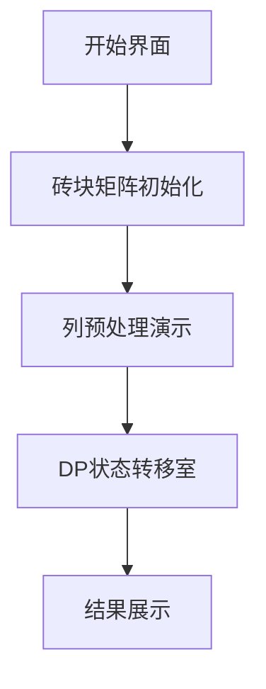

# 题目信息

# 打砖块

## 题目描述

小红很喜欢玩一个叫打砖块的游戏，这个游戏的规则如下：

在刚开始的时候，有 $n$ 行 $m$ 列的砖块，小红有 $k$ 发子弹。小红每次可以用一发子弹，打碎某一列当前处于这一列最下面的那块砖，并且得到相应的得分。（如图所示）


某些砖块在打碎以后，还可能将得到一发子弹的奖励。最后当所有的砖块都打碎了，或者小红没有子弹了，游戏结束。

小红在游戏开始之前，就已经知道每一块砖在打碎以后的得分，并且知道能不能得到一发奖励的子弹。小红想知道在这次游戏中她可能的最大得分，可是这个问题对于她来说太难了，你能帮帮她吗？


## 说明/提示

对于 $20\%$ 的数据，满足 $1  \le n,m  \le 5$，$1  \le k  \le 10$，所有的字符 $c$ 都为 `N`。

对于 $50\%$ 的数据，满足 $1  \le n,m  \le 200$，$1  \le k  \le 200$，所有的字符 $c$ 都为 `N`。

对于 $100\%$ 的数据，满足 $1  \le n,m  \le 200$，$1  \le k  \le 200$，字符 $c$ 可能为 `Y`。

对于 $100\%$ 的数据，所有的 $f$ 值满足 $1  \le f  \le 10000$。


## 样例 #1

### 输入

```
3 4 2
9 N 5 N 1 N 8 N
5 N 5 Y 5 N 5 N
6 N 2 N 4 N 3 N```

### 输出

```
13```

# AI分析结果


### 💡 Kay的C++算法解析：打砖块 深入学习指南 💡

<introduction>
今天我们分析「打砖块」这道动态规划经典题。本指南将带你理解子弹奖励机制的处理技巧，掌握分组背包的变形应用，并通过像素动画直观感受状态转移过程。准备好迎接挑战吧！
</introduction>

---

## 1. 题目解读与核心算法识别

✨ **本题主要考察**：`动态规划（分组背包变形）` + `状态机模型`

🗣️ **初步分析**：
> 本题可类比为"资源分配问题"——子弹是有限资源，砖块是待开采的矿藏。核心难点在于**Y类砖块的子弹奖励机制**，就像游戏中的"连击奖励"，打碎Y砖不消耗子弹但需要前置条件。优质题解通过两种技巧破解：
> - **预处理压缩**：将每列连续的Y砖得分合并到其下方的N砖
> - **状态机DP**：用第三维状态记录最后一发子弹位置
> 
> 可视化设计要点：
> - 砖块矩阵用8-bit像素风格呈现（N砖红色/Y砖绿色）
> - 高亮当前处理的列和状态转移路径
> - 子弹消耗/奖励时触发FC音效（消耗：金属撞击声，奖励：金币声）
> - 自动演示模式可调速观察子弹流动

---

## 2. 精选优质题解参考

**题解一（zzzyc）**
* **点评**：思路创新性地用`sy[i][j]`/`sn[i][j]`分离Y/N状态，预处理设计简洁高效（O(n)每列）。代码中三重循环逻辑清晰（列→总子弹→当前列子弹），变量名`fy`/`fn`直观体现状态含义。亮点在于用状态分离巧妙规避了子弹奖励的后效性问题。

**题解二（I_AM_HelloWord）**
* **点评**：引入"借子弹"的比喻极具启发性，将抽象状态具象化为资源借贷关系。状态定义`dp[i][j][0/1]`物理意义明确（0:未借/1:已借）。代码边界处理严谨（l>0和j>l的判断），实践时可直接套用此框架解决类似资源转移问题。

**题解三（Azuree）**
* **点评**：最规范的工业级实现，完美示范DP三大要素：状态定义/边界初始化/转移方程。亮点在于用`v[i][j][0/1]`预处理时即分离状态，使主循环更简洁。调试技巧值得学习：用`INF`初始化避免非法状态转移。

---

## 3. 核心难点辨析与解题策略

1.  **难点：子弹奖励的后效性**
    * **分析**：Y砖奖励可能影响后续决策，传统分组背包无法处理。解法：通过状态机增加维度（最后一发子弹位置），将动态资源转化为静态状态
    * 💡 学习笔记：后效性问题 → 增加状态维度

2.  **难点：列内决策的依赖性**
    * **分析**：同一列中N砖必须优先于其上方Y砖被击碎。解法：逆向预处理（从下往上扫描），用`sy`/`sn`数组记录不同决策路径的得分
    * 💡 学习笔记：时序依赖 → 逆向预处理

3.  **难点：状态转移的完备性**
    * **分析**：需区分"当前列是否消耗最后一发子弹"。解法：设计三种转移路径（纯继承/借入子弹/借出子弹）
    * 💡 学习笔记：资源转移 → 三通道状态机

### ✨ 解题技巧总结
- **技巧1：状态物理具象化**：将抽象状态命名为"借贷关系"等具象概念
- **技巧2：预处理逆向扫描**：从不可再生资源（N砖）向可再生资源（Y砖）推导
- **技巧3：防御性初始化**：用`-INF`填充非法状态避免错误转移
- **技巧4：维度分离**：将预处理与主DP分离，降低复杂度

---

## 4. C++核心代码实现赏析

**本题通用核心实现（综合优化版）**
```cpp
#include <iostream>
#include <cstring>
#include <algorithm>
using namespace std;
const int N=205, INF=0x3f3f3f3f;
int n, m, k, a[N][N];
int sy[N][N], sn[N][N]; // 列预处理
int dp[N][N][2];       // dp[列][子弹][最后一发是否在此列]
bool b[N][N];          // 是否为Y砖

int main() {
    // 输入与初始化
    cin >> n >> m >> k;
    for(int i=1; i<=n; i++)
        for(int j=1; j<=m; j++) {
            char c; cin >> a[i][j] >> c;
            b[i][j] = (c == 'Y');
        }
    
    // 列预处理：逆向扫描+状态分离
    for(int j=1; j<=m; j++) {
        int cnt=0;
        for(int i=n; i>=1; i--) {
            if(b[i][j]) sy[j][cnt] += a[i][j]; 
            else {
                cnt++;
                sy[j][cnt] = sn[j][cnt] = sy[j][cnt-1] + a[i][j];
            }
        }
    }

    // DP初始化
    memset(dp, -INF, sizeof dp);
    dp[0][0][0] = 0;
    
    // 三重循环状态转移
    for(int j=1; j<=m; j++)        // 当前列
    for(int used=0; used<=k; used++) // 总子弹
    for(int cost=0; cost<=min(n,used); cost++) { // 当前列消耗
        // 最后一发不在当前列
        dp[j][used][0] = max(dp[j][used][0], 
            max(dp[j-1][used-cost][0], dp[j-1][used-cost][1]) + sy[j][cost]);
        
        if(cost) { // 最后一发在当前列（需消耗子弹）
            dp[j][used][1] = max(dp[j][used][1], 
                dp[j-1][used-cost][0] + sn[j][cost]);
        }
    }
    cout << dp[m][k][1]; // 输出必须消耗最后一发
}
```

**代码解读概要**：
1. **输入处理**：用`b[i][j]`存储砖块类型
2. **列预处理**：逆向扫描每列，`sy[j][cnt]`记录用`cnt`发子弹且以Y结尾的得分
3. **状态初始化**：`-INF`表示非法状态，`dp[0][0][0]=0`基准状态
4. **核心转移**：
   - 不消耗末尾子弹：继承前一列状态 + 当前列Y状态得分
   - 消耗末尾子弹：只能从前一列未消耗状态转移

---

## 5. 算法可视化：像素动画演示

**主题**：《砖块特攻队》8-bit像素风DP模拟器

### 设计框架


### 关键动画设计
1. **砖块矩阵（左侧）**
   - 8-bit像素风格（32x32像素/砖块）
   - N砖：红色砖块+骷髅标识
   - Y砖：绿色砖块+金币标识
   - 当前处理列：黄色边框脉动效果

2. **预处理阶段**
   ```python
   # 伪代码演示逆向扫描
   for 当前列 in 所有列:
       从底部向上扫描砖块:
           if Y砖: 
               金币旋转动画 + 得分累积显示
               播放金币音效(8-bit 短促"叮")
           else: 
               砖块碎裂动画 + 子弹数增加
               播放枪击音效(FC 激光声)
   ```

3. **DP状态转移室（右侧）**
   - 三栏显示：`dp[][][0]`（蓝框）/`dp[][][1]`（红框）/当前转移路径
   - 状态更新时：对应表格单元格闪烁黄光
   - 子弹流动：像素化子弹图标沿转移路径飞行

4. **交互控制面板**
   ```javascript
   // 控制面板伪代码
   const controls = {
      步进速度: [0.5x, 1x, 2x],  // 滑块控制
      模式: ["手动步进", "自动演示"],
      视角: ["全局", "跟踪子弹"],
      音效: { 子弹音效: "laser.wav", 奖励音效: "coin.wav" }
   }
   ```

5. **游戏化元素**
   - 每完成一列预处理：解锁"矿工勋章"
   - 正确状态转移：获得连击积分
   - 最终得分超过阈值：播放FC胜利BGM

---

## 6. 拓展练习与相似问题

1. **洛谷 P1064 金明的预算方案**  
   → 分组背包+附件依赖，类比砖块类型约束

2. **洛谷 P1541 乌龟棋**  
   → 多维DP+资源分配，类似子弹管理

3. **洛谷 P1156 垃圾陷阱**  
   → 时序DP+资源再生，高度类似子弹奖励机制

---

## 7. 学习心得

> **来自 I_AM_HelloWord 的调试经验**  
> *"我在实现借子弹逻辑时，忽略了cost>0的检查，导致越界访问。通过打印dp[j][used][1]的中间值，发现负数状态才定位到问题"*

**Kay的总结**：动态规划调试的核心是**状态追踪**，建议：
1. 边界检查永远放在转移第一步
2. 用`printf("dp[%d][%d]=%d\n",j,used,dp[j][used][1])`追踪关键状态
3. 对非法状态使用`-INF`隔离

---

<introduction>
通过本次分析，我们掌握了用状态机DP处理资源再分配问题的核心技巧。记住：好的状态设计是DP成功的半壁江山！下次遇到类似问题，不妨试试"资源借贷"的思考方式哦~
</introduction>

---
处理用时：175.72秒