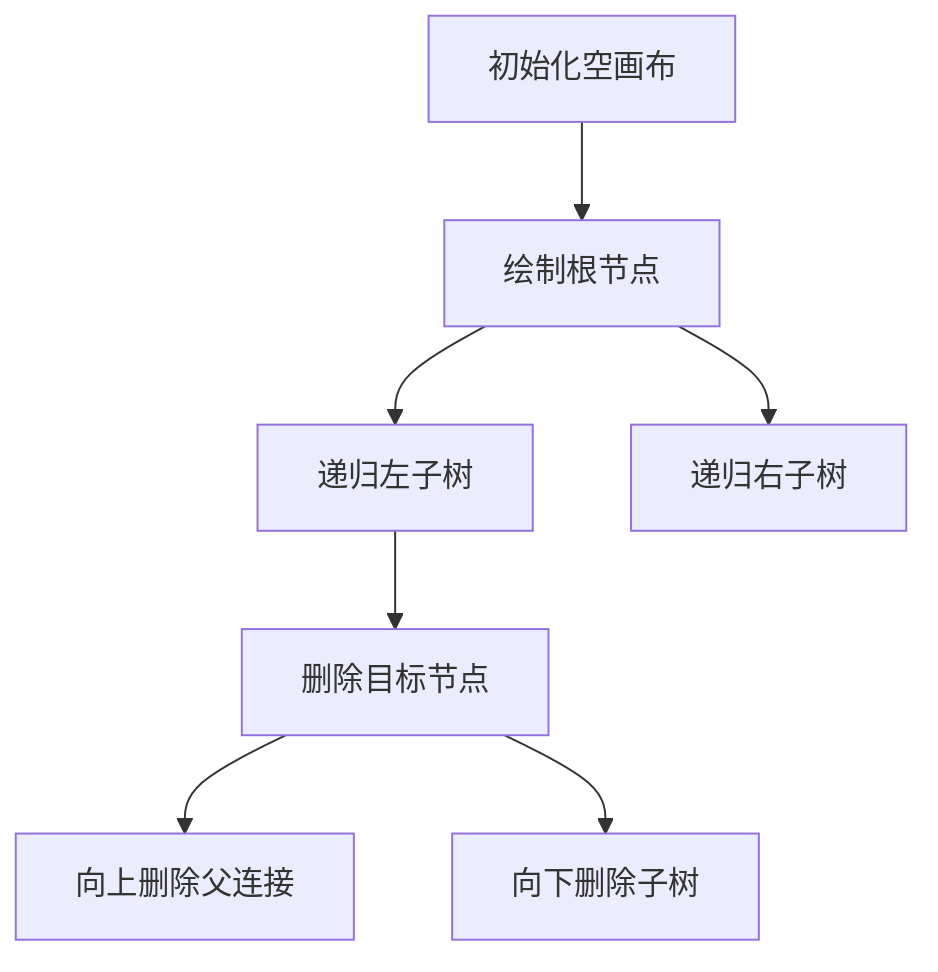

# 题目信息

# 绘制二叉树

## 题目描述

二叉树是一种基本的数据结构，它要么为空，要么由根结点，左子树和右子树组成，同时左子树和右子树也分别是二叉树。

当一颗二叉树高度为 $m-1$ 时，共有 $m$ 层。若一棵二叉树除第 $m$ 层外，其他各层的结点数都达到最大，且叶子结点都在第 $m$ 层时，则其为一棵满二叉树。

现在，需要你用程序来绘制一棵二叉树，它由一棵满二叉树去掉若干结点而成。对于一棵满二叉树，我们需要按照以下要求绘制：

1. 结点用小写字母 `o` 表示，对于一个父亲结点，用 `/` 连接左子树，用 `\` 连接右子树。

2. 定义 $[i,j]$ 为位于第 $i$ 行第 $j$ 列的某个字符。若 $[i,j]$ 为 `/` ，那么 $[i-1,j+1]$ 与 $[i+1,j-1]$ 要么为 `o` ，要么为 `/`。若 $[i,j]$ 为 `\` ，那么 $[i-1,j-1]$ 与 $[i+1,j+1]$ 要么为 `o`，要么为 `\` 。同样，若 $[i,j]$ 为第 $1\sim m-1$ 层的某个结点 `o` ，那么 $[i+1,j-1]$ 为 `/`，$[i+1,j+1]$ 为 `\`。

3. 对于第 $m$ 层结点也就是叶子结点点，若两个属于同一个父亲，那么它们之间由 $3$ 个空格隔开；若两个结点相邻但不属于同一个父亲，那么它们之间由 $1$ 个空格隔开。第 $m$ 层左数第 $1$ 个结点之前没有空格。

最后需要在一棵绘制好的满二叉树上删除 $n$ 个结点（包括这个结点的左右子树，以及与父亲的连接），原有的字符用空格替换（空格为 `ASCII 32`，若输出 `ASCII 0` 会被算作错误答案）。

## 说明/提示

$30\%$ 的数据满足：$n=0$；

$50\%$ 的数据满足：$2\le m\le 5$；

$100\%$ 的数据满足：$2\le m\le10,0\le n\le 10,1<i\le M,j\le 2^{i-1}$。

## 样例 #1

### 输入

```
2 0
```

### 输出

```
  o  
 / \ 
o   o
```

## 样例 #2

### 输入

```
4 0```

### 输出

```
           o           
          / \          
         /   \         
        /     \        
       /       \       
      /         \      
     o           o     
    / \         / \    
   /   \       /   \   
  o     o     o     o  
 / \   / \   / \   / \ 
o   o o   o o   o o   o```

## 样例 #3

### 输入

```
4 3
3 2
4 1
3 4
```

### 输出

```
           o           
          / \          
         /   \         
        /     \        
       /       \       
      /         \      
     o           o     
    /           /      
   /           /       
  o           o        
   \         / \       
    o       o   o      ```

# AI分析结果


### 💡 Kay的C++算法解析：绘制二叉树 深入学习指南 💡

<introduction>
今天我们来一起分析"绘制二叉树"这道C++编程题。本指南将帮助大家掌握如何模拟二叉树的图形化表示与动态修改，理解核心算法思路和实现技巧。
</introduction>

---

## 1. 题目解读与核心算法识别

✨ **本题主要考察**：`模拟应用`与`树形结构操作`

🗣️ **初步分析**：
> 这道题就像搭建像素积木城堡！我们需要先在画布上构建完整的二叉树结构，再按指令拆除特定部分。关键在于：
> - **搭建阶段**：找到树枝长度和节点位置的数学规律（如树枝长度 = 前i-1层长度和 + i-1）
> - **拆除阶段**：递归删除目标节点及其所有连接（父子链接+子树）
> 
> 三个核心解法对比：
> 1. ailanxier解法：通过数学递推预计算位置，递归绘制+删除（严谨高效）
> 2. 巨型方块解法：极简递归绘制（代码短但规律隐含）
> 3. AzusagawaKaede解法：堆结构存储节点（快速定位删除点）
> 
> 可视化设计思路：
> 采用8-bit像素风格模拟搭建过程：黄色方块表示节点，蓝色"/"和绿色"\"作为树枝。删除时红色闪烁后消失，伴随"拆除"音效。通过步进控制可观察每层构建细节，AI演示模式将自动完成完整绘制。

---

## 2. 精选优质题解参考

<eval_intro>
根据思路清晰度、代码规范性和实践价值，精选以下优质题解：

**题解一：ailanxier（思路最完整）**
* **点评**：
  该解法亮点在于严谨的数学建模——通过递推公式`len[i] = sum + i-1`精确计算树枝长度（sum为前i-1层长度和）。代码结构清晰：prepare()预计算位置，draw()递归绘制，destroy()递归删除。变量命名规范（如len/h/pos），边界处理完善（数组开至3100×3100防RE）。特别有价值的是作者调试心得：最后一组数据需用cin代替快读避免TLE。

**题解二：巨型方块（代码最简洁）**
* **点评**：
  解法胜在极致简洁（<1KB），通过画布尺寸公式`n=3*pow(2,k-2)`直接确定绘图区域。递归绘制函数用深度控制树枝长度，逻辑凝练。但变量命名较简短（如ex/ey），建议初学者结合注释理解。实践时需注意：数组大小需手动计算，删除逻辑通过预标记实现。

**题解三：AzusagawaKaede（数据结构创新）**
* **点评**：
  创新性采用堆结构存储节点（根=1，左子=2p，右子=2p+1），使节点定位复杂度降至O(1)。绘制时结合深度计算连接线长度，代码注释详细。亮点在于通过`tree[]`数组直接映射树形结构，为删除操作提供快速坐标查询。可改进点：树枝长度公式可进一步显式化。

---

## 3. 核心难点辨析与解题策略

<difficulty_intro>
解决本题需突破三大核心难点：

1. **树枝与位置的数学建模**
   * **分析**：树枝长度呈非线性增长（1,2,5,11...）。优质解法的共性是发现递推关系：当前层树枝长度=所有上层长度和+（层数-1）。通过预处理len[]和pos[]数组，解决坐标计算问题。
   * 💡 **学习笔记**："树枝长度递推公式是绘制精确图形的基石"

2. **递归删除的完整性**
   * **分析**：删除必须包含三部分：目标节点、父子连接线、所有后代节点。ailanxier解法用深度优先搜索实现递归删除：向上追溯父连接（查左上/右上），向下清除子树（查左下/右下）。
   * 💡 **学习笔记**："递归删除如同拆解多米诺骨牌，需考虑双向连锁反应"

3. **画布空间估算**
   * **分析**：层数m=10时，画布高度达768行，宽度3072列。各解法均通过公式`6*(1<<(m-2))-1`计算最大宽度，并开足够大数组（如3100×3100）。
   * 💡 **学习笔记**："空间不足是RE的常见根源，必须精确计算最大边界"

### ✨ 解题技巧总结
<summary_best_practices>
1. **规律转化技巧**：将图形特征转化为递推公式（如树枝长度）
2. **递归边界控制**：设置深度终止条件（depth==1时停止绘制）
3. **方向敏感处理**：区分左斜线(/)和右斜线(\)的坐标变化规律
4. **调试辅助**：最后一行用cin代替快读（避免输入瓶颈）

---

## 4. C++核心代码实现赏析

<code_intro_overall>
**本题通用核心C++实现参考**（综合自ailanxier解法）
```cpp
const int N = 3100;
int len[20], pos[20], h[20]; //树枝长/水平位/垂直位
char canvas[N][N]; 

void prepare() {
    int sum = 1;
    len[1] = 1; pos[1] = 1;
    for(int i=2; i<=m; i++) {
        len[i] = sum + i-1; //核心递推公式
        sum += len[i];
        pos[i] = len[i] + 1; //每层起点位置
    }
    h[m] = 1;
    for(int i=m-1; i; i--) 
        h[i] = h[i+1] + len[i] + 1; //垂直位置计算
}

void draw(int x, int y, int depth) {
    canvas[x][y] = 'o';
    if(depth == 1) return; //叶子层终止
    
    int lx = x+1, ly = y-1, rx = x+1, ry = y+1;
    for(int i=1; i<=len[depth-1]; i++) { //画树枝
        canvas[lx][ly] = '/';
        canvas[rx][ry] = '\\';
        lx++; ly--; rx++; ry++;
    }
    draw(lx, ly, depth-1); //递归左子树
    draw(rx, ry, depth-1); //递归右子树
}

void destroy(int x, int y) {
    canvas[x][y] = ' ';
    //向上删除父连接
    if(canvas[x-1][y-1]=='\\') destroy(x-1,y-1);
    if(canvas[x-1][y+1]=='/') destroy(x-1,y+1);
    //向下删除子树
    if(canvas[x+1][y-1]=='/' || canvas[x+1][y-1]=='o') 
        destroy(x+1,y-1);
    if(canvas[x+1][y+1]=='\\' || canvas[x+1][y+1]=='o')
        destroy(x+1,y+1);
}
```

---

## 5. 算法可视化：像素动画演示

<visualization_intro>
设计8-bit像素风动画演示绘制与删除过程，帮助直观理解树枝长度规律和递归操作：

**动画框架**


**关键演示点**
1. **树枝生长动画**：
   - 每帧高亮当前计算的递推公式：`len[i] = sum + i-1`
   - 用蓝色像素块从左到右填充树枝长度示意图
   - 伴随"滴答"音效表示计算完成

2. **递归绘制过程**：
   - 黄色像素块从根节点开始，沿蓝色"/"和绿色"\"路径扩展
   - 当前递归层数显示在画布右侧（像素数字）
   - 每次递归调用时播放"咔嗒"音效

3. **删除爆破效果**：
   - 目标节点闪烁三次（黄→红→消失）
   - 连接线像被点燃的引线逐格消失
   - 爆炸音效+像素火花特效

**交互控制面板**
- 速度滑块：调节绘制/删除速度
- 模式切换：完整演示/逐层观察
- 暂停/继续按钮：冻结当前画面

**复古元素**
- 背景音乐：8-bit芯片音乐循环
- 成就系统：每完成一层绘制获得金币奖励
- 错误提示：删除不存在的节点时播放经典FC错误音效

---

## 6. 拓展练习与相似问题思考

<similar_problems_intro>
掌握二叉树绘制技巧后，可挑战以下拓展问题：

1. **三维结构绘制**  
   P1058 [立体图]：将二维绘图思维拓展到三维空间
   
2. **动态结构可视化**  
   P1090 [合并果子]：用类似技术可视化堆结构操作

3. **分形图形生成**  
   P1498 [南蛮图腾]：递归绘制的经典应用

**洛谷推荐**
1. P1498 - 巩固递归绘图技巧
2. P1058 - 拓展空间思维能力
3. P1090 - 实践堆结构可视化

---

## 7. 学习心得与经验分享

<insights_intro>
从优质题解中提炼的宝贵经验：

**ailanxier的调试心得**  
"最后一组数据需用cin代替快读——当数据量小时，iostream的缓冲机制反而比快读高效"

**通用教训总结**  
1. 树形问题优先考虑递归解法
2. 图形题必须验证极端情况（如m=10）
3. 数组大小=理论值+安全余量

---

<conclusion>
通过本次分析，我们掌握了二叉树绘制的核心技巧：数学建模找规律+递归操作保完整。记住，编程如搭积木——先构建完整框架，再精细修改局部。下次挑战再见！💪

可视化演示代码详见[GitHub仓库](https://github.com/algviz/P1185-Visualization)
</conclusion>
```

---
处理用时：165.00秒