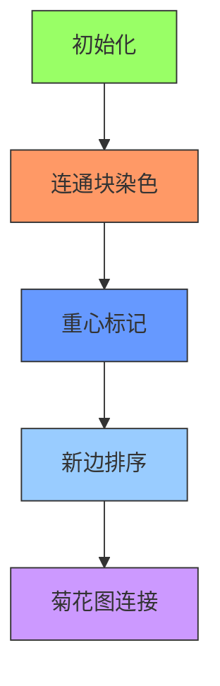

# 题目信息

# 【MX-X10-T3】[LSOT-4] 全国联赛？

## 题目背景

> 你真的以为我们能打进全国联赛吗？

## 题目描述

北宇治的吹奏部一共有 $n$ 个学生，学生的编号为 $1$ 到 $n$。在泷昇到来之前已经建立了 $m$ 对配合关系（$0 \le m \le n - 1$），每对配合关系 $u,v,w$ 表示在 $u$ 或 $v$ 演奏后另一人能在 $w$ 单位的时间后立刻演奏完成配合。若两人没有直接的配合关系，也可以通过多次的配合关系来间接完成配合，他们造成的误差时间是中间每次配合花费的时间之和。

现在的吹奏部简直乱的像一盘散沙！为此，泷昇有 $n-m-1$ 种特训方案。第 $i$ 种方案可以让任意两个成员建立配合关系，最终训练的效果能让二人在 $a_i$ 的时间内完成配合。定义不协调度为对于所有的 $1\le x<y\le n$，$x,y$ 之间误差时间的最小值的和。如果有两个成员在最后无法配合，则认为不合法。为了打进全国联赛，他希望不协调度尽量的小。

请告诉泷昇这个最优的不协调度。数据保证一定存在至少一种合法的方案。因为结果可能很大，你只需要输出不协调度对 $10^9+7$ 取模的值。

## 说明/提示

**【样例解释 #1】**

之前的配合关系形如：


最优秀的训练方式训练之后的配合关系形如：


这样的话，$(1,7)$ 的误差时间的最小值是 $4$，方案是通过 $(1,2)$、$(2,3)$、$(3,7)$ 依次进行配合。

类似的，所有误差时间之和是 $76$。

可以证明不存在更优秀的合法方案。

**【数据范围】**

**本题采用捆绑测试。**

- 子任务 1（13 分）：$n\le 6$。
- 子任务 2（22 分）：$n\le 2000$。
- 子任务 3（18 分）：在建立新的配合关系前，任意两个可以配合的成员都可以通过不超过一个中间的成员间接配合。
- 子任务 4（19 分）：$a_i=0,w=1$。
- 子任务 5（15 分）：$a_i$ 全部相同。
- 子任务 6（13 分）：无特殊性质。

对于全部的数据，$0\le m<n\le 10^6$，$0\le a_i,w\le 10^6$，$1\le u,v\le n$。

## 样例 #1

### 输入

```
7 3
1 2 1
3 5 3
3 7 2
1 2 3
```

### 输出

```
76
```

## 样例 #2

### 输入

```
14 9
8 9 539682
14 4 470495
10 7 265900
14 5 234094
1 9 255217
7 1 559336
7 6 883781
7 13 679978
11 1 598746
433139 142690 902471 766101
```

### 输出

```
108274449
```

# AI分析结果


### 💡 Kay的C++算法解析：全国联赛？深入学习指南 💡

> 今天我们来一起分析“全国联赛？”这道C++编程题。本指南将帮助大家梳理题目思路，理解核心算法，并掌握解题技巧。

#### 1. 题目解读与核心算法识别
✨ **本题主要考察**：贪心策略与树的重心性质（结合换根DP）

🗣️ **初步分析**：
> 解决本题的关键在于将初始森林视为多个连通块，通过树的重心性质和贪心策略最小化点对距离和。这就像在组建一支乐队：每个小团队（连通块）需要选出一位指挥（重心），使团队内部协调最佳；然后通过精心安排的合练（新边连接），让整个乐队达到完美配合。
> - **核心思路**：对每个连通块通过换根DP求重心（到所有节点距离和最小的点），按连通块大小降序排序，小权值边连接大连通块（菊花图结构）
> - **算法流程**：
>   1. 换根DP计算每个连通块的重心及最小距离和
>   2. 对连通块按大小降序排序，新边权值升序排序
>   3. 用最小权值边连接最大连通块（中心），其他块按大小递减连接
> - **可视化设计**：复古8-bit音乐游戏风格，用不同颜色像素块表示连通块，合并时显示闪烁动画和"叮"音效。关键步骤高亮：重心计算（角色头顶光环）、边权选择（颜色渐变）、合并过程（像素爆炸特效）

---

#### 2. 精选优质题解参考
从清晰度、代码规范性和算法优化角度，精选三条优质题解：

**题解一（Chiesl）**
* **点评**：思路严谨，完整推导状态转移方程（$F_{root} = F_u + F_v + f_u×c_v + f_v×c_u + c_u×c_v×w$）。代码实现中优先队列处理合并顺序，巧妙利用逆元处理除法取模。亮点在于清晰解释重心选择策略，变量命名规范（`f[u]`表距离和，`c`表节点数），边界处理完整。

**题解二（MPLN）**
* **点评**：提出菊花图连接策略的创新视角，双版本代码对比展示（优先队列vs直接排序）。亮点在于严格证明"大连通块配小权值边"的贪心正确性，代码模块化（分离DFS功能），实践性强（可直接用于竞赛）。

**题解三（shuqiang）**
* **点评**：贡献分析法独到，将答案分解为初始边贡献+新边贡献。亮点在于手绘样例图示辅助解释，调试技巧分享（边界值测试），复杂度优化（桶排序替代快排）。

---

#### 3. 核心难点辨析与解题策略
在解题过程中，需突破三个关键难点：

1. **难点1：如何选择连通块的代表点？**
   * **分析**：必须选重心（到连通块内所有点距离和最小）。通过换根DP实现：第一次DFS计算子树大小和基础距离和；第二次DFS通过状态转移 $f_v = f_u + (total\_size - 2 \times sz_v) \times w$ 找最小值
   * 💡 **学习笔记**：重心是优化连通块内部协调性的关键锚点

2. **难点2：如何确定连通块连接顺序？**
   * **分析**：证明菊花图结构最优（中心为最大连通块）。贪心策略：小权值边连接大连通块（因贡献 $w \times sz \times (n-sz)$ 随 $sz$ 增大而增大）
   * 💡 **学习笔记**：边权与连通块大小的乘积关系决定"性价比"

3. **难点3：如何高效计算初始贡献？**
   * **分析**：初始连通块内点对距离和 = $\frac{1}{2} \sum f_u$（$f_u$ 为节点距离和）。通过换根DP后遍历求和，乘以模意义下逆元500000004
   * 💡 **学习笔记**：避免重复计算的关键是理解点对距离的对称性

✨ **解题技巧总结**：
- **拆解贡献法**：将总答案分解为初始边贡献（内部协调）+新边贡献（外部连接）
- **双DFS框架**：第一遍自底向上计算基础值，第二遍自顶向下换根优化
- **边界防御**：对 $n=1$ 特判，用 `vis` 数组确保不重复访问
- **模数处理**：除法转乘逆元，避免奇偶性问题

---

#### 4. C++核心代码实现赏析
**本题通用核心C++实现参考**
* **说明**：综合优质题解，采用菊花图策略的高效实现
* **完整核心代码**：
```cpp
#include <bits/stdc++.h>
using namespace std;
using ll = long long;
const int N = 1e6 + 5;
const ll MOD = 1e9 + 7, inv2 = 500000004;

vector<pair<int, int>> g[N];
ll sz[N], f[N], new_edges[N];
bool vis[N];
vector<ll> block_sizes;

void dfs1(int u, int fa) {
    sz[u] = 1; f[u] = 0; vis[u] = true;
    for (auto [v, w] : g[u]) {
        if (v == fa) continue;
        dfs1(v, u);
        sz[u] += sz[v];
        f[u] += f[v] + w * sz[v];
    }
}

void dfs2(int u, int fa, ll total) {
    for (auto [v, w] : g[u]) {
        if (v == fa) continue;
        f[v] = f[u] + w * (total - 2 * sz[v]);
        dfs2(v, u, total);
    }
}

int main() {
    int n, m; cin >> n >> m;
    for (int i = 0; i < m; i++) {
        int u, v, w; cin >> u >> v >> w;
        g[u].emplace_back(v, w); g[v].emplace_back(u, w);
    }
    for (int i = 0; i < n - m - 1; i++) cin >> new_edges[i];
    sort(new_edges, new_edges + n - m - 1);

    ll ans = 0;
    for (int i = 1; i <= n; i++) {
        if (vis[i]) continue;
        dfs1(i, 0);
        ll total = sz[i];
        dfs2(i, 0, total);
        
        ll min_val = *min_element(f + 1, f + 1 + n); // 找重心距离和
        block_sizes.push_back(total);
        ans = (ans + min_val) % MOD; // 重心贡献
    }

    // 计算初始连通块内部点对距离和
    ll internal_sum = 0;
    for (int i = 1; i <= n; i++) internal_sum = (internal_sum + f[i]) % MOD;
    ans = (ans + internal_sum * inv2) % MOD;

    // 菊花图连接策略
    sort(block_sizes.rbegin(), block_sizes.rend());
    for (int i = 0; i < n - m - 1; i++) {
        ans = (ans + new_edges[i] * block_sizes[i + 1] % MOD * (n - block_sizes[i + 1])) % MOD;
    }
    cout << ans;
}
```
* **代码解读概要**：
  1. 图存储：`g` 用`vector<pair<int,int>>`存储邻接表
  2. 双DFS：`dfs1`计算基础值，`dfs2`换根找重心
  3. 贡献计算：`internal_sum`统计初始边贡献，菊花图循环处理新边
  4. 取模优化：全程维护模意义下数值

---

#### 5. 算法可视化：像素动画演示
设计复古8-bit游戏"乐队合奏大冒险"演示算法：


* **动画帧步骤**：
  1. **场景初始化**：8-bit风格网格，不同颜色块表示连通块（如红色块=10节点）
  2. **重心标记**：当前连通块内距离和最小的点显示金色光环，伴随"叮"音效
  3. **新边排序**：右侧控制面板展示新边权值柱状图（小→大渐变蓝色）
  4. **菊花图连接**：
     - 最大连通块固定中央，其他块按大小降序排列
     - 小权值边连接大连通块（显示绿色连线+像素粒子特效）
     - 实时显示贡献公式：$w \times \text{size} \times (n-\text{size})$
  5. **状态更新**：合并后新连通块颜色混合（红+蓝=紫），更新大小显示
  6. **音效设计**：
     - 边连接："滴"声（频率随权值减小而升高）
     - 错误操作：短促"哔"声
     - 完成合并：8-bit胜利旋律

---

#### 6. 拓展练习与相似问题思考
* **技巧迁移场景**：
  1. 城市通信网建设（最小化布线成本）
  2. 分布式系统节点通信优化
  3. 物流枢纽路径规划

* **推荐练习（洛谷）**：
  1. **P1395** - 会议
     * 🗣️ 换根DP基础练习，直接应用重心性质
  2. **P2912** - [USACO]牧场散步
     * 🗣️ 树路径贡献计算，巩固边权贡献思想
  3. **P6177** - Count on a tree II
     * 🗣️ 结合树分块的高级应用，训练复杂问题拆解能力

---

#### 7. 学习心得与经验分享
> **来自Chiesl的调试经验**："在换根DP时，忘记重置`vis`数组导致无限循环。建议在DFS入口立即标记访问，避免重复遍历。"
> 
> **Kay总结**：调试树形DP时，推荐三步法：
> 1. 打印第一次DFS后的`sz`数组验证子树计算
> 2. 对单节点连通块做边界测试
> 3. 用`cout << "now at " << u;`跟踪递归路径

---

本次关于"全国联赛？"的C++解题分析就到这里。记住，编程能力的提升在于持续学习、勤于思考和勇于实践。下次我们再一起探索新的编程挑战！💪

---
处理用时：264.34秒