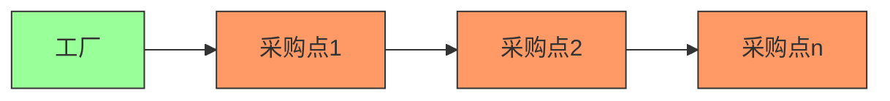

# 题目信息

# [蓝桥杯 2025 省 Python A/Java A/研究生组] 原料采购

## 题目描述

小蓝负责一家工厂的原料采购。

工厂有一辆运货卡车，其容量为 $m$。

工厂附近的采购点都在同一条路的同一方向上，一共有 $n$ 个，每个采购点和工厂的距离各不相同。其中，第 $i$ 个采购点的价格为 $a_i$, 库存为 $b_i$, 距离为 $c_i$。

卡车每行驶一单位长度的路径就需要额外花费 $o$。（返程没有花费，你也可以认为 $o$ 实际是行驶两单位长度的花费）

请计算将卡车装满最少需要花费多少钱，如果没有任何方案可以装满请输出 $-1$。

## 说明/提示

### 评测用例规模与约定

- 对于 $40\%$ 的评测用例，$n \leq 5000$, $m \leq 50000$;
- 对于 $60\%$ 的评测用例，$m \leq 10^5$;
- 对于所有评测用例，$1 \leq n \leq 10^5$, $1 \leq m, o \leq 10^9$, $1 \leq a_i, b_i, c_i \leq 10^9$, 保证对于 $i > 1$, 一定有 $c_{i-1} < c_i$。

## 样例 #1

### 输入

```
3 5 1
99 9 1
3 4 99
1 2 190```

### 输出

```
201```

# AI分析结果


### 💡 Kay的C++算法解析：原料采购 深入学习指南 💡

**引言**  
今天我们一起分析"原料采购"这道C++编程题。本指南将帮助你理解反悔贪心算法的精妙应用，掌握如何在考虑运输成本的情况下优化采购决策，并通过像素动画直观感受算法执行过程。

---

## 1. 题目解读与核心算法识别

✨ **本题主要考察**：`反悔贪心`（Greedy with Undo）  

🗣️ **初步分析**：
> 解决"原料采购"的关键在于运用反悔贪心策略。就像在超市购物时，我们先把商品放进购物车，发现更便宜的商品时再替换掉贵的货物。算法通过优先队列动态维护最优选择：  
> - 按距离递增遍历采购点（保证运费只与最远点相关）  
> - 用大顶堆存储已选货物（价格高的在堆顶）  
> - 遇到更便宜的货物时替换堆顶元素  
> - 每次货物满仓时更新最小费用（货物价+当前运费）  
>  
> **可视化设计思路**：  
> 采用8位像素风格展示卡车沿路采购过程。关键元素：  
> - 卡车到达采购点时货物加入动画（绿色便宜/红色昂贵）  
> - 替换操作时显示旧货物弹出、新货物加入  
> - 实时显示总费用公式：`货物费用 + 当前距离×运费`  
> - 音效设计：加入货物"叮"、替换"咔嚓"、最优解"胜利"音效  

---

## 2. 精选优质题解参考

**题解一（蒋淋雨）**  
* **点评**：思路清晰阐释了反悔贪心的核心机制，代码规范（`now`/`v`变量名明确），算法实现完整处理了部分替换场景。亮点在于：  
  - 替换逻辑分层处理（完全替换/部分替换）  
  - 严格维护堆中货物剩余量  
  - 实践价值高（注意初始值设为4e18避免溢出）  
  - 作者调试经验：强调大值初始化的必要性（95→100分关键）  

**题解二（Aliadgnus）**  
* **点评**：结构体封装使优先队列操作更清晰（重载`<`运算符），替换逻辑直接计算费用差值提升效率。亮点：  
  - 费用更新公式`sum -= (u.price-a[i])*u.wei`简洁高效  
  - 严格处理边界条件（总库存检测）  
  - 变量命名规范（`price`/`wei`语义明确）  

---

## 3. 核心难点辨析与解题策略

1. **难点：如何设计反悔策略？**  
   * **分析**：运费依赖最远采购点，需按距离递增遍历。用大顶堆维护已选货物，遇到更便宜货物时替换堆顶元素。关键变量：`优先队列`存储（价格,数量），`当前货物总量`控制替换时机  
   * 💡 **学习笔记**：反悔贪心=贪心+撤销机制，优先队列是核心工具  

2. **难点：如何高效实现替换？**  
   * **分析**：分两种情况处理：  
     - 新货物量≥堆顶货物：完全替换并更新费用  
     - 新货物量不足：部分替换后重新入堆剩余货物  
   * 💡 **学习笔记**：`min(b[i], top.second)`确定替换量是通用技巧  

3. **难点：运费与货物费用的协调**  
   * **分析**：运费仅与最远采购点距离相关（`c[i]*o`），在每次货物满仓时更新总费用。注意：  
     - 遍历必须按距离递增（题目保证`c_{i-1} < c_i`）  
     - 最优解可能在中间采购点产生  
   * 💡 **学习笔记**：分离计算货物费用和运费是解题关键  

### ✨ 解题技巧总结
- **策略选择**：识别问题允许"撤销"特性→反悔贪心  
- **数据结构**：优先队列动态维护当前最优解  
- **边界处理**：总库存检测（`sum b_i < m`时返回-1）  
- **数值安全**：初始答案设为足够大值（≥1e16）  

---

## 4. C++核心代码实现赏析

**通用核心实现参考**  
```cpp
#include <iostream>
#include <queue>
using namespace std;
typedef pair<long, long> pii; // price, weight

int main() {
    // 输入省略...
    priority_queue<pii> pq; // 大顶堆
    long selected = 0, cost = 0, ans = 1e18;
    
    for(int i=1; i<=n; ++i) {
        if(selected + b[i] <= m) { // 直接加入
            pq.push({a[i], b[i]});
            selected += b[i]; cost += a[i]*b[i];
        } else if(selected < m) { // 部分加入至满仓
            long need = m - selected;
            pq.push({a[i], need});
            cost += a[i]*need; selected = m;
            b[i] -= need; // 更新剩余库存
        }
        
        while(!pq.empty() && pq.top().first > a[i] && b[i]>0) {
            pii top = pq.top(); pq.pop();
            long replace = min(b[i], top.second);
            cost -= (top.first - a[i]) * replace; // 反悔核心
            pq.push({a[i], replace}); // 新货物入堆
            if((top.second -= replace) > 0) 
                pq.push(top); // 剩余货物放回
            b[i] -= replace;
        }
        if(selected >= m) 
            ans = min(ans, cost + c[i]*o); // 更新最优解
    }
    cout << (ans==1e18 ? -1 : ans);
}
```
* **代码解读概要**：  
  > 1. 优先队列维护已选高价货物  
  > 2. 分三阶段处理：直接加入/部分加入/替换操作  
  > 3. 替换时计算费用差`(top.first - a[i])*replace`  
  > 4. 每次满仓时更新`货物费用+当前运费`  

---

**题解一核心片段（蒋淋雨）**  
```cpp
while (sz(q) && it.fi > a[i]) {
    q.pop();
    if (b[i] > Used + it.se) { // 完全替换
        v -= it.fi * it.se;
        Used += it.se;
    } else { // 部分替换
        v -= it.fi * (b[i]-Used);
        it.se -= (b[i]-Used);
        if(it.se) q.push(it);
        break;
    }
}
```
* **亮点**：替换操作分层处理，严格维护堆中余量  
* **代码解读**：  
  > - `it.fi > a[i]`触发替换条件  
  > - 完全替换时直接移除堆顶元素  
  > - 部分替换时修改堆顶元素数量后重新入堆  
  > - `Used`记录已替换量，确保状态一致  
* 💡 **学习笔记**：部分替换需重新入堆剩余货物  

**题解二核心片段（Aliadgnus）**  
```cpp
while (!q.empty() && b[i]) {
    node u = q.top();
    if (u.price <= a[i]) break;
    q.pop();
    if (b[i] >= u.wei) { // 完全替换
        sum -= (u.price - a[i]) * u.wei;
        b[i] -= u.wei;
        q.push({a[i], u.wei});
    } else { // 部分替换
        sum -= (u.price - a[i]) * b[i];
        q.push({u.price, u.wei - b[i]});
        q.push({a[i], b[i]});
        b[i] = 0;
    }
}
```
* **亮点**：直接计算费用差提升效率  
* **代码解读**：  
  > - `sum -= (u.price - a[i]) * ...` 直接更新费用  
  > - 完全替换时新货物整体入堆  
  > - 部分替换时新旧货物分别入堆  
* 💡 **学习笔记**：费用差值计算避免重复累加  

---

## 5. 算法可视化：像素动画演示

**主题**：像素卡车之旅（8-bit风格供应链模拟）  

**核心演示内容**：  
卡车从工厂（0点）出发，沿路经过按距离排序的采购点。动态展示：  
1. 货物加入/替换操作  
2. 优先队列实时状态  
3. 费用计算公式变化  

**设计细节**：  


**动画流程**：  
1. **场景初始化**：  
   - 像素化道路（横向滚动）  
   - 卡车（绿色像素车）停在工厂位置  
   - 采购点显示价格/库存（红色=$高$, 绿色=$低$）  

2. **采购阶段**：  
   - 卡车移动到`采购点i`（距离`c_i`）  
   - 货物加入：货物像素块飞入卡车（音效：叮）  
   - 替换操作：  
     * 高价货物变红闪烁→弹出消失（音效：咔嚓）  
     * 新货物飞入卡车（颜色渐变：红→绿）  

3. **数据结构可视化**：  
   - 右侧显示优先队列（大顶堆动画）  
   - 堆顶元素始终高亮黄色边框  
   - 货物数量以像素块堆叠高度表示  

4. **费用计算面板**：  
   ``` 
   总费用 = [货物费用] + [距离]×[运费] 
   ▶ 当前：1200 + 99×1 = 1299
   ▼ 历史最优：1200 + 10×1 = 1210
   ```  

5. **交互控制**：  
   - 单步执行：观察每个采购点细节  
   - 速度滑块：调整动画速度  
   - AI演示模式：自动完成最优路径探索  

6. **游戏化元素**：  
   - 每个采购点视为关卡（过关条件：完成替换）  
   - 费用低于历史最优时播放"胜利"音效  
   - 积分系统：费用越低得分越高  

---

## 6. 拓展练习与相似问题思考

**通用技巧迁移**：  
反悔贪心适用于需动态调整决策的场景：  
1. 任务调度（替换低收益任务）  
2. 股票交易（多次买卖）  
3. 资源分配（替换低效资源）  

**洛谷题目推荐**：  
1. **P2949 [USACO09OPEN]Work Scheduling G**  
   🗣️ 基础反悔贪心，巩固优先队列应用  
2. **P4053 [JSOI2007] 建筑抢修**  
   🗣️ 带截止时间的反悔贪心，提升状态处理能力  
3. **P1792 [国家集训队] 种树**  
   🗣️ 环形反悔贪心，训练边界条件处理  

---

## 7. 学习心得与经验分享

> **蒋淋雨的经验**：  
> "初始答案记得设大一些，10e16第一发喜提95分→溢出风险"  
>  
> **Kay点评**：  
> 大数据问题必须预估最大可能值（本题费用上限≈10e14），初始值应≥10e15。这是竞赛常见陷阱，建议：  
> 1. 计算理论最大值  
> 2. 使用`LLONG_MAX`或科学计数法（1e18）  
> 3. 测试边界数据  

---

**结语**  
通过本次分析，相信大家已掌握反悔贪心在采购优化问题中的应用精髓。记住：算法学习就像卡车运货——先装核心知识，遇到更优解法时勇敢替换旧思路！下次挑战见！🚚💨

---
处理用时：228.98秒