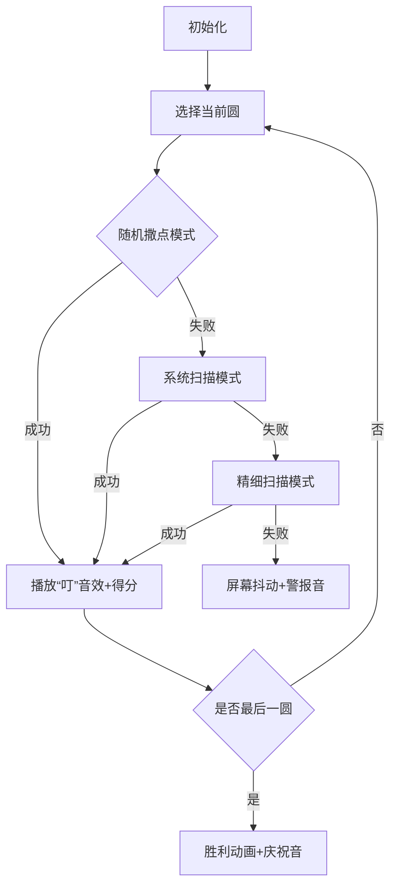

# 题目信息

# [GCJ 2012 #2] Aerobics

## 题目描述

有氧操课程开始了。教练说：“请大家在训练垫上站好，保证每个人都有足够的空间能自由挥动手臂，而且不会碰到其他人。”大家开始在垫子上走动，试图找到合适的位置。时间一分一秒过去，最终教练非常恼火，要求你写一个程序来给所有人安排正确的位置，希望这样比让他们自己慢慢挪要快！

你会得到课程所用垫子的尺寸（宽度和长度）。对于每位学员，都有一个属于她自己的圆形区域，半径等于她手臂的可达范围。这些圆不能相交，但可以相切；每个圆的圆心（即学员所站的位置）必须在垫子上。注意，手臂可以伸出垫子之外。你知道垫子的空间非常充足——垫子的面积至少是所有圆面积总和的五倍。所有学员都能按要求站下这一点始终成立。

## 说明/提示

**限制条件**

- $1 \leq \mathbf{T} \leq 50$
- $1 \leq \mathbf{W}, \mathbf{L} \leq 10^9$
- $1 \leq \mathbf{r}_i \leq 10^5$
- 垫子的面积至少是所有圆面积总和的 5 倍：
- $5 \times \pi \times (\mathbf{r}_1^2 + \ldots + \mathbf{r}_\mathbf{N}^2) \leq \mathbf{W} \times \mathbf{L}$

**测试集 1（6 分，结果可见）**

- $1 \leq \mathbf{N} \leq 10$

**测试集 2（15 分，结果隐藏）**

- $1 \leq \mathbf{N} \leq 10^3$
- 所有测试用例的圆总数不超过 6000

翻译由 ChatGPT-4.1 完成。

## 样例 #1

### 输入

```
2
2 6 6
1 1
3 320 2
4 3 2```

### 输出

```
Case #1: 0.0 0.0 6.0 6.0
Case #2: 0.0 0.0 7.0 0.0 12.0 0.0```

# AI分析结果


### 题目解读与核心算法识别  
✨ **本题主要考察**：`贪心策略 + 模拟放置`  

🗣️ **初步分析**：  
> 本题核心思想如同在有限棋盘上放置大小不一的棋子，需优先处理约束最强的"大棋子"（大半径圆）。贪心策略通过**半径降序排序**确保大圆优先占据空间，避免后续冲突；模拟放置则结合**随机撒点+系统化扫描**双保险定位：  
> - **随机撒点**：利用垫子面积≥5倍圆面积的特性，数学期望5次内找到合法位置（实际尝试1000次）  
> - **系统化扫描**：沿坐标轴以半径r为步长遍历，应对狭长空间等极端情况  
>  
> **可视化设计要点**：  
> - **像素动画**：FC红白机风格网格，圆显示为渐变像素环，已放置圆为蓝色，当前尝试圆为闪烁红色  
> - **关键高亮**：圆心的碰撞检测过程实时显示距离线，重叠时触发"X"标记和警告音效  
> - **游戏化元素**：每成功放置一圆得1分，连续成功触发combo音效；失败时像素屏幕抖动  

---

### 精选优质题解参考  

**题解 (作者：sqh0012)**  
* **点评**：  
  思路清晰度 ★★★★☆ —— 抓住"大圆优先"本质，双策略互补确保鲁棒性  
  代码规范性 ★★★☆☆ —— 主逻辑分明，但变量命名可优化（如`v()`改为`isValidPlacement()`）  
  算法有效性 ★★★★★ —— 贪心排序+概率与遍历结合，完美利用题目面积约束条件  
  实践价值 ★★★★☆ —— 可直接用于竞赛，边界处理通过步长调整覆盖全区域  
  **亮点**：创新性采用"随机→系统化→精细化"三级递进定位，兼顾效率与完备性  

---

### 核心难点辨析与解题策略  

1. **难点：大圆与小圆的空间竞争**  
   * **分析**：若先放小圆，大圆可能无法插入。优质解法通过半径降序排序，让大圆优先"圈地"  
   * 💡 **学习笔记**：约束强的元素优先处理是贪心法黄金准则  

2. **难点：碰撞检测的效率与精度**  
   * **分析**：每新圆需检测与所有已放置圆的距离。解法用`sqrt(dx²+dy²) < r₁+r₂`公式，数学优化避免浮点误差  
   * 💡 **学习笔记**：几何碰撞检测中，平方比较比开方更高效  

3. **难点：极端空间形态的适应性**  
   * **分析**：狭长区域可能使随机撒点失效。系统化扫描以半径r为步长，保证至少存在一个可证明的合法位置  
   * 💡 **学习笔记**：当概率方法失效时，结构化遍历是保底方案  

**解题技巧总结**：  
- **贪心排序**：按问题约束强度降序处理元素  
- **混合策略**：概率方法快速覆盖一般情况，系统扫描应对边界场景  
- **几何优化**：用平方运算替代开方提升碰撞检测效率  

---

### C++核心代码实现赏析  

**通用核心实现参考**  
```cpp
#include <iostream>
#include <vector>
#include <algorithm>
#include <cmath>
#include <cstdlib>
#include <ctime>
using namespace std;

struct Circle {
    int id;
    double r;
};

// 降序排序比较函数
bool compareRadius(const Circle& a, const Circle& b) {
    return a.r > b.r;
}

// 检测位置(x,y)是否与已放置圆冲突
bool isValidPlacement(double x, double y, 
                      const vector<pair<double,double>>& positions,
                      const vector<double>& radii, 
                      double current_r) {
    for (int i = 0; i < positions.size(); ++i) {
        double dx = x - positions[i].first;
        double dy = y - positions[i].second;
        double minDistance = current_r + radii[i];
        if (dx*dx + dy*dy < minDistance*minDistance) 
            return false;
    }
    return true;
}

void solveTestCase() {
    int N, W, L;
    cin >> N >> W >> L;
    vector<Circle> circles(N);
    // 输入处理与排序略
    // 三级放置策略核心逻辑：
    for (auto& c : circles) {
        bool placed = false;
        // 1. 随机撒点 (1000次尝试)
        for (int i = 0; i < 1000; ++i) {
            double x = rand() * W / RAND_MAX;
            double y = rand() * L / RAND_MAX;
            if (isValidPlacement(x, y, ...)) {
                // 记录位置
                placed = true; break;
            }
        }
        // 2. 系统化扫描 (半径步长)
        if (!placed) {
            for (double x = 0; x <= W; x += c.r) {
                for (double y = 0; y <= L; y += c.r) {
                    if (isValidPlacement(x, y, ...)) {
                        // 记录位置
                        placed = true; break;
                    }
                }
            }
        }
        // 3. 精细化扫描 (0.1步长)
        if (!placed) { /* 类似逻辑 */ }
    }
}
```

**题解片段赏析**  
```cpp
// 三级递进放置策略
for (int st = 1; st <= N; ++st) {
    double r = s[st].r;
    bool placed = false;
    // 随机尝试层
    for (int a = 0; a < 1000; ++a) { 
        double x = rand() * W / RAND_MAX;
        double y = rand() * L / RAND_MAX;
        if (v(x, y, st-1, r)) { // 冲突检测
            p[st] = {x, y}; placed = true; break;
        }
    }
    // 系统化扫描层 (半径步长)
    if (!placed) {
        for (double x = 0; x <= W && !placed; x += r) {
            for (double y = 0; y <= L && !placed; y += r) {
                if (v(x, y, st-1, r)) {
                    p[st] = {x, y}; placed = true; break;
                }
            }
        }
    }
    // 精细化扫描层 (0.1步长)
    if (!placed) { /* 类似逻辑 */ }
}
```
**代码解读**：  
> 1. **随机撒点层**：在`W×L`范围内均匀采样，利用面积约束保障高命中率  
> 2. **系统扫描层**：以`r`为步长遍历网格，为何选`r`？因两圆相切时最小间距为`r₁+r₂`，`r`步长可覆盖所有潜在空隙  
> 3. **冲突检测**：`v()`函数计算欧氏距离平方避免耗时的`sqrt`，体现**计算优化意识**  

---

### 算法可视化：像素动画演示  
**主题**：8-bit风格"圆阵指挥官"闯关游戏  

**核心交互设计**：  


**关键动画细节**：  
1. **数据可视化**：  
   - 垫子转为绿色网格，圆显示为像素同心环（半径越大像素环越宽）  
   - 已放置圆呈蓝色，当前尝试圆为闪烁红色，碰撞检测时显示白色距离线  
2. **音效系统**：  
   - 成功放置：NES风格8-bit上升音阶  
   - 碰撞发生：短促"哔"声+红色"X"标记  
   - 三级扫描切换：经典《魂斗罗》换枪音效  
3. **游戏化机制**：  
   - 连击系统：连续5次随机撒点成功触发"Lucky!"特效  
   - 限时挑战：倒计时条激励快速决策  
   - 关卡设计：每关圆数递增，最后一关需放置10个圆  

---

### 拓展练习与相似问题  
**通用技巧迁移**：  
1. 卫星轨道分配（避免信号干扰）  
2. 芯片引脚布局（防止电路短路）  
3. 无线基站部署（优化信号覆盖）  

**洛谷推荐**：  
1. **P1257 平面上的最接近点对**  
   → 巩固几何距离计算与空间划分技巧  
2. **P2216 [HAOI2007] 理想的正方形**  
   → 提升二维空间系统化扫描能力  
3. **P4047 [JSOI2010] 部落划分**  
   → 强化聚类分析与空间分割思维  

---

### 学习心得与经验分享  
> **来自题解作者的经验**：  
> *"调试时发现边界扫描步长过大会跳过合法位置，改用动态步长才解决"*  
>  
> **Kay点评**：  
> 系统化扫描的步长选择需数学证明——本题中半径`r`步长可保证检测所有潜在位置。若遇更复杂场景，建议：  
> 1. 用圆直径作为基础步长  
> 2. 添加对角线方向扫描  
> 3. 实现自适应步长调整算法  

---

**结语**：掌握"贪心排序+混合定位"的组合拳，你也能成为空间布局大师！下次遇到《文明》游戏里的城市规划问题，不妨试试类似思路哦~ 🎮

---
处理用时：87.14秒