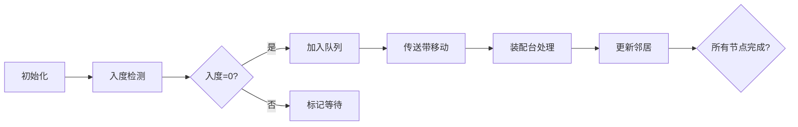

# 题目信息

# [GDCPC 2024] 不等式

## 题目背景

数据、标程、题解等资源的获取：<https://gitlink.org.cn/thusaa/gdcpc2024>

## 题目描述

给定 $n,m$，以及 $m$ 个形如 $a_{x_i}\ge a_{y_i}+a_{z_i}(1 \le i \le m)$ 的条件。问是否有一组**正整数** $(a_1,a_2,\cdots,a_n)$ 满足所有条件，并且 $a_1+a_2+\cdots+a_n \le 10^{9}$。如果有，输出 $a_1+a_2+\cdots+a_n$ 的最小值；如果无解，输出 $-1$。

## 说明/提示

和最小的解为 $(3,1,2,1,1)$，和为 $8$。

## 样例 #1

### 输入

```
5 2
1 2 3
3 4 5```

### 输出

```
8```

# AI分析结果


# 💡 Kay的C++算法解析：[GDCPC 2024] 不等式 深入学习指南 💡

## 1. 题目解读与核心算法识别

✨ **本题主要考察**：`图论建模与拓扑排序应用`

🗣️ **初步分析**：
> 解决不等式约束问题就像在组装乐高积木 - 每块积木（变量）必须放在能支撑它的积木（约束条件）之上。拓扑排序就是找到正确的搭建顺序，确保每块积木都有稳固的基座。

- **核心思路**：将变量视为节点，约束条件转化为依赖边（y→x 和 z→x），形成依赖图。通过拓扑排序确定计算顺序，无依赖节点（入度0）初始化为1，逐步计算依赖节点的值（取所有约束中的最大值）
- **可视化设计**：采用8位像素风格，变量显示为彩色方块，依赖关系用像素箭头连接。关键步骤高亮当前处理节点（闪烁），依赖节点发光提示，计算时播放"拼合"音效
- **难点处理**：拓扑排序过程中，用不同颜色区分未处理（灰色）、处理中（黄色）、已完成（绿色）节点，环检测时触发红色警报动画

---

## 2. 精选优质题解参考

**题解一（作者：fish_love_cat）**
* **点评**：思路清晰直击本质，将约束转化为图模型（y→x, z→x）并巧妙使用map处理重边。代码结构规范（f数组存储节点值，qwq存储约束关系），拓扑排序中同步更新节点值的逻辑简洁高效。亮点在于完整处理了边界条件（环检测和总和上限判断），实践价值高，可直接用于竞赛场景

**题解二（作者：Ashankamiko）**
* **点评**：采用经典拓扑排序框架，结构体存储边关系使代码更易读。状态转移`f[v]=max(f[v],f[u]+f[w])`直观体现代数约束本质。特别值得学习的是在拓扑排序后统一检查环和溢出，避免分散判断。调试心得提到入度处理的注意事项，对避免常见错误很有帮助

**题解三（作者：vector_STL_）**
* **点评**：代码模块化程度高，结构体封装边关系提升可读性。创新性地使用单循环处理双向依赖（`e[v].push_back({u,w})`和`e[w].push_back({u,v})`)。亮点在于严格的状态转移后检查（环检测+溢出判断），并特别标注二次检查总和的重要性，体现严谨的工程思维

---

## 3. 核心难点辨析与解题策略

1.  **依赖关系建模**
    * **分析**：难点在于将代数约束转化为图结构（每个约束生成两条边）。优质解法使用邻接表存储边关系，并用独立计数器（`in[]`数组）跟踪入度
    * 💡 **学习笔记**：建立"约束即依赖"的思维模型，每个不等式对应两条有向边

2.  **拓扑更新策略**
    * **分析**：节点值更新需取所有约束中的最大值（`a_x = max(a_x, a_y+a_z)`）。解法初始化所有节点为1，拓扑过程中遇到依赖关系时动态更新
    * 💡 **学习笔记**：DAG上的动态规划需满足无后效性，当前节点值仅依赖已处理节点

3.  **边界条件处理**
    * **分析**：需同时检测环（拓扑序列不完整）和溢出（节点值>1e9或总和>1e9）。优质解法在拓扑后遍历检查未处理节点，并在求和时实时判断
    * 💡 **学习笔记**：正权环导致无限递增，必须通过入度残留检测

### ✨ 解题技巧总结
- **图论建模技巧**：将代数约束转化为图结构，注意重边处理
- **拓扑排序优化**：使用队列实现O(n+m)复杂度，同步更新节点值
- **防御性编程**：初始化节点最小值（1），严格检测环和溢出
- **复杂度控制**：邻接表存储确保空间效率，实时判断避免无效计算

---

## 4. C++核心代码实现赏析

**本题通用核心C++实现参考**
* **说明**：综合优质题解思路，体现拓扑排序在约束求解中的典型应用
* **完整核心代码**：
```cpp
#include <iostream>
#include <vector>
#include <queue>
using namespace std;
const int N = 2e5+5;

int main() {
    int n, m; 
    cin >> n >> m;
    vector<vector<pair<int, int>>> graph(n+1); // 存储边关系
    vector<int> in(n+1, 0);       // 入度计数器
    vector<long long> val(n+1, 1); // 节点值（初始为1）

    // 建立图模型
    while (m--) {
        int x, y, z;
        cin >> x >> y >> z;
        graph[y].push_back({x, z}); // y->x 依赖
        graph[z].push_back({x, y}); // z->x 依赖
        in[x] += 2; // 增加入度计数
    }

    // 拓扑排序初始化
    queue<int> q;
    for (int i = 1; i <= n; i++) 
        if (in[i] == 0) q.push(i);

    // 拓扑排序过程
    int processed = 0;
    while (!q.empty()) {
        int u = q.front(); q.pop();
        processed++;
        
        // 更新所有依赖u的节点
        for (auto [v, w] : graph[u]) {
            val[v] = max(val[v], val[u] + val[w]); // 关键状态转移
            if (--in[v] == 0) q.push(v);
        }
    }

    // 结果判断
    long long total = 0;
    for (int i = 1; i <= n; i++) {
        if (in[i] > 0 || val[i] > 1e9) { // 环或溢出检测
            cout << -1;
            return 0;
        }
        total += val[i];
    }
    cout << (total > 1e9 ? -1 : total);
}
```
* **代码解读概要**：
  - **图建模**：使用`vector<vector<pair<int, int>>>`存储边（目标节点，关联节点）
  - **拓扑初始化**：入度为0的节点入队列，初始值设为1（正整数最小值）
  - **核心更新**：节点出队时更新其邻居`val[v]=max(val[v], val[u]+val[w])`
  - **结果验证**：检查未处理节点（环）和溢出情况，最后判断总和是否超限

---

**题解一（fish_love_cat）核心代码**
```cpp
void tp(){
    queue<int> q;
    for(int i=1;i<=n;i++)
        if(!f[i]) q.push(i); // 初始化入度为0节点
    while(!q.empty()){
        int x=q.front(); q.pop(); siz++;
        // 更新依赖当前节点的邻居
        for(int i=0;i<ve[x].size();i++)
            if(--f[ve[x][i]]==0) q.push(ve[x][i]);
        // 根据约束更新节点值
        ret[x]=1;
        for(int i=0;i<qwq[x].size();i++)
            ret[x]=max(ret[x],ret[qwq[x][i].b]+ret[qwq[x][i].c]);
        ans+=ret[x]; // 实时累加总和
    }
}
```
* **亮点**：分离约束存储(qwq)和拓扑结构(ve)，逻辑清晰
* **代码解读**：
  > `ve`存储拓扑依赖关系用于排序流程，`qwq`存储具体约束条件用于值计算。节点出队后遍历其所有约束（`qwq[x]`），取`ret[y]+ret[z]`的最大值作为新值。实时累加`ans`但需注意最后要检查溢出
* 💡 **学习笔记**：分离拓扑结构和约束条件提升代码可读性

**题解二（Ashankamiko）状态转移**
```cpp
for (auto [v, w] : e[u]) {
    In[v]--; 
    f[v] = max(f[u] + f[w], f[v]); // 状态转移
    if (In[v] == 0) q.push(v);
}
```
* **亮点**：简洁的状态转移表达式直击问题本质
* **代码解读**：
  > 遍历节点u的所有出边（目标节点v，关联节点w）。核心转移`f[v]=max(f[v],f[u]+f[w])`保证v满足所有约束条件。入度减1后若为0则入队，实现拓扑推进
* 💡 **学习笔记**：拓扑排序中同步更新动态规划状态是DAG处理的常用技巧

**题解三（vector_STL_）结果验证**
```cpp
for(int i=1;i<=n;i++){
    if(in[i]>0||f[i]>1e9){ // 环检测和溢出判断
        cout<<-1; return 0;
    }
    ans+=f[i]; // 累加总和
}
if(ans>1e9) cout<<-1; // 二次检查
```
* **亮点**：严谨的二次验证确保结果正确性
* **代码解读**：
  > 拓扑后遍历所有节点：入度>0说明存在环；节点值>1e9直接判无效。即使各节点未超限，累加总和仍可能超限，故需二次检查
* 💡 **学习笔记**：边界条件检查要覆盖所有失效场景（环、单点溢出、总和溢出）

-----

## 5. 算法可视化：像素动画演示

**动画主题**：像素工厂 - 传送带上的零件组装

### 设计思路
采用8位像素风格模拟工厂生产线，变量表示为彩色零件（不同形状对应不同变量），约束关系是装配规则。通过传送带（拓扑序列）和装配台（节点更新）直观演示算法流程，配合FC游戏音效增强记忆点

### 动画帧步骤


1. **像素工厂初始化**：
   - 屏幕左侧：变量零件库（n个彩色方块，标号1-n）
   - 中央：装配流水线（传送带+装配台）
   - 右侧：成品区（显示当前总和）
   - 控制面板：开始/暂停、单步执行、速度调节

2. **入度检测（音效：扫描哔哔声）**：
   - 零件库扫描各零件底部连接点（入度）
   - 入度=0的零件闪烁绿光，自动进入传送带

3. **传送带运输（音效：传送带滚动声）**：
   - 队列头零件移动到装配台
   - 播放零件就位音效（清脆"叮"声）

4. **约束装配处理（关键动画）**：
   - 装配台升起，显示当前约束（如a1≥a2+a3）
   - 相关零件（a2,a3）从库中高亮飞出，在装配台组合
   - 新值计算：显示a2+a3=具体数值
   - 当前零件更新：出现max比较动画，零件尺寸增大

5. **更新下游（音效：齿轮转动）**：
   - 处理完成后，当前零件移入成品区
   - 所有依赖此零件的连接线闪烁红光
   - 被依赖零件入度减1，减到0时自动进入传送带

6. **异常处理**：
   - 环检测：零件循环闪烁红光，播放警报音效
   - 溢出：零件显示骷髅图标，爆炸动画

### 游戏化设计
- **关卡系统**：每完成5个节点解锁新装配技能
- **成就系统**：无环通关获得"拓扑大师"徽章
- **BGM**：8-bit风格工厂背景音乐，关键操作时变奏

---

## 6. 拓展练习与相似问题思考

### 通用技巧迁移
拓扑排序处理依赖关系的核心方法适用于：
1. 任务调度（前置任务依赖）
2. 课程安排（先修课要求）
3. 编译顺序（文件依赖）

### 洛谷推荐练习
1. **P1113 杂务** - 基础拓扑排序应用  
   🗣️ 帮助掌握拓扑排序的基本框架和状态转移

2. **P4017 最大食物链计数** - 拓扑排序结合路径计数  
   🗣️ 学习在DAG上扩展动态规划应用

3. **P1983 车站分级** - 隐含约束的拓扑建模  
   🗣️ 训练将实际问题转化为图模型的抽象能力

---

## 7. 学习心得与经验分享

> **经验摘录（来自 fish_love_cat）**：  
> "特判这里，过了" —— 提醒总和上限检查容易被忽略

> **点评**：多位作者强调三个关键检查点：环检测（入度残留）、单点溢出（val[i]>1e9）、总和溢出。这提醒我们：算法正确性不仅依赖主流程，更在于周全的边界处理。编码时可采用防御性编程策略，先写验证逻辑再实现核心算法

---

本次不等式问题的核心在于建立"约束→依赖"的思维模型，通过拓扑排序解决动态依赖关系。记住：图论是描述关系的强大工具，拓扑排序是处理依赖的利器。继续在洛谷上挑战推荐题目，巩固这些技巧吧！💪

---
处理用时：138.89秒