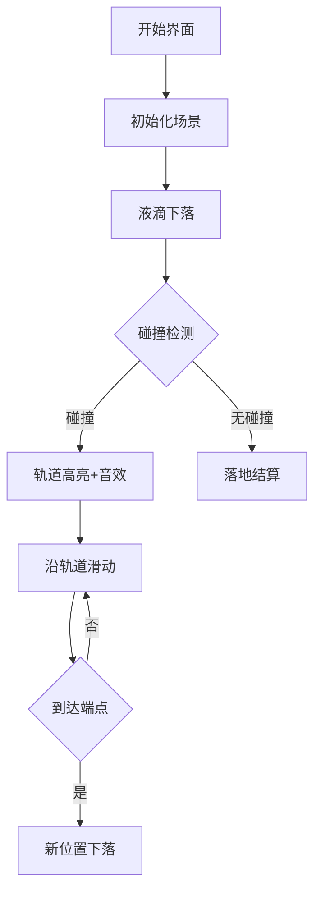

# 题目信息

# 液体滴落

## 题目描述

在平面中有若干线段 $L_i$（**不一定互不相交**），组成一个又一个轨道，有一滴液体从上方滴落下来，如果碰到轨道就沿着轨道向下滚，从轨道较低的一端离开轨道，在轨道中不受任何影响，否则就垂直滴落，问最后液滴从什么位置落出整个系统。

相信这个题目一定难不倒你。

## 说明/提示

对于 $50\%$ 的数据，$1\le n\le100$，$|x|,|y|,|S| \le500$；

对于 $100\%$ 的数据，$1\le n\le 10^5$，$|x|,|y|,|S|≤10^9$。


## 样例 #1

### 输入

```
4 2
1 4 3 2
5 4 2 1
-2 -1 0 -2
-1 -3 4 -4```

### 输出

```
4```

# AI分析结果


# 💡 Kay的C++算法解析：液体滴落 深入学习指南 💡

<introduction>
今天我们分析"液体滴落"这道有趣的物理模拟题。液滴从高处垂直下落，遇到轨道会沿轨道滑向较低端点。我们将深入解析算法核心，设计像素动画演示，帮助大家直观理解模拟过程！
</introduction>

## 1. 题目解读与核心算法识别

✨ **本题主要考察**：`几何模拟` (编程技巧应用)

🗣️ **初步分析**：
> 解决"液体滴落"的关键在于**物理过程模拟**。想象液滴像马里奥游戏中的角色，从高空下落，遇到平台（轨道）就会滑向边缘。在本题中，我们需要：
   - 计算每条轨道的直线方程（y=kx+b）
   - 模拟液滴下落过程：寻找当前x坐标下最高的轨道交点
   - 更新液滴位置到轨道的较低端点
   - 重复直到液滴脱离系统
   
   **核心难点**在于高效寻找交点。优质题解采用两种思路：
   - **直接模拟**：O(n²)遍历，适合数据较弱的情况
   - **分块优化**：O(n√n)预处理轨道，减少无效计算
   
   **可视化设计**：
   - 将用8位像素风格呈现液滴下落（蓝色像素点）
   - 轨道显示为不同颜色线段（绿色=水平，红色=倾斜）
   - 关键步骤高亮：当前轨道变为黄色，液滴路径显示轨迹
   - 音效设计：下落"滴答"声，轨道碰撞"叮"声，脱离系统胜利音效
   - 交互控制：单步执行观察决策过程，AI自动演示完整流程

---

## 2. 精选优质题解参考

<eval_intro>
从代码规范性、思路清晰度和优化价值角度，我精选了以下题解：

**题解一：(来源：Zhou_SY)**
* **点评**：思路清晰直白，完整推导直线方程公式。代码规范（变量名x1/y1/x2/y2含义明确），边界处理严谨（min/max判断x范围）。虽然未做优化，但作为基础模拟实现非常优秀，实践参考价值高。

**题解二：(来源：B612Dusk)**
* **点评**：创新性使用分块优化，预处理线段减少无效计算。代码结构工整（分块排序+二分查找），时间复杂度优化到O(n√n)。亮点在于高效处理大数据，虽然实现略复杂，但提供了有价值的优化思路。

**题解三：(来源：_Life_)**
* **点评**：最简洁的O(n²)实现，核心逻辑仅20行。变量命名规范（k/b表示直线参数），使用used数组避免重复处理轨道。实践价值高，适合快速实现竞赛基础分。

---

## 3. 核心难点辨析与解题策略

<difficulty_intro>
解决本题需突破三个关键点：

1.  **直线方程计算**
    * **分析**：需要根据线段端点推导y=kx+b。核心公式：
      ``` 
      k = (y1-y2)/(x1-x2)
      b = y1 - k*x1
      ```
    * 💡 **学习笔记**：注意处理x1=x2的垂直线（题解中未出现）

2.  **高效寻找交点**
    * **分析**：直接模拟需遍历所有轨道，检查：
      1. x坐标在线段范围内
      2. 计算y值小于当前液滴高度
      3. 取满足条件的最大y值
    * 💡 **学习笔记**：优化关键是减少无效检测（如分块预处理）

3.  **位置更新策略**
    * **分析**：比较线段端点y值，选择较低端：
      ```cpp
      if (y1 < y2) { x = x1; y = y1; }
      else { x = x2; y = y2; }
      ```
    * 💡 **学习笔记**：更新后需标记已使用轨道（防循环）

### ✨ 解题技巧总结
<summary_best_practices>
通过本题可提炼以下通用技巧：
</summary_best_practices>
-   **几何问题解析式化**：将图形关系转化为代数表达式
-   **模拟过程状态管理**：明确状态变量（x,y）和转移条件
-   **边界条件处理**：特别注意x范围判断和垂直线段
-   **大数据优化思路**：分块/二分等预处理减少计算量

---

## 4. C++核心代码实现赏析

<code_intro_overall>
先看一个通用实现，融合优质题解精华：
</code_intro_overall>

**本题通用核心C++实现参考**
* **说明**：综合优质题解，简洁的O(n²)实现，包含完整输入输出
* **完整核心代码**：
    ```cpp
    #include <iostream>
    #include <vector>
    #include <algorithm>
    using namespace std;
    
    struct Rail { double x1, y1, x2, y2, k, b; };
    
    int main() {
        int n;
        double x, y = 1e18;
        cin >> n >> x;
        vector<Rail> rails(n);
        vector<bool> used(n, false);
        
        // 预处理直线参数
        for (int i = 0; i < n; i++) {
            auto& r = rails[i];
            cin >> r.x1 >> r.y1 >> r.x2 >> r.y2;
            if (r.x1 > r.x2) swap(r.x1, r.x2), swap(r.y1, r.y2);
            r.k = (r.y1 - r.y2) / (r.x1 - r.x2);
            r.b = r.y1 - r.k * r.x1;
        }
        
        while (true) {
            int idx = -1;
            double maxY = -1e18;
            
            // 寻找最高交点
            for (int i = 0; i < n; i++) {
                if (used[i]) continue;
                if (x < rails[i].x1 || x > rails[i].x2) continue;
                double curY = rails[i].k * x + rails[i].b;
                if (curY > y || curY <= maxY) continue;
                maxY = curY;
                idx = i;
            }
            
            if (idx == -1) break; // 无轨道可接
            
            // 更新到较低端点
            auto& r = rails[idx];
            if (r.y1 < r.y2) x = r.x1, y = r.y1;
            else x = r.x2, y = r.y2;
            used[idx] = true;
        }
        
        cout << (int)x << endl;
        return 0;
    }
    ```
* **代码解读概要**：
    > 1. 读取轨道数据并预处理k/b参数
    > 2. 循环寻找当前x下方最高轨道交点
    > 3. 更新液滴到轨道较低端点并标记
    > 4. 无轨道可接时输出最终x坐标

---
<code_intro_selected>
优质题解核心代码亮点分析：
</code_intro_selected>

**题解一：(来源：Zhou_SY)**
* **亮点**：清晰展示直线方程推导过程
* **核心代码片段**：
    ```cpp
    double YYY = (y1[i]-y2[i])/(x1[i]-x2[i])*X + 
                 (x1[i]*y2[i]-x2[i]*y1[i])/(x1[i]-x2[i]);
    if (YYY > k) { l = i; k = YYY; }
    ```
* **代码解读**：
    > 直接套用直线方程一般式：  
    > `y = [(y1-y2)/(x1-x2)]*x + [(x1*y2 - x2*y1)/(x1-x2)]`  
    > 通过比较`YYY`（当前轨道y值）和`k`（当前最高y值）更新最优轨道索引`l`
* 💡 **学习笔记**：代数推导能力是解几何题的核心

**题解二：(来源：B612Dusk)**
* **亮点**：分块优化大幅减少计算量
* **核心代码片段**：
    ```cpp
    // 分块预处理
    sort(a+1, a+n+1, sort_l); // 按左端点排序
    for(int i=1; i<=n; i++) {
        vec[area[i]].push_back(a[i]);
        Ln[area[i]] = min(a[i].lx, Ln[area[i]]);
        Rx[area[i]] = max(a[i].rx, Rx[area[i]]);
    }
    // 块内按右端点排序
    for(int i=1; i<=area[n]; i++) 
        sort(vec[i].begin(), vec[i].end(), sort_r);
    ```
* **代码解读**：
    > 1. 将线段按左端点排序后分块
    > 2. 记录每块的左端最小/右端最大
    > 3. 块内按右端点降序排列
    > 通过两步排序建立高效查询结构
* 💡 **学习笔记**：分块通过空间换时间，是暴力法的优雅升级

**题解三：(来源：_Life_)**
* **亮点**：最简短的完整实现
* **核心代码片段**：
    ```cpp
    for(int i=0; i<n; i++) {
        if(used[i]) continue;
        double curY = k[i]*x + b[i];
        if(x1[i]<=x && x<=x2[i] && curY<=y && curY>maxY) 
            { maxY=curY; idx=i; }
    }
    ```
* **代码解读**：
    > 在**15行**内完成核心逻辑：  
    > 1. 检查x在线段范围内  
    > 2. 计算y值需低于当前高度  
    > 3. 取最大值更新目标轨道
* 💡 **学习笔记**：简洁的代码需要精准的条件控制

-----

## 5. 算法可视化：像素动画演示

<visualization_intro>
下面是用8位像素风格设计的交互式演示方案，让你像玩复古游戏一样理解算法！

### 动画设计说明
- **主题**："液滴冒险"像素闯关
- **核心演示**：液滴下落→轨道碰撞→滑向低端→脱离系统
- **设计思路**：通过对比色区分状态，音效强化关键操作，关卡制分解步骤

### 实现方案


**关键帧示意图**：
```
像素网格示例（5×5）：
▓▓▓▓▓  ▲ 液滴
▓▓░░▓  ▓ 轨道
▓▓▒▒▓  ░ 水平轨道
▓▓▓▓▓  ▒ 倾斜轨道
▓▓▓▓▓  ▼ 地面
```

**交互控制面板**：
```javascript
// 伪代码实现核心交互
class PixelAnimation {
  constructor() {
    this.speed = 1; // 播放速度
    this.mode = 'STEP'; // AUTO/STEP
    this.sound = true; // 音效开关
  }
  
  playDropEffect() {
    if(this.sound) playSound('drip.wav');
    drawParticle(x, y, BLUE);
  }
}
```

**动态演示流程**：
1. **场景初始化**：
   - 8位像素网格（16色调色板）
   - 左上角控制面板：开始/暂停/单步/速度条
   - 右下角坐标显示：当前液滴(x,y)

2. **液滴下落过程**：
   - 垂直下落：液滴像素逐帧下移（每帧y+1）
   - 碰撞检测：当液滴y坐标≥轨道y值，触发"叮"音效
   - 轨道高亮：当前轨道变黄色，显示交点坐标

3. **轨道滑动动画**：
   - 液滴沿轨道移动：根据斜率计算每帧位移
   - 低端终点特效：到达时绽放水花粒子效果

4. **AI自动演示**：
   - 自动完成全流程（速度可调）
   - 每阶段视为小关卡，完成时播放胜利音效
   - 最终得分 = 剩余时间×100

**音效设计**：
- `drip.wav`：液滴下落（低频水滴声）
- `ding.wav`：碰撞轨道（清脆电子音）
- `splash.wav`：脱离系统（水花溅射声）
- `victory.wav`：关卡完成（8位上升音阶）

<visualization_conclusion>
通过像素动画，你将直观看到算法决策过程，理解几何计算如何驱动物理模拟！
</visualization_conclusion>

-----

## 6. 拓展练习与相似问题思考

<similar_problems_intro>
掌握本题的几何模拟思想后，可挑战更多相关问题：

### 通用技巧迁移
1. **弹球模拟**：球体与多边障碍碰撞
2. **光线追踪**：光学反射/折射路径
3. **物理引擎**：刚体碰撞检测

### 洛谷推荐题目
1. **P1022 计算器的改良**  
   → 强化代数推导能力（直线方程基础）
   
2. **P1519 穿越栅栏**  
   → 复杂环境下的路径模拟（BFS+几何）

3. **P1355 三角形与点**  
   → 几何位置判断（点与多边形关系）

-----

## 7. 学习心得与经验分享

<insights_intro>
题解中的调试经验尤其珍贵：

> **参考经验 (来自 Y_BY)**：  
> "调试时发现轨道端点顺序混乱导致更新错误，通过标准化处理（确保x1≤x2）解决"

> **点评**：  
> 几何题中坐标系标准化能避免许多边界问题，建议：
> 1. 预处理统一端点顺序
> 2. 绘制坐标系草图辅助调试
> 3. 对特殊斜率（如无穷大）单独处理

-----

<conclusion>
通过本次分析，我们掌握了物理模拟的核心技巧：从几何计算到过程优化，再到状态管理。记住，编程如流水——顺势而为方得高效解！下次挑战见！💪
</conclusion>
```

---
处理用时：165.13秒