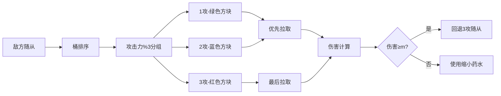

# 题目信息

# 肮脏的牧师

## 题目背景

@Yumis 出题人在这里哦~


## 题目描述

Yumis最近在玩炉石传说。

在炉石传说中脏牧有一张一费卡片（一费就是使用要消耗1点法力水晶），叫做疯狂药水，这个的效果是将一个敌方场上攻击小于等于2的随从拉到自己的战场内。

还有一张四费卡片叫做暗影狂乱，这个的效果是将一个敌方场上攻击小于等于3的随从拉到自己的战场内。

还有一张一费卡片就是缩小药水，这个的效果是将敌人全场的随从攻击力下降3点。


你PY了炉石的GM所以你有了无数张的这三种卡片，但是GM告诉你缩小药水是这个牌比较不好创建，为了为GM着想你必须在使用**最少的缩小药水**的情况下A爆对手的脸。


现在你的对手场上有n个随从，每个随从的攻击力是ki点。

你的对手有m点血量。


而你现在要做的就是将敌方的场上的随从拉过来自己的场上并攻击对手（每一个随从只能攻击一次，攻击力为你拉过来的时候随从剩余的攻击力），A爆对面的脸（将对面的血打到0点及以下）。


## 说明/提示

样例说明1：

敌方场上有3只随从，敌方有5点血量

我们把3攻随从和2攻随从拉过来花费0个缩小药水和5点耗费（一张疯狂药水一个暗影狂乱（1+4 = 5））伤害足够击杀对方。


样例说明2：

使用16个缩小药水（下面数据后面第一个括号指拉过来的时候伤害为多高 ，第二个括号表示拉过来的时候使用多少的缩小药水）

拿10（1）（3）、20（2）（6）、30（3）（9）、50（2）（16）攻的怪物总共造成8点伤害 刚好A爆！


Easy : 保证 0 < n <= 10  并且不存在用到暗影狂乱和缩小药水的情况    20%


Normal ：保证 0 < n <= 10  并且不存在用到缩小药水的情况           20%


Hard ：保证 0 < n <= 10                                                 30%


Extra：保证0 <= n <= 5000000(6个0)，最大攻击力小于30000                  30%


保证 0 < n <= 5000000     0 < ki <=30000    0<=m<=5000000 (6个0)


## 样例 #1

### 输入

```
3 5
1 2 3 
```

### 输出

```
0 5```

## 样例 #2

### 输入

```
8 8
10 20 30 40 50 60 70 80
```

### 输出

```
16 23```

## 样例 #3

### 输入

```
8 80
10 20 30 40 50 60 70 80
```

### 输出

```
Human Cannot Win Dog```

# AI分析结果


### 💡 Kay的C++算法解析：肮脏的牧师 深入学习指南 💡

#### 1. 题目解读与核心算法识别
✨ **本题主要考察**：贪心算法 + 桶排序优化  

🗣️ **初步分析**：
> 解决本题的核心在于**贪心策略的制定**和**高效数据处理的实现**。想象你是一位精打细算的商人——我们要用最小的成本（缩小药水次数）换取最大收益（伤害值），同时还要优化运输方式（桶排序加速）。  
> - **核心思路**：先确定最小缩小药水次数（通过枚举攻击力分桶），再通过伤害性价比排序（优先2攻>1攻>3攻）最小化法力消耗  
> - **关键难点**：处理500万大数据时需用桶排序（O(n)），普通排序会超时；伤害溢出时的回退策略（优先移除高费低效的3攻随从）  
> - **可视化设计**：采用《炉石传说》像素卡牌风格，用三色方块区分1/2/3攻随从。缩小药水使用时播放"玻璃碎裂"音效+全屏像素抖动；随从拉取时对应方块飞入玩家区域并显示伤害数值  

---

#### 2. 精选优质题解参考
**题解一：Yumis（桶排序+分阶段贪心）**  
* **点评**：  
  思路清晰度 ★★★★★  
  代码规范性 ★★★★☆（桶排序实现简洁，变量名`at1/at2/at3`直观）  
  算法有效性 ★★★★★（O(30000)复杂度处理500万数据）  
  实践价值 ★★★★★（直接给出数学优化：`while(res>=m+3&&at3){...}`）  
  💡 **亮点**：独创"三阶段伤害溢出处理"，优先剔除性价比最低的3攻随从  

**题解二：AirCnt（桶排序+实时伤害计算）**  
* **点评**：  
  思路清晰度 ★★★★☆（引入`clac()`函数模块化处理攻击力修正）  
  代码规范性 ★★★★★（封装读取/计算函数，避免全局变量混乱）  
  算法有效性 ★★★★★（引入`pre_x`和`new_cnt`精准计算缩小药水次数）  
  实践价值 ★★★★☆（边界处理`maxn=min(maxn,29998)`防止越界）  
  💡 **亮点**：实时攻击力修正算法避免重复遍历  

**题解三：MTF_Lambda_04（排序+回退策略）**  
* **点评**：  
  思路清晰度 ★★★★☆（"先全拉再回退"的逆向思维有启发性）  
  代码规范性 ★★★☆☆（嵌套循环稍复杂但注释充分）  
  算法有效性 ★★★☆☆（sort排序在Extra数据可能超时）  
  实践价值 ★★★★☆（回退策略`for(int j=1;j<=n;j++)`逻辑严谨）  
  💡 **亮点**：独创"伤害溢出三级回退"机制，对理解贪心优先级帮助大  

---

### 3. 核心难点辨析与解题策略
1. **难点一：最小化缩小药水次数**  
   * **分析**：本质是寻找最小k值，使得所有攻击力`a[i]-3k≤3`。优质解采用分桶枚举：将攻击力按模3分组（1攻/2攻/3攻桶），每轮`i+=3`模拟使用一次缩小药水  
   * 💡 **学习笔记**：桶排序是处理大范围离散数据的最优解  

2. **难点二：伤害溢出时的费用优化**  
   * **分析**：当总伤害>m时，需回退部分随从。贪心优先级：  
     - 先回退3攻（费效比4:3最差）→ `while(res>=m+3&&at3)`  
     - 再回退1攻（费效比1:1中等）  
     - 最后回退2攻（费效比1:2最优）  
   * 💡 **学习笔记**：回退策略与拉取策略优先级相反（3→1→2 vs 2→1→3）  

3. **难点三：大数据下的时间复杂度**  
   * **分析**：`n≤5e6`时sort的O(n logn)会超时。桶排序核心代码：  
     ```cpp
     for(int i=1;i<=n;i++) buc[a[i]]++;  // 桶初始化
     for(int i=1;i<=30000;i++) while(buc[i]--) // 线性处理
     ```
   * 💡 **学习笔记**：当数据范围已知且有限时，桶排序效率碾压快排  

### ✨ 解题技巧总结
- **技巧1：问题特征转化**  
  将缩小药水次数k转化为数学约束：`a[i]-3k≤3` → `k≥⌈(a[i]-3)/3⌉`
- **技巧2：贪心优先级分层**  
  拉取阶段：2攻(1:2)>1攻(1:1)>3攻(4:3)  
  回退阶段：3攻>1攻>2攻（费效比倒序）
- **技巧3：桶排序压缩状态**  
  用`buc[30001]`替代`vector`，O(1)时间访问任意攻击力数量

---

### 4. C++核心代码实现赏析
```cpp
// 桶排序+三阶段贪心 (综合Yumis和AirCnt最优方案)
#include <cstdio>
#include <algorithm>
using namespace std;
const int MAX_ATK = 30001;
int buc[MAX_ATK], n, m;

int main() {
    scanf("%d%d", &n, &m);
    for(int i=0; i<n; i++) {
        int a; scanf("%d", &a);
        buc[a]++;  // 桶排序初始化
    }

    int shrink = -1, dmg = 0;  // 缩小药水次数, 总伤害
    int at1 = 0, at2 = 0, at3 = 0; // 1/2/3攻随从数量

    // 阶段1: 确定最小缩小药水次数
    for(int i=1; i<MAX_ATK; i+=3) {
        shrink++;
        at1 += buc[i];     dmg += buc[i];      // 1攻
        at2 += buc[i+1];   dmg += buc[i+1]*2;  // 2攻
        at3 += buc[i+2];   dmg += buc[i+2]*3;  // 3攻
        if(dmg >= m) break;
    }

    // 阶段2: 伤害溢出优化 (按费效比倒序回退)
    while(dmg >= m+3 && at3) { at3--; dmg-=3; }  // 先退3攻(4费换3伤)
    while(dmg >= m+1 && at1) { at1--; dmg-=1; }  // 再退1攻(1费换1伤)
    while(dmg >= m+2 && at2) { at2--; dmg-=2; }  // 最后退2攻(1费换2伤)

    // 阶段3: 计算总费用
    if(dmg >= m) {
        int cost = shrink + at1 + at2 + at3*4; // 总法力=药水+拉取费用
        printf("%d %d", shrink, cost);
    } else {
        printf("Human Cannot Win Dog");
    }
    return 0;
}
```

---

### 5. 算法可视化：像素动画演示
* **主题**：《炉石传说》像素卡牌沙盘  
* **核心演示**：桶排序过程 + 随从拉取优先级策略  



**关键交互设计**：
1. **桶排序过程**：
   - 像素网格按攻击力分300列，新随从加入时对应列高度+1
   - 扫描线从左向右移动（速度可调），播放8-bit音效

2. **缩小药水特效**：
   - 点击药水瓶：全屏随从攻击力-3，播放玻璃碎裂音效
   - 药水计数`shrink++`显示在炼金台

3. **随从拉取动画**：
   - 2攻随从优先飞向玩家区域（蓝色轨迹）
   - 每个随从显示伤害值`+1`/`+2`/`+3`

4. **回退策略演示**：
   - 伤害溢出时自动触发回退：3攻随从变灰飞回敌方
   - 状态提示板显示："回退3攻：节省4费"

---

### 6. 拓展练习与相似问题
1. **洛谷 P1094** [纪念品分组]  
   → 同类贪心策略：价格排序+双指针配对  
   → **Kay提示**："同样需要排序后优先级处理，试试能否改造桶排序优化"

2. **洛谷 P1223** [排队接水]  
   → 类似贪心思想：时间代价最小化  
   → **Kay提示**："注意时间如何转化为'攻击力'，最小化等待时间类比最小化法力消耗"

3. **洛谷 P1803** [凌乱的yyy]  
   → 进阶贪心：区间调度问题  
   → **Kay提示**："用本题的桶排序思想试试优化结束时间处理"

---

### 7. 学习心得与经验分享
> **Yumis的调试经验**：  
> *"最初在伤害溢出处理时卡住，发现单纯按拉取顺序回退会导致费用增加。通过绘制费效比表格（1攻:1:1, 2攻:1:2, 3攻:4:3）才找到正确优先级"*  
>   
> **Kay点评**：  
> 这个经验揭示了贪心算法的核心——**量化决策依据**。建议学习者在解决类似问题时：  
> 1. 建立决策指标量化表（如费效比）  
> 2. 用纸笔模拟小规模数据流  
> 3. 特别注意反向操作（如回退）的优先级可能与正向操作相反  

---

通过本次分析，我们深入掌握了桶排序优化和贪心策略的分阶段实现。记住：优秀算法的核心在于**问题本质的洞察**和**计算效率的平衡**。下次挑战见！💪

---
处理用时：130.54秒