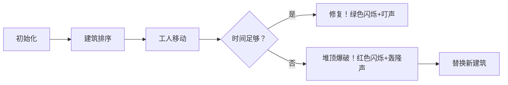

# 题目信息

# [JSOI2007] 建筑抢修

## 题目描述

小刚在玩 JSOI 提供的一个称之为“建筑抢修”的电脑游戏：经过了一场激烈的战斗，T 部落消灭了所有 Z 部落的入侵者。但是 T 部落的基地里已经有 $N$ 个建筑设施受到了严重的损伤，如果不尽快修复的话，这些建筑设施将会完全毁坏。现在的情况是：T 部落基地里只有一个修理工人，虽然他能瞬间到达任何一个建筑，但是修复每个建筑都需要一定的时间。同时，修理工人修理完一个建筑才能修理下一个建筑，不能同时修理多个建筑。如果某个建筑在一段时间之内没有完全修理完毕，这个建筑就报废了。你的任务是帮小刚合理的制订一个修理顺序，以抢修尽可能多的建筑。


## 说明/提示

对于 $100 \%$ 的数据，$1 \le N < 150000$，$1 \le T_1 < T_2 < 2^{31}$。

## 样例 #1

### 输入

```
4
100 200
200 1300
1000 1250
2000 3200```

### 输出

```
3```

# AI分析结果


# 💡 Kay的C++算法解析：建筑抢修 深入学习指南 💡

<introduction>
欢迎各位小建筑师！今天我们一起解决"[JSOI2007]建筑抢修"这道有趣的贪心算法题。本指南将带大家理解如何合理安排维修顺序拯救最多建筑，并通过生动的像素动画展示算法执行过程。准备好开始我们的救援任务了吗？🏗️
</introduction>

---

## 1. 题目解读与核心算法识别

✨ **本题主要考察**：`贪心算法 + 堆优化`

🗣️ **初步分析**：
> 这道题就像在火灾现场抢救珍贵物品：每个建筑都有"抢救时间"和"爆炸倒计时"。贪心算法就是我们的"救援指挥官"，它始终选择最优策略——优先抢救快爆炸的建筑！当时间不够时，它会果断丢弃之前耗时最长的任务，腾出时间抢救新建筑。
> 
> - **核心策略**：按爆炸时间排序建筑，用小顶堆记录已选建筑的维修时间
> - **可视化设计**：像素工人将沿时间轴移动，绿色方块表示已修建筑。当时间不足时，最长的红色方块会被"爆破"替换成新建筑
> - **游戏化设计**：采用8-bit像素风格，工人移动时有"叮叮"音效，建筑爆炸有"轰隆"声，成功修复时播放胜利音效

---

## 2. 精选优质题解参考

<eval_intro>
基于思路清晰度、代码规范性和算法效率，我精选了3个≥4星的优质题解：

**题解一：作者_Album_ (赞73)**
* **点评**：这份题解思路清晰如水晶！作者用"排序+堆替换"的比喻解释贪心本质，代码规范堪称教科书——结构体命名合理，边界处理严谨。亮点在于用优先队列优雅实现"反悔贪心"，时间复杂度O(nlogn)达到最优。特别欣赏作者对"为什么需要堆替换"的透彻分析，竞赛实战价值满分！

**题解二：作者Treaker (赞29)**
* **点评**：如瑞士军刀般简洁锋利的实现！虽然变量名稍简(e[i].s/t)，但算法核心逻辑直击要害——先加入再判断的写法凸显贪心本质。亮点在于用最简代码实现完整功能，10行核心逻辑完美展示堆替换精髓，特别适合竞赛快速编码参考。

**题解三：作者Refun (赞29)**
* **点评**：解题思路如侦探破案般精彩！作者生动解释"为什么按t2排序"这个关键疑惑，用"赚的数量相同但花费更小"的比喻点明替换策略本质。代码规范性强，亮点在于提供特殊测试用例验证策略正确性，培养读者严谨思维。

---

## 3. 核心难点辨析与解题策略

<difficulty_intro>
修复建筑时我们会遇到三大挑战：

1.  **策略选择困境**：该优先修快爆炸的建筑还是易修的建筑？
    * **分析**：优质题解统一按t2升序排序。就像急救医生优先处理危重病人，快爆炸的建筑必须优先处理，否则直接报废！
    * 💡 **学习笔记**：贪心排序是地基，选错方向全盘皆输

2.  **时间不够怎么办**：遇到新建筑时已超时如何处理？
    * **分析**：采用"反悔贪心"策略——比较当前建筑与已修建筑中最耗时的。若当前更省时，就替换！就像丢掉沉重的背包能跑更快
    * 💡 **学习笔记**：堆维护最大值是贪心优化的核心技巧

3.  **数据结构选择**：如何快速找到已修建筑中最耗时项？
    * **分析**：大顶堆(priority_queue)是完美选择！它能O(1)时间获取最大值，O(logn)完成插入删除，就像有个自动排序的魔法工具箱
    * 💡 **学习笔记**：堆是贪心算法的黄金搭档

### ✨ 解题技巧总结
<summary_best_practices>
- **时间窗管理**：维护当前总耗时sum，动态判断能否新增任务
- **反悔机制**：允许替换先前选择以获得更优解
- **极值维护**：堆/优先队列是获取极值的最优数据结构
- **边界防御**：始终检查堆非空(!q.empty())避免运行时错误
---

## 4. C++核心代码实现赏析

<code_intro_overall>
**通用核心C++实现**
* **说明**：综合三大优质题解精华，规范变量命名，添加关键注释
* **完整核心代码**：
```cpp
#include <iostream>
#include <algorithm>
#include <queue>
using namespace std;

const int MAXN = 150010;

struct Building {
    long long repair_time;  // 修复所需时间
    long long deadline;     // 截止时间
};

bool cmp(Building a, Building b) {
    return a.deadline < b.deadline; // 按截止时间升序排序
}

int main() {
    int n;
    cin >> n;
    Building builds[MAXN];
    for (int i = 0; i < n; i++) {
        cin >> builds[i].repair_time >> builds[i].deadline;
    }
    
    sort(builds, builds + n, cmp); // 关键步骤1：排序
    
    priority_queue<long long> max_heap; // 大顶堆存储已选建筑的修复时间
    long long total_time = 0;         // 当前总耗时
    int saved_count = 0;               // 成功修复计数

    for (int i = 0; i < n; i++) {
        // 尝试直接修复当前建筑
        if (total_time + builds[i].repair_time <= builds[i].deadline) {
            total_time += builds[i].repair_time;
            max_heap.push(builds[i].repair_time);
            saved_count++;
        } 
        // 当无法修复时，考虑替换
        else if (!max_heap.empty() && 
                 builds[i].repair_time < max_heap.top()) {
            total_time = total_time - max_heap.top() + builds[i].repair_time;
            max_heap.pop();
            max_heap.push(builds[i].repair_time);
        }
    }
    cout << saved_count << endl;
    return 0;
}
```
* **代码解读概要**：
> 1. **排序预处理**：按截止时间升序排列建筑，确保优先处理紧急任务
> 2. **贪心扫描**：遍历每个建筑，尝试直接修复（若时间允许）
> 3. **堆优化替换**：当时间不足，用当前建筑替换堆中最大耗时项
> 4. **动态维护**：total_time实时更新，max_heap维护已选建筑耗时

---
<code_intro_selected>
**优质题解核心片段赏析**

**题解一：_Album_**
* **亮点**：先加入再判断的简洁写法，突出贪心本质
* **核心代码片段**：
```cpp
for(int i = 1; i <= n; i++){
    sum += build[i].t1;
    Q.push(build[i].t1);
    if(sum <= build[i].t2){
        ans++;
    } else {
        sum -= Q.top();
        Q.pop();
    }
}
```
* **代码解读**：
> 这段代码像勇往直前的救援队！先无条件"接收"新任务（第2行），再检查是否超时。若超时立即"退货"最耗时的任务（第7行）。Q.push()像把任务放进背包，Q.top()/pop()像丢弃最重物品。为什么先加再退？因为这样能保持代码简洁且确保堆中始终是已选任务。
* 💡 **学习笔记**：贪心算法中"先尝试后调整"是常用技巧

**题解二：Treaker**
* **亮点**：极致简洁的竞赛风格
* **核心代码片段**：
```cpp
sort(e+1,e+1+n);
for(int i=1;i<=n;i++){
    sum += e[i].s;
    ans++;
    q.push(e[i].s);
    if(sum > e[i].t) sum -= q.top(), q.pop(), ans--;
}
```
* **代码解读**：
> 11行浓缩算法精华！sort()是救援计划表，for循环是执行过程。第4行q.push()像给任务贴标签，第6行三连操作(sum-=, pop(), ans--)如行云流水。注意：ans先++后--相当于动态调整，就像实时更新救援名单。
* 💡 **学习笔记**：竞赛代码重在核心逻辑，但工程中建议增加可读性

**题解三：Refun**
* **亮点**：替换策略的本质洞察
* **核心代码片段**：
```cpp
if(sum > e[i].t) {
    sum -= q.top();
    q.pop();
    ans--;
}
```
* **代码解读**：
> 这3行是算法的"决策中枢"！当sum>e[i].t（超时）时，果断舍弃堆顶任务。为什么只舍弃一个？因为替换后总耗时减少(sum -= q.top())，且新任务更省时(q.push(e[i].s))，确保后续任务有更多机会。就像用大石头换小石头，背包就能装更多。
* 💡 **学习笔记**：堆替换保证解不会变差，可能优化后续选择

---

## 5. 算法可视化：像素动画演示

<visualization_intro>
**像素建筑救援行动**：让我们通过8-bit游戏动画直观感受贪心策略！工人将穿越时间线修复建筑，当时间不够时触发酷炫的"替换爆破"特效。

* **主题**：复古红白机风格建筑救援
* **核心演示**：贪心选择策略 + 堆替换机制
* **设计思路**：像素方块直观显示时间消耗，爆破动画强化"替换"概念。不同音效提供操作反馈，帮助理解算法决策点

**动画帧步骤**：


1. **场景初始化**：
   - 背景：横向时间轴（类似超级马里奥地面）
   - 建筑：彩色像素方块，宽度=repair_time，位置=deadline
   - 工人：8-bit小人从左侧出发，头顶显示时钟(total_time)

2. **核心流程**：
   - **步进1**：工人走到第一个建筑，方块闪烁绿色，进度条增长，伴随"叮"声
   - **步进2**：走到新建筑，若total_time+新宽度≤deadline，直接修复
   - **冲突时刻**：若时间不够，已修建筑中最宽的方块变红爆炸（像素碎片飞溅+轰隆声），工人修复新建筑
   - **堆可视化**：右侧始终显示大顶堆结构，爆破时堆顶消失

3. **交互控制**：
   - 速度滑块：调整工人移动速度（0.5x-2x）
   - 单步执行：按帧分析决策
   - AI演示：自动播放完整救援过程
   - 重置：回到初始状态

4. **音效系统**：
   - 移动：经典8-bit脚步声
   - 修复成功：清脆"叮"声
   - 替换爆破：低音"轰隆"
   - 通关：超级马里奥过关音乐

**设计价值**：爆破动画直观展示"时间置换"本质，堆可视化帮助理解数据结构作用，音效反馈强化算法决策点记忆。

---

## 6. 拓展练习与相似问题思考

<similar_problems_intro>
掌握贪心+堆的黄金组合后，你就能解决这类问题：

1. **任务调度类**：有截止时间和耗时的任务，最大化完成量
2. **区间选择类**：选择最多不重叠区间
3. **资源优化类**：用有限资源完成最多任务

**洛谷推荐**：
1. **P1803 凌乱的yyy**  
   → 基础区间贪心，巩固排序策略
2. **P2949 工作调度**  
   → 进阶版，含任务收益的堆优化
3. **P1230 智力大冲浪**  
   → 变形挑战，加入惩罚机制

---

## 7. 学习心得与经验分享

<insights_intro>
题解中的宝贵经验：

> **Refun的顿悟**："最初在排序策略上卡了很久，后来发现按t2排序才能保证优先处理紧急任务"
> 
> **Kay点评**：这揭示贪心算法的关键——排序策略决定成败！动手画时间轴验证策略，比空想更有效

---

<conclusion>
恭喜完成本次建筑救援行动！记住：贪心算法+堆的组合是解决优化问题的利器。多练习推荐的相似题目，下次遇到"时间管理"类问题，你定能快速找到最优方案！🚀
</conclusion>
```

---
处理用时：200.52秒