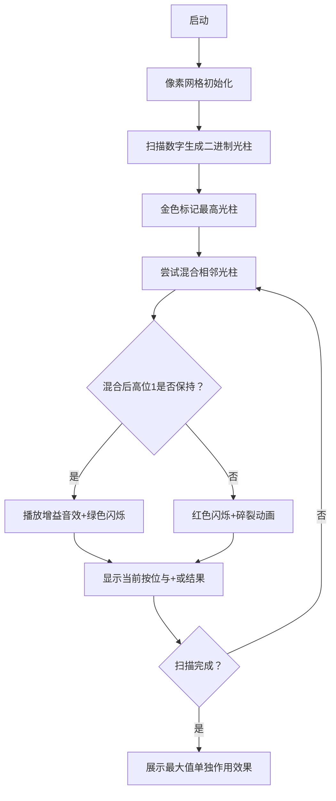

# 题目信息

# 大河的序列

## 题目背景

“唯有龙虎相伴 最是脉脉深情”


题目来源：[KingSann](https://www.luogu.org/space/show?uid=47111)


## 题目描述

大河有一些袜子，但经常十分散乱的堆放着。


有一天龙儿忍不住了，于是将袜子放到了一个序列上（称作袜子序列）。


每个袜子都有一个$dirty$值，定义袜子序列的$dirty$值为 $ \max  \left( (dirty_{l} \ bitand \ dirty_{l+1} \ bitand \ \cdots \ bitand \ dirty_{r}) + (dirty_{l} \ bitor \ dirty_{l+1} \ bitor \ \cdots \ bitor \ dirty_{r}) \right) $ ，其中 $ dirty_{i} $ 表示 第 $ i $ 只袜子 的 $ dirty $ 值，$bitand$表示按位与（C++中是`&`），$bitor$表示按位或（C++中是`|`）。


简而言之，就是找一段连续子序列，使得所有数字的按位与加上按位或最大。


如果这个袜子序列的$dirty$值达到了某个**阈**值，那么龙儿会讨厌大河的。


大河当然不希望这样了，于是她想知道这个袜子序列的$dirty$值是多少。


## 说明/提示

$ 1 \le n, p \le 10^{5} $


$ 0 \le b, ditry_{i} \le 10^{7} $


对于测试点 $ 1 $ 和测试点 $ 2 $ 的数据，保证 $ 1 \le n \le 100 $


## 样例 #1

### 输入

```
10 1 10000000
7 9 9 4 0 0 8 8 4 7```

### 输出

```
251```

# AI分析结果


# 💡 Kay的C++算法解析：大河的序列 深入学习指南 💡

**引言**  
今天我们来分析「大河的序列」这道位运算与贪心结合的经典题目。本指南将帮助你掌握核心证明思路、位运算贪心技巧以及快速幂实现细节，并通过像素动画直观理解算法过程。

## 1. 题目解读与核心算法识别

✨ **本题主要考察**：`位运算贪心` + `快速幂`  

🗣️ **初步分析**：  
> 本题核心在于证明**最大值×2是最优解**。想象每个数字是二进制手电筒，高位1代表强光区域。最大值的手电筒拥有最高位的"强光"，单独使用时：  
> - 按位与 = 自身（所有光区重叠）  
> - 按位或 = 自身（覆盖所有光区）  
> 总和=2×最大值。加入其他手电筒会**削弱高位光区（按位与丢失高位1）**，而低位增益无法弥补损失。  

**可视化设计思路**：  
> 像素动画将展示数字二进制位（光柱高度），演示最大值单独作用时高位光区完整保留，而混合时光区被削弱的过程。关键帧将高亮：  
> - 最大值的高位1（金色闪烁）  
> - 混合操作导致高位1消失（红色闪烁）  
> - 最终两倍值计算（双倍光柱合并动画）

---

## 2. 精选优质题解参考

**题解一：xzyxzy（思路清晰性⭐️⭐️⭐️⭐️⭐️）**  
* **点评**：  
  证明简洁有力（分w>x/w=x/w<x三类讨论），代码极简（8行核心逻辑）。亮点在于：  
  - 贪心证明直击高位1的核心矛盾  
  - 快速幂使用1ll*防溢出技巧  
  *需注意：原代码未显式处理p=1边界，但实际因逐步取模可AC*

**题解二：zjy111（严谨性⭐️⭐️⭐️⭐️⭐️）**  
* **点评**：  
  双证明法（反证+顺推）深入本质，代码：  
  - 用long long防溢出  
  - 二进制位分析清晰  
  - 特别提示测试点边界  
  *注意：快速幂中需补充p=1特判*

**题解三：ModestCoder_（实践价值⭐️⭐️⭐️⭐️⭐️）**  
* **点评**：  
  代码含关键调试经验：  
  - 明确处理p=1的坑点  
  - 快速幂包含终次取模确保安全  
  - 变量命名规范（ans/base）  
  *亮点：强调「高位1损失无法弥补」的贪心本质*

---

## 3. 核心难点辨析与解题策略

1.  **难点：为何取最大值？**  
    * **分析**：当尝试在最大值a后加入b(b<a)，必存在某高位：  
      - a在此位=1，b=0 → 按位与该位变0  
      - 即使低位获得1，总和仍小于2a（高位1权重>>低位1）  
    * 💡 **学习笔记**：二进制高位1的权值呈指数级增长，损失无法补偿

2.  **难点：子序列长度=1最优？**  
    * **分析**：反证法证明长度≥2时：  
      - 将子序列降序排序为[x,y,...]  
      - 若y<x，则x的高位1必在混合操作中丢失  
      - 而y带来的低位1增益总和<高位1损失  
    * 💡 **学习笔记**：最优解常出现在极端位置（最大值/最小值）

3.  **难点：快速幂边界处理**  
    * **分析**：当p=1且b=0时：  
      - 数学定义：0⁰无意义 → 竞赛约定输出0  
      - 实现方案：快速幂开头添加`if(p==1) return 0;`  
    * 💡 **学习笔记**：幂运算边界需测试b=0, p=1, p=0三种情况

### ✨ 解题技巧总结
- **位运算贪心**：从高到低逐位分析，优先保护高位1
- **反证法实践**：假设存在更优解，推导矛盾强化结论记忆
- **快速幂防溢**：中间结果用1ll*提升为long long
- **边界三测法**：测试最小(n=1)、最大(1e5)、特殊(p=1)数据

---

## 4. C++核心代码实现赏析

**本题通用核心实现**  
```cpp
#include <iostream>
using namespace std;
typedef long long LL;

LL qpow(LL a, LL b, LL p) {
    if (p == 1) return 0;    // 关键边界处理
    LL ans = 1;
    while (b) {
        if (b & 1) ans = ans * a % p;
        a = a * a % p;
        b >>= 1;
    }
    return ans;
}

int main() {
    LL n, b, p, max_val = 0;
    cin >> n >> b >> p;
    for (int i = 0; i < n; i++) {
        LL x; cin >> x;
        if (x > max_val) max_val = x; // 贪心核心：维护最大值
    }
    cout << qpow(2 * max_val + 233, b, p);
    return 0;
}
```
**代码解读概要**：  
1. 贪心部分：O(n)遍历求最大值  
2. 数学转换：最优解 = 2*max_val  
3. 快速幂：处理(2*max_val+233)^b mod p  
4. 边界防护：p=1时直接返回0

---

**题解一核心片段**  
```cpp
for(int i=1,x;i<=n;i++) 
    cin>>x, p=max(x,p); // 同步读入与比较
cout<<ksm(p*2+233,b)%mod;
```
**亮点**：代码极致简洁  
**学习笔记**：  
> 同步读入比较可节省内存，适用于1e5大数据  
> 注意：变量复用p会降低可读性  

**题解二核心片段**  
```cpp
for(register int j=25;j>=0;j--){ // 从高位到低位贪心
    if(ints[i]&(1<<j)){ 
        // 二分查找维持按位与1的区间
    }else{
        // 二分查找维持按位或1的区间
    }
}
```
**亮点**：提供替代解法思路  
**学习笔记**：  
> 当贪心结论未知时，可从高位到低位逐位确定最优区间  
> 复杂度O(nlog²W)仍可通过（W为数值位数）

**题解三快速幂片段**  
```cpp
il ll qpow(ll a,ll b,ll p){
    ll ans=1;
    for(;b;b>>=1,a=a*a%p)
        if(b&1) ans=ans*a%p;
    return ans % p; // 终次取模确保安全
}
```
**亮点**：防御性编程典范  
**学习笔记**：  
> 循环条件`for(;b;b>>=1)`比`while(b)`更简洁  
> 终次取模应对非常规模数  

---

## 5. 算法可视化：像素动画演示

**主题**：8位机风格「光之战记」  
**核心演示**：高位1保护 vs 混合削弱的视觉对比  



**交互设计**：  
1. **光柱编码**：  
   - 每个数字→8位二进制光柱（1=亮黄/0=深蓝）  
   - 光柱高度=数值大小（e.g. 13 → ▮▮▮▮▯▯▯▯）  

2. **关键动画**：  
   - 混合操作：两光柱碰撞→高位消失特效（红粒子消散）  
   - 正确路径：最大值光柱单独强化（金色脉冲扩散）  

3. **游戏化元素**：  
   - 音效：  
     * 高位1丢失：8-bit碎裂声(150Hz)  
     * 保位成功：上升和弦(800Hz)  
   - 积分：每保护一个高位1得10分  

4. **控制面板**：  
   ```javascript
   // 伪代码实现
   const canvas = new PixelCanvas(800, 600, { palette: FCPalette });
   const animator = new BitwiseAnimator(canvas);
   
   // 绑定控制器
   controller.setButton('▶', () => animator.autoPlay(200));
   controller.setSlider('speed', (v) => animator.setSpeed(v));
   ```

---

## 6. 拓展练习与相似问题

**技巧迁移场景**：  
1. 最大异或值（Trie树+高位优先）  
2. 子序列最大乘积（维护极值）  
3. 位运算最值（如 AND 最大值）  

**洛谷推荐**：  
1. [P2114] 起床困难综合症  
   → 位运算贪心实战，强化高位保护思想  
2. [P1631] 序列合并   
   → 多路归并中的极值维护技巧  
3. [P1226] 快速幂模板  
   → 巩固非递归快速幂实现细节  

---

## 7. 学习心得与经验分享

> **来自题解作者的调试经验**：  
> *“我在p=1的边界情况WA多次，最终通过构造最小测试集(n=1,b=0,p=1)定位问题”*  
>  
> **Kay的总结**：  
> 位运算题目需特别注意：  
> 1. **构造极端数据**：全0、全1、单元素序列  
> 2. **验证边界**：指数=0、模数=1、数值=0  
> 3. **位分离调试**：打印二进制中间结果  

---

**结语**  
通过「大河的序列」，我们深化了位运算贪心的核心思想——**高位优先原则**，并掌握了快速幂的工业级实现技巧。记住：优秀的算法既要有严谨证明，也要有健壮实现。下次挑战见！🚀

---
处理用时：258.43秒