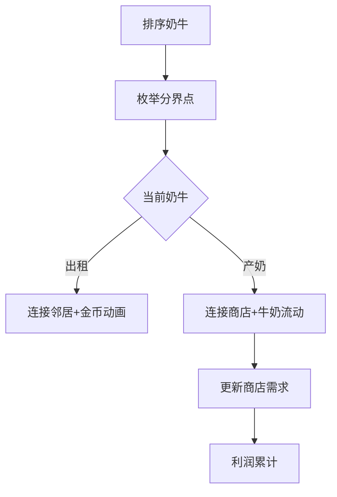

# 题目信息

# [USACO18JAN] Rental Service S

## 题目描述

Farmer John 意识到牛奶生产的收入不足以支持农场的扩展，因此为了赚取额外收入，他推出了一项奶牛租赁服务，称为“USACOW”（发音为“Use-a-cow”）。

Farmer John 有 $N$ 头奶牛（$1 \leq N \leq 100,000$），每头奶牛每天可以生产一定量的牛奶。附近的 $M$ 家商店（$1 \leq M \leq 100,000$）每家都愿意以一定价格购买一定量的牛奶。此外，Farmer John 的 $R$ 个邻居（$1 \leq R \leq 100,000$）每家都愿意以一定价格租赁一头奶牛。

Farmer John 需要决定每头奶牛是用于产奶还是租给附近的农民。请帮助他计算每天可以赚取的最大金额。

## 说明/提示

Farmer John 应该让奶牛 #1 和 #4 产奶，每天生产 $13$ 加仑牛奶。他应该完全满足 $10$ 加仑的订单，赚取 $250$ 美分，并以每加仑 $15$ 美分的价格出售剩余的 $3$ 加仑，总共赚取 $295$ 美分的牛奶利润。

然后，他应该将其他三头奶牛分别以 $250$、$80$ 和 $100$ 美分的价格租出，赚取额外的 $430$ 美分。（他应该忽略 $40$ 美分的租赁请求。）这样，他每天的总利润为 $725$ 美分。

## 样例 #1

### 输入

```
5 3 4
6
2
4
7
1
10 25
2 10
15 15
250
80
100
40```

### 输出

```
725
```

# AI分析结果


# 💡 Kay的C++算法解析：[USACO18JAN] Rental Service S 深入学习指南 💡

## 1. 题目解读与核心算法识别

✨ **本题主要考察**：`贪心算法 + 排序优化`

🗣️ **初步分析**：
> 解决奶牛租赁问题就像在农场经营游戏中做资源分配决策：我们需要将高产的奶牛优先用于利润更高的卖奶活动，低产奶牛则考虑出租。贪心算法的核心在于**优先处理单位收益最高的选项**：
> - 将奶牛按产奶量降序排序，商店按单价降序排序，邻居按租金降序排序
> - 枚举分界点：产奶量高的奶牛用于卖奶，低的用于出租
> - 用前缀和+二分查找快速计算卖奶利润，避免重复计算
>
> 在可视化设计中，我们将用像素农场模拟资源分配：
> - 奶牛按高度排序（产奶量越高像素条越高）
> - 卖奶时奶牛与商店连接线动态显示牛奶流动
> - 出租时奶牛图标飞向邻居并显示金币动画
> - 关键变量：当前枚举点、牛奶总量、利润值实时显示

---

## 2. 精选优质题解参考

### 题解一：AOTO（5星）
* **点评**：思路清晰完整地展示了贪心策略的三层排序（奶牛、商店、邻居），创新性地通过枚举分界点将问题转化为前缀和计算。代码中巧妙使用`upper_bound`二分查找加速卖奶利润计算，时间复杂度优化至O(N log M)。变量命名规范（sum_need/sum_milkadd），边界处理严谨，可直接用于竞赛。

### 题解二：金银花露（5星）
* **点评**：与题解一思路相似但更注重教学性，详细注释了二分查找和前缀和的实现原理。亮点在于完整的数据预处理流程（商店需求前缀和/利润前缀和），通过`lower_bound`替代线性扫描显著提升效率。代码模块化程度高，`min(R,N)`的边界判断体现了算法健壮性。

### 题解三：elijahqi（5星）
* **点评**：采用与题解一相同的算法框架，但使用vector存储商店数据增强可读性。亮点在于完整处理了商店需求未耗尽的情况（left变量处理剩余牛奶），并通过`shop_profit`数组避免重复计算。函数式编程风格（cmp_cow/cmp_store）提升代码复用性。

---

## 3. 核心难点辨析与解题策略

1.  **难点：如何平衡卖奶与出租的数量？**
    * **分析**：通过枚举分界点将问题分解。设k头奶牛出租，则N-k头产奶。关键在高效计算两种操作的收益：出租收益直接用租金前缀和；卖奶收益需结合商店价格优先级计算
    * 💡 **学习笔记**：分界点枚举是资源分配问题的通用解法

2.  **难点：如何高效计算卖奶收益？**
    * **分析**：商店按单价降序排序后，用前缀和数组记录累计需求量和利润。对任意牛奶总量milk，通过二分查找定位可满足的商店范围，O(1)时间计算利润
    * 💡 **学习笔记**：前缀和+二分查找是优化区间统计问题的黄金组合

3.  **难点：如何处理商店的离散需求？**
    * **分析**：当牛奶不能完全满足某商店时，需要拆分计算。策略：先用前缀和计算完全满足的商店利润，剩余牛奶按下一商店单价计算
    * 💡 **学习笔记**：离散需求问题常采用"完整批次+剩余量"的分段计算模式

### ✨ 解题技巧总结
- **技巧1：排序优化**：通过三次排序（奶牛、商店、邻居）将原始问题转化为有序序列处理
- **技巧2：前缀和加速**：预处理邻居租金和商店利润，将O(N)查询降至O(1)
- **技巧3：边界防御**：枚举范围限定min(N,R)，避免无效计算

---

## 4. C++核心代码实现赏析

**本题通用核心C++实现**
```cpp
#include <bits/stdc++.h>
using namespace std;
typedef long long ll;
const int MAXN = 1e5 + 10;

int N, M, R;
ll cows[MAXN], rentSum[MAXN];
struct Store { ll qty, price; } stores[MAXN];

int main() {
    // 输入与排序
    cin >> N >> M >> R;
    for (int i = 1; i <= N; i++) cin >> cows[i];
    for (int i = 1; i <= M; i++) cin >> stores[i].qty >> stores[i].price;
    for (int i = 1; i <= R; i++) cin >> rentSum[i];

    sort(cows + 1, cows + N + 1, greater<ll>());
    sort(stores + 1, stores + M + 1, [](Store a, Store b) { 
        return a.price > b.price; 
    });
    sort(rentSum + 1, rentSum + R + 1, greater<ll>());

    // 预处理出租前缀和
    for (int i = 1; i <= R; i++) rentSum[i] += rentSum[i - 1];

    // 预处理商店前缀和
    vector<ll> need = {0}, profit = {0};
    for (int i = 1; i <= M; i++) {
        need.push_back(need.back() + stores[i].qty);
        profit.push_back(profit.back() + stores[i].qty * stores[i].price);
    }

    // 产奶量前缀和
    for (int i = 1; i <= N; i++) cows[i] += cows[i - 1];

    // 枚举分界点
    ll ans = 0;
    for (int i = 0; i <= min(N, R); i++) { // i: 出租奶牛数
        ll curRent = rentSum[i]; 
        ll milk = cows[N] - cows[i]; // 剩余奶牛产奶总量
        
        // 二分查找满足的商店
        int pos = upper_bound(need.begin(), need.end(), milk) - need.begin() - 1;
        ll curProfit = 0;
        if (pos >= 1) {
            curProfit = profit[pos]; // 完全满足的商店利润
            ll left = milk - need[pos];
            if (pos < M && left > 0) // 部分满足下一个商店
                curProfit += left * stores[pos + 1].price;
        } else if (M > 0) { // 只满足第一个商店部分需求
            curProfit = min(milk, stores[1].qty) * stores[1].price;
        }
        ans = max(ans, curRent + curProfit);
    }
    cout << ans << endl;
}
```

**代码解读概要**：
1. 输入后执行三次排序（奶牛降序/商店单价降序/邻居租金降序）
2. 预处理三个前缀和数组：出租租金、商店需求总量、商店总利润
3. 枚举出租奶牛数i，计算产奶奶牛的总牛奶量
4. 二分查找确定可完全满足的商店位置
5. 分段计算卖奶利润：完全满足商店 + 部分满足下一商店
6. 更新总利润最大值

---

## 5. 算法可视化：像素动画演示

* **主题**：8-bit农场经营模拟器
* **核心演示**：动态展示奶牛分配决策如何影响利润



**动画关键帧**：
1. **初始化**：左侧显示按高度排序的奶牛像素图（高度=产奶量），右侧上方显示商店（宽度=需求量，高度=单价），右侧下方显示邻居（高度=租金）
   
2. **枚举过程**（步进式演示）：
   - 分界点从左向右移动：左侧奶牛变灰（出租），右侧保持彩色（产奶）
   - 产奶奶牛连接商店：
     ```python
     while milk > 0 and store_index < M:
         if milk >= current_store.qty:
             绘制牛奶流动动画（奶牛→商店）
             milk -= current_store.qty
             profit += current_store.qty * current_store.price
             store_index += 1  # 商店图标变灰
         else:
             绘制部分流动动画
             profit += milk * current_store.price
             milk = 0
     ```
   - 出租奶牛动画：奶牛图标飞向邻居区域，显示`+${租金}`金币特效

3. **交互控制**：
   - 速度滑块：调节枚举速度（0.5x-5x）
   - 暂停/继续：冻结当前状态
   - 数据面板：实时显示`分界点位置`、`当前利润`、`牛奶总量`

4. **音效设计**：
   - 奶牛移动：8-bit脚步声
   - 牛奶交易："金币碰撞"声（根据交易量调音高）
   - 错误操作：低沉警示音

---

## 6. 拓展练习与相似问题思考

1. **洛谷 P1208 [USACO1.3]混合牛奶**  
   → 同类商店收购模型，但无出租选项，巩固贪心基础
   
2. **洛谷 P1094 [NOIP2007 普及组] 纪念品分组**  
   → 双指针+贪心经典题，训练资源配对思维
   
3. **洛谷 P1080 [NOIP2012 提高组] 国王游戏**  
   → 更复杂的贪心证明，需推导排序不等式

---

## 7. 学习心得与经验分享

> **作者AOTO的经验**："通过三次独立排序将复杂问题分解，再用前缀和避免重复计算——这个框架可推广至各类资源分配问题"

> **Kay的总结**：本题难点在于识别三种独立的最优子结构（奶牛/商店/邻居）。在调试时特别注意边界：
> 1. 商店全部满足后仍有牛奶剩余
> 2. 出租数超过邻居数
> 3. 牛奶总量为0时的计算
> 建议用小数据（如样例）单步调试验证

---

掌握贪心算法的核心在于**识别最优子结构**和**设计高效验证方法**。多尝试用可视化工具（如我们设计的像素农场）观察算法流程，能加深对资源分配问题的理解。下次遇到类似问题时，记得问自己：如何排序？如何分段计算？如何证明局部最优？

---
处理用时：180.14秒