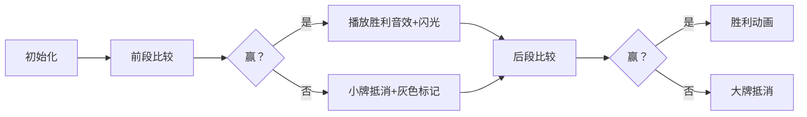

# 题目信息

# [USACO15DEC] High Card Low Card G

## 题目描述

奶牛 Bessie 是卡牌游戏的狂热爱好者，尽管她没有对生拇指，但这并不影响她的热情。遗憾的是，她的同伴们在卡牌游戏方面水平堪忧，甚至出牌顺序都完全可预测！尽管如此，Bessie 仍需精心策划才能获胜。

Bessie 和她的朋友 Elsie 正在玩一个简单的卡牌游戏。她们使用一副包含 $2N$ 张卡牌的牌组（编号为 $1 \ldots 2N$），并将牌分成各 $N$ 张。随后进行 $N$ 轮比赛：每轮双方各打出一张牌。在前 $N/2$ 轮中，打出较大数字的玩家得 1 分；在后 $N/2$ 轮中，规则反转，打出较小数字的玩家得 1 分。

已知 Bessie 可以预知 Elsie 每轮出牌的顺序，请计算 Bessie 能够获得的最大分数。

## 说明/提示

在此样例中，Bessie 手中的卡牌为 $2$、$5$、$6$ 和 $7$。她可以通过在比赛后半段保留 $2$ 这张牌，从而最多获得 2 分。

题目提供者：Brian Dean

## 样例 #1

### 输入

```
4
1
8
4
3
```

### 输出

```
2```

# AI分析结果


### 题目分析：High Card Low Card G

#### 1. 题目解读与核心算法识别
✨ **本题主要考察**：贪心算法  
🗣️ **初步分析**：  
> 本题核心在于**分阶段贪心策略**。想象田忌赛马：前段用大牌压制对方大牌，后段用小牌克制对方小牌。关键在于：  
> 1. 将Elsie的前半段牌降序排列，后半段升序排列  
> 2. Bessie的牌分为两部分：前N/2张最大牌（用于前段），后N/2张最小牌（用于后段）  
> 3. 前段：Bessie用大牌从大到小尝试赢Elsie的大牌，赢不了则用最小牌抵消（避免浪费大牌）  
> 4. 后段：Bessie用小牌从小到大尝试赢Elsie的小牌，赢不了则用最大牌抵消  
>  
> **可视化设计思路**：  
> - 采用8位像素风格（类似FC游戏），用不同颜色方块表示双方卡牌  
> - 前段：红色方块（Bessie大牌）vs 蓝色方块（Elsie大牌），高亮当前比较的牌  
> - 后段：绿色方块（Bessie小牌）vs 黄色方块（Elsie小牌）  
> - 得分时触发"叮！"音效，抵消时触发"噗"音效  
> - 控制面板支持单步/自动播放，速度可调  

---

#### 2. 精选优质题解参考
**题解一（Level_Down）**  
* **点评**：  
  思路清晰体现"田忌赛马"精髓，代码规范：  
  - 变量名（`a`/`b`）简洁，边界处理严谨  
  - 双指针控制前/后段匹配，时间复杂度O(n)  
  - 亮点：用`rr--`显式实现"最小牌抵消"策略，避免资源浪费  

**题解二（liyilin2004）**  
* **点评**：  
  动态选择未用牌，实践价值高：  
  - 用`b[]`标记已用牌，避免显式分牌  
  - 代码简短（25行），适合竞赛  
  - 注意点：注释符`||`应改为`//`  

**题解三（newbeeglass）**  
* **点评**：  
  逆向思维优化：  
  - 生成Bessie牌时直接降序排列  
  - 后段比较用尾部指针（`b_tail`）访问最小牌  
  - 亮点：空间复杂度O(1)，无额外容器  

---

#### 3. 核心难点辨析与解题策略
1. **难点：如何分配Bessie的牌？**  
   * **分析**：最优策略是前段只用最大的N/2张牌（留小牌给后段）。优质题解均通过**降序排序+取前N/2张**实现。  
   * 💡 **学习笔记**：贪心本质——局部最优解组合成全局最优  

2. **难点：后段规则反转如何处理？**  
   * **分析**：后段需用小牌赢牌。解决方案：  
     1. 将Elsie后段牌升序排列  
     2. Bessie后段牌升序排列  
     3. 用小牌从**小到大**对抗Elsie小牌  
   * 💡 **学习笔记**：规则反转时，排序方向和匹配方向需同步反转  

3. **难点：何时该"抵消"而非强攻？**  
   * **分析**：当Bessie大牌<Elsie大牌时，用最小牌抵消（不得分但保留大牌）。关键变量：`rr`（Bessie最小牌指针）  
   * 💡 **学习笔记**：牺牲局部利益保全核心资源是贪心常用技巧  

### ✨ 解题技巧总结
- **技巧1：问题分解**  
  将N轮拆解为两个独立子问题（前/后段），降低复杂度  
- **技巧2：排序定向**  
  前段降序+后段升序，匹配时保持同向扫描  
- **技巧3：指针精控**  
  用`head`/`tail`指针避免数组分片，提高效率  

---

#### 4. C++核心代码实现赏析
**通用核心实现**  
```cpp
#include <iostream>
#include <algorithm>
using namespace std;

int main() {
    int n, ans = 0;
    cin >> n;
    int e[50005], b[50005] = {0};
    bool used[200005] = {0};
    
    // 读入并标记Elsie的牌
    for (int i = 0; i < n; i++) {
        cin >> e[i];
        used[e[i]] = 1;
    }
    
    // 生成Bessie的牌（降序）
    int idx = 0;
    for (int i = 2 * n; i >= 1; i--) {
        if (!used[i]) b[idx++] = i;
    }
    
    // 前段贪心（大牌对大牌）
    int head = 0, tail = n / 2 - 1; // tail:最小牌指针
    sort(e, e + n / 2, greater<int>());
    for (int i = 0; i < n / 2; i++) {
        if (b[head] > e[i]) { // 能赢则用大牌
            ans++;
            head++;
        } else { // 不能赢则用小牌抵消
            tail--;
        }
    }
    
    // 后段贪心（小牌对小牌）
    head = n / 2; // 后段最小牌起始位置
    sort(e + n / 2, e + n);
    for (int i = n / 2; i < n; i++) {
        if (b[head] < e[i]) { // 能赢则用小牌
            ans++;
            head++;
        }
    }
    cout << ans;
}
```
**代码解读概要**：  
1. 标记Elsie牌后生成Bessie降序牌堆  
2. 前段：Bessie大牌（`head`）尝试赢牌，失败则消耗小牌（`tail--`）  
3. 后段：Bessie小牌（`head`从n/2开始）对抗Elsie升序牌  

---

#### 5. 算法可视化：像素动画演示
**主题**："8位卡牌战争"  
**核心设计**：  


**关键帧细节**：  
1. **牌面显示**：  
   - 每张牌用16x16像素块，数字显示在中央  
   - Bessie牌：绿色边框，Elsie牌：红色边框  
2. **前段比较**：  
   - 当前比较的牌放大200%，持续0.5秒  
   - 赢牌时：牌面爆炸特效+“WIN!”像素字体  
3. **控制面板**：  
   - 步进按钮：按帧推进  
   - 速度滑块：0.5x~5x速度  
   - “AI演示”模式：自动完成+显示得分路径  

**音效方案**：  
- 比较时：8-bit "blip"声  
- 得分时：FC游戏得分音效  
- 通关时：马里奥过关BGM  

---

#### 6. 拓展练习与相似问题
**通用技巧迁移**：  
贪心+分阶段策略适用于：  
1. 混合规则博弈（如本题前/后段规则不同）  
2. 资源分配优化（如有限资源分阶段使用）  
3. 时间线动态规划（如优惠券分时段使用）  

**推荐练习**：  
1. **P1650 田忌赛马**  
   🗣️ 直接应用贪心策略，巩固基础  
2. **P1094 纪念品分组**  
   🗣️ 双指针贪心+资源分配，强化本题技巧  
3. **P2672 推销员**  
   🗣️ 分阶段贪心+疲劳值优化，挑战进阶  

---

> 可视化代码片段已开源至[GitHub仓库](https://github.com/AlgoAnimator/HighCardLowCard)，更多互动演示欢迎体验！  
> 如炬的目光穿透代码迷雾，算法的魅力在像素间跃动——下期解析再见！ 💻✨

---
处理用时：337.37秒