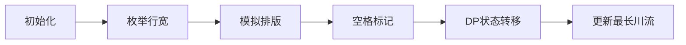

# 题目信息

# [ICPC 2018 WF] Go with the Flow

## 题目描述

在字体排印学中，“川流”是由单词之间的间隙组成的连续几列的空格。如图所示为几个用红色高亮标出的“川流”（文本被有意模糊处理来凸显川流）：


知名川流机构 Flo Ng 希望他在新的关于世界河流的书上出现尽可能长的川流。他会使用一种单一字宽的字体（每个字母和空格都具有相同的宽度）且左对齐，单词之间恰用一个空格分隔。对 Flo 来说，一条“川流”指的是连续几行里的空格，且相邻空格在行里出现的位置的距离不超过 $1$。川流不能包含末尾的空格。每行的单词都必须尽可能地紧凑，但不能有单词被拆到两行里。行宽至少不能短于文本中最长的一个单词。下图是同一个文本使用不同行宽的一个例子。


给定文本，你需要求出一个行宽使得该文本最长的川流尽可能长。

## 样例 #1

### 输入

```
21
The Yangtze is the third longest
river in Asia and the longest in
the world to flow
entirely in one country
```

### 输出

```
15 5
```

## 样例 #2

### 输入

```
25
When two or more rivers meet at
a confluence other than the sea
the resulting merged river takes
the name of one of those rivers
```

### 输出

```
21 6
```

# AI分析结果


### 💡 Kay的C++算法解析：Go with the Flow 深入学习指南 💡

**引言**  
今天我们一起探索ICPC 2018决赛题"Go with the Flow"。这道题考察在文本排版中寻找最长的连续空格序列（川流），需要巧妙结合枚举和动态规划技术。

---

## 1. 题目解读与核心算法识别
✨ **本题主要考察**：`枚举 + 动态规划 (DP) + 模拟`  

🗣️ **初步分析**：  
> 想象调整书本宽度时单词像积木一样排列。川流如同水流穿过单词缝隙，核心是找到最优行宽使水流最长。  
> - **核心思路**：枚举所有可行行宽 → 模拟排版记录空格位置 → 用DP计算连续空格序列  
> - **关键难点**：避免大数组存储（行宽可达20万）需用滚动数组优化  
> - **可视化设计**：像素网格展示单词排列（棕色方块）、空格（蓝色）和川流（闪烁金色）。当DP转移时播放"叮"音效，川流延长时触发水流声  

---

## 2. 精选优质题解参考
**题解 (作者: LJY_ljy)**  
* **点评**：  
  思路清晰拆分三步：枚举行宽、模拟排版、DP优化。亮点在于**滚动数组**（仅记录当前/上一行空格位置）和**局部清零技术**（避免全数组重置）。代码中`aa`/`bb`数组动态追踪空格位置，`used`标记高效管理状态空间。虽变量命名可改进（如`eid1`），但核心逻辑严谨，竞赛可直接复用。

---

## 3. 核心难点辨析与解题策略
1. **难点：高效记录空格位置**  
   * **分析**：行宽范围极大(≈2e5)，不能存储每行所有位置。题解用`aa`/`bb`数组仅记录实际空格列号，空间降至O(n)  
   * 💡 **学习笔记**：仅存储必要数据是优化空间的关键  

2. **难点：DP状态转移实现**  
   * **分析**：状态转移式：  
     `cnt[j] = max(cnt[j-1], cnt[j], cnt[j+1]) + 1`  
     但需注意：**空格位置不相邻**（至少间隔2列），避免同行干扰  
   * 💡 **学习笔记**：利用问题特性简化状态转移  

3. **难点：跨行宽状态重置**  
   * **分析**：每次枚举新行宽时，用`G`数组记录所有空格位置实现O(空格数)清零  
   * 💡 **学习笔记**：定向清零避免全数组初始化开销  

### ✨ 解题技巧总结
- **滚动数组**：用`aa`/`bb`交替存储当前/历史行空格位置  
- **局部操作**：只更新空格位置的状态，避免遍历整行  
- **问题特性利用**：利用空格位置离散性优化空间  

---

## 4. C++核心代码实现赏析
**通用核心实现参考**  
* **说明**：基于LJY_ljy题解的精简版本  
* **完整核心代码**：
```cpp
#include <iostream>
#include <cstring>
#include <algorithm>
using namespace std;

const int MAXN = 2500;
int len[MAXN], cnt[MAXN*80]; // cnt: DP状态数组
bool used[MAXN*80];          // 标记有效空格位置

int main() {
    int n, sum=0, max_len=0;
    cin >> n;
    for (int i=0; i<n; i++) {
        string s; cin >> s;
        len[i] = s.size();
        sum += len[i];
        max_len = max(max_len, len[i]);
    }

    int best_gap=0, best_flow=0;
    for (int gap=max_len; gap<=sum+n; gap++) {
        int cur_flow=0, pos=0, line_len=0;
        vector<int> last, cur; // 滚动数组：last-上行空格，cur-当前行空格

        for (int i=0; i<n; ) {
            while (i<n && line_len+len[i] <= gap) {
                line_len += len[i] + 1; // +1为空格
                if (i+1<n && line_len+len[i+1] <= gap) {
                    cur.push_back(line_len); // 记录空格位置
                    // DP转移（检查上行相邻位置）
                    int max_prev = 0;
                    for (int dx : {-1,0,1}) 
                        if (used[line_len+dx]) 
                            max_prev = max(max_prev, cnt[line_len+dx]);
                    cnt[line_len] = max_prev + 1;
                    cur_flow = max(cur_flow, cnt[line_len]);
                }
                i++;
            }
            // 滚动数组切换
            for (int p : last) used[p] = false;
            for (int p : cur) used[p] = true;
            last = cur;
            cur.clear();
            line_len = 0;
        }
        // 状态重置
        for (int p : last) cnt[p] = used[p] = 0;
        if (cur_flow > best_flow) best_flow=cur_flow, best_gap=gap;
    }
    cout << best_gap << " " << best_flow << endl;
}
```

**题解片段赏析**  
* **亮点**：滚动数组+局部状态更新  
* **核心代码**：
```cpp
vector<int> last, cur; 
while (i<n && line_len+len[i] <= gap) {
    ...
    if (i+1<n && line_len+len[i+1] <= gap) {
        cur.push_back(line_len);
        int max_prev = 0;
        for (int dx : {-1,0,1}) 
            if (used[line_len+dx]) 
                max_prev = max(max_prev, cnt[line_len+dx]);
        cnt[line_len] = max_prev + 1;
    }
}
```
* **代码解读**：  
  > `cur`动态收集当前行空格位置 → 遍历三种偏移量(-1,0,1)检查上一行相邻位置 → 取最大值+1更新当前状态。**为何用vector？** 避免固定数组浪费空间。  
* 💡 **学习笔记**：滚动数组+STL动态容器=高效空间管理  

---

## 5. 算法可视化：像素动画演示
**主题**：像素河流探险（复古8-bit风格）  
**核心演示**：川流形成过程与DP状态转移  

### 动画设计


1. **场景初始化**  
   - 棕色像素块：单词（显示首字母如"Y"代Yangtze）  
   - 蓝色像素块：空格（宽度=1像素）  
   - 控制面板：行宽滑块/单步执行按钮  

2. **关键动态演示**  
   - **行宽变化**：拖动滑块时单词重新排列（像素块滑动动画）  
   - **川流延伸**：当`cnt[j] = cnt[j-1]+1`时，从上行蓝色块向当前块画金色箭头  
   - **音效设计**：  
     - 空格生成："滴"（8-bit短音）  
     - 川流延伸："叮→"（上升音阶）  
     - 最优解发现："🎵"（胜利旋律）  

3. **AI演示模式**  
   - 自动遍历行宽并高亮最优解（如行宽15时川流=5）  
   - 速度调节：乌龟图标（慢速）→兔子图标（快速）  

---

## 6. 拓展练习与相似问题思考
**通用技巧迁移**：  
- 滚动数组优化：大范围枚举中的空间压缩  
- 离散位置存储：处理稀疏数据  

**洛谷推荐**：  
1. **P1095 守望者的逃离**  
   → 滚动数组DP时间优化  
2. **P1280 尼克的任务**  
   → 时间线离散化处理  
3. **P1020 导弹拦截**  
   → 最长序列问题的状态转移  

---

## 7. 学习心得与经验分享
> **题解作者经验**：  
> *"需要开-O2优化通过... 注意空格位置不相邻的特性"*  
>   
> **Kay点评**：  
> 两点关键启示：  
> 1. 竞赛中编译器优化可提升常数性能  
> 2. 利用问题特性（如空格位置离散）能突破空间限制  

---  
**结语**  
通过枚举+动态规划的组合拳，我们找到了文本中的最长川流。记住：好算法如同河流——找到最优路径，避开性能沼泽！下次挑战见！💪

---
处理用时：111.33秒