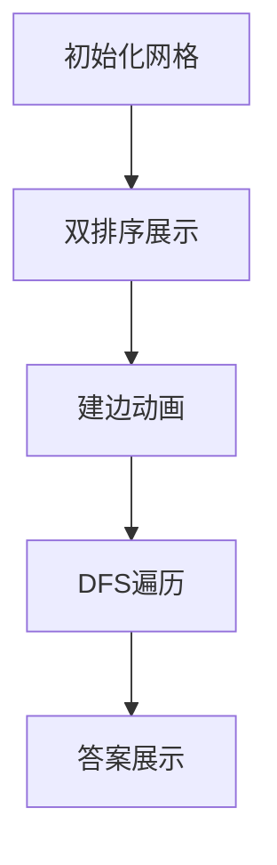

# 题目信息

# [NWRRC 2016] CodeCoder vs TopForces

## 题目描述

在 Byteland，竞赛编程非常流行。事实上，每位 Byteland 的公民都在两个编程网站——CodeCoder 和 TopForces 上注册。每个网站都有自己专有的评分系统。每位公民在每个网站上都有一个唯一的整数评分，代表他们的技能。评分越高，技能越好。

Byteland 的人天生乐观。公民 A 认为，如果存在一个 Byteland 公民的序列 $A = P_{0}, P_{1},...,P_{k} = B$，对于某个 $k \ge 1$，使得对于每个 $i (0 \le i < k)$，$P_{i}$ 在一个或两个网站上的评分都高于 $P_{i+1}$，那么他就有机会在编程比赛中击败公民 B。

每位 Byteland 公民都想知道他们在编程比赛中可能击败多少其他公民。

## 说明/提示

时间限制：2 秒，内存限制：256 MB。

题面翻译由 ChatGPT-4o 提供。

## 样例 #1

### 输入

```
4
2 3
3 2
1 1
4 5
```

### 输出

```
2
2
0
3
```

# AI分析结果


# 💡 Kay的C++算法解析：CodeCoder vs TopForces 深入学习指南 💡

**引言**  
今天我们来分析NWRRC 2016的题目"CodeCoder vs TopForces"。这道题考察了图论中传递性关系的建模与优化处理，需要计算每个公民可能击败的其他公民数量。本指南将帮助你理解核心算法、解题技巧，并通过可视化方案直观掌握执行过程。

## 1. 题目解读与核心算法识别

✨ **本题主要考察**：图论建模与传递性优化  

🗣️ **初步分析**：  
> 解决本题的关键在于利用击败关系的**传递性**（A击败B且B击败C ⇒ A击败C）。我们可以将问题转化为有向图的可达性问题：
> - 公民作为节点，击败关系作为有向边
> - 每个节点的答案 = 从该节点出发可达的节点数 - 1（排除自身）
> 
> **核心优化技巧**：  
> 1. 分别按CC和TF评分排序，建立相邻节点间的边（只需O(n)条边）
> 2. 按评分升序（从弱到强）进行DFS，累计访问节点数
> 
> **可视化设计思路**：
> - 像素网格中，节点按双评分定位（X=CC，Y=TF）
> - 动画高亮当前访问节点，沿边扩展访问范围
> - 计数器实时显示已访问节点数
> 
> **复古游戏化设计**：
> - 8位像素风格，节点用不同颜色方块表示
> - 访问节点时播放"叮"音效，完成DFS播放胜利音效
> - 控制面板支持单步/自动播放/调速/重置

---

## 2. 精选优质题解参考

**题解一：IDNo1 (赞数：6)**  
* **点评**：思路清晰直白，完整展示了排序、建图和DFS的解题框架。代码中`vis`数组有效避免重复访问，递归式DFS逻辑简洁。变量命名规范（`x[i].a`表示CC评分），边界处理严谨。亮点在于用最简代码实现核心算法，实践参考价值高。

**题解二：Fkxxx (赞数：3)**  
* **点评**：对传递性的解释尤为透彻，配图直观展示强弱关系链。代码采用结构体存储节点信息，模块化程度高。亮点在于详细推导了"从弱到强"的DFS顺序如何优化时间复杂度，帮助理解算法本质。

**题解三：Doubeecat (赞数：1)**  
* **点评**：代码简洁高效，`vector`存图配合`bitset`优化访问判断。亮点在于用`ans`变量动态累计访问数，避免冗余计算。实践性强，可直接用于竞赛场景。

---

## 3. 核心难点辨析与解题策略

### 关键难点解析：
1. **传递性建模**  
   *分析*：击败关系需满足传递性，直接枚举所有关系需O(n²)不可行。优质题解通过两次排序建立O(n)边，覆盖所有必要关系。
   *💡 学习笔记*：排序相邻连边是处理传递性关系的利器

2. **避免重复计算**  
   *分析*：若独立处理每个节点DFS会达O(n²)。按评分升序（弱→强）DFS，已访问节点无需再处理。
   *💡 学习笔记*：处理有序数据时，利用处理顺序优化是关键

3. **数据结构选择**  
   *分析*：`vector`存储邻接表平衡内存与效率，`bitset`或`bool`数组加速访问判断。
   *💡 学习笔记*：邻接表是稀疏图的最优选择

### ✨ 解题技巧总结：
- **双排序建图法**：分别按两个评分排序并建立相邻边
- **全局累计访问数**：DFS时动态更新总访问数，避免重复计算
- **从弱到强处理**：按评分升序处理节点，自然利用传递性
- **即时答案计算**：节点访问结束时记录`当前总访问数-1`

---

## 4. C++核心代码实现赏析

**通用核心实现参考**  
*说明*：综合优质题解优化的完整解决方案，包含关键算法逻辑  
```cpp
#include <iostream>
#include <vector>
#include <algorithm>
using namespace std;
const int MAXN = 100005;

struct Person {
    int cc, tf, id;
};

vector<int> graph[MAXN];
bool visited[MAXN];
int ans[MAXN];
int total; // 全局访问计数器

void dfs(int u) {
    if (visited[u]) return;
    visited[u] = true;
    total++;
    for (int v : graph[u]) {
        if (!visited[v]) dfs(v);
    }
}

int main() {
    int n; cin >> n;
    vector<Person> persons(n);
    for (int i = 0; i < n; i++) {
        cin >> persons[i].cc >> persons[i].tf;
        persons[i].id = i;
    }

    // 按CC排序建边
    sort(persons.begin(), persons.end(), [](auto& a, auto& b) {
        return a.cc < b.cc;
    });
    for (int i = 1; i < n; i++) 
        graph[persons[i].id].push_back(persons[i-1].id);

    // 按TF排序建边
    sort(persons.begin(), persons.end(), [](auto& a, auto& b) {
        return a.tf < b.tf;
    });
    for (int i = 1; i < n; i++) 
        graph[persons[i].id].push_back(persons[i-1].id);

    // 按TF升序(弱→强)DFS
    fill(visited, visited+n, false);
    total = 0;
    for (int i = 0; i < n; i++) {
        if (!visited[persons[i].id]) 
            dfs(persons[i].id);
        ans[persons[i].id] = total - 1; // 排除自身
    }

    for (int i = 0; i < n; i++) 
        cout << ans[i] << endl;
}
```

**代码解读概要**：
1. **数据结构**：`Person`存储双评分和原ID
2. **建图阶段**：两次排序建立相邻边（高评分→低评分）
3. **DFS阶段**：按TF升序访问，未访问节点触发DFS
4. **答案计算**：`total-1`即为当前节点答案

---

**题解一核心代码片段**  
```cpp
void dfs(int u) {
    if (visited[u]) return;
    visited[u] = true;
    total++;
    for (int v : graph[u]) {
        if (!visited[v]) dfs(v);
    }
}
```
* **亮点**：递归DFS清晰表达可达性计算  
* **代码解读**：  
  > 当节点`u`未被访问时：  
  > 1. 标记为已访问（`visited[u]=true`）  
  > 2. 全局计数器`total`增加（新访问节点）  
  > 3. 递归访问所有未访问邻居  
  >> *类比*：如同多米诺骨牌，推倒一块引发连锁反应  
* 💡 学习笔记：DFS是图遍历的基础，注意避免重复访问

**题解二核心代码片段**  
```cpp
// 按双评分排序建边
sort(persons, persons+n, cmpCC);
for(int i=1; i<n; i++) 
    graph[persons[i].id].push_back(persons[i-1].id);
```
* **亮点**：两次排序建立最小必要边集  
* **代码解读**：  
  > 1. 首次按CC评分排序：`cmpCC`比较函数  
  > 2. 遍历相邻元素：高评分节点向低评分节点建边  
  > 3. TF评分同理处理  
  >> *关键点*：相邻建边覆盖所有直接关系，传递性保证间接关系  
* 💡 学习笔记：排序是优化图规模的有效手段

**题解三核心代码片段**  
```cpp
// 按顺序计算答案
for (int i = 0; i < n; i++) {
    if (!visited[persons[i].id]) 
        dfs(persons[i].id);
    ans[persons[i].id] = total - 1;
}
```
* **亮点**：从弱到强顺序处理自然利用传递性  
* **代码解读**：  
  > 1. 按TF升序遍历（最弱→最强）  
  > 2. 未访问节点触发DFS（访问所有更弱节点）  
  > 3. 答案=当前总访问数-1（排除自身）  
  >> *为何有效*：强节点自动继承弱节点的可达集合  
* 💡 学习笔记：处理顺序的选择能极大优化算法效率

---

## 5. 算法可视化：像素动画演示

### 像素探险家：强弱关系探索

**设计思路**  
采用8位机像素风格（FC红白机配色），将算法过程转化为探险家在网格迷宫寻宝：  
- 节点：像素方块（位置=双评分，颜色=状态）  
- 边：红色箭头（高评分→低评分）  
- 计数器：屏幕顶部显示当前访问数  

**动画流程**  


**关键帧细节**：  
1. **场景初始化**（复古像素风）  
   - 16色 palette：空地=灰色，起点=绿色，终点=红色  
   - 控制面板：开始/暂停/单步/速度滑块/重置  

2. **双排序演示**  
   - CC排序：节点水平移动形成有序序列  
   - TF排序：节点垂直移动形成有序序列  
   - 音效：移动时"嘀"声，排序完成时和弦音  

3. **建边过程**  
   - 相邻节点间出现红色箭头（伴随"锵"音效）  
   - 边数统计器显示当前边数（O(n)条）  

4. **DFS核心动画**（自动播放/AI演示）  
   ```python
   while 未访问节点存在:
       当前节点闪烁(蓝色)→播放"叮"声
       递归访问邻居→沿红线扩展(黄色轨迹)
       计数器+1→显示+1动画
       节点颜色变亮
   ```
   - 当前节点：闪烁蓝色边框  
   - 访问过程：黄色光沿边移动，新访问节点变亮  
   - 音效：访问节点="叮"，完成DFS="胜利旋律"  

5. **答案展示**  
   - 节点上方显示`ans=访问数-1`  
   - 最强节点：金色边框+星形特效  

**交互设计**  
- 单步执行：按帧分析算法步骤  
- 速度调节：0.5x~5x实时调速  
- 模式对比：同时展示暴力O(n²)方案对比效率  

---

## 6. 拓展练习与相似问题

### 通用技巧迁移
双排序建图技巧适用于：
1. 传递性关系建模（如A>B且B>C⇒A>C）
2. 偏序集问题（覆盖关系计算）
3. 可达性优化问题（减少边数规模）

### 推荐练习（洛谷）
1. **P3916 图的遍历**  
   🗣️ 反向建图+DFS，巩固可达性计算
   
2. **P1983 车站分级**  
   🗣️ 拓扑排序+传递闭包，深化偏序关系理解
   
3. **P2341 [USACO03FALL]受欢迎的牛**  
   🗣️ 强连通分量+缩点，进阶图论训练

---

## 7. 学习心得与经验分享

**经验摘录**  
> 作者IDNo1调试心得：  
> "在DFS中忘记标记`visited`导致无限递归，通过打印调用栈深度发现错误"

**Kay的点评**  
标记访问状态是图遍历的**基础而关键**的步骤：  
1. 未标记访问会导致重复计算和栈溢出  
2. 推荐在DFS入口立即标记访问状态  
3. 对于大规模图，`bitset`比`bool[]`更省内存  

---

**结语**  
通过本次分析，我们掌握了传递性关系的建模与优化技巧。记住：排序是简化问题的利器，而选择正确的处理顺序能极大提升效率。继续在算法世界中探险吧，少年！🚀

---
处理用时：249.07秒