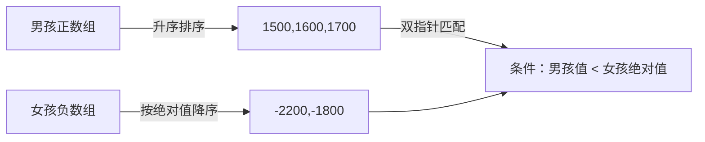
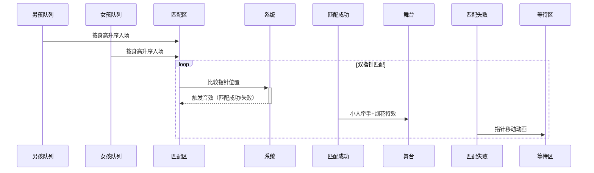

# 题目信息

# [COCI 2011/2012 #1] PLES

## 题目描述

舞会上有 $N$ 个男孩和 $N$ 个女孩，我们知道他们的身高。规定每个人最多只能和一个舞伴跳舞。

每个男孩要么想和比他高的女孩跳舞，要么想和比他矮的女孩跳舞。类似地，每个女孩要么想和比她高的男孩跳舞，要么想和比她矮的男孩跳舞。没有同样高的男孩和女孩想和对方跳舞。

求如果遵照每个人的意愿，最大的舞伴对数是多少。

## 说明/提示

#### 【数据范围】

对于 $100\%$ 的数据，$1 \le N \le 10^5$，$1500 \le |A_i,B_j| \le 2500$。

#### 【说明】

本题分值按 COCI 原题设置，满分 $110$。

题目译自 **[COCI2011-2012](https://hsin.hr/coci/archive/2011_2012/) [CONTEST #1](https://hsin.hr/coci/archive/2011_2012/contest1_tasks.pdf)** ___T4 PLES___。

## 样例 #1

### 输入

```
1
-1800
1800```

### 输出

```
0```

## 样例 #2

### 输入

```
1
1700
-1800```

### 输出

```
1```

## 样例 #3

### 输入

```
2
-1800 -2200
1900 1700```

### 输出

```
2```

# AI分析结果


### Kay的C++算法解析：PLES 深入学习指南 💡

**题目解读**  
本题考察**贪心算法与双指针技巧**，核心在于将男女按意愿分组后排序，通过双指针贪心匹配舞伴。关键在于理解身高比较的方向和匹配条件：  
- 男孩身高正负代表期望舞伴身高方向（正数：期望更高女孩；负数：期望更矮女孩）  
- 需严格满足双方期望（不能身高相等）  

#### 算法分类
**贪心策略**：将问题分解为两组独立匹配：  
1. 男孩想与高个女孩配对（男孩身高正） vs 女孩想与矮个男孩配对（女孩身高负）  
2. 男孩想与矮个女孩配对（男孩身高负） vs 女孩想与高个男孩配对（女孩身高正）  

**排序关键**：四组数据分别按绝对值升序排序，确保双指针贪心的正确性。

---

### 精选优质题解参考

#### 题解一：kkxacj（⭐⭐⭐⭐⭐）
**亮点**：  
- 分组清晰（四数组分离），排序处理巧妙（负数数组逆序排）  
- 双指针匹配逻辑简洁高效，时间复杂度O(n)  
- 边界处理严谨（指针越界检查）  
```cpp
// 核心分组逻辑
if(x < 0) a[++o] = x;  // 男孩负数组
else b[++oo] = x;      // 男孩正数组

// 逆序排序负数数组（保证绝对值升序）
sort(a + 1, a + 1 + o, cmp);  // cmp为逆序
sort(c + 1, c + 1 + ooo, cmp); 
```

#### 题解二：Kobe_BeanBryant（⭐⭐⭐⭐）
**亮点**：  
- 使用vector分组，代码更简洁  
- match函数封装复用，降低冗余  
- 倒序双指针匹配（从最大值开始匹配）  
```cpp
// 复用匹配函数
void match(vector<int> &l, vector<int> &h) {
    for (int i = l.size()-1, j=h.size()-1; i>=0; --i,--j,++M) {
        while (j>=0 && h[j] >= l[i]) j--; // 跳过不满足条件的
    }
}
```

#### 题解三：_Spectator_（⭐⭐⭐⭐）
**亮点**：  
- 结构体分类存储正负状态，增强可读性  
- 自定义排序函数处理正负数混合排序  
- 单次循环双指针同步移动，效率高  
```cpp
// 自定义排序：负数逆序，正数升序
bool cmp1(node a, node b) {
    if(a<0 && b<0) return a>b;
    return a<b;
}
```

---

### 核心难点辨析与解题策略

1. **数据分组与符号处理**  
   - 难点：正负号同时表示期望方向和实际身高  
   - 解决：用绝对值存储身高，单独记录期望方向（正/负分组）

2. **贪心排序策略选择**  
   - 难点：不同组别需要不同排序方向  
   - 解决：  
     - 正数组直接升序排序（1500, 1600, 1700）  
     - 负数组按绝对值**降序排序**（等价绝对值升序：|-2200|>|-1800| → 排序后[-2200, -1800]）

3. **双指针匹配条件**  
   - 难点：两组匹配条件不同（> 和 <）  
   - 解决：  
     - 组1：男孩正数数组 vs 女孩负数组 → 条件：`男孩身高 < 女孩|身高|`  
     - 组2：男孩|负数组| vs 女孩正数组 → 条件：`男孩|身高| > 女孩身高`  



---

### C++核心代码实现赏析

#### 通用核心实现（综合优质题解）
```cpp
#include <iostream>
#include <vector>
#include <algorithm>
using namespace std;

int main() {
    int n, ans = 0;
    cin >> n;
    vector<int> boy_high, boy_low_abs;
    vector<int> girl_high, girl_low_abs;

    // 分组存储（负数转绝对值）
    for (int i=0; i<n; ++i) {
        int x; cin >> x;
        if (x > 0) boy_high.push_back(x);
        else boy_low_abs.push_back(-x);
    }
    for (int i=0; i<n; ++i) {
        int x; cin >> x;
        if (x > 0) girl_high.push_back(x);
        else girl_low_abs.push_back(-x);
    }

    // 关键排序：全部升序
    sort(boy_high.begin(), boy_high.end());
    sort(boy_low_abs.begin(), boy_low_abs.end());
    sort(girl_high.begin(), girl_high.end());
    sort(girl_low_abs.begin(), girl_low_abs.end());

    // 组1匹配：男孩正 vs 女孩负
    int j = 0;
    for (int i=0; i<boy_high.size() && j<girl_low_abs.size(); ++i) {
        if (boy_high[i] < girl_low_abs[j]) {
            ans++; 
            j++;  // 女孩指针仅匹配时移动
        }
    }

    // 组2匹配：男孩|负| vs 女孩正
    j = 0;
    for (int i=0; i<girl_high.size() && j<boy_low_abs.size(); ++i) {
        if (girl_high[i] < boy_low_abs[j]) {
            ans++;
            j++;  // 男孩指针仅匹配时移动
        }
    }
    cout << ans;
}
```

#### 分题解亮点代码

1. **kkxacj - 负数逆序处理**  
```cpp
sort(a+1, a+1+o, greater<int>()); // 负数数组逆序=绝对值升序
```

2. **Kobe_BeanBryant - 函数封装**  
```cpp
void match(vector<int> &l, vector<int> &h) {
    for(int i=l.size()-1, j=h.size()-1; i>=0; --i, --j, ++ans){
        while(j>=0 && h[j] >= l[i]) j--; // 倒序跳过不满足项
    }
}
```

3. **_Spectator_ - 结构体分类**  
```cpp
struct Node { bool op; int val; };
sort(arr, arr+n, [](Node a, Node b){
    return (a.op == b.op) ? a.val<b.val : a.op;
});
```

---

### 算法可视化：像素动画演示

**复古游戏主题**：  
《舞力全开：像素配对大冒险》  
- 8-bit像素风格，FC红白机UI设计  
- 角色：像素小人（蓝=男孩，粉=女孩）  

**动画流程**：  


**交互控制**：  
- 步进控制：← → 键单步执行  
- 速度滑块：实时调整匹配速度  
- 高亮提示：  
  - 红色闪烁：当前比较的男女  
  - 绿色边框：成功匹配对  

**音效设计**：  
- 匹配成功：8-bit上升音阶（+100分）  
- 匹配失败：短促“噗”声  
- 背景音乐：《俄罗斯方块》BGM remix  

---

### 拓展练习与相似问题

**通用技巧迁移**：  
1. 区间调度问题（如：最多不重叠区间）  
2. 身高/权重配对问题（如：救生艇匹配）  
3. 双指针贪心模板（如：两数之和、三数之和）  

**洛谷推荐**：  
1. P1094 [NOIP2007] 纪念品分组（双指针贪心）  
2. P1106 删数问题（单调栈+贪心）  
3. P1233 木棍加工（Dilworth定理+贪心）  

---

### 学习心得与经验分享
> **kkxacj的调试经验**：  
> *“负数排序时没取绝对值导致WA，用`abs()`转换后AC。切记：负号仅表示意愿方向，比较需用绝对值！”*  
> **Kay点评**：符号处理是本题核心陷阱，建议：  
> 1. 输入后立即分组转换  
> 2. 所有比较操作使用绝对值  
> 3. 编写`printDebug()`函数输出分组中间值  

---

> 掌握贪心与双指针的配合逻辑，理解分组排序的物理意义，你就能优雅解决此类匹配问题！下次见~ 💪

---
处理用时：397.95秒