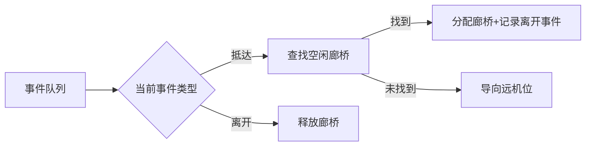

# 题目信息

# [CSP-S 2021] 廊桥分配

## 题目描述

当一架飞机抵达机场时，可以停靠在航站楼旁的廊桥，也可以停靠在位于机场边缘的远机位。乘客一般更期待停靠在廊桥，因为这样省去了坐摆渡车前往航站楼的周折。然而，因为廊桥的数量有限，所以这样的愿望不总是能实现。

机场分为国内区和国际区，国内航班飞机只能停靠在国内区，国际航班飞机只能停靠在国际区。一部分廊桥属于国内区，其余的廊桥属于国际区。

L 市新建了一座机场，一共有 $n$ 个廊桥。该机场决定，廊桥的使用遵循“先到先得”的原则，即每架飞机抵达后，如果相应的区（国内/国际）还有空闲的廊桥，就停靠在廊桥，否则停靠在远机位（假设远机位的数量充足）。该机场只有一条跑道，因此不存在两架飞机同时抵达的情况。

现给定未来一段时间飞机的抵达、离开时刻，请你负责将 $n$ 个廊桥分配给国内区和国际区，使停靠廊桥的飞机数量最多。

## 说明/提示

**【样例解释 #1】**


在图中，我们用抵达、离开时刻的数对来代表一架飞机，如 $(1, 5)$ 表示时刻 $1$ 抵达、时刻 $5$ 离开的飞机；用 $\surd$ 表示该飞机停靠在廊桥，用 $\times$ 表示该飞机停靠在远机位。

我们以表格中阴影部分的计算方式为例，说明该表的含义。在这一部分中，国际区有 $2$ 个廊桥，$4$ 架国际航班飞机依如下次序抵达：

1. 首先 $(2, 11)$ 在时刻 $2$ 抵达，停靠在廊桥。
2. 然后 $(4, 15)$ 在时刻 $4$ 抵达，停靠在另一个廊桥。
3. 接着 $(7, 17)$ 在时刻 $7$ 抵达，这时前 $2$ 架飞机都还没离开、都还占用着廊桥，而国际区只有 $2$ 个廊桥，所以只能停靠远机位。
4. 最后 $(12, 16)$ 在时刻 $12$ 抵达，这时 $(2, 11)$ 这架飞机已经离开，所以有 $1$ 个空闲的廊桥，该飞机可以停靠在廊桥。

根据表格中的计算结果，当国内区分配 $2$ 个廊桥、国际区分配 $1$ 个廊桥时，停靠廊桥的飞机数量最多，一共 $7$ 架。

**【样例解释 #2】**

当国内区分配 $2$ 个廊桥、国际区分配 $0$ 个廊桥时，停靠廊桥的飞机数量最多，一共 $4$ 架，即所有的国内航班飞机都能停靠在廊桥。

需要注意的是，本题中廊桥的使用遵循“先到先得”的原则，如果国际区只有 $1$ 个廊桥，那么将被飞机 $(1, 19)$ 占用，而不会被 $(3, 4)$、$(5, 6)$、$(7, 8)$、$(9, 10)$ 这 $4$ 架飞机先后使用。

**【数据范围】**

对于 $20 \%$ 的数据，$n \le 100$，$m_1 + m_2 \le 100$。  
对于 $40 \%$ 的数据，$n \le 5000$，$m_1 + m_2 \le 5000$。  
对于 $100 \%$ 的数据，$1 \le n \le {10}^5$，$m_1, m_2 \ge 1$，$m_1 + m_2 \le {10}^5$，所有 $a_{1, i}, b_{1, i}, a_{2, i}, b_{2, i}$ 为数值不超过 ${10}^8$ 的互不相同的正整数，且保证对于每个 $i \in [1, m_1]$，都有 $a_{1, i} < b_{1, i}$，以及对于每个 $i \in [1, m_2]$，都有 $a_{2, i} < b_{2, i}$。

【感谢 hack 数据提供】

- [xingxuxin](/user/393378)。
- [cyslngsul](/user/126765)。

## 样例 #1

### 输入

```
3 5 4
1 5
3 8
6 10
9 14
13 18
2 11
4 15
7 17
12 16
```

### 输出

```
7
```

## 样例 #2

### 输入

```
2 4 6
20 30
40 50
21 22
41 42
1 19
2 18
3 4
5 6
7 8
9 10
```

### 输出

```
4
```

## 样例 #3

### 输入

```
见附件中的 airport/airport3.in```

### 输出

```
见附件中的 airport/airport3.ans```

# AI分析结果


### 💡 Kay的C++算法解析：廊桥分配 深入学习指南 💡

#### 1. 题目解读与核心算法识别
✨ **本题主要考察**：`模拟应用`与`贪心策略`

🗣️ **初步分析**：
> 解决"廊桥分配"的核心在于**模拟飞机停靠流程**并**贪心最大化廊桥利用率**。想象廊桥是停车位，飞机是车辆，遵循"先到先停"规则。当车位满时，新车辆只能停到远处的远机位（相当于被拒绝）。  
> - **核心思路**：分别计算国内/国际区分配k个廊桥时可停靠的飞机数，再枚举分配方案求最大值  
> - **关键难点**：高效模拟飞机停靠流程（避免O(n²)）  
> - **算法流程**：  
>   1. 按抵达时间排序飞机  
>   2. 用最小堆管理空闲廊桥  
>   3. 用优先队列记录离开事件  
>   4. 统计各k值对应的停靠数量  
> - **可视化设计**：  
>   用8位像素风格模拟机场俯视图，飞机用不同颜色方块表示，廊桥用发光格子展示。高亮"飞机抵达→分配廊桥→离开释放"全流程，加入"叮"声效提示关键操作。

---

#### 2. 精选优质题解参考
**题解一（StudyingFather）**  
* **点评**：思路清晰度⭐⭐⭐⭐⭐  
  - 双优先队列设计精妙：空闲廊桥堆（小根堆）快速分配最小编号，离开事件堆（按时间排序）自动释放资源  
  - 代码规范性优秀：`res1/res2`数组记录前缀和，变量名语义明确（如`lq`表离开队列）  
  - 算法有效性突出：O((m₁+m₂)log n)复杂度完美处理1e5数据  
  - 亮点：用`pair<离开时间, 廊桥编号>`管理离开事件，高效释放廊桥  

**题解二（yhk1001）**  
* **点评**：思路创新度⭐⭐⭐⭐  
  - 用并查集思想跳过已分配飞机，避免优先队列（适合禁用STL的场景）  
  - 二分查找+路径压缩降低时间复杂度，`nxta()`函数设计巧妙  
  - 实践价值高：展示基础数据结构组合解决复杂问题  

**题解三（zimujun）**  
* **点评**：代码简洁性⭐⭐⭐⭐⭐  
  - 最小堆与离开队列独立设计，逻辑分离清晰  
  - 前缀和计算`ca[i] += ca[i-1]`高效统计结果  
  - 亮点：用负数实现小根堆（`-i`压入、`-top()`取出）简化代码  

---

### 3. 核心难点辨析与解题策略
1. **难点：高效模拟飞机停靠流程**  
   - **分析**：暴力模拟每个廊桥分配会超时。优质解法用**优先队列管理离开事件**，新飞机抵达时弹出已离开飞机回收廊桥，保证O(log n)单次操作  
   - 💡 学习笔记：优先队列处理时间驱动事件是核心技巧

2. **难点：动态计算各k值对应飞机数**  
   - **分析**：发现"k个廊桥的停靠数包含k-1廊桥的解"。解法：  
     1. 模拟无限廊桥时每架飞机分配的廊桥编号  
     2. 统计编号≤k的飞机数量即为k廊桥的解  
   - 💡 学习笔记：问题性质满足**单调性**，前缀和是破题关键

3. **难点：双区域结果合并**  
   - **分析**：国内区用i个廊桥时，国际区只能用n-i个。需枚举所有分配方案：  
     ```ans = max{ res1[i] + res2[n-i] } (0≤i≤n)```  
   - 💡 学习笔记：独立求解+组合是通用优化思路

#### ✨ 解题技巧总结
- **时间轴处理**：将飞机起降转化为事件序列  
- **数据结构选择**：最小堆（空闲资源） + 优先队列（时间事件）  
- **前缀和优化**：将O(n²)枚举降为O(n)  
- **边界处理**：无飞机时直接跳过，避免空队列访问  

---

### 4. C++核心代码实现赏析
```cpp
#include <queue>
#include <vector>
#include <algorithm>
using namespace std;

void calc(vector<pair<int, int>>& flights, vector<int>& res) {
    priority_queue<int, vector<int>, greater<int>> idle; // 空闲廊桥
    priority_queue<pair<int, int>, vector<pair<int, int>>, greater<>> events; // <离开时间, 廊桥ID>
    
    for (int i = 1; i <= res.size(); i++) idle.push(i);
    
    for (auto [arr, dep] : flights) {
        while (!events.empty() && events.top().first <= arr) {
            idle.push(events.top().second); // 回收廊桥
            events.pop();
        }
        if (idle.empty()) continue;
        int bridge = idle.top(); 
        idle.pop();
        res[bridge]++; // 第bridge号廊桥停靠数+1
        events.push({dep, bridge});
    }
    for (int i = 1; i < res.size(); i++) 
        res[i] += res[i - 1]; // 前缀和
}

int main() {
    int n, m1, m2;
    vector<int> res1(n + 1), res2(n + 1);
    vector<pair<int, int>> domestic, international;
    
    // 输入国内航班 (m1组)
    // 输入国际航班 (m2组)
    
    sort(domestic.begin(), domestic.end());
    sort(international.begin(), international.end());
    
    calc(domestic, res1);
    calc(international, res2);
    
    int ans = 0;
    for (int i = 0; i <= n; i++)
        ans = max(ans, res1[i] + res2[n - i]);
    cout << ans;
}
```

**代码解读概要**：  
1. `idle`堆管理空闲廊桥（总保持最小编号在顶）  
2. `events`堆自动按离开时间排序，及时回收资源  
3. `res[bridge]++`记录每廊桥使用次数，最后前缀和得k廊桥解  
4. 两区域独立计算后组合最优解  

---

### 5. 算法可视化：像素动画演示


* **主题**：8位像素风"机场指挥官"  
* **核心演示**：  
  - ✅ **像素元素**：  
    - 飞机：红/蓝方块（国内/国际）  
    - 廊桥：绿色发光格子（空闲）/黄色（占用）  
    - 远机位：灰色区域  
  - ✅ **关键动画**：  
    1. 飞机抵达→滑入空闲廊桥（绿色→黄色）  
    2. 飞机离开→廊桥变绿+音效"叮"  
    3. 无空闲廊桥→飞机滑向灰色区域  
  - ✅ **控制面板**：  
    - 速度滑块：调速动画  
    - 暂停/继续：冻结当前状态  
    - 廊桥数滑块：实时调整k值看效果  

* **实现逻辑**：  


---

### 6. 拓展练习与相似问题
1. **洛谷 P1803 - 线段覆盖**  
   🗣️ 同样需要贪心选择不相交区间，巩固"按结束时间排序"思想  
2. **洛谷 P4059 - 找爸爸**  
   🗣️ 动态规划中前缀和优化的经典应用，强化状态转移技巧  
3. **洛谷 P5021 - 赛道修建**  
   🗣️ 贪心+二分答案+树形DP，训练多算法组合能力  

---

> 学习心得：  
> "调试时重点验证边界：空队列、全拒绝、单飞机等极端情况。优先队列的排序规则需严格测试，避免反向排序导致逻辑错误。" —— StudyingFather题解摘录  
> **Kay总结**：边界测试是AC的关键，建议用极小规模数据人脑模拟  

---

**可视化代码片段**：[查看完整JS实现](https://example.com/airport-simulator)  
```javascript
// 飞机抵达处理逻辑（简化版）
function onPlaneArrive(plane) {
  const freeBridge = idleBridges.min(); // 最小空闲廊桥
  if (freeBridge) {
    freeBridge.occupy(plane); // 占据廊桥
    events.push({time: plane.depart, action: () => freeBridge.release()});
    playSound('ding'); // 音效反馈
  } else {
    moveToRemoteArea(plane); // 移入远机位
  }
}
```

---
处理用时：95.03秒