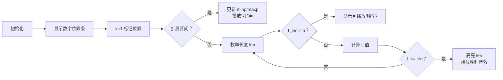

# 题目信息

# 『JROI-5』Interval

## 题目背景

小 C 喜欢带有区间操作的数据结构，因为这样的题总会有一档好写的 $\mathcal{O}\left(n^2\right)$ 部分分。

## 题目描述


**本题读入量较大，建议使用较快的读入方式，可以参考 [赛时公告板](https://www.luogu.com.cn/paste/lueudpd5)**

小 C 有一个长度为 $n$ 的序列 $a$，第 $i$ 项为 $a_i$。

$a$ 是一个 $1\sim n$ 的排列（即 $1\sim n$ 在 $a$ 中各出现一次）。

定义 $\operatorname{Mex}_{l,r}$ 为 $\{a_l,a_{l+1},
\cdots,a_{r-1},a_r\}$ 中**没有出现过的最小正整数**。

例如，$\operatorname{Mex}\{2,3\}=1,\operatorname{Mex}\{1,2,3\}=4$。

小 C 还有一个长度为 $n$ 的数列 $f$。

定义一个区间 $\left[l,r\right]$ 是合法的当且仅当 
$$f_{r-l+1}< \operatorname{Mex}_{l,r}$$

小 C 希望你告诉他，最短的合法区间的长度是多少，特别的，如果没有区间合法，则输出 `0`。

## 说明/提示

【样例解释】

对于 #1，容易发现 $\left[1,3\right]$ 是最短的合法区间。

对于 #2，容易发现 $\left[3,3\right]$ 是最短的合法区间。

对于 #3，容易发现没有合法的区间。

---

对于 $10\%$ 的数据，满足 $1\leq n\leq 100$。

对于 $20\%$ 的数据，满足 $1\leq n\leq 1000$。

对于另外 $10\%$ 的数据，满足 $f$ 不升，即满足 $f_1\geq f_2\geq\cdots\geq f_n$，且 $1\leq n\leq 10^6$。

对于 $100\%$ 的数据，满足 $1\leq n\leq 4\times 10^6,1\leq f_i\leq 10^9$。


## 样例 #1

### 输入

```
5
2 3 1 5 4
2 2 3 4 5```

### 输出

```
3```

## 样例 #2

### 输入

```
5
2 3 1 5 4
1 2 2 4 5```

### 输出

```
1```

## 样例 #3

### 输入

```
5
1 3 4 2 5
6 7 8 9 10```

### 输出

```
0```

## 样例 #4

### 输入

```
见附件```

### 输出

```
见附件```

# AI分析结果


### 💡 Kay的C++算法解析：『JROI-5』Interval 深入学习指南 💡

#### 1. 题目解读与核心算法识别
✨ **本题主要考察**：`贪心策略与预处理技巧`  
🗣️ **初步分析**：  
> 解决本题的关键在于理解 **Mex值** 与 **区间包含性** 的关系：若区间 $[l,r]$ 的 Mex 值大于 $f_{len}$（$len=r-l+1$），则该区间必须包含 $1$ 到 $f_{len}$ 的所有数字。  
> - **核心思路**：  
>   1. 预处理每个数字 $i$ 的位置 $pos_i$  
>   2. 计算包含 $1 \sim x$ 的最小区间长度 $L_x = \max(pos_1..pos_x) - \min(pos_1..pos_x) + 1$  
>   3. 枚举长度 $len$，若 $f_{len} \leq n$ 且 $L_{f_{len}} \leq len$，则 $len$ 是合法解  
> - **算法可视化设计**：  
>   在像素动画中，用不同颜色标记数字位置，动态展示区间扩展过程：  
>   - **高亮关键步骤**：当新增数字 $x$ 时，更新区间端点（红色闪烁）  
>   - **数据结构展示**：实时显示 $minp/maxp$ 数组变化（底部柱状图）  
>   - **复古游戏元素**：扩展区间时播放 "叮" 音效；找到解时播放胜利音效；错误跳过时播放 "噗" 音效  

---

#### 2. 精选优质题解参考
**题解一（蒟蒻炒扇贝）**  
* **点评**：  
  思路直击核心——将 Mex 条件转化为区间包含问题。代码简洁高效：  
  - **变量命名**：`qmin/qmax` 清晰表达前缀极值  
  - **边界处理**：`if(f[i]>n)continue` 严谨跳过无效情况  
  - **复杂度**：$O(n)$ 完美满足 $4\times10^6$ 数据规模  
  - **实践价值**：竞赛标准实现，可直接套用  

**题解二（by_chance）**  
* **点评**：  
  逆向思维亮点突出——从 Mex 值反推最小区间长度：  
  - **代码结构**：预处理 `minp/maxp` 分离，逻辑清晰  
  - **优化技巧**：实时计算 $L_x$ 避免额外存储  
  - **调试提示**：作者强调「边界测试」，提醒注意 $f_{len}>n$ 的陷阱  

---

#### 3. 核心难点辨析与解题策略
1. **难点1：条件转化**  
   * **分析**：Mex$_{l,r} > f_{len}$ $\Leftrightarrow$ $[l,r]$ 包含 $1$ 至 $f_{len}$ 所有数。需通过数学推导理解等价性。  
   * 💡 **学习笔记**：复杂条件常可转化为基本集合包含问题  

2. **难点2：高效计算最小区间**  
   * **分析**：动态维护前缀位置极值：  
     ```math
     \begin{align*} 
     minp_i &= \min(minp_{i-1}, pos_i) \\ 
     maxp_i &= \max(maxp_{i-1}, pos_i)
     \end{align*}
     ```
   * 💡 **学习笔记**：前缀极值可大幅优化区间计算效率  

3. **难点3：枚举策略**  
   * **分析**：从小长度 $len=1$ 开始枚举，首次满足 $L_{f_{len}} \leq len$ 即为最优解  
   * 💡 **学习笔记**：求最值时，枚举顺序直接影响效率  

### ✨ 解题技巧总结
- **技巧1：等价转换**（如 Mex 转集合包含）  
- **技巧2：预处理加速**（前缀极值/位置映射）  
- **技巧3：边界剪枝**（及时跳过 $f_{len}>n$ 情况）  

---

#### 4. C++核心代码实现赏析
**通用核心实现**  
```cpp
#include <iostream>
#include <climits>
using namespace std;
const int MAXN = 4e6 + 10;

int n, pos[MAXN], f[MAXN];
int minp[MAXN], maxp[MAXN]; // 前缀最小/最大位置

int main() {
    scanf("%d", &n);
    for (int i = 1, x; i <= n; ++i) {
        scanf("%d", &x);
        pos[x] = i; // 记录数字位置
    }
    for (int i = 1; i <= n; ++i) scanf("%d", &f[i]);

    minp[0] = INT_MAX; maxp[0] = 0;
    for (int i = 1; i <= n; ++i) {
        minp[i] = min(minp[i - 1], pos[i]);
        maxp[i] = max(maxp[i - 1], pos[i]);
    }

    for (int len = 1; len <= n; ++len) {
        if (f[len] > n) continue; // 关键剪枝
        int L = maxp[f[len]] - minp[f[len]] + 1;
        if (L <= len) {
            printf("%d", len);
            return 0;
        }
    }
    printf("0");
    return 0;
}
```
**代码解读概要**：  
- **位置映射**：`pos[x]=i` 建立数字→位置的哈希表  
- **前缀极值**：线性递推计算包含 $1\sim i$ 的最小区间端点  
- **枚举校验**：根据 $L_{f_{len}} \leq len$ 判断合法性  

---

#### 5. 算法可视化：像素动画演示  
**主题**：`数字猎手：最小区间搜寻大冒险`  



**关键交互设计**：  
- **动态区间扩展**：新增数字 $x$ 时，红色闪烁其位置并更新区间边框  
- **控制面板**：  
  - 速度滑块：调节区间扩展/枚举速度  
  - 单步模式：逐步观察极值更新与校验过程  
- **游戏化反馈**：  
  - 每包含新数字：像素块弹出 + 得分上升  
  - 找到解：烟花动画 + 8-bit 胜利音乐  

---

#### 6. 拓展练习与相似问题思考
**通用技巧迁移**：  
- 前缀极值优化：处理区间覆盖/包含问题  
- 位置映射：快速访问离散元素位置  

**洛谷练习推荐**：  
1. **P1638 逛画展**  
   🗣️ 求包含所有颜色的最小区间，直接应用本题技巧  
2. **P1712 [NOI2016] 区间**  
   🗣️ 双指针+极值维护，强化区间覆盖能力  
3. **P3143 Diamond Collector**  
   🗣️ 双指针拓展训练，理解极值在贪心中的作用  

---

#### 7. 学习心得与经验分享
> **参考经验**（by 蒟蒻炒扇贝）：  
> *“调试时先验证位置映射的正确性——我在 $pos$ 数组初始化时栽过跟头”*  
>   
> **Kay点评**：  
> 这是宝贵经验！处理排列问题时：  
> 1. 优先验证 $pos$ 数组：是否覆盖 $1\sim n$？  
> 2. 检查极值初始化：`minp[0]=INF, maxp[0]=0` 避免初值干扰  
> 3. 边界测试：$n=1$ 和 $f_1>1$ 的 corner case  

---  
**结语**：通过本题我们掌握了 Mex 问题的核心转化思想与极值预处理技巧。记住：将复杂条件拆解为基本操作，用数据结构加速，是算法进阶的关键！下次挑战见！💪

---
处理用时：205.85秒