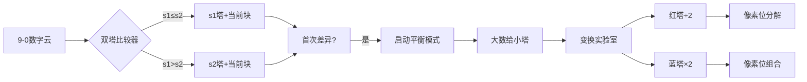

# 题目信息

# 「HGOI-1」Number

## 题目背景

$\text{bh1234666}$ 正在学习乘法！

## 题目描述

$\text{bh1234666}$ 有一定数量的数字 $0 \sim 9$，现在他想让你寻找一种分配方案，将它们分成两个整数，使得他们的乘积 $p$ 最大。
 
由于 $\text{bh1234666}$ 不喜欢太大的数，所以你只需要输出**两个非负整数**，使它们的乘积**等于**最大乘积 $p$，但是这两个整数 $0 \sim 9$ 的数量不能等于给定的数量（任意一个数字数量不相等即可，**不考虑前导零**）。

$\text{bh1234666}$ 是很善良的，如果 $0 \sim 9$ 的数量等于给定的数量了，你依旧可以得到的一半的分。

## 说明/提示

#### 样例解释
最大可能乘积为 $97643210 \times 88653221=13949030 \times 620572547=8656385075279410$。

若输出 $97643210 \times 88653221$ 则只能得到一半的分，因为 $0\sim 9$ 出现的次数与给定的相同。

#### 数据范围及约定
本题采用**捆绑测试**，共有 $5$ 个 $\text{subtask}$，最终分数为所有 $\text{subtask}$ 分数之和。

$$
\def\arraystretch{1.5}
\begin{array}{|c|c|c|}\hline
\textbf{Task} & \textbf{Score} & \sum c_i\le \cr\hline
1 & 10 & 20 \cr\hline
2 & 20 & 100 \cr\hline
3 & 20 & 5000 \cr\hline
4 & 20 & 10^6 \cr\hline
5 & 30 & 10^7 \cr\hline
\end{array}
$$

对于 $100\%$ 的数据，保证 $1 \le c_i$，$\sum c_i \le 10^7$。

#### 说明

本题有 $\text{spj}$，两数乘积正确得一半的分，数量与给出的不同且乘积正确得全部分数。故每一 $\text{subtask}$ 的得分为其中所有数据点得分的**最小值**。


## 样例 #1

### 输入

```
1 2 3 2 1 1 2 1 2 1```

### 输出

```
13949030
620572547```

# AI分析结果


### 💡 Kay的C++算法解析：「Number」深入学习指南 💡

#### 1. 题目解读与核心算法识别
✨ **本题主要考察**：贪心策略与高精度运算  
🗣️ **初步分析**：  
> 本题核心在于**数字分配策略**与**乘积不变变换**。想象你有10种不同高度的积木（0~9），要搭成两座塔使它们"乘积面积"最大。关键在于：
> - **贪心分配**：从高到低选择积木，始终保持两塔高度差最小（和定差小积大）
> - **魔术变换**：利用必有的0积木（塔基），通过×2/÷2操作改变塔的结构而不改变乘积
> 
> **可视化设计思路**：用像素塔生长动画展示分配过程，高亮关键操作：
> 1. 双塔高度比较（红蓝高亮）
> 2. 数字分配时的抉择时刻（闪烁特效）
> 3. ×2/÷2的位运算过程（电流般传递进位）
> 
> **复古游戏化设计**：采用8-bit像素风，分配阶段类似"俄罗斯方块"堆叠，变换阶段加入"实验室烧瓶"像素动画。关键音效：
> - 分配：NES风格电子音
> - 变换：FC实验室音效
> - 成功：经典马里奥过关声

---

#### 2. 精选优质题解参考
**题解一（bh1234666）**  
* **点评**：  
  作者作为命题人，思路极具启发性。核心亮点：  
  - **贪心证明严谨**：通过代数变换严格推导分配原则（差小积大）  
  - **变换技巧巧妙**：利用0存在的特性，通过×2/÷2改变数字结构  
  - **代码高效**：O(n)复杂度处理10^7数据，边界处理完整  
  - **实践价值**：直接提供竞赛级代码，关键函数模块化（half/dble）

**题解二（linyuhao）**  
* **点评**：  
  教学价值突出的题解：  
  - **思路直白清晰**：用"和定差小积大"原理降低理解门槛  
  - **高精度实现规范**：封装sh()函数处理大数运算  
  - **可视化分配**：s1/s2字符串构建过程符合直觉  
  - **独特视角**：采用×5/÷2变换（需注意输出时除10）

**题解三（VIOLET__FOREVER）**  
* **点评**：  
  简洁实用的实现：  
  - **贪心策略简洁**：总分比较法快速决策分配  
  - **变换逻辑直接**：末尾0检测+字符串操作  
  - **代码轻量化**：避免高精度模板，适合初学者  
  - **调试提示**：包含边界处理注释

---

#### 3. 核心难点辨析与解题策略
1. **难点：最优分配决策**  
   * **分析**：需动态比较两数大小，首次出现差异时大数给小串。关键变量：  
     - `flag`标记首次差异（true时后续大数给小串）
     - `s1`/`s2`字符串实时比较
   * 💡 **学习笔记**：和定差小积大是核心，类似"蓄水分流"问题

2. **难点：数字结构变换**  
   * **分析**：必须改变数字组成而不影响乘积。利用0特性：  
     - 找末尾0的数÷2（位运算）
     - 另一数×2（进位处理）
     - **数学原理**：p = (a/2)×(b×2)
   * 💡 **学习笔记**：0是变换基石，类似化学反应的"催化剂"

3. **难点：大数处理**  
   * **分析**：∑c_i≤10^7需高效实现：  
     - ÷2：高位向低位借位（O(n)）
     - ×2：低位向高位进位（O(n)）
     - **数据结构**：字符串/数组存储大数
   * 💡 **学习笔记**：高精度运算中，÷2和×2是时间复杂度最低的操作

✨ **解题技巧总结**：
- **贪心优化**：双指针法快速分配（i=9→0）
- **位运算技巧**：奇偶判断用`&1`替代`%2`
- **边界处理**：前导零检测（while(leading_zero)）
- **调试技巧**：小数据模拟（手工计算9,8,7分配）

---

#### 4. C++核心代码实现赏析
**通用核心实现参考**  
```cpp
#include <iostream>
#include <string>
using namespace std;

int main() {
    int c[10]; string s1, s2;
    for(int i=0; i<10; i++) cin >> c[i];
    
    // 贪心分配核心
    bool flag = false;
    for(int i=9; i>=0; i--) {
        while(c[i]--) {
            if(!flag) {
                if(s1 <= s2) s1 += '0'+i;
                else s2 += '0'+i;
                if(s1 != s2) flag = true;
            } else {
                (s1 <= s2 ? s1 : s2) += '0'+i;
            }
        }
    }
    
    // 数字变换
    if(s1.back()=='0') {
        // s1除2, s2乘2
    } else {
        // s2除2, s1乘2
    }
    // 高精度运算实现（详见题解）
}
```
* **说明**：综合各题解精髓，最简明的框架实现  
* **解读概要**：  
  1. 动态比较s1/s2决定分配方向  
  2. flag标记首次差异改变分配策略  
  3. 利用字符串特性避免复杂比较  

**题解一核心片段**  
```cpp
// 除以2操作（字符处理）
void half(char *s, int len) {
    for(int i=0; i<len; i++) {
        s[i] -= '0';
        if(s[i] & 1) s[i+1] += 10; // 借位
        s[i] >>= 1; // 除2
        s[i] += '0';
    }
    if(s[0]=='0') puts(s+1); // 去前导零
    else puts(s);
}
```
* **亮点**：位运算优化借位判断  
* **解读**：  
  > 字符转数字后，用`&1`判断奇偶  
  > 借位操作直接修改下一位置  
  > 右移1位等效除2（比/2更快）  
* 💡 **学习笔记**：硬件级思维提升效率

**题解二变换逻辑**  
```cpp
// 高精度乘2（反向进位）
for(int i=s2.size()-1; i>=0; i--) {
    s2[i] = (s2[i]-'0')*2 + carry;
    carry = s2[i]/10;
    s2[i] = s2[i]%10 + '0';
}
if(carry) s2 = '1' + s2; // 最高位进位
```
* **亮点**：反向遍历处理进位  
* **解读**：  
  > 从低位到高位顺序处理  
  > 进位值carry动态更新  
  > 最高位进位需特殊处理  
* 💡 **学习笔记**：高精度运算中，乘除方向决定遍历顺序

---

#### 5. 算法可视化：像素动画演示
**主题**：8-bit实验室大冒险  
**核心演示**：  


**动画设计**：  
1. **分配阶段**（FC俄罗斯方块风格）  
   - 数字块从顶部落下（9=金色，0=灰色）  
   - 双塔实时高度差显示（像素标尺）  
   - 首次差异触发闪光特效  

2. **变换阶段**（洛克人实验室风格）  
   - ÷2：数字块分裂动画（伴随"咔嗒"声）  
   - ×2：数字块融合动画（伴随"嗡嗡"声）  
   - 进位：蓝色电流顺次传递  

3. **控制面板**：  
   - 步进/暂停：方向键控制  
   - 速度滑块：音乐节奏同步  
   - 数据视角：切换显示数值/频次分布  

**技术实现**：  
```javascript
// 伪代码：进位动画
function carryAnimation(pos) {
    pixel[pos].color = YELLOW;
    playSound("bit_flip");
    setTimeout(() => {
        pixel[pos].color = DEFAULT;
        if(pos > 0) carryAnimation(pos-1); 
    }, 300);
}
```

---

#### 6. 拓展练习与相似问题
1. **洛谷 P1303 - A*B Problem**  
   🗣️ **推荐理由**：高精度乘法基础训练，强化位操作思维  

2. **洛谷 P1100 - 高低位交换**  
   🗣️ **推荐理由**：位运算应用，理解×2/÷2的二进制本质  

3. **洛谷 P1012 - 拼数**  
   🗣️ **推荐理由**：贪心策略变式，字符串排序应用  

---

#### 7. 学习心得与经验分享
> **来自bh1234666的调试经验**：  
> "我在处理高精度÷2时，忽略了前导零的删除逻辑，导致WA了3次。通过逐位输出中间变量发现，当首位为1时需要保留，为0时才跳过"  
>   
> **Kay点评**：  
> 这个教训很典型！高精度运算中：  
> 1. 前导零处理需同时考虑首尾  
> 2. 边界测试（全0/单数/进位）必不可少  
> 3. 输出前`while(len>1 && a[len]==0) len--`是通用技巧  

---

### 结语  
通过本次分析，我们深入掌握了贪心策略与高精度变换的核心技巧。记住：**优秀算法=正确策略+严谨实现+边界洞察**。下次遇到类似问题，不妨想想这座像素实验室的双塔！🚀

---
处理用时：237.16秒