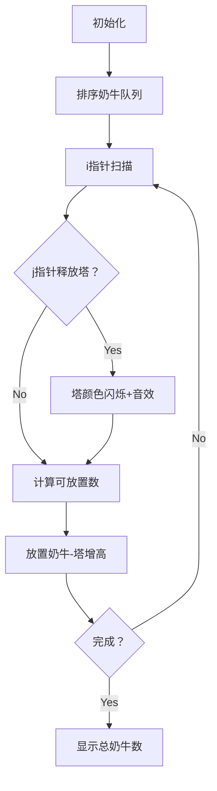

# 题目信息

# [USACO23DEC] Bovine Acrobatics S

## 题目描述

Farmer John 决定让他的奶牛表演杂技！首先，FJ 为他的奶牛称重，发现她们有 $N$（$1\le N\le 2\times 10^5$）个不同的体重。具体来说，对于全部的 $i\in [1,N]$，有 $a_i$ 只奶牛的体重为 $w_i$ 单位（$1\le a_i\le 10^9, 1\le w_i\le 10^9$）。

他最出名的节目需要奶牛叠成**平衡的奶牛塔**。一座**奶牛塔**是一些奶牛，每只奶牛站在下一只奶牛身上。一座奶牛塔是**平衡的**，当且仅当每一只被踩着的奶牛，都比**直接**踩在它身上的那只奶牛重至少 $K$（$1\le K\le 10^9$）单位。每只奶牛都可以成为奶牛塔的一部分。

如果 FJ 想要创造最多 $M$（$1 \le M \le 10^9$）座奶牛塔，最多有多少只奶牛可以成为奶牛塔的一部分？

## 说明/提示

### 样例解释 1

FJ 可以用体重为 $5,7,9$ 的奶牛创造四座平衡的奶牛塔，再用体重为 $5,7$ 的奶牛创造另一座。

### 样例解释 2

FJ 可以用体重为 $5,9$ 的奶牛创造四座平衡的奶牛塔，再用体重为 $7$ 的一只奶牛创造另一座。或者，他可以用体重为 $5,9$ 的奶牛创造四座平衡的奶牛塔，再用体重为 $5$ 的一只奶牛创造另一座。

### 测试点性质

- 测试点 $3-5$ 满足 $M \le 5000$ 且奶牛的总数不超过 $5000$。
- 测试点 $6-11$ 满足奶牛的总数不超过 $2\cdot 10^5$。
- 测试点 $12-17$ 没有额外限制。


## 样例 #1

### 输入

```
3 5 2
9 4
7 6
5 5```

### 输出

```
14```

## 样例 #2

### 输入

```
3 5 3
5 5
7 6
9 4```

### 输出

```
9```

# AI分析结果


# 💡 Kay的C++算法解析：[USACO23DEC] Bovine Acrobatics S 深入学习指南 💡

## 1. 题目解读与核心算法识别

✨ **本题主要考察**：贪心算法与双指针技巧

🗣️ **初步分析**：
> 解决"奶牛杂技表演"这道题，关键在于**贪心策略**和**高效维护可用资源**。想象你在玩俄罗斯方块：为了叠得更高，你会优先放小方块垫底，这样大方块才能稳稳落在上面！本题中，我们将奶牛按体重排序后，优先用轻的奶牛作为塔顶（轻垫底），这样后续重的奶牛才能继续叠加（重盖轻）。难点在于如何实时追踪"可用塔顶"的数量。

> - **核心流程**：排序后，用双指针维护可用塔的数量（左指针释放过期塔，右指针处理当前奶牛）。变量`m`动态记录可用塔数，`ans`累加结果。
> - **可视化设计**：用像素方块表示奶牛，塔垂直堆叠。动画高亮：①当前奶牛指针移动 ②体重差≥K时释放塔（颜色闪烁） ③放置奶牛时塔增高（音效："叮"）。复古游戏化设计：每成功放置一组奶牛视为"消除一行"，播放8-bit胜利音效；自动演示模式像"贪吃蛇AI"逐步解题。

---

## 2. 精选优质题解参考

**题解一（作者：Little_x_starTYJ）**
* **点评**：思路直击贪心本质——轻奶牛优先作塔顶，为后续创造空间。代码简洁有力：双指针维护可用塔（`id`释放过期塔，`ans[i]`记录放置数），边界处理严谨（体重差严格≥K）。变量名`m`（可用塔数）、`res`（结果）含义明确，`min`手动实现避免STL开销，竞赛实践性强。亮点在于用`ans[]`数组隐式记录塔状态，避免额外数据结构。

**题解二（作者：_qingshu_）**
* **点评**：与题解一思路相似，但更强调贪心正确性证明（"轻奶牛非塔顶时，后续选择不会更劣"）。代码使用`stable_sort`确保排序稳定性，避免指针错位；`qa[]`数组记录放置数，逻辑清晰。亮点在于用数学归纳法论证贪心策略，帮助理解本质。

**题解三（作者：Zi_Gao）**
* **点评**：提供贪心策略的严格证明（"轻奶牛放置不劣于重奶牛"），强化理论支撑。代码添加详细注释解释指针移动逻辑，边界`j`初始化为1避免越界。亮点在于用"让位"比喻解释贪心选择，并讨论空间复杂度优化（无额外队列）。

---

## 3. 核心难点辨析与解题策略

1.  **难点：贪心策略的证明**  
    * **分析**：为什么轻奶牛优先？假设轻奶牛A和重奶牛B都可放置，若选择B，则A可能因体重不足无法放在其他塔顶；反之选A后，B仍可放在新塔顶。优质题解通过"无后效性"证明：轻奶牛给后续留更多选择空间。
    * 💡 **学习笔记**：贪心的核心是"局部最优导致全局最优"，需结合问题特性验证。

2.  **难点：可用塔的实时维护**  
    * **分析**：体重差≥K的塔才能复用。双指针高效维护：左指针`j`标记"过期体重"，当`cow[i].w - cow[j].w ≥ K`时，释放这些塔（`m += ans[j]`）。关键在于理解`j`与`i`的单调性——体重递增时，`j`只需右移不回溯。
    * 💡 **学习笔记**：双指针适用场景：数组有序，且区间判断满足单调性。

3.  **难点：批量处理大数量奶牛**  
    * **分析**：`a_i`达1e9时不可逐头处理。题解直接用`min(m, a_i)`计算可放置数量，将O(a_i)优化为O(1)。数据结构上，用数组而非队列避免存储单个塔。
    * 💡 **学习笔记**：批量处理是优化贪心的关键，将操作次数从"奶牛头数"降为"奶牛种类数"。

### ✨ 解题技巧总结
- **技巧1：排序预处理**  
  对维度（如体重）排序，将无序问题转化为有序序列问题，便于贪心选择。
- **技巧2：双指针维护状态**  
  用左右指针分别追踪"待释放资源"和"当前操作"，避免O(n²)遍历。
- **技巧3：边界防御性编程**  
  特别注意`m`减为0、体重差恰好等于K等边界，调试时打印中间变量验证。

---

## 4. C++核心代码实现赏析

**本题通用核心C++实现参考**
* **说明**：综合优质题解，使用双指针实现贪心策略，完整包含输入输出逻辑。
* **完整核心代码**：
```cpp
#include <iostream>
#include <algorithm>
using namespace std;
typedef long long LL;
const int N = 200010;

struct Cow { int w, a; } cows[N];
int n, M, k; // M为初始塔数
LL ans = 0;

int main() {
    cin >> n >> M >> k;
    for (int i = 1; i <= n; ++i)
        cin >> cows[i].w >> cows[i].a;
    
    // 按体重升序排序
    sort(cows + 1, cows + n + 1, [](const Cow& x, const Cow& y) {
        return x.w < y.w;
    });
    
    int j = 1; // 左指针：标记可释放的塔
    for (int i = 1; i <= n; ++i) {
        // 释放体重差≥k的塔：这些塔可被当前奶牛复用
        while (j < i && cows[i].w - cows[j].w >= k) {
            M += cows[j].a; // 释放j处放置的奶牛数
            j++;
        }
        // 放置当前奶牛：取min(可用塔数, 当前奶牛数)
        int use = min(M, cows[i].a);
        M -= use;         // 更新可用塔数
        ans += use;       // 累加结果
        cows[i].a = use; // 记录该体重放置数
    }
    cout << ans << endl;
    return 0;
}
```
* **代码解读概要**：
  1. **输入与排序**：读入奶牛体重`w`和数量`a`，按体重升序排序。
  2. **双指针扫描**：`i`遍历奶牛，`j`标记可释放的塔（体重≤当前-`k`）。
  3. **贪心放置**：`use = min(M, a_i)`计算可放置数，更新`M`和`ans`。
  4. **隐式记录**：`cows[i].a`复用为放置数，避免额外数组。

---

**题解一（Little_x_starTYJ）片段赏析**
* **亮点**：用`ans[]`数组隐式记录状态，精简高效。
* **核心代码片段**：
```cpp
while (id < i && c[i].b - c[id].b >= k)
    m += ans[id++];        // 释放过期塔
ans[i] = m < c[i].a ? m : c[i].a; // 计算放置数
m -= ans[i]; res += ans[i]; // 更新可用塔和结果
```
* **代码解读**：
  - `id`指针遍历过期奶牛（体重差≥`k`），`ans[id]`是之前放置数，释放后加入`m`。
  - 三目运算符避免STL的`min`开销，适合竞赛优化。
  - **关键行**：`m -= ans[i]`消耗可用塔，`res`累加总奶牛数。
* 💡 **学习笔记**：数组复用节省空间，但需确保语义清晰。

**题解二（_qingshu_）片段赏析**
* **亮点**：`stable_sort`保证稳定排序，避免指针失效。
* **核心代码片段**：
```cpp
while (tot <= i-1 && c[i].w - c[tot].w >= k)
    m += qa[tot++];     // 移动tot释放塔
qa[i] = min(m, c[i].a); // 记录放置数
m -= qa[i]; ans += qa[i];
```
* **代码解读**：
  - `tot`类似`j`指针，条件`tot ≤ i-1`严格防止越界。
  - `qa[i]`显式存储放置数，逻辑更易读。
* 💡 **学习笔记**：稳定排序确保同体重奶牛顺序不变，避免指针错位。

---

## 5. 算法可视化：像素动画演示

**主题**：8-bit风格"奶牛叠叠乐"  
**核心演示**：双指针动态维护可用塔，贪心放置过程可视化  



* **动画帧步骤**：
  1. **像素场景**：左侧奶牛队列（按体重升序排列，不同体重用不同颜色），右侧为M个可用塔基。
  2. **指针移动**：`i`指针高亮当前奶牛（红色边框），`j`指针标记可释放区（蓝色边框），当`cow[i].w - cow[j].w ≥ k`时，`j`处奶牛塔闪烁绿色并释放。
  3. **放置操作**：从当前奶牛堆取`use`个放置到塔上，塔增高对应层数，播放"叮"音效；若`use = min(M, a_i)`，显示数值浮动。
  4. **游戏化元素**：
     - **音效**：放置成功（清脆"叮"），释放塔（"咔嚓"），完成（8-bit胜利旋律）
     - **自动演示**：点击"AI演示"后，算法自动步进，速度可调
     - **关卡积分**：每处理完一种奶牛视为过关，显示当前得分`ans`

* **技术实现**：
  - Canvas绘制网格，奶牛=16x16像素方块
  - 状态高亮：当前奶牛=`#FF4136`，可用塔=`#2ECC40`
  - 伪代码同步：右侧显示代码当前执行行（如`while(j<i && diff>=k)`）

---

## 6. 拓展练习与相似问题思考

* **通用技巧迁移**：
  1. **区间覆盖问题**（如：用最少区间覆盖线段）——同样需排序+贪心选择
  2. **任务调度**（如：会议室安排）——维护资源池，按结束时间贪心
  3. **数列分段**（如：将数组分为和递增的子序列）——双指针维护当前段

* **洛谷推荐**：
  1. **P1090 [NOIP2004 提高组] 合并果子**  
     🗣️ 巩固贪心+优先队列，理解"每次选最小两堆"如何优化
  2. **P1230 智力大冲浪**  
     🗣️ 练习时间窗口下的贪心选择，强化双指针应用
  3. **P1106 删数问题**  
     🗣️ 迁移"局部最优解"思想，对比本题的塔放置策略

---

## 7. 学习心得与经验分享

> **经验分享（来自 Little_x_starTYJ）**：  
> "我在指针移动条件`c[i].b - c[id].b >= k`中漏写等号，导致体重差恰好等于K时少释放塔。调试时打印`i, j, m`值才发现问题。"

> **点评**：边界条件调试是贪心算法的核心挑战。建议：
> 1. 用极值测试：`K=0`或`K=1e9`
> 2. 打印中间状态：如每次循环后输出`i, j, m, ans`
> 3. 验证贪心策略：用小样例手工模拟

---

通过本次分析，我们深入理解了贪心与双指针的配合之美。记住：好的算法既是科学，也是艺术——多思考"为什么这样最优"，少死记硬背。下次挑战再见！ 💪

---
处理用时：161.74秒