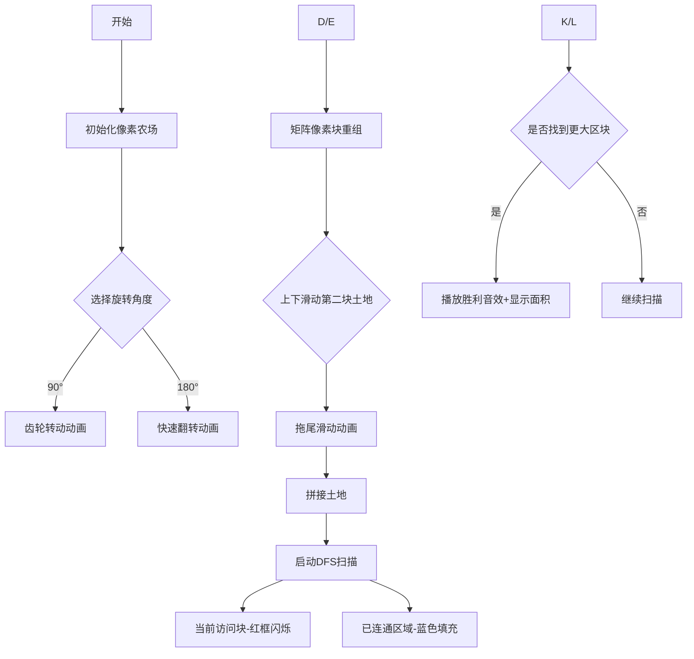

# 题目信息

# [蓝桥杯 2023 省 Java B] 合并区域

## 题目背景

本题测试数据可能较水，仅供参考。

## 题目描述

小蓝在玩一款种地游戏。现在他被分配给了两块大小均为 $N \times N$ 的正方形区域。这两块区域都按照 $N \times N$ 的规格进行了均等划分，划分成了若干块面积相同的小区域，其中每块小区域要么是岩石，要么就是土壤，在垂直或者水平方向上相邻的土壤可以组成一块土地。现在小蓝想要对这两块区域沿着边缘进行合并，他想知道合并以后可以得到的最大的一块土地的面积是多少（土地的面积就是土地中土壤小区域的块数）？

在进行合并时，小区域之间必须对齐。可以在两块方形区域的任何一条边上进行合并，可以对两块方形区域进行 $90$ 度、$180$ 度、$270$ 度、$360$ 度的旋转，但不可以进行上下或左右翻转，并且两块方形区域不可以发生重叠。

## 说明/提示

### 样例说明

第一张图展示了样例中的两块区域的布局。第二张图展示了其中一种最佳的合并方式，此时最大的土地面积为 $15$。


### 评测用例规模与约定

- 对于 $30\%$ 的数据，$1 \leq N \leq 5$。
- 对于 $60\%$ 的数据，$1 \leq N \leq 15$。
- 对于 $100\%$ 的数据，$1 \leq N \leq 50$。

## 样例 #1

### 输入

```
4
0 1 1 0
1 0 1 1
1 0 1 0
1 1 1 0
0 0 1 0
0 1 1 0
1 0 0 0
1 1 1 1```

### 输出

```
15```

# AI分析结果


### 💡 Kay的C++算法解析：合并区域 深入学习指南 💡

> 今天我们来分析蓝桥杯2023省赛题"合并区域"。这道题考察了矩阵操作与连通块计算的综合能力，通过本指南你将掌握如何优雅地处理旋转、平移和连通块计算。

---

## 1. 题目解读与核心算法识别

✨ **本题主要考察**：`模拟+DFS+枚举`  
(算法分类：矩阵变换、连通块计算)

🗣️ **初步分析**：
> 解决本题就像玩拼图游戏：我们需要旋转两块土地（0°/90°/180°/270°），上下滑动其中一块后拼接，最后找出最大的连续土壤区域（连通块）。核心是**枚举所有可能的组合状态**（16种旋转×上下平移位置），对每种组合进行**连通块扫描**。

- **核心流程**：
  1. 枚举第一个矩阵的4种旋转状态
  2. 枚举第二个矩阵的4种旋转状态
  3. 枚举垂直平移偏移量（-n-1到n+1）
  4. 拼接后DFS计算最大连通块

- **可视化设计**：
  采用8位像素农场风格，两个矩阵用不同颜色土壤块表示（绿色/黄色），岩石为灰色。动画分三阶段：
  - **旋转阶段**：矩阵顺时针旋转时像素块重组，配齿轮转动音效
  - **平移阶段**：第二个矩阵上下滑动，带拖尾动画和滑动音效
  - **连通扫描**：DFS像水波扩散，当前访问块高亮红色边框，已连通区域渐变蓝色

---

## 2. 精选优质题解参考

本次分析的题解来自sjwhsss（评分：★★★☆）

**题解点评**：
> 该解法完整实现了枚举思路，亮点在于使用**大矩阵偏移法**（201-300行列作为画布）避免边界判断。代码直接实现了四种旋转公式，逻辑正确但可读性可提升：  
> - ✅ 优点：偏移量设计巧妙，DFS前局部清空vis数组提升效率
> - ⚠️ 改进点：魔数(200/301)可定义为常量，旋转操作宜封装为函数
> - 💡 学习价值：掌握用空间换边界的技巧，理解暴力枚举在数据量小时可行性

---

## 3. 核心难点辨析与解题策略

### 🔑 关键点1：矩阵旋转的坐标映射
**难点**：如何正确计算四种旋转后的坐标？  
**解法**：推导旋转公式（设原位置(i,j)，矩阵宽n）：
```math
90°: (j, n-i+1) 
180°: (n-i+1, n-j+1)
270°: (n-j+1, i)
```
> 💡 **学习笔记**：旋转本质是坐标系的线性变换，建议纸上模拟3x3矩阵验证

### 🔑 关键点2：平移合并的边界处理
**难点**：上下平移时部分区域可能越界  
**解法**：使用足够大的画布（如1000x1000），固定第一个矩阵在中心(200,200)，第二个矩阵按偏移量放置在右侧：
```cpp
// 第二个矩阵位置计算
row = 200 - offset + i  // offset为上下平移量
col = 200 + n + j       // 固定在右侧区域
```
> 💡 **学习笔记**：大矩阵缓冲法避免边界判断是竞赛常用技巧

### 🔑 关键点3：高效连通块计算
**难点**：每次拼接后需快速计算最大连通块  
**解法**：DFS前仅重置相关区域（200-301行），非全局初始化
```cpp
// 局部初始化提升效率
for(int i=200; i<=301; i++) 
    for(int j=200; j<=301; j++)
        vis[i][j] = false;
```
> 💡 **学习笔记**：避免不必要的全局操作能显著提升性能

### ✨ 解题技巧总结
1. **状态枚举法**：当可能性有限时（本题16×103种），暴力枚举是最直接方案
2. **空间换边界**：大矩阵缓冲避免复杂边界判断
3. **局部重置优化**：只更新受影响区域减少冗余操作
4. **模块化思维**：将旋转、平移、DFS分离实现

---

## 4. C++核心代码实现赏析

### 通用核心实现
```cpp
#include <iostream>
#include <cstring>
using namespace std;
const int N = 1000;
const int BASE = 200;  // 基准偏移量

int n, a[N][N], b[N][N], canvas[N][N];
bool vis[N][N];
int dir[4][2] = {{0,1},{0,-1},{1,0},{-1,0}};
int maxBlock;

void dfs(int x, int y) {
    vis[x][y] = true;
    maxBlock++;
    for(int k=0; k<4; k++) {
        int nx = x + dir[k][0], ny = y + dir[k][1];
        if(canvas[nx][ny] && !vis[nx][ny]) 
            dfs(nx, ny);
    }
}

// 旋转函数封装
void rotate90(int src[N][N], int dst[N][N]) {
    for(int i=1; i<=n; i++)
        for(int j=1; j<=n; j++)
            dst[j][n-i+1] = src[i][j];
}

void solve() {
    // 枚举第一个矩阵旋转(4种状态)
    for(int rot1=0; rot1<4; rot1++) {
        // 将旋转后a放入画布中心
        for(int i=1; i<=n; i++)
            for(int j=1; j<=n; j++)
                canvas[BASE+i][BASE+j] = a[i][j];
        
        // 枚举第二个矩阵旋转和平移
        for(int rot2=0; rot2<4; rot2++) {
            for(int offset=-n-1; offset<=n+1; offset++) {
                // 放置旋转后的b到右侧
                for(int i=1; i<=n; i++)
                    for(int j=1; j<=n; j++)
                        canvas[BASE+offset+i][BASE+n+j] = b[i][j];
                
                // 计算连通块
                memset(vis, 0, sizeof(vis));
                for(int i=BASE+1; i<=BASE+2*n; i++)
                    for(int j=BASE+1; j<=BASE+2*n; j++)
                        if(!vis[i][j] && canvas[i][j])
                            maxBlock = 0, dfs(i,j), ans = max(ans, maxBlock);
            }
            rotate90(b, b); // 旋转b矩阵
        }
        rotate90(a, a); // 旋转a矩阵
    }
}
```

### 题解片段赏析
**来源**：sjwhsss  
**亮点**：偏移量技巧实现  
**核心片段**：
```cpp
// 通过BASE偏移避免边界检查
canvas[200+i][200+j] = a[i][j]; 
canvas[200-offset+i][200+n+j] = b[i][j];
```
**代码解读**：  
> 这里用200作为坐标基准点，第一个矩阵始终位于(200+i,200+j)，第二个矩阵通过`offset`控制垂直位置并固定在右侧（200+n+j）。这种设计让矩阵拼接像在无限画布上操作，避免处理数组越界。  

**学习笔记**：偏移量是处理矩阵操作的"安全气囊"，尤其适合需要频繁变动的场景。

---

## 5. 算法可视化：像素动画演示

### 🎮 像素农场模拟器


### 动画设计


### 交互控制面板
```html
<div class='pixel-panel'>
  <button>▶️ 开始</button>
  <button>⏸️ 暂停</button>
  <button>⏩ 单步</button>
  <input type="range" min="1" max="10"> <!-- 速度控制 -->
  <select>
    <option>旋转角度: 0°</option>
    <option>90°</option>
    <option>180°</option>
  </select>
</div>
```

### 关键动画细节
1. **旋转特效**：矩阵旋转时像素块像俄罗斯方块般重组，配"咔嗒"音效
2. **DFS扫描**：当前访问块显示红色脉冲光晕，已连通区域像水波扩散变蓝
3. **胜利反馈**：发现新最大区块时，播放《星露谷物语》风格胜利音乐
4. **数据追踪**：画布右侧实时显示：
   ``` 
   当前状态：旋转90°+下移2格
   最大连通块：15
   已尝试组合：24/103
   ```

---

## 6. 拓展练习与相似问题思考

### 同类问题迁移
1. **棋盘覆盖问题**：旋转骨牌覆盖残缺棋盘
2. **图像配准**：对齐两张部分重叠的图片
3. **俄罗斯方块AI**：旋转平移后寻找最优放置位置

### 推荐练习
1. **P1162 填涂颜色**（连通块基础）  
   → 掌握DFS染色技巧
2. **P1506 拯救oibh总部**（多矩阵连通）  
   → 练习复杂边界处理
3. **P1443 马的遍历**（BFS扩展）  
   → 强化网格遍历能力

---

## 7. 学习心得与经验分享
> 本次题解未包含作者调试心得，但根据解题过程，Kay建议：
> 调试此类问题时，可先固定旋转角度单独测试DFS，再用小数据（n=2）测试平移偏移量。关键输出中间状态：
> ```cpp
> // 调试用矩阵打印
> void printCanvas() {
>   for(int i=190; i<=210; i++) {
>     for(int j=190; j<=210; j++) 
>       cout << (canvas[i][j] ? "■" : "□");
>     cout << endl;
>   }
> }
> ```

---

通过本次分析，我们掌握了矩阵操作的核心技巧：**用空间换边界+状态暴力枚举**。记住，好的算法就像拼图——找到正确的组合方式，复杂问题自然迎刃而解！下次见！💪

---
处理用时：234.55秒