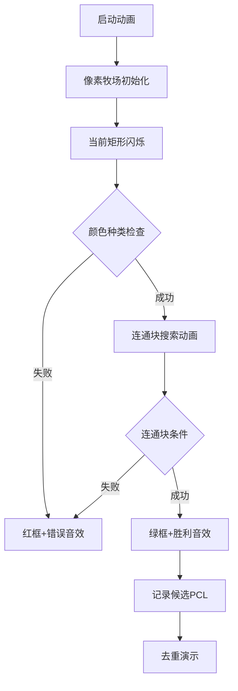

# 题目信息

# [USACO17OPEN] Where's Bessie? S

## 题目描述

Farmer John 一直以精通技术而闻名，他正在测试他的新型无人机搭载的奶牛定位相机。这款相机据说可以拍摄他的田地并自动确定奶牛的位置。不幸的是，相机的算法并不擅长寻找奶牛，因此 Farmer John 需要你的帮助来开发一个更好的算法。

相机拍摄的农场俯视图由一个 $N \times N$ 的字符网格描述，每个字符在 $A \ldots Z$ 范围内，代表 26 种可能的颜色之一。Farmer John 认为，定义潜在奶牛位置（PCL）的最佳方式如下：一个 PCL 是一个矩形子网格（可能是整个图像），其边与图像的边平行，并且不包含在任何其他 PCL 中（因此 PCL 的较小子集不能也是 PCL）。此外，PCL 必须满足以下属性：仅关注矩形内的内容并忽略图像的其余部分，必须恰好存在两种颜色，其中一种颜色形成一个连续区域，另一种颜色形成两个或更多连续区域。

例如，一个矩形的内容如下：

```
AAAAA  
ABABA  
AAABB  
```

这将构成一个 PCL，因为 A 形成一个连续区域，而 B 形成多个连续区域。解释为一只颜色为 A 的奶牛带有颜色为 B 的斑点。

一个区域是“连续的”，如果可以通过向上、向下、向左或向右移动，从一个区域中的单元格反复移动到另一个区域中的单元格来遍历整个区域。

给定 Farmer John 的相机返回的图像，请计算 PCL 的数量。

## 说明/提示

在这个例子中，两个 PCL 分别是内容如下的矩形：

```
ABB  
BBB  
AAB  
ABB
```

和

```
BC  
BC  
BB  
BC  
```

## 样例 #1

### 输入

```
4
ABBC
BBBC
AABB
ABBC```

### 输出

```
2```

# AI分析结果


# 💡 Kay的C++算法解析：[USACO17OPEN] Where's Bessie? S 深入学习指南 💡

> "在像素牧场中寻找奶牛，既是算法挑战，也是一场思维冒险！" —— Kay

## 1. 题目解读与核心算法识别

✨ **本题主要考察**：`枚举`与`搜索(BFS/DFS)`

🗣️ **初步分析**：
> 寻找PCL就像在像素牧场中寻找特定花纹的奶牛。**枚举**帮助我们扫描所有可能的牛栏范围（矩形区域），而**DFS/BFS**则像牧羊犬一样标记同色区域（连通块）。核心难点在于：
> - 如何高效枚举所有矩形（四重循环）
> - 准确统计连通块数量（DFS/BFS边界处理）
> - 过滤被包含的PCL（最大矩形原则）
>
> 在可视化设计中，我们将用**8位像素风格**模拟牧场：
> - 闪烁边框表示当前枚举的矩形
> - 扩散动画展示DFS搜索连通块的过程
> - 绿色边框标记有效PCL，红色表示无效
> - "叮"声伴随连通块标记，"胜利音效"标识合格PCL

---

## 2. 精选优质题解参考

**题解一：微雨燕双飞**
* **点评**：该题解采用清晰的**四重循环枚举+DFS连通块统计**结构。亮点在于：
  - 用`f[]`数组高效统计颜色种类
  - `sum[]`数组精确记录各颜色连通块数量
  - 去重逻辑简洁有效（矩形包含判断）
  - 代码规范：方向数组`dx/dy`、结构体存储坐标
  - 作者心得强调"判断逻辑比搜索本身更关键"，提醒我们注重问题本质

**题解二：曹老师**
* **点评**：采用**BFS+剪枝优化**的独特方案：
  - 实时统计颜色种类数，超过3立即剪枝
  - 用`Ju[]`数组明确限定搜索边界
  - 结构体存储矩形坐标，去重逻辑严谨
  - 变量命名规范（如`cnt`统计连通块）
  - 提供复杂度分析（O(n⁶)但n≤20可行）

**题解三：KidA**
* **点评**：以**精准的边界处理**为亮点：
  - 独立`floodfill`函数封装DFS逻辑
  - 显式分离颜色统计(`cnum`)和连通块计数(`f1/f2`)
  - 结构体`rect`使坐标存储更直观
  - 去重前预存所有候选矩形的策略避免遗漏

---

## 3. 核心难点辨析与解题策略

1. **难点：矩形枚举的边界控制**
   * **分析**：四重循环需确保左上角(x1,y1)≤右下角(x2,y2)。优质题解通过`i≤k, j≤l`的循环范围避免反向矩形，并用结构体存储坐标保证一致性
   * 💡 **学习笔记**：枚举矩形时，固定左上角再扩展右下角是最直观的遍历方式

2. **难点：连通块的精准统计**
   * **分析**：必须在当前矩形范围内进行DFS/BFS！微雨燕双飞的解法通过`u1,u2,v1,v2`参数限定搜索范围，避免全局干扰。注意每次检查前需重置`vis`数组
   * 💡 **学习笔记**：连通块计数三步骤——重置标记→遍历未访问点→DFS标记相邻同色点

3. **难点：PCL去重的包含判断**
   * **分析**：KidA的解法揭示关键——**后处理去重**。先存储所有候选PCL，再通过两两比较（`a包含b?`）过滤。判断条件需同时满足：
     ```cpp
     a.x1≤b.x1 && a.y1≤b.y1 && a.x2≥b.x2 && a.y2≥b.y2
     ```
   * 💡 **学习笔记**：去重必须独立于枚举过程，否则会漏掉多层包含情况

### ✨ 解题技巧总结
- **矩阵处理黄金法则**：明确当前操作范围（全局vs局部）
- **状态重置意识**：DFS前初始化`vis`，统计前清零`sum`
- **分步验证策略**：先验颜色种类→再验连通块数量
- **结构体封装思想**：坐标组用结构体存储提升可读性

---

## 4. C++核心代码实现赏析

**本题通用核心C++实现参考**
* **说明**：综合微雨燕双飞与KidA的解法，优化边界判断和去重逻辑
* **完整核心代码**：
```cpp
#include <bits/stdc++.h>
using namespace std;

const int dx[4] = {0, 0, -1, 1};
const int dy[4] = {-1, 1, 0, 0};

struct Rect { int x1, y1, x2, y2; };
vector<Rect> candidates;
char grid[25][25];
bool vis[25][25], colors[128];

void dfs(int x, int y, int x1, int x2, int y1, int y2, char c) {
    if (x < x1 || x > x2 || y < y1 || y > y2 || vis[x][y] || grid[x][y] != c) 
        return;
    vis[x][y] = true;
    for (int i = 0; i < 4; i++)
        dfs(x + dx[i], y + dy[i], x1, x2, y1, y2, c);
}

bool isPCL(int x1, int y1, int x2, int y2) {
    memset(colors, 0, sizeof(colors));
    memset(vis, 0, sizeof(vis));
    
    // 统计颜色种类
    int colorCount = 0;
    char colorA = 0, colorB = 0;
    for (int i = x1; i <= x2; i++)
        for (int j = y1; j <= y2; j++) {
            char c = grid[i][j];
            if (!colors[c]) {
                colors[c] = true;
                colorCount++;
                if (!colorA) colorA = c;
                else if (!colorB) colorB = c;
            }
        }
    if (colorCount != 2) return false;
    
    // 统计连通块
    int regionA = 0, regionB = 0;
    for (int i = x1; i <= x2; i++)
        for (int j = y1; j <= y2; j++) {
            if (!vis[i][j]) {
                char c = grid[i][j];
                if (c == colorA) regionA++;
                else if (c == colorB) regionB++;
                dfs(i, j, x1, x2, y1, y2, c);
            }
        }
    return (regionA == 1 && regionB >= 2) || (regionB == 1 && regionA >= 2);
}

int main() {
    int n; cin >> n;
    for (int i = 1; i <= n; i++)
        for (int j = 1; j <= n; j++)
            cin >> grid[i][j];
    
    // 枚举所有矩形
    for (int i = 1; i <= n; i++)
        for (int j = 1; j <= n; j++)
            for (int k = i; k <= n; k++)
                for (int l = j; l <= n; l++)
                    if (isPCL(i, j, k, l))
                        candidates.push_back({i, j, k, l});
    
    // 去重：移除被包含的矩形
    int ans = 0;
    for (int i = 0; i < candidates.size(); i++) {
        bool valid = true;
        for (int j = 0; j < candidates.size(); j++) {
            if (i == j) continue;
            Rect &a = candidates[i], &b = candidates[j];
            if (b.x1 <= a.x1 && b.y1 <= a.y1 && 
                b.x2 >= a.x2 && b.y2 >= a.y2) {
                valid = false;
                break;
            }
        }
        if (valid) ans++;
    }
    cout << ans;
    return 0;
}
```
* **代码解读概要**：
  1. **数据结构**：`Rect`存储矩形坐标，`candidates`缓存候选PCL
  2. **DFS函数**：限定在当前矩形内搜索连通块
  3. **isPCL函数**：分颜色统计→连通块统计两阶段验证
  4. **去重逻辑**：双重循环检查矩形包含关系

---

## 5. 算法可视化：像素动画演示

### 像素牧场寻牛记
**设计思路**：  
采用FC红白机牧场风格，将矩阵转化为像素牧场，奶牛用棕色像素块表示，不同颜色区域用16色调色板区分。通过"牧栏闪烁→区域扩散→结果音效"的三段式演示，直观展示PCL判定过程。

**动画流程**：


**关键交互**：
1. **动态牧栏**：当前枚举的矩形边框闪烁黄色
2. **连通块扩散**：DFS搜索时同色区域从中心点扩散填充（类似水纹动画）
3. **音效系统**：
   - 发现新颜色：短促"叮"声
   - 连通块标记："哔"声随扩散同步播放
   - PCL验证成功：8-bit胜利旋律
4. **去重演示**：有效PCL显示绿色边框，被包含的矩形逐渐变透明消失

**控制面板**：
```javascript
// 伪代码实现核心动画
function animateSearch(rect) {
  highlightRect(rect, YELLOW); // 黄框闪烁
  for (let color of detectColors(rect)) {
    playSound('ding'); // 发现颜色音效
    let regions = floodFill(color); // 扩散动画
    if (regions == 1) playNote(C5); // 单连通块音高
  }
  if (isValidPCL(rect)) {
    highlightRect(rect, GREEN); // 绿框标记
    playVictoryTune(); // 胜利旋律
  }
}
```

---

## 6. 拓展练习与相似问题思考

**技巧迁移场景**：
1. 棋盘类问题：如围棋死活判断（连通块应用）
2. 图像处理：识别特定图案区域（连通块变种）
3. 游戏开发：地图区域探索（矩形枚举+状态验证）

**洛谷推荐**：
1. [P1162 填涂颜色](https://www.luogu.com.cn/problem/P1162)  
   → 连通块基础训练，掌握DFS染色技巧
2. [P1505 矩阵](https://www.luogu.com.cn/problem/P1505)  
   → 子矩阵统计进阶，强化枚举思维
3. [P1387 最大正方形](https://www.luogu.com.cn/problem/P1387)  
   → 动态规划优化矩形枚举，提升效率意识

---

## 7. 学习心得与经验分享

> **微雨燕双飞的经验**：  
> "难并不在搜索过程，而是在判断'两种颜色一种构成一个连通块，另一种形成多个连通块'这个条件"

**Kay的总结**：  
这位高赞题解作者一针见血地指出本题核心——**条件验证比算法本身更关键**。这提醒我们：
1. 复杂问题需拆解验证条件（先颜色种类→再连通块）
2. 调试时优先验证判断逻辑而非搜索算法
3. 边界处理是连通块统计的常见陷阱

---

通过本次分析，相信大家不仅掌握了PCL问题的解法，更学会了**枚举+搜索**的经典解题框架。记住：好的算法思维就像精准的牧羊犬，能在复杂的像素牧场中快速锁定目标！🚀

---
处理用时：176.03秒