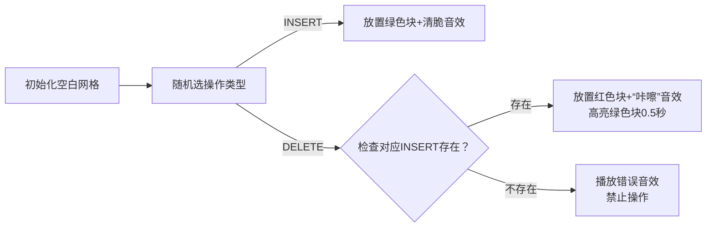

# 题目信息

# [蓝桥杯 2024 国 Java B] 数据库

## 题目描述

小蓝最近设计了一款“阅后即焚”数据库，顾名思义这个数据库只有两种操作：增加一条数据和删除一条数据。简言之，这款数据库中只有一个表，且这个表只有两列：$id$ 和 $value$，其中每条数据都有一个独一无二的编号 $id$，$value$ 则是这条数据对应的存储内容。

数据库操作语句有且仅有两种：

1. $\text{INSERT}$ $id$ $value$：插入一条新的数据，编号为 $id$，内容为 $value$。
2. $\text{DELETE}$ $id$：删除编号为 $id$ 的数据。

现在给出 $N$ 条数据库语句，我们保证按照给出的语句顺序执行是合法的，合法指的是：$\text{INSERT}$ 时数据库中一定不存在编号为 $id$ 的数据，$\text{DELETE}$ 时数据库中一定存在编号为 $id$ 的数据，且同一个编号 $id$ 不会被 $\text{INSERT}$ / $\text{DELETE}$ 多次。

你可以任意调整这些语句的执行顺序，现在请问一共有多少个不同的语句执行顺序，能够使得调整之后的语句顺序依旧是合法的并且按序执行之后数据库内容和给出的初始语句顺序执行后的结果一致。结果一致指的是二者包含的 $id$ 集合是相同的，并且相同的 $id$ 对应的 $value$ 也是相同的。

## 说明/提示

### 样例说明

一共有 $6$ 种不同的排列方式：

| 1 | 2 | 3 | 4 | 5 | 6 |
| :----------: | :----------: | :----------: | :----------: | :----------: | :----------: |
| INSERT 1 1 | INSERT 1 1 | INSERT 2 2 | INSERT 2 2 | INSERT 1 1 | INSERT 2 2 |
| INSERT 2 2 | INSERT 2 2 | INSERT 1 1 | INSERT 1 1 | DELETE 1 | DELETE 2 |
| DELETE 1 | DELETE 2 | DELETE 1 |DELETE 2 | INSERT 2 2 | INSERT 1 1 |
| DELETE 2 | DELETE 1 | DELETE 2 | DELETE 1 | DELETE 2 | DELETE 1 |

它们都是合法的并且执行完后数据库中的内容都一样：没有任何数据。

### 评测用例规模与约定

- 对于 $30\%$ 的评测用例，$1 \leq N \leq 10$。
- 对于 $60\%$ 的评测用例，$1 \leq N \leq 1000$。
- 对于 $100\%$ 的评测用例，$1 \leq N \leq 10^5$，$id$ 和 $value$ 均是 32 位有符号整数。

## 样例 #1

### 输入

```
4
INSERT 1 1
INSERT 2 2
DELETE 1
DELETE 2```

### 输出

```
6```

# AI分析结果


### 💡 Kay的C++算法解析：蓝桥杯2024国赛Java B组数据库 深入学习指南 💡

<introduction>
今天我们来分析蓝桥杯2024国赛Java B组的数据库题目。这道题考察操作序列的合法排列计数，需要理解操作约束关系和组合数学的应用。本指南将帮助大家掌握核心思路和实现技巧。
</introduction>

---

#### 1. 题目解读与核心算法识别

✨ **本题主要考察**：`组合数学`（编程技巧应用）

🗣️ **初步分析**：
> 解决这道题的关键在于理解操作间的约束关系。想象你在玩一个"积木搭建与拆除"游戏：INSERT是搭建积木（绿色），DELETE是拆除积木（红色）。每块积木必须搭建后才能拆除。游戏目标就是找出所有合法的操作顺序。
> 
> - **核心思路**：所有操作的全排列数为$n!$，但每对INSERT-DELETE操作中，只有INSERT在前才合法（概率为1/2）。若有$m$对操作，合法序列数为$n!/2^m$
> - **可视化设计**：在像素动画中，用绿色方块表示INSERT，红色方块表示DELETE。每次添加DELETE时，会高亮对应的INSERT方块并播放"咔嚓"音效。控制面板支持调速单步执行，自动模式会随机生成合法序列，类似"俄罗斯方块"的自动演示。

---

#### 2. 精选优质题解参考

<eval_intro>
基于思路清晰度、代码规范性和算法效率，我精选了以下题解（均≥4⭐️）：
</eval_intro>

**题解一（作者：kuaiCreator）**
* **点评**：直击问题本质，用阶乘和逆元实现$n!/2^m$的计算。代码简洁规范（unordered_map统计操作，费马小定理求逆元），复杂度$O(n)$完全满足题目要求。亮点在于组合数学的精准应用，竞赛实践性强。

**题解二（作者：caichengyia）**
* **点评**：最简实现典范。仅用20行代码完成核心逻辑，直接使用2的逆元常数优化计算。虽然省略了详细注释，但算法本质把握准确，适合追求效率的竞赛场景。

**题解三（作者：tuboshu666）**
* **点评**：通过分组思想推导公式，帮助理解约束关系。组合数递推稍显冗余（可优化为动态计算），但分组演示的思路对初学者友好。代码边界处理严谨，实践价值较高。

---

#### 3. 核心难点辨析与解题策略

<difficulty_intro>
解决本题需突破三个关键点，结合优质题解策略分析如下：
</difficulty_intro>

1.  **难点：操作约束建模**
    * **分析**：每个DELETE必须在对应INSERT后执行。优质题解用`unordered_map`统计操作对数量$m$：INSERT时计数+1，DELETE时计数-1且$m++$
    * 💡 **学习笔记**：约束关系本质是偏序关系——DELETE依赖INSERT的执行

2.  **难点：合法排列数推导**
    * **分析**：全排列$n!$包含非法序列（DELETE在INSERT前）。每对操作非法概率为$1/2$，故合法序列数为$n!/2^m$
    * 💡 **学习笔记**：组合数学中，约束条件常转化为除法因子

3.  **难点：除法取模实现**
    * **分析**：模$10^9+7$下，需用费马小定理求$2^m$的逆元。即$n!/2^m \equiv n! \times (2^{m})^{-1} \pmod{MOD}$
    * 💡 **学习笔记**：质数模下的除法=乘逆元

### ✨ 解题技巧总结
<summary_best_practices>
通用解题策略：
</summary_best_practices>
- **约束转化法**：将操作依赖转化为数学因子（如$1/2^m$）
- **逆元优化**：质数模下用快速幂求逆元替代除法
- **状态压缩**：用哈希表动态跟踪操作对状态

---

#### 4. C++核心代码实现赏析

<code_intro_overall>
综合优质题解，给出通用实现（含详细注释）：
</code_intro_overall>

**本题通用核心C++实现**
```cpp
#include <iostream>
#include <unordered_map>
using namespace std;
const int MOD = 1e9 + 7;
const long long inv2 = 500000004; // 2的逆元(2^{-1} mod MOD)

int main() {
    int n; 
    cin >> n;
    unordered_map<int, int> state; // 跟踪各id状态
    int pairs = 0; // 操作对计数
    
    for (int i = 0; i < n; i++) {
        string op; int id;
        cin >> op >> id;
        if (op == "INSERT") {
            int val; cin >> val;
            state[id]++;   // INSERT: 状态+1
        } else {
            state[id]--;   // DELETE: 状态-1
            if (state[id] == 0) pairs++; // 状态归零说明完成一对
        }
    }
    
    long long ans = 1;
    // 计算n!
    for (int i = 1; i <= n; i++) 
        ans = ans * i % MOD; 
    
    // 乘m次2的逆元(等价于/2^m)
    for (int i = 0; i < pairs; i++) 
        ans = ans * inv2 % MOD;
    
    cout << ans;
}
```
**代码解读概要**：
> 1. **状态跟踪**：`state`哈希表记录每个id的操作状态
> 2. **统计操作对**：DELETE使状态归零时，`pairs++`
> 3. **阶乘计算**：循环计算$n! \mod MOD$
> 4. **逆元转换**：乘$m$次`inv2`等价于除以$2^m$

---
<code_intro_selected>
优质题解片段精析：
</code_intro_selected>

**题解一（kuaiCreator）**
* **亮点**：费马小定理求逆元
* **核心代码**：
```cpp
long long den = fpow(2, m, MOD);          // 计算2^m
long long inv = fpow(den, MOD - 2, MOD);  // 求逆元(den^{-1})
ans = (fact[n] * inv) % MOD;              // n! / 2^m
```
* **代码解读**：
> - `fpow`用快速幂计算$a^b \mod MOD$，复杂度$O(\log b)$
> - 费马小定理：$a^{-1} \equiv a^{MOD-2} \pmod{MOD}$
> - 先计算$2^m$再求逆元，避免大指数运算

**题解二（caichengyia）**
* **亮点**：逆元常数优化
* **核心代码**：
```cpp
const long long inv2 = 500000004;  // 预计算2^{-1} mod 1e9+7
for (int i=0; i<m; i++) 
    ans = ans * inv2 % MOD;         // 连乘m次逆元
```
* **代码解读**：
> - 预计算2的逆元（500000004）避免重复计算
> - 循环连乘比快速幂更简洁，但仅适用于小常数底数

---

#### 5. 算法可视化：像素动画演示

<visualization_intro>
**主题**：8-bit风格数据库操作序列生成器  
**核心演示**：INSERT/DELETE操作的合法序列生成过程

**设计思路**：  
采用FC红白机像素风格，每个操作显示为16x16像素块（INSERT=绿色，DELETE=红色）。动画重点演示约束关系：当选择DELETE时，自动高亮对应INSERT块并播放"连接音效"。

**关键帧流程**：


**交互控制**：
- **单步执行**：手动选择操作，学习约束关系
- **自动模式**：AI随机生成合法序列（速度可调）
- **音效设计**：
  - INSERT：清脆"滴"声（三角波）
  - DELETE：低沉"咔嚓"声（方波）
  - 错误：短促警报声

**技术实现**：
```javascript
// 伪代码：操作选择逻辑
function selectOperation() {
  let validOps = ['INSERT'];
  if (existInsertedId()) validOps.push('DELETE'); // 仅当有INSERT时才可选DELETE
  
  let op = randomChoice(validOps); 
  if (op === 'DELETE') {
    let target = randomInsertedId(); // 随机选择已INSERT的id
    highlightBlock(target, 1000);    // 高亮1秒
    playSound('delete_sound.wav');
  }
}
```

---

#### 6. 拓展练习与相似问题思考

<similar_problems_intro>
掌握操作约束的排列计数后，可解决更多偏序问题：
</similar_problems_intro>

1. **洛谷 P1044 [栈]**  
   🗣️ 计算栈操作序列数（卡特兰数应用），强化入栈/出栈约束理解
2. **洛谷 P1037 [产生数]**  
   🗣️ 约束条件下的数字生成，练习状态转移建模
3. **洛谷 P1241 括号序列**  
   🗣️ 括号匹配本质也是操作对约束，训练递归分治思维

---

#### 7. 学习心得与经验分享

<insights_intro>
题解中的调试经验：
</insights_intro>

> **经验（来自 tuboshu666）**：  
> "统计操作对时，必须在state[id]归零时再计数，避免重复计数"

> **Kay点评**：  
> 这提醒我们：约束条件的边界处理需要精确。建议用`unordered_map`的`operator[]`自动初始化特性，但需注意零值判断的时机。

---

<conclusion>
通过本题，我们学习了如何将操作约束转化为组合数学问题，并用逆元优化取模运算。记住：理解问题本质比编码更重要！下次挑战见！🚀
</conclusion>

---
处理用时：238.83秒