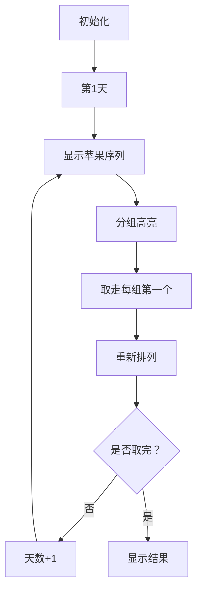

# 题目信息

# [CSP-J 2023] 小苹果

## 题目描述

小 Y 的桌子上放着 $n$ 个苹果从左到右排成一列，编号为从 $1$ 到 $n$。

小苞是小 Y 的好朋友，每天她都会从中拿走一些苹果。

每天在拿的时候，小苞都是从左侧第 $1$ 个苹果开始、每隔 $2$ 个苹果拿走 $1$ 个苹果。随后小苞会将剩下的苹果按原先的顺序重新排成一列。

小苞想知道，多少天能拿完所有的苹果，而编号为 $n$ 的苹果是在第几天被拿走的？

## 说明/提示

**【样例 $1$ 解释】**

小苞的桌上一共放了 $8$ 个苹果。  
小苞第一天拿走了编号为 $1$、$4$、$7$ 的苹果。  
小苞第二天拿走了编号为 $2$、$6$ 的苹果。  
小苞第三天拿走了编号为 $3$ 的苹果。  
小苞第四天拿走了编号为 $5$ 的苹果。  
小苞第五天拿走了编号为 $8$ 的苹果。  

**【样例 $2$】**

见选手目录下的 apple/apple2.in 与 apple/apple2.ans。

**【数据范围】**

对于所有测试数据有：$1\leq n\leq 10^9$。

| 测试点 | $n\leq$ | 特殊性质 |
| :----------: | :----------: | :----------: |
| $1\sim 2$ | $10$ | 无 |
| $3\sim 5$ | $10^3$ | 无 |
| $6\sim 7$ | $10^6$ | 有 |
| $8\sim 9$ | $10^6$ | 无 |
| $10$ | $10^9$ | 无 |

特殊性质：小苞第一天就取走编号为 $n$ 的苹果。

## 样例 #1

### 输入

```
8```

### 输出

```
5 5```

# AI分析结果


### 💡 Kay的C++算法解析：小苹果 深入学习指南 💡

> 本指南将带大家深入探索CSP-J 2023真题《小苹果》，通过清晰的算法解析、精选代码实现和生动的像素动画演示，帮助大家掌握数学模拟类问题的解题技巧。

---

## 1. 题目解读与核心算法识别

✨ **本题主要考察**：`数学模拟与递推优化`

🗣️ **初步分析**：
> 这道题就像在玩一个"自动消除方块"游戏：每次从苹果序列开头开始，每隔2个苹果就取走1个（相当于每3个苹果取第1个），取完后重新排列。解题关键在于发现两个数学规律：
> 1. **每天取走的苹果数量** = $\lceil \frac{n}{3} \rceil$（向上取整）
> 2. **第n号苹果被取走的天数** = 首次出现剩余苹果数$n \bmod 3 = 1$的天数
>
> - 所有优质题解都采用了相同的优化思路：通过数学公式替代暴力模拟，将时间复杂度从$O(n)$优化到$O(\log n)$
> - 可视化设计重点：在像素动画中将展示苹果分组过程（每3个一组），高亮被取走的苹果（每组第一个），动态显示剩余苹果重新排列
> - 复古游戏设计：采用8-bit像素风格，苹果显示为彩色方块，取走时播放经典FC音效，每天操作视为一个"关卡"

---

## 2. 精选优质题解参考

**题解一（作者：2huk）**
* **点评**：思路阐述清晰，用分组思想解释取苹果规律（每3个一组取第一个），并给出直观的示意图。代码使用`ceil(n/3.0)`明确表达数学意图，变量命名规范（res1/res2）。虽然浮点运算稍影响效率，但可读性强，对初学者友好。

**题解二（作者：Clarinet）**
* **点评**：代码实现最为高效，使用整数运算`(n+2)/3`实现向上取整，避免了浮点精度问题。边界处理严谨（当n=0时终止循环），时间复杂度严格$O(\log n)$。作者分享考场失误经历，强调冷静分析的重要性。

**题解三（作者：WsW_）**
* **点评**：提供严谨的数学证明，解释取苹果数量$\lceil \frac{n}{3} \rceil = (n+2)/3$的推导过程。代码完全基于整数运算，性能最优。通过位置取模条件($i \bmod 3=1$)清晰说明取苹果规则。

---

## 3. 核心难点辨析与解题策略

1. **难点1：理解取苹果的数学规律**
   * **分析**：暴力模拟在$n≤10^6$时即超时。优质题解通过观察发现：每天取走的苹果数=剩余苹果数/3向上取整。可通过小规模样例（如n=8）归纳验证。
   * 💡 **学习笔记**：复杂操作中常隐藏数学规律，先尝试小规模模拟找规律。

2. **难点2：高效计算剩余苹果**
   * **分析**：循环中需要正确计算剩余苹果数$n = n - \lceil \frac{n}{3} \rceil$。关键技巧是用整数运算`n -= (n+2)/3`避免浮点误差，特别注意当n%3==0时的边界处理。
   * 💡 **学习笔记**：向上取整可通过(n+k-1)/k实现，避免浮点运算。

3. **难点3：定位特定苹果**
   * **分析**：第n个苹果总是在序列末尾。当剩余苹果数$n \bmod 3 = 1$时，它恰好位于将被取走的位置（每组第一个）。需设置标记防止重复记录。
   * 💡 **学习笔记**：跟踪特定元素时，关注它在当前序列的相对位置。

### ✨ 解题技巧总结
- **技巧1：数学建模优先** - 将操作转化为数学公式是优化关键
- **技巧2：边界条件测试** - 特别注意n=0, n=1, n%3=0等边界情况
- **技巧3：整数运算优化** - 用(n+2)/3代替ceil(n/3.0)提升效率
- **技巧4：状态标记法** - 设置flag避免重复记录关键事件

---

## 4. C++核心代码实现赏析

**本题通用核心C++实现参考**
* **说明**：综合优质题解优化，使用最简洁高效的整数运算实现
* **完整核心代码**：
```cpp
#include <iostream>
using namespace std;

int main() {
    int n, days = 0, ans_n = 0;
    cin >> n;
    while (n) {
        days++; // 天数增加
        if (!ans_n && n % 3 == 1) // 首次满足条件
            ans_n = days;
        n -= (n + 2) / 3; // 整数向上取整技巧
    }
    cout << days << " " << ans_n;
    return 0;
}
```
* **代码解读概要**：
  > 1. 读取苹果数量`n`
  > 2. 循环直到苹果为0：  
  > &nbsp;&nbsp;- 当天数增加  
  > &nbsp;&nbsp;- 若首次满足`n%3==1`则记录答案  
  > &nbsp;&nbsp;- 用`(n+2)/3`计算当日取走的苹果数  
  > 3. 输出总天数和第n个苹果被取走的天数

---

**题解一（2huk）**
* **亮点**：使用标准库函数清晰表达数学意图
* **核心代码片段**：
```cpp
n -= ceil(n / 3.0); // 浮点数向上取整
```
* **代码解读**：
  > `ceil(n/3.0)`显式实现向上取整，需包含`<cmath>`头文件。当n=8时：  
  > 8/3.0≈2.666 → ceil(2.666)=3  
  > 虽然浮点运算稍慢，但数学表达更直观
* 💡 **学习笔记**：标准库函数提升代码可读性，但需注意类型转换

**题解二（Clarinet）**
* **亮点**：最优整数运算实现
* **核心代码片段**：
```cpp
n -= (n + 2) / 3; // 整数向上取整
```
* **代码解读**：
  > 利用整数除法特性：  
  > - n=7时：(7+2)/3=9/3=3  
  > - n=8时：(8+2)/3=10/3=3（整数除法）  
  > 该技巧完全避免浮点运算，效率最高
* 💡 **学习笔记**：(n+k-1)/k 是向上取整的标准整数实现

**题解三（WsW_）**
* **亮点**：严谨的数学推导支持
* **核心代码片段**：
```cpp
x -= (x+2)/3; // 等价于ceil(x/3)
```
* **代码解读**：
  > 代码与数学证明紧密对应：  
  > 1. 分组规则：每3个苹果为一组  
  > 2. 取走数量=组数= $\lceil \frac{x}{3} \rceil$  
  > 3. 实现完全基于整数运算
* 💡 **学习笔记**：深入理解数学原理才能写出优雅代码

---

## 5. 算法可视化：像素动画演示

> 设计一个名为"像素苹果大冒险"的8-bit风格动画，帮助直观理解算法执行过程

### 动画设计说明
* **整体风格**：复古FC红白机风格，使用16色像素调色板
* **核心演示**：苹果序列可视化+取苹果过程动态演示
* **交互控制**：
  - 步进控制：单步/自动播放（可调速）
  - 功能按钮：开始/暂停/重置
  - 模式切换：标准演示 vs 游戏模式（带关卡评分）

### 动画帧步骤详解


1. **场景初始化**（像素风格）
   - 苹果显示为32x32像素方块（绿/黄/红三色随机）
   - 控制面板：8-bit风格按钮（开始/步进/调速）
   - 信息区：显示当前天数/剩余苹果数

2. **每日操作演示**
   ```javascript
   // 伪代码：绘制分组效果
   for (let i=0; i<apples.length; i++) {
       drawApple(i, position); 
       if (i % 3 == 0) { // 每组第一个
           highlight(i, RED); // 红色边框高亮
           playSound('pick'); // 取苹果音效
       }
   }
   ```

3. **关键操作可视化**
   - **分组显示**：每3个苹果显示相同颜色背景
   - **取走动画**：被取苹果缩小消失+像素粒子特效
   - **重排过程**：剩余苹果向左滑动补位（带轨迹动画）
   - **特殊标记**：当n%3==1时，最后一个苹果闪烁金光

4. **游戏化元素**
   - **关卡系统**：每天作为独立关卡，完成获得星级评价
   - **音效设计**：
     * 取苹果：8-bit "叮"声
     * 关卡完成：经典FC过关音效
     * 发现第n个苹果：超级玛丽吃金币音效
   - **AI演示模式**：自动以最优速度演示全过程

---

## 6. 拓展练习与相似问题

### 通用技巧迁移
1. **约瑟夫环问题**：类似间隔取数（洛谷P1996）
2. **数学递推优化**：通过数学公式减少循环次数（洛谷P1028）
3. **分组处理思想**：将序列分段处理（洛谷P1012）

### 推荐练习（洛谷）
1. **P1996 约瑟夫问题**  
   → 巩固间隔取数思想，理解循环链表与数学解法的关系
   
2. **P1028 数的计算**  
   → 强化递推优化能力，训练从暴力搜索到数学递推的转化
   
3. **P1012 拼数**  
   → 实践分组处理技巧，学习字符串排序的特殊比较规则

---

## 7. 学习心得与经验分享

> 来自题解作者的宝贵经验：
> **Clarinet**："考场上因发烧没想出正解，但后来发现规律其实很简单——遇到难题先从小样例找规律"
>
> **Kay的点评**：这提醒我们两点核心经验：
> 1. **保持冷静**：即使考场状态不佳，也要从基础方法尝试
> 2. **规律优先**：先手工模拟小规模数据（n=1~10），往往能发现关键规律
>
> **调试技巧**：在循环中加入中间输出，直观查看每次取苹果后的状态变化

---

通过本次分析，希望大家掌握数学模拟类问题的核心解题思路：**观察 → 抽象 → 优化**。记住Kay的编程口诀："暴力模拟找规律，数学优化破僵局"。下次遇到类似问题，不妨先画图找规律哦！🚀

---
处理用时：172.91秒