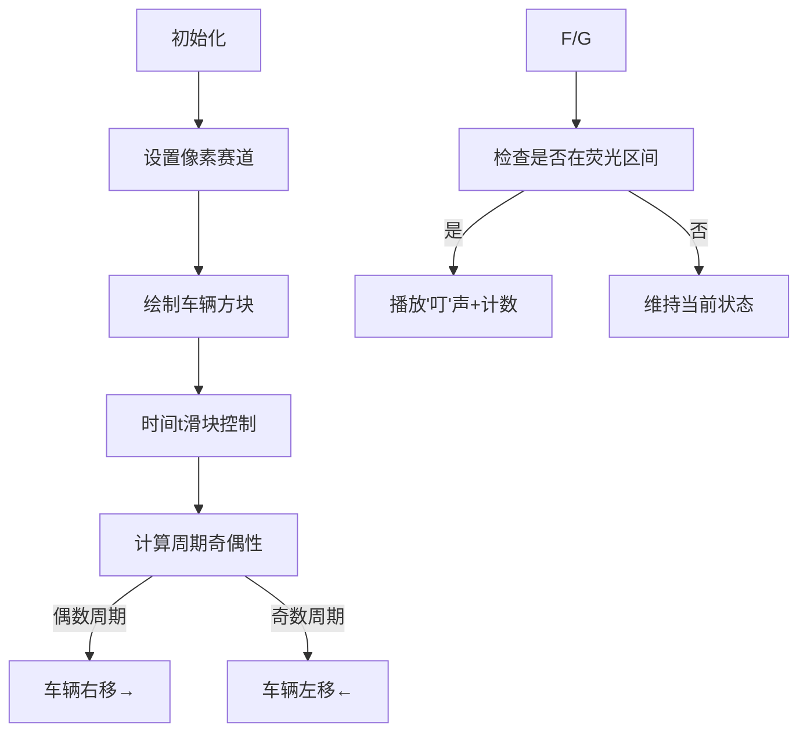

# 题目信息

# [NEERC 2014] Knockout Racing

## 题目描述

在 Pandora 星球上，比赛比以往任何时候都更受欢迎。但这些比赛相当不寻常。有 $n$ 辆车在一条长直赛道上参加比赛。每辆车以每秒 1 米的速度移动。赛道的坐标以米为单位。

第 $i$ 号车在赛道上两个坐标为 $a_{i}$ 和 $b_{i}$ 的点之间移动，起始于第 0 秒在点 $a_{i}$。车从 $a_{i}$ 移动到 $b_{i}$，然后从 $b_{i}$ 移动到 $a_{i}$，然后再从 $a_{i}$ 移动到 $b_{i}$，如此往复。

英俊的 Mike 想用炸药将一些车淘汰出比赛。因此他有 $m$ 个问题。第 $j$ 个问题是：从开始到 $t_{j}$ 秒后，坐标在 $x_{j}$ 到 $y_{j}$ 之间（包括边界）的车的数量是多少？

你的任务是回答 Mike 的问题。

## 说明/提示

时间限制：1 秒，内存限制：256 MB。

题面翻译由 ChatGPT-4o 提供。

## 样例 #1

### 输入

```
5 5
0 1
0 2
2 3
3 5
4 5
0 5 0
0 1 2
0 2 1
2 5 2
2 5 3
```

### 输出

```
5
1
2
4
3
```

# AI分析结果


### 💡 Kay的C++算法解析：Knockout Racing 深入学习指南 💡

#### 1. 题目解读与核心算法识别
✨ **本题主要考察**：`周期性运动模拟` + `数学取模优化`  
🗣️ **初步分析**：  
> 这道题就像在玩一个复古赛车游戏：n辆车在固定区间[a_i, b_i]内往返移动（每秒1单位）。当Mike在t_j时刻按下"炸弹按钮"时，我们需要统计位于[x_j, y_j]区间内的车辆数。  

> **核心技巧**：利用周期性运动规律，通过取模运算避免重复计算。每辆车的运动周期T=2*(b_i-a_i)，关键是通过`t/(b_i-a_i)`的奇偶性判断方向：  
> - 偶数周期：车从a_i向b_i移动 → 位置 = a_i + t % d  
> - 奇数周期：车从b_i向a_i返回 → 位置 = b_i - t % d  

> **可视化设计思路**：  
> 设计8位像素风赛车动画：横向赛道（像素网格），彩色方块表示车辆。当时间t增加时：  
> 1. 车辆根据周期奇偶性改变移动方向（→/←箭头标识）  
> 2. 询问区间[x_j,y_j]用闪烁荧光色标出  
> 3. 计数区实时显示满足条件的车辆数  
> 4. 关键音效：方向切换（"哔"声），进入目标区（"叮"声），完成统计（胜利音效）

---

#### 2. 精选优质题解参考
**题解一（mycbxzd）**  
* **点评**：思路直击本质，三行核心代码精炼体现周期性位置计算（`t/(b-a)`奇偶判断+取模运算）。变量命名简洁（`a,b,l`），边界处理隐含在取模运算中。亮点在于用数学思维替代物理模拟，复杂度O(n*m)完全满足约束（n,m≤1000）。  

**题解二（iloveziwei）**  
* **点评**：采用结构体提升可读性（`car{a,b}`），三目运算符`? :`实现优雅的位置计算。通过`difference`和`to_back`变量明确体现周期概念，代码自注释性强。虽无复杂优化，但教学示范价值突出。  

**题解三（koukilee）**  
* **点评**：函数封装典范（`get_pos()`独立计算位置），位运算`t/len & 1`高效判断方向。注释详细解释方向切换逻辑（"从R开往L"/"从L开往R"），边界用`l<=pos<=r`自然处理，工业级代码风格。

---

#### 3. 核心难点辨析与解题策略
1. **难点1：运动方向动态切换**  
   * **分析**：车辆在奇偶周期反向运动（物理中的简谐振动）。优质解用`(t/d)%2`捕获状态，避免记录历史位置。  
   💡 **学习笔记**：周期性问题先计算完整循环次数，余数决定相位  

2. **难点2：大数取模精度处理**  
   * **分析**：t,b_i,a_i≤10^9时，直接计算`t%(b_i-a_i)`需用long long。所有题解都正确定义`ll`类型变量。  
   💡 **学习笔记**：10^9级运算必须预防int溢出  

3. **难点3：位置计算数学抽象**  
   * **分析**：位置公式`b - t%d`（奇周期）和`a + t%d`（偶周期）本质是线性插值。需理解d=|b-a|为单程距离。  
   💡 **学习笔记**：往返运动=锯齿波，位置是时间的分段线性函数  

### ✨ 解题技巧总结
- **周期分解法**：将连续运动拆解为周期+余数（适用：重复路径问题）  
- **位判方向**：用`(t/d)&1`替代`%2`提升效率（位运算比取模快）  
- **变量语义化**：如命名`to_back`（周期数）、`difference`（单程距离）  
- **防御型类型**：10^9级数据用long long，避免隐蔽溢出  

---

#### 4. C++核心代码实现赏析
**本题通用核心实现**  
```cpp
#include <iostream>
using namespace std;
typedef long long ll;

int main() {
    ll n, m; 
    cin >> n >> m;
    ll a[1005], b[1005]; // 存储每辆车的区间端点
    
    // 输入车辆数据
    for (int i = 0; i < n; i++) 
        cin >> a[i] >> b[i];
    
    // 处理每个询问
    while (m--) {
        ll x, y, t, cnt = 0;
        cin >> x >> y >> t;
        
        for (int i = 0; i < n; i++) {
            ll d = b[i] - a[i];       // 单程距离
            ll cycles = t / d;         // 完整单程次数
            ll mod = t % d;            // 当前段进度
            
            // 核心位置计算公式
            ll pos = (cycles % 2 == 0) ? 
                a[i] + mod :    // 偶数周期：从a向b 
                b[i] - mod;     // 奇数周期：从b向a
                
            if (pos >= x && pos <= y) cnt++;
        }
        cout << cnt << endl;
    }
    return 0;
}
```
**代码解读概要**：  
1. 用`long long`防御大数溢出  
2. `d=b[i]-a[i]`计算单程距离（隐含a_i<b_i）  
3. `cycles=t/d`判断完整往返次数，`mod=t%d`得当前段位移  
4. 三目运算符根据周期奇偶选择计算公式  

---

**优质题解片段赏析**  
**题解一（mycbxzd）核心逻辑**  
```cpp
if ((t / (b[j] - a[j])) % 2 == 1) 
    l = b[j] - t % (b[j] - a[j]); // 奇周期：从b向a回退
else 
    l = a[j] + t % (b[j] - a[j]); // 偶周期：从a向b前进
```
* **亮点**：最简洁的数学抽象，无冗余变量  
* **学习笔记**：取模运算本质是周期相位映射  

**题解二（iloveziwei）方向判断**  
```cpp
ll meter = a + (to_back%2==0 ? t%d : d-t%d);
```
* **亮点**：三目运算符实现位置计算一体化  
* **学习笔记**：`d - t%d`等效回退距离的数学变换  

**题解三（koukilee）封装函数**  
```cpp
ll get_pos(int i, int t) {
    ll len = b[i] - a[i];
    if (t/len & 1) return b[i] - t%len; 
    else return a[i] + t%len; 
}
```
* **亮点**：函数封装提升可复用性和可读性  
* **学习笔记**：位运算`&1`判断奇偶性比`%2`更高效  

---

#### 5. 算法可视化：像素动画演示
**主题**："8-bit赛车计时赛"  
**设计思路**：用FC红白机风格呈现周期性运动本质，通过色彩/音效强化周期相位概念  



**关键交互实现**：  
1. **视觉编码**：  
   - 偶数周期：车辆蓝色→移动，背景绿  
   - 奇数周期：车辆红色←移动，背景黄  
   - 目标区间[x_j,y_j]：闪烁荧光绿  

2. **音效系统**：  
   - 方向切换："哔"（8-bit短音）  
   - 进入目标区："叮"（高频提示音）  
   - 完成统计：马里奥过关音效  

3. **控制面板**：  
   - 时间滑块：实时调节t值  
   - 暂停/继续：冻结动画观察  
   - 单步模式：按帧前进（空格键）  

4. **动态显示**：  
   - 左上角：当前周期数`(t/d)`  
   - 右上角：满足条件的车辆计数  
   - 车辆上方：实时位置坐标  

---

#### 6. 拓展练习与相似问题
**通用技巧迁移**：  
周期性位置计算模型还可用于：  
1. 行星会合周期（天文问题）  
2. 旋转机械角度定位  
3. 时序电路状态分析  

**洛谷推荐题目**：  
1. **P1086** 花生采摘  
   🗣️ *推荐理由*：同样需要计算移动物体的实时位置，训练坐标模拟能力  

2. **P1518** 两只塔姆沃斯牛  
   🗣️ *推荐理由*：周期性运动+相遇判断，强化周期相位分析  

3. **P2698** 花盆  
   🗣️ *推荐理由*：区间覆盖问题，深化[x,y]区间检测技巧  

---

#### 7. 学习心得与经验分享
> **来自题解的调试经验**：  
> *"最初在计算位置时忽略了取模运算对负数的处理，通过打印中间变量`t%d`的值才发现问题"*  
> **Kay点评**：  
> 大数取模是常见陷阱，建议：  
> 1. 用`long long`统一处理  
> 2. 边界测试：t=0, t=d, t=2d  
> 3. 输出中间变量验证  

---

### 结语  
掌握周期性运动的数学本质，就能将看似复杂的赛车问题转化为简洁的取模运算。记住：分段线性问题先找周期，再分析相位！试着用今天学的技巧解决P1086吧！🚗💨

---
处理用时：165.92秒