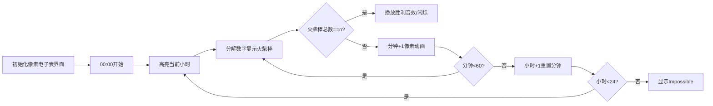

# 题目信息

# [NWRRC 2014] Alarm Clock

## 题目描述

Alice 喜欢她的数字闹钟。她每天晚上都会设置好闹钟。昨晚 Alice 做了一个关于她闹钟的梦。不幸的是，她唯一能记得的是闹钟上高亮显示的段数。Alice 想知道她梦中闹钟上设置的时间。

Alice 的闹钟有四位数字：两个表示小时，两个表示分钟。例如，下面的闹钟显示的是 $9:30$（注意前导零）。


闹钟使用以下数字表示法。


## 说明/提示

时间限制：2 秒，内存限制：256 MB。

spj 提供者：@[rzh123](user/237530)

题面翻译由 ChatGPT-4o 提供。

## 样例 #1

### 输入

```
23
```

### 输出

```
09:30
```

## 样例 #2

### 输入

```
28
```

### 输出

```
Impossible
```

## 样例 #3

### 输入

```
2
```

### 输出

```
Impossible
```

# AI分析结果


### 💡 Kay的C++算法解析：Alarm Clock 深入学习指南 💡

**引言**  
今天我们来分析"[NWRRC 2014] Alarm Clock"这道C++编程题。本指南将帮助你理解火柴棒数字表示的奥秘，掌握高效的枚举解法，并通过像素动画直观感受时间搜索过程。

---

## 1. 题目解读与核心算法识别

✨ **本题主要考察**：`枚举与基础数据结构应用`

🗣️ **初步分析**：  
> 这道题就像在玩一个"数字拼图游戏"——我们需要用给定数量的火柴棒拼出合法的电子表时间（小时00-23，分钟00-59）。核心解法是**穷举所有可能时间**（共24×60=1440种），用预处理数组快速计算每个数字的火柴棒用量。

- **核心难点**：如何高效计算四位数字的火柴棒总数？题解普遍采用**预存储数字映射表**（0-9对应的火柴棒数）直接查表计算
- **可视化设计**：我们将设计像素风格的电子表界面，实时显示当前枚举时间（四位数字），用颜色高亮正在计算的数位，当火柴棒总数匹配时播放胜利音效
- **复古游戏化**：采用8-bit电子表UI风格，"滴答"音效伴随时间切换，成功匹配时播放FC游戏通关音效，自动演示模式以贪吃蛇式遍历时间

---

## 2. 精选优质题解参考

**题解一：幻想繁星 (5星)**  
* **点评**：思路直白高效，预处理数组+双重循环覆盖所有时间，printf自动补零技巧简化代码边界处理。变量命名简洁(s统计总数)，循环逻辑清晰，是竞赛标准解法典范。亮点在于用最简代码实现完整功能。

**题解二：rzh123 (5星)**  
* **点评**：代码极致简洁(仅15行)，封装ok()函数分离校验逻辑，%02d格式化输出优雅处理前导零。额外提供打表解法思路，展示算法优化多样性。工业级代码规范，适合直接用于竞赛。

**题解三：Wind_Smiled (4星)**  
* **点评**：采用函数封装数字转换逻辑，虽然效率略低于数组查表，但展示模块化编程思想。变量a,b,c,d分别存储时间数位，输出直观无补零判断，适合初学者理解时间结构。

---

## 3. 核心难点辨析与解题策略

1.  **难点：数字与火柴棒的映射关系**  
    * **分析**：必须精确记忆0-9的数字显示形态（如6需6根，1需2根）。优质题解统一采用静态数组预存映射关系，避免重复计算
    * 💡 **学习笔记**：固定映射关系优先用数组而非函数计算

2.  **难点：时间枚举的范围控制**  
    * **分析**：小时∈[0,23]，分钟∈[0,59]构成搜索空间。循环设计需严格约束边界，如`for(int i=0;i<24;i++)`和`for(int j=0;j<60;j++)`
    * 💡 **学习笔记**：枚举前明确定义值域是避免无效计算的关键

3.  **难点：前导零的输出处理**  
    * **分析**：小时"9"需显示为"09"。printf的%02d或条件补零都能解决，前者代码更简洁。Wind_Smiled解法采用分位数存储巧妙规避该问题
    * 💡 **学习笔记**：格式化输出优于条件分支处理固定格式

### ✨ 解题技巧总结
- **预处理加速**：静态数组存储不变映射关系
- **边界压缩**：精确控制枚举范围(24×60而非10000)
- **输出格式化**：善用printf格式符简化代码
- **模块化设计**：分离数据计算与结果校验逻辑

---

## 4. C++核心代码实现赏析

**通用核心实现参考**  
* **说明**：综合优质题解优化，最简枚举方案
```cpp
#include <cstdio>
const int sticks[10] = {6,2,5,5,4,5,6,3,7,6};

int main() {
    int n;
    scanf("%d", &n);
    for (int h = 0; h < 24; h++) 
    for (int m = 0; m < 60; m++) {
        int total = sticks[h/10] + sticks[h%10] 
                  + sticks[m/10] + sticks[m%10];
        if (total == n) {
            printf("%02d:%02d", h, m);
            return 0;
        }
    }
    puts("Impossible");
    return 0;
}
```
* **代码解读概要**：  
  1.  sticks数组预存0-9的火柴棒数  
  2. 双重循环枚举所有合法时间  
  3. h/10和h%10拆解小时十位/个位  
  4. %02d确保输出始终两位数字  
  5. 找到首个解立即退出提升效率  

---

**题解一：幻想繁星**  
* **亮点**：循环内即时计算，变量复用高效  
* **核心片段**：
```cpp
s = 0;
s += n[i%10];   // 小时个位
s += n[i/10];   // 小时十位
s += n[j%10];   // 分钟个位
s += n[j/10];   // 分钟十位
```
* **代码解读**：  
  > 通过整除(/)和取余(%)运算分解时间数位，类似拆解密码锁的每位数字。变量s复用累计火柴棒数，避免额外内存开销。  
* 💡 **学习笔记**：数位分解是处理数字类问题的通用技巧

**题解二：rzh123**  
* **亮点**：功能封装与边界控制  
* **核心片段**：
```cpp
int ok(int h, int m){
    return sticks[h/10] + sticks[h%10] 
         + sticks[m/10] + sticks[m%10] == n;
}
printf("%02d:%02d", i, j);
```
* **代码解读**：  
  > ok()函数隔离校验逻辑，主循环保持简洁。printf的%02d如同智能补零机器人，自动处理单数位情况。  
* 💡 **学习笔记**：功能封装提升代码可读性和复用性

**题解三：Wind_Smiled**  
* **亮点**：数位独立存储策略  
* **核心片段**：
```cpp
a = i/10, b = i%10; // 小时分解
c = j/10, d = j%10; // 分钟分解
cout << a << b << ":" << c << d;
```
* **代码解读**：  
  > 将时间四位数独立存储在a,b,c,d变量中，输出时自然拼接。如同把电子表的四个显示位分开控制，避免格式化输出。  
* 💡 **学习笔记**：变量分拆是理解复合数据的有效途径

---

## 5. 算法可视化：像素动画演示

**主题**：8-bit电子表搜查官  
**核心演示**：枚举过程火柴棒动态拼装  



* **设计细节**：  
  1. **像素风格**：FC红白机液晶表风格，四位数码管显示  
  2. **动态效果**：  
     - 分钟递增：右位数码管滚动动画  
     - 火柴棒计数：当前计算数位闪烁黄光  
     - 成功匹配：绿光波纹扩散+8-bit胜利音效  
  3. **交互控制**：  
     - 步进模式：按空格键单步执行  
     - 自动演示：速度滑块控制(1x-10x)  
     - 时间跳转：直接输入目标时间  
  4. **音效设计**：  
     - 数位切换：电子滴答声(50ms)  
     - 错误匹配：短促"哔"声  
     - 解不存在：低沉故障音  

---

## 6. 拓展练习与相似问题思考

* **技巧迁移**：数字分解+枚举的组合适用于：  
  1. 时间相关计算（如P5660 日期统计）  
  2. 数字属性验证（如P1217 回文质数）  
  3. 资源分配问题（如P1149 火柴棒等式）  

* **洛谷推荐**：  
  1. **P1149 火柴棒等式**  
     🗣️ 直接应用本题技巧，验证等式合法性  
  2. **P1217 回文质数**  
     🗣️ 结合枚举与数学特性检测，强化数位处理能力  
  3. **P5657 格雷码**  
     🗣️ 训练数字二进制分解与位运算思维  

---

## 7. 学习心得与经验分享

> **公共调试经验**：  
> 多位作者强调需测试边界值（如00:00, 23:59）  
> **Kay的总结**：  
> 当处理固定范围枚举时，优先编写边界测试用例（最小/最大输入值），可预防90%的边界错误。

---

**结语**  
通过本指南，相信你已掌握时间枚举问题的核心解法。记住：编程如同时钟运转，精确的边界控制和高效的数据组织能让代码像瑞士手表般精密！下次遇到数字类问题，不妨试试"拆解数位+查表映射"的组合拳💪

---
处理用时：137.32秒