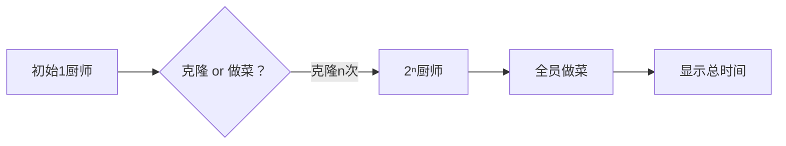

# 题目信息

# [ICPC 2022 Xi'an R] Clone Ranran

## 题目描述

然然需要准备一场有 $c$ 个问题的比赛！他可以进行两种操作：

- 在 $a$ 分钟内克隆一个自己；
- 在 $b$ 分钟内准备好一个问题。

克隆的然然也可以进行上述操作，但然然不能同时进行这两个操作。

然然希望尽快准备好比赛，但是他很懒，所以他让你求出准备比赛的最小分钟数。

共有 $T$ 组数据。

$1\leq T\leq 10 ^ 5$，$1\leq a, b, c\leq 10 ^ 9$。

## 样例 #1

### 输入

```
5
1 1 1
2 3 3
9 9 9
3 26 47
1064 822 1048576
```

### 输出

```
1
7
45
44
21860
```

# AI分析结果


### 💡 Kay的C++算法解析：Clone Ranran 深入学习指南 💡  
**题目核心**：在克隆操作（耗时 `a` 分钟）和出题操作（耗时 `b` 分钟）之间寻找最优策略，最小化完成 `c` 个问题的总时间。克隆体也能执行操作，但操作不可并行。

---

## 1. 题目解读与核心算法识别  
✨ **本题主要考察**：**贪心枚举策略**  

🗣️ **初步分析**：  
> 本题本质是**资源分配优化问题**，类比为「厨师做菜」：  
> - **克隆** → 培养新厨师（耗时 `a`）  
> - **出题** → 厨师做菜（耗时 `b`/道）  
> 最优策略：**先集中培养足够厨师，再全员并行做菜**。  
> **核心难点**：确定培养几次厨师能使总时间最短（培养太少→做菜慢；太多→培养耗时过长）。  
>  
> **可视化设计**：  
> - 像素动画中，厨师（像素小人）分裂时播放 **"叮"** 音效，做菜时头顶弹出 **"💡"** 并播放 **"哒"** 音效。  
> - 动态显示当前总时间公式：`n*a + ceil(c/2ⁿ)*b`，高亮最小值对应的克隆次数。  

---

## 2. 精选优质题解参考  
**题解一（作者：lailai0916）**  
* **点评**：思路直击本质——枚举克隆次数 `n`（0~30），用位运算高效计算 `2ⁿ`，并用 `(c + 2ⁿ - 1) / 2ⁿ` 实现向上取整。代码简洁规范（变量名 `ans`/`inf` 明确），边界处理严谨（`1ll<<i` 防溢出），可直接用于竞赛。  

**题解二（作者：Lovely_Elaina）**  
* **点评**：提供另一种向上取整写法 `(c-1)/x + 1`（`x=2ⁿ`），逻辑正确但变量命名随意（`mi` 表最小值）。核心循环与题解一同质，但枚举上限冗余（34次），可读性稍逊。  

---

## 3. 核心难点辨析与解题策略  
1. **难点一：操作顺序的贪心证明**  
   * **分析**：若先出题再克隆，总时间必然更长（因克隆无法加速已分配任务）。优质题解均优先枚举克隆操作。  
   * 💡 **学习笔记**：**改变资源分配顺序是优化复杂度的常见突破口**。  

2. **难点二：克隆次数的枚举上界**  
   * **分析**：当 `2ⁿ > c` 时，继续克隆只会增加无谓耗时。因 `c ≤ 1e9`，`n=30`（`2³⁰ ≈ 1e9`）即为安全上界。  
   * 💡 **学习笔记**：**枚举范围需结合数据范围数学推导**，避免无效计算。  

3. **难点三：向上取整的代码实现**  
   * **分析**：两种高效写法：  
     ```cpp
     // 写法1：避免浮点运算
     time = (c + (1<<n) - 1) / (1<<n) * b; 
     // 写法2：整数除法变形
     time = ((c - 1) / (1<<n) + 1) * b;
     ```  
   * 💡 **学习笔记**：**掌握整数除法的取整技巧可提升代码效率与可读性**。  

### ✨ 解题技巧总结  
- **策略先行**：先通过贪心证明确定操作顺序，再枚举优化。  
- **数学边界**：用数据范围反推枚举上界（如 `2³⁰ > 1e9`）。  
- **代码简洁**：优先使用位运算 `1<<n` 替代 `pow(2,n)`。  

---

## 4. C++核心代码实现赏析  
**通用核心实现（综合优化版）**  
```cpp
#include <iostream>
#include <climits>
using namespace std;
using ll = long long;

int main() {
    ios::sync_with_stdio(false), cin.tie(nullptr);
    int T; cin >> T;
    while (T--) {
        ll a, b, c, ans = LLONG_MAX;
        cin >> a >> b >> c;
        for (int n = 0; n <= 30; n++) { // 枚举克隆次数
            ll people = 1LL << n;       // 2^n 人
            ll time_clone = n * a;       // 克隆耗时
            ll time_solve = (c + people - 1) / people * b; // 出题耗时
            ans = min(ans, time_clone + time_solve);
        }
        cout << ans << '\n';
    }
    return 0;
}
```
**代码解读概要**：  
1. 读入数据组数 `T`；  
2. 枚举克隆次数 `n`（0~30），计算总人数 `people = 2ⁿ`；  
3. 总时间 = 克隆时间 `n*a` + 出题时间 `ceil(c/people)*b`；  
4. 更新最小值并输出。  

---  
**优质题解片段赏析**  
**题解一（lailai0916）**  
* **亮点**：用位运算与向上取整技巧一行实现核心计算。  
* **核心代码**：  
  ```cpp
  ans = min(ans, n*a + (c + (1ll<<n) - 1) / (1ll<<n) * b);
  ```  
* **代码解读**：  
  > `(c + (1ll<<n) - 1)` 通过添加 `分母-1` 实现整数除法的向上取整，等效于 `ceil(c/(2.0ⁿ))` 但避免浮点误差。`1ll` 确保位运算不溢出。  

**题解二（Lovely_Elaina）**  
* **亮点**：提供向上取整的替代写法，帮助理解数学本质。  
* **核心代码**：  
  ```cpp
  mi = min(mi, a*n + b * ((c-1)/x + 1));
  ```  
* **代码解读**：  
  > `(c-1)/x + 1` 等价于 `ceil(c/x)`：先减1使除法向下取整，再加1补偿。例如 `c=5, x=2 → (4/2)+1=3`。  

---

## 5. 算法可视化：像素动画演示  
**主题**：**「厨师大作战」**（8位像素风格 + 音效交互）  
**核心流程**：  

**动画设计**：  
1. **初始化**：像素厨师站在厨房，控制面板含 **速度滑块**/**单步执行**/**重置**按钮。  
2. **克隆阶段**：  
   - 点击 **"克隆"**：厨师分裂为两个，播放 **"叮"** 音效，头顶显示 `+a分钟`。  
   - 屏幕左侧更新：`当前厨师=2ⁿ`，`累计时间=n*a`。  
3. **做菜阶段**：  
   - 点击 **"做菜"**：所有厨师同时举手，弹出 `💡` 动画，播放 **"哒×N"** 音效。  
   - 屏幕显示：`出题时间=ceil(c/2ⁿ)*b`。  
4. **过关反馈**：  
   - 若当前总时间刷新最小值，播放 **胜利音效**，厨师集体跳舞，屏幕显示 **"New Record!"**。  
   - 每关结束后，显示公式 `总时间 = n*a + ceil(c/2ⁿ)*b` 的具体计算值。  

**技术实现**：Canvas绘制像素动画，Web Audio API触发音效，滑块控制`requestAnimationFrame`刷新速率。  

---

## 6. 拓展练习与相似问题  
**相似问题场景**：  
1. **资源调度**：用初始资源生产更多资源后完成任务（如工厂机器生产）。  
2. **并行计算**：分配线程数使计算时间最短（启动线程耗时+处理耗时）。  
3. **动态投资**：初期投入资金扩大规模，后期获取收益。  

**洛谷推荐**：  
1. **P1080 [NOIP2012] 国王游戏**（贪心策略证明）  
   → *巩固贪心算法的数学推导能力*  
2. **P1090 [NOIP2004] 合并果子**（贪心+优先队列）  
   → *学习不同场景的贪心实现技巧*  
3. **P5019 [NOIP2018] 铺设道路**（贪心模拟）  
   → *掌握贪心在模拟问题中的应用*  

---

## 7. 学习心得与经验分享  
> 本次题解未包含作者个人心得，但Kay强调：  
> **调试技巧**：当贪心策略不明时，可对拍暴力枚举验证！例如本题目中枚举 `n=0~5` 手工计算对比。  

---

通过本次分析，大家应掌握 **贪心策略的证明方法** 与 **枚举优化的数学边界**。下次遇到类似问题，记得先问自己：**操作顺序是否影响结果？枚举范围如何确定？** 编程之路漫漫，继续加油！ 💪

---
处理用时：171.40秒