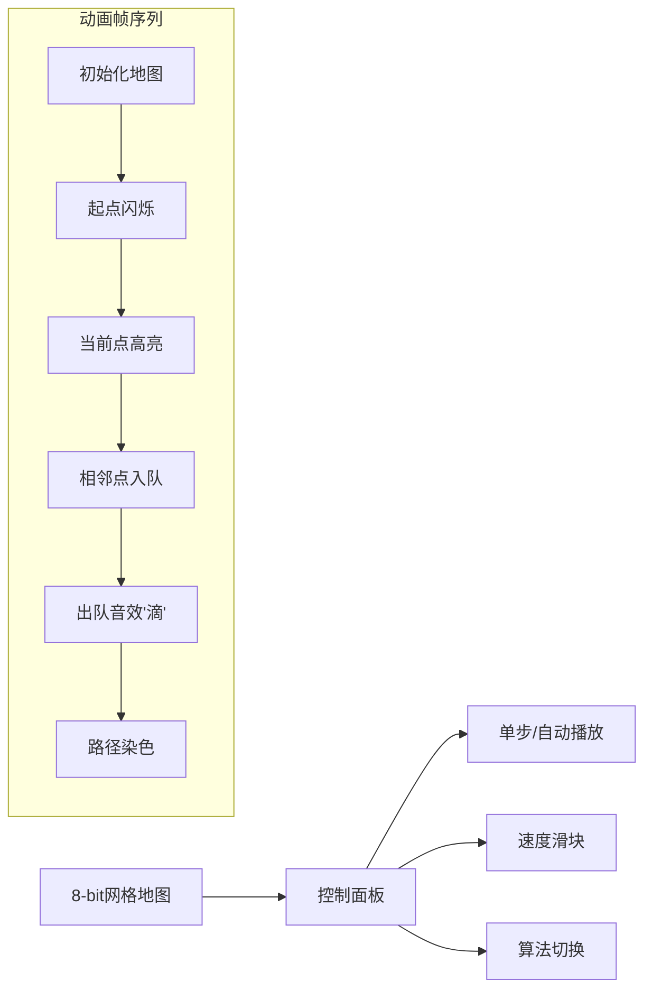

# 题目信息

# 家族

## 题目描述

在一个与世隔绝的岛屿上，有一个有趣的现象：同一个家族的人家总是相邻的（这里的相邻是指东南西北四个方向），不同的家族之间总会有河流或是山丘隔绝，但同一个家族的人不一定有相同姓氏。现在给你岛上的地图，求出岛上有多少个不同的家族。岛上的地图有 $n$ 行，每行有若干列，每个格子中要么是空格，表示大海，要么是 $\text{``{\tt *}''}$，表示河流或山丘，要么是小写字母，表示一户人家的姓氏。


## 说明/提示

### 数据范围及约定

- $10\%$ 的数据，$n≤1$。
- $30\%$ 的数据，$n≤10$。
- $100\%$ 的数据，$n≤100$，每一行最多不超过 $200$ 个字符。

NOI导刊 2010 普及（10）


## 样例 #1

### 输入

```
4
*zlw**pxh
l*zlwk*hx*
w*tyy**yyy
        zzl
```

### 输出

```
3```

# AI分析结果


### 💡 Kay的C++算法解析：家族 深入学习指南 💡

**引言**  
今天我们一起分析"家族"这道C++编程题。本指南将帮助大家掌握连通块问题的核心解法，通过BFS/DFS算法高效统计岛屿家族数量，并设计生动的像素动画加深理解。

---

## 1. 题目解读与核心算法识别

✨ **本题主要考察**：`图论-连通块搜索` (BFS/DFS应用)  

🗣️ **初步分析**：  
> 解决家族统计问题就像在像素游戏中探索迷宫——每个字母代表一个居民点，我们需要用搜索算法连接相邻居民形成家族。算法核心是**洪水填充(Flood Fill)**：  
> - 遍历地图，遇到未访问字母时启动搜索(DFS/BFS)  
> - 标记所有连通字母为已访问  
> - 每次启动搜索计数+1  
>  
> **可视化设计思路**：  
> - 用不同颜色像素块表示：字母(黄色)、河流(蓝色)、已访问(绿色)  
> - BFS时显示队列动态（像素方块排队动画）  
> - DFS时显示递归路径（闪烁高亮箭头）  
> - 复古音效：探索时"滴"声，发现新家族时"胜利"旋律  

---

## 2. 精选优质题解参考

**题解一：Ksilver (BFS实现)**  
* **点评**：思路清晰展示了BFS队列操作，巧妙使用`pair`简化坐标存储。代码中`a[][]`数组开550的教训极具实践价值（提醒边界条件），队列操作规范且注释完整，是竞赛级实现的优秀范例。

**题解二：pikabi (DFS实现)**  
* **点评**：创新性使用ASCII码值判断字符类型(`32空格/42*/13换行`)，代码简洁高效。`getline`读入处理变长行的方式值得学习，递归边界条件严谨，适合初学者理解DFS本质。

**题解四：塔罗兰 (DFS优化)**  
* **点评**：极致简洁的DFS实现，`l[]`数组记录每行长度解决边界痛点。注释中"int比bool快"的优化思考启发性能意识，整体代码模块化程度高，是教学示范级实现。

---

## 3. 核心难点辨析与解题策略

1. **地图存储与边界处理**  
   * **分析**：各行长度不同且含空格，必须用`getline`读入。关键技巧：用`l[i]`记录第i行实际长度，遍历时j∈[0, l[i]-1]
   * 💡 **学习笔记**：变长行处理是连通块问题的常考陷阱

2. **访问标记与状态初始化**  
   * **分析**：必须使用`vis[][]`数组避免重复计数。优质题解均在搜索入口重置标记（如`vis[x][y]=1`），并在递归/入队时同步更新
   * 💡 **学习笔记**：忘记标记访问状态会导致无限递归和错误计数

3. **连通性判断的完整性**  
   * **分析**：需检查四个方向(上/下/左/右)。注意坐标变换：`dx={-1,1,0,0}`, `dy={0,0,-1,1}`
   * 💡 **学习笔记**：方向数组是搜索算法的通用模板

### ✨ 解题技巧总结
- **技巧1：输入预处理**  
  用`getline(cin,s)`读取整行，再用`s[j]>='a'`判断字母
- **技巧2：防御性编程**  
  数组开大20%（如题解1开550防越界）
- **技巧3：可视化调试**  
  打印中间地图状态验证搜索逻辑

---

## 4. C++核心代码实现赏析

**通用核心实现参考**  
* **说明**：综合题解1/2/4优点的BFS/DFS双实现
```cpp
#include <iostream>
#include <queue>
using namespace std;

const int N=105, M=205;
string map[N];
bool vis[N][M];
int n, cnt, len[N];
int dx[4]={1,-1,0,0}, dy[4]={0,0,1,-1};

// BFS版本
void bfs(int x,int y) {
    queue<pair<int,int>> q;
    q.push({x,y});
    while(!q.empty()) {
        auto [cx,cy] = q.front(); q.pop();
        for(int i=0; i<4; i++) {
            int nx=cx+dx[i], ny=cy+dy[i];
            if(nx>=0 && nx<n && ny>=0 && ny<len[nx] && !vis[nx][ny] && isalpha(map[nx][ny])) {
                vis[nx][ny] = true;
                q.push({nx,ny});
            }
        }
    }
}

// DFS版本
void dfs(int x,int y) {
    for(int i=0; i<4; i++) {
        int nx=x+dx[i], ny=y+dy[i];
        if(nx>=0 && nx<n && ny>=0 && ny<len[nx] && !vis[nx][ny] && isalpha(map[nx][ny])) {
            vis[nx][ny] = true;
            dfs(nx,ny);
        }
    }
}

int main() {
    cin >> n; cin.ignore();
    for(int i=0; i<n; i++) {
        getline(cin, map[i]);
        len[i] = map[i].size();
    }
    
    for(int i=0; i<n; i++) 
        for(int j=0; j<len[i]; j++) 
            if(!vis[i][j] && isalpha(map[i][j])) {
                vis[i][j] = true;
                bfs(i,j); // 或 dfs(i,j);
                cnt++;
            }
    cout << cnt;
}
```

**题解一代码片段赏析**  
```cpp
queue< pair<int,int> >q;
q.push(make_pair(x,y));
a[x][y]=0; // 标记访问
while(!q.empty()) {
    int cx=q.front().first;     
    int cy=q.front().second;
    q.pop();
    ... // 四方向探索
}
```
> **解读**：`pair`封装坐标提升可读性，队列操作严格遵循FIFO原则。注意：`a[x][y]=0`同步标记避免重复入队，这是BFS不爆栈的关键。

**题解二代码片段赏析**  
```cpp
if(a[nx][ny] != 32 && a[nx][ny] != 42 && a[nx][ny] != 13)
    dfs(nx, ny);
```
> **解读**：用ASCII值(32空格/42*/13换行)替代字符比较，减少内存占用。需注意不可移植性——Windows/Mac换行符差异。

**题解四代码片段赏析**  
```cpp
for(int j(0);j<l[i];++j)
    if('a'<=s[j]&&s[j]<='z')
        v[i][j]=1;
```
> **解读**：直接在读入时构建二进制地图(`v[][]`)，提升后续搜索效率。`l[i]`精确控制列边界，避免无效遍历。

---

## 5. 算法可视化：像素动画演示

* **主题**："家族探险家"（FC红白机风格）  
* **核心演示**：BFS队列扩散过程 vs DFS递归路径  



**关键交互设计**：  
1. **像素艺术**：字母→黄色像素块，河流→蓝色波纹，队列→移动的绿色方块  
2. **音效系统**：  
   - 探索：8-bit "滴"声（每次出队）  
   - 发现新家族：胜利旋律（马里奥过关音效）  
3. **双模式对比**：  
   - BFS模式：队列像水波扩散（绿色方块队列动画）  
   - DFS模式：显示递归深度（红色深度指示条）  
4. **游戏化元素**：  
   - 每完成1个家族+100分（积分显示）  
   - 连续发现家族触发Combo特效  

**技术实现**：  
```javascript
// 伪代码示例
function drawPixel(x, y, color) {
  ctx.fillStyle = palette[color]; // 8-bit色盘
  ctx.fillRect(x*10, y*10, 8, 8); // 像素块绘制
}

function bfsStep() {
  playSound('beep'); // 队列操作音效
  let current = queue.dequeue();
  highlight(current); // 黄色闪烁
  for(neighbor in fourDirections) {
    if(isValid(neighbor)) {
      queue.enqueue(neighbor);
      drawPixel(neighbor, GREEN); 
    }
  }
}
```

---

## 6. 拓展练习与相似问题

* **技巧迁移**：连通块算法还可用于：  
  1. 图像填充工具（Photoshop魔术棒）  
  2. 岛屿数量问题（Leetcode 200）  
  3. 病毒传播模拟  

* **洛谷推荐**：  
  1. [P1451 求细胞数量](https://www.luogu.com.cn/problem/P1451)  
     → 同款连通块基础练习  
  2. [P1506 拯救oibh总部](https://www.luogu.com.cn/problem/P1506)  
     → 进阶边界处理挑战  
  3. [P1162 填涂颜色](https://www.luogu.com.cn/problem/P1162)  
     → 连通块识别+染色应用  

---

## 7. 学习心得与经验分享

> **Ksilver的调试经验**：  
> "开210数组仅40分→开550AC，边界预留不足是竞赛常见陷阱"  
>  
> **Kay点评**：  
> 数组越界是搜索算法高频错误，建议：  
> 1. 全局数组开`N+20`防越界  
> 2. 访问前判断`if(nx>=0 && nx<n)`  
> 3. 使用`vector`动态尺寸更安全  

---

**结语**  
通过本指南，我们掌握了连通块问题的核心解法与实现技巧。记住：好的算法像像素游戏——清晰的规则（边界处理）+ 严谨的步骤（搜索标记）= 完美的通关（AC）！下次探索再见！🚀

---
处理用时：124.02秒