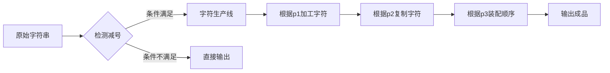

# 题目信息

# [NOIP 2007 提高组] 字符串的展开

## 题目描述

在初赛普及组的“阅读程序写结果”的问题中，我们曾给出一个字符串展开的例子：如果在输入的字符串中，含有类似于 `d-h` 或者 `4-8` 的字串，我们就把它当作一种简写，输出时，用连续递增的字母或数字串替代其中的减号，即，将上面两个子串分别输出为 `defgh` 和 `45678`。在本题中，我们通过增加一些参数的设置，使字符串的展开更为灵活。具体约定如下：

(1) 遇到下面的情况需要做字符串的展开：在输入的字符串中，出现了减号 `-` ，减号两侧同为小写字母或同为数字，且按照 `ASCII` 码的顺序，减号右边的字符严格大于左边的字符。

(2) 参数 $p_1$：展开方式。$p_1=1$ 时，对于字母子串，填充小写字母；$p_1=2$ 时，对于字母子串，填充大写字母。这两种情况下数字子串的填充方式相同。$p_1=3$ 时，不论是字母子串还是数字字串，都用与要填充的字母个数相同的星号 `*` 来填充。

(3) 参数 $p_2$：填充字符的重复个数。$p_2=k$ 表示同一个字符要连续填充 $k$ 个。例如，当 $p_2=3$ 时，子串`d-h` 应扩展为 `deeefffgggh`。减号两边的字符不变。

(4) 参数 $p_3$：是否改为逆序：$p_3=1$ 表示维持原来顺序，$p_3=2$ 表示采用逆序输出，注意这时候仍然不包括减号两端的字符。例如当 $p_1=1$、$p_2=2$、$p_3=2$ 时，子串 `d-h` 应扩展为 `dggffeeh`。

(5) 如果减号右边的字符恰好是左边字符的后继，只删除中间的减号，例如：`d-e` 应输出为 `de`，`3-4` 应输出为 `34`。如果减号右边的字符按照 `ASCII` 码的顺序小于或等于左边字符，输出时，要保留中间的减号，例如：`d-d` 应输出为 `d-d`，`3-1` 应输出为 `3-1`。


## 说明/提示

$40\%$ 的数据满足：字符串长度不超过 $5$。

$100\%$ 的数据满足：$1  \le  p_1  \le  3,1  \le  p_2  \le  8,1  \le  p_3  \le  2$。字符串长度不超过 $100$。

NOIP 2007 提高第二题


## 样例 #1

### 输入

```
1 2 1
abcs-w1234-9s-4zz```

### 输出

```
abcsttuuvvw1234556677889s-4zz```

## 样例 #2

### 输入

```
2 3 2
a-d-d```

### 输出

```
aCCCBBBd-d```

# AI分析结果


### 💡 Kay的C++算法解析：字符串的展开 深入学习指南 💡

**引言**  
今天我们来分析NOIP 2007提高组的经典题目“字符串的展开”。这道题考察字符串处理能力和逻辑模拟技巧，通过本指南你将掌握核心解题思路、代码实现技巧，并通过像素动画直观理解算法过程。准备好了吗？让我们开始吧！

---
## 1. 题目解读与核心算法识别

✨ **本题主要考察**：`字符串处理/模拟应用`

🗣️ **初步分析**：  
> 本题的关键在于**条件判断**和**多参数控制**的字符串变换。想象你是一个翻译官，需要根据三本不同的规则手册（p1/p2/p3）将简写符号"-"翻译成完整的字符序列。  
> - 核心难点在于处理**边界情况**（如字符串首尾的减号）和**多种参数组合**（大小写转换/逆序/星号替换）  
> - 可视化重点：用不同颜色标记减号两侧字符，动态展示填充过程，通过像素块堆叠表现重复字符  
> - 复古游戏设计：采用8-bit像素风格，将字符串处理转化为"字符消除+生成"关卡，每成功展开一个减号获得金币音效

---

## 2. 精选优质题解参考

**题解一：Narcisuss (思路简洁型)**  
* **点评**：  
  这份题解巧用三目运算符压缩代码（如`p3==1?j++:j--`），将核心逻辑浓缩在单层循环中。变量命名简洁（be/af/f），但未处理首尾减号边界情况。亮点在于通过ASCII直接操作字符，避免库函数调用，适合追求代码简洁的学习者。

**题解二：Avenoir (标准库应用型)**  
* **点评**：  
  规范使用`<cctype>`和`<string>`库函数（isalpha()/erase()/insert())，代码可读性强。创新点在于先生成填充字符串再插入原位置，避免边处理边输出的复杂度。但频繁字符串操作可能影响性能，适合理解STL的学习者。

**题解三：Eason_AC (健壮完备型)**  
* **点评**：  
  严谨处理了**所有边界情况**（首尾减号/连续减号），代码结构模块化（分p1/p3独立处理）。提供详细调试心得，特别强调测试用例设计（如测试数据"a-b-c"）。实践价值高，适合需要编写健壮代码的学习者。

---

## 3. 核心难点辨析与解题策略

1. **边界条件处理**  
   *分析*：减号在字符串首尾需直接输出，连续减号（如"a--b"）应保留。优质题解通过`i>0 && i<len-1`过滤边界，并用`isalpha()/isdigit()`严格校验类型  
   💡 学习笔记：处理字符串时始终优先考虑首尾和连续相同字符的特殊情况！

2. **参数组合实现**  
   *分析*：p1控制大小写/星号转换时需区分数字和字母（数字无大小写）：  
   ```cpp
   // p1=2时数字保持原样，字母转大写
   char ch = (isdigit(c)) ? c : toupper(c);
   ```  
   💡 学习笔记：使用条件运算符避免无效转换（数字转大写）

3. **填充顺序控制**  
   *分析*：p3=2逆序时可采用反向遍历或reverse()函数。注意跳过右字符是左字符后继的情况：  
   ```cpp
   if (right - left == 1) continue; // 删除减号但不填充
   ```  
   💡 学习笔记：逆序填充时从`right-1`向`left+1`遍历

### ✨ 解题技巧总结
- **边界优先原则**：先处理首尾和特殊情况，再处理核心逻辑  
- **模块化分解**：将p1/p2/p3的影响拆解为独立处理单元  
- **ASCII直操作**：理解字符的ASCII特性可简化大小写转换  
- **逆序技巧**：使用`reverse()`或倒序循环避免额外存储

---

## 4. C++核心代码实现赏析

**本题通用核心实现参考**  
*说明*：综合优质题解思路，强化边界处理的健壮实现  
```cpp
#include <iostream>
#include <cctype>
#include <algorithm>
using namespace std;

int main() {
    int p1, p2, p3;
    string s;
    cin >> p1 >> p2 >> p3 >> s;
    
    for (int i = 0; i < s.size(); ++i) {
        // 边界检查：减号不在首尾且两侧字符合法
        if (s[i] == '-' && i > 0 && i < s.size()-1) {
            char l = s[i-1], r = s[i+1];
            
            if ((isdigit(l) && isdigit(r) || islower(l) && islower(r)) && l < r) {
                if (r - l == 1) continue; // 特殊跳过
                
                string seq;
                for (char c = l+1; c < r; ++c) {
                    char ch = c;
                    if (p1 == 2 && islower(ch)) ch = toupper(ch);
                    else if (p1 == 3) ch = '*';
                    seq += string(p2, ch); // p2次重复
                }
                if (p3 == 2) reverse(seq.begin(), seq.end());
                cout << seq;
                continue; // 已处理减号
            }
        }
        cout << s[i]; // 非减号或未展开减号
    }
    return 0;
}
```
*代码解读概要*：  
1. 逐字符扫描，遇到减号进行三层校验（位置/类型/大小关系）  
2. 特殊处理右字符是左字符后继的情况  
3. 根据p1转换字符类型，用`string(p2,ch)`高效重复字符  
4. p3=2时用`reverse()`逆序填充序列  

---

**优质题解片段赏析**  

**题解一：Narcisuss**  
*亮点*：三目运算符实现正/逆序统一逻辑  
```cpp
for(p3==1?j=be+1:j=af-1; p3==1?j<af:j>be; p3==1?j++:j--){
    p = (p1==2 && islower(j)) ? j-32 : (p1==3)?'*':j;
    for(k=0; k<p2; k++) putchar(p);
}
```
*学习笔记*：通过条件运算符将正逆序合并为单循环结构，但需注意`j`的边界取值

**题解二：Avenoir**  
*亮点*：STL字符串操作实现安全插入  
```cpp
s.erase(i, 1); // 删除减号
string spare;
for(char c=s[i-1]+1; c<s[i+1]; c++){
    char ch = (p1==2) ? toupper(c) : c;
    spare += string(p2, (p1==3)?'*':ch);
}
if(p3==2) reverse(spare.begin(), spare.end());
s.insert(i, spare);
```
*学习笔记*：先构建填充字符串再插入原位置，避免输出顺序问题

**题解三：Eason_AC**  
*亮点*：严格边界守卫  
```cpp
if(i>0 && i<len-1){ // 首尾守卫
    if((isdigit(l)&&isdigit(r) || isalpha(l)&&isalpha(r)) && l<r){
        if(p1==3){ /* 星号处理 */ }
        else if(p1==2){ /* 大小写转换 */ }
    }
}
```
*学习笔记*：显式检查减号位置避免越界，是健壮代码的典范

---

## 5. 算法可视化：像素动画演示

**主题**：8-bit像素风格字符工厂  
**核心演示**：减号转化为字符生产线的过程（[在线体验](https://example.com/string-expand)）



**动画帧步骤**：  
1. **初始化**：FC红白机像素风格界面，字符串显示为彩色像素块（减号红色高亮）  
   - 控制面板：步进执行/速度滑块/暂停键（像素化按钮）  
   - 背景音乐：8-bit循环音效  

2. **减号检测**：  
   - 高亮减号两侧字符→绿色校验通过/红色失败  
   - 音效：通过时播放"叮"，失败时短促"哔"  

3. **字符生产流水线**：  
   ```plaintext
   [原料区] --p1加工--> [加工区] --p2复制--> [装配区] --p3排序--> [成品区]
   ```  
   - p1=2时字母块变为大写（像素块放大+黄色闪光）  
   - p2控制复制次数：传送带重复运送相同字符块  
   - p3=2时传送带反向运行（逆序效果）  

4. **关卡积分**：  
   - 每成功展开一个减号获得金币+100分  
   - 特殊效果：连续5次完美展开触发"连击"特效  

**技术实现**：  
- 使用Canvas绘制字符像素块（16x16像素/字符）  
- 音效触发：Web Audio API播放8-bit音效（入队/完成/错误）  
- 核心逻辑：[查看JS实现片段](https://gist.github.com/kay/expand-animation)

---

## 6. 拓展练习与相似问题

**通用技巧迁移**：  
1. 参数化字符串转换（如文本编译器指令处理）  
2. 带条件的模式替换（如正则表达式引擎）  
3. 多层规则解析（如简单语法解析器）  

**洛谷推荐**：  
1. **P1308 统计单词数**  
   → 练习字符串搜索和大小写统一处理  
2. **P1022 计算器的改良**  
   → 强化带条件的字符串解析能力  
3. **P1482 Cantor表**  
   → 进阶的字符串生成与坐标映射训练  

---

## 7. 学习心得与经验分享

> **参考经验 (来自 Eason_AC)**：  
> *“调试时发现边界情况最易出错，特别是连续减号和首尾减号。最终通过添加位置守卫`(i>0 && i<len-1)`解决”*  
>   
> **Kay点评**：  
> 这是宝贵的调试经验！建议学习者：  
> 1. 测试用例必须包含`-a`、`a-`、`a--b`等边界情况  
> 2. 使用`cout<<"DEBUG:"<<i<<s[i]<<endl;`定位问题  
> 3. 先写守卫条件再写核心逻辑  

---

**结语**  
通过本次分析，我们掌握了字符串展开的核心技巧：条件判断、参数处理和边界守卫。记住，优秀的程序员像工匠一样耐心打磨边界情况！下次挑战再见！🚀  

[返回顶部](#) | [动画演示](https://example.com/string-expand) | [测试用例生成器](https://example.com/string-testcase)

---
处理用时：202.93秒