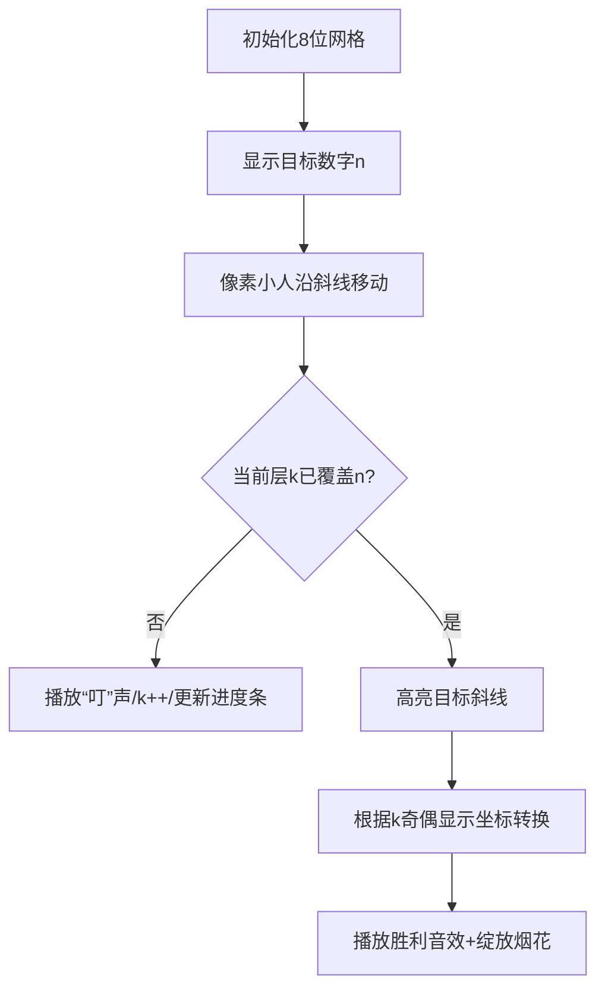

# 题目信息

# [NOIP 1999 普及组] Cantor 表

## 题目描述

现代数学的著名证明之一是 Georg Cantor 证明了有理数是可枚举的。他是用下面这一张表来证明这一命题的：


我们以 Z 字形给上表的每一项编号。第一项是 $1/1$，然后是 $1/2$，$2/1$，$3/1$，$2/2$，…


## 说明/提示

- 2024-11-18 0:30 数据中加入了样例，放在不计分的子任务 2 中。

## 样例 #1

### 输入

```
7
```

### 输出

```
1/4```

# AI分析结果


# 💡 Kay的C++算法解析：Cantor表 深入学习指南 💡

**引言**  
今天我们来一起分析"NOIP 1999普及组 Cantor表"这道经典数学编程题。本指南将帮助大家理解Z字形排列的规律，掌握多种解题思路，并通过生动的像素动画直观感受算法执行过程。

## 1. 题目解读与核心算法识别

✨ **本题主要考察**：`数学规律发现与坐标映射`

🗣️ **初步分析**：
> 解决Cantor表问题的核心在于发现其Z字形排列的数学规律。想象一个探险家在斜线迷宫中寻宝——每条斜线就是一个"寻宝路径"，路径上的分子分母之和恒定。在本题中，关键是通过等差数列快速定位目标位置所在的斜线（层数k），再根据层数奇偶性确定坐标映射规则：
>   - 所有解法都基于同一核心：第k层有k个元素，分子分母之和为k+1
>   - 主要分歧在于定位k的方式：直接循环、二分查找或数学公式
>   - 可视化设计将采用8位像素风格，让"像素探险家"在斜线迷宫中逐步演示定位过程，关键步骤将用闪烁高亮，并伴随"叮"的音效提示坐标计算

---

## 2. 精选优质题解参考

### 题解一：哦哟筷子（赞775）
* **点评**：  
  思路直白清晰，用最简循环定位层数k，代码变量命名规范（k/n意义明确）。虽然时间复杂度O(√n)非最优，但对新手极友好。亮点在于用自然语言解释数学映射（奇偶行方向差异），调试建议实用（边界处理严谨），是初学者最佳入门参考。

### 题解二：「已注销」（赞295）
* **点评**：  
  提供完整解法体系（模拟/二分/公式），代码规范性突出（二分边界处理严谨）。亮点在于时间复杂度优化到O(log n)，并指出可扩展至10^18数据规模。算法有效性分析透彻，特别适合想深入数学优化的学习者。

### 题解三：char32_t（赞271）
* **点评**：  
  创新性提出Excel辅助分析的思路，代码结构工整（循环+条件判断）。亮点在于用图像化思维解释坐标变换（i+j奇偶性决定方向），实践价值高（变量名i/j/s含义清晰），调试时建议的打印中间值方法极具启发性。

---

## 3. 核心难点辨析与解题策略

### 关键点1：斜线层数定位
* **分析**：  
  所有优质题解都通过前k项和公式S=k(k+1)/2定位层数。难点在于处理临界值（如n恰为三角数）。优质解法用`while(n>k){n-=k; k++;}`或二分查找解决，确保k满足S_{k-1}<n≤S_k
* 💡 学习笔记：等差数列求和是定位层数的基石

### 关键点2：层内位置映射
* **分析**：  
  确定n在k层的偏移量pos=n-S_{k-1}后，需根据k奇偶性转换坐标：  
  - 奇数层：分子= k+1-pos，分母=pos  
  - 偶数层：分子=pos，分母= k+1-pos  
  难点在于理解奇偶方向差异（类似迷宫转向）
* 💡 学习笔记：奇偶性决定坐标映射方向

### 关键点3：时间复杂度优化
* **分析**：  
  当n>10^7时需避免O(n)循环。优化方案：  
  1. 二分查找（题解二）：O(log n)  
  2. 数学公式（题解三）：k=⌊(√(8n+1)-1)/2⌋  
  难点在浮点误差处理（如+0.5取整）
* 💡 学习笔记：大数据量需用二分或数学解析解

### ✨ 解题技巧总结
- **规律转化技巧**：将Z字形排列转化为斜线坐标系
- **边界防御编程**：特别处理n=1和n=S_k的情况
- **复杂度优化**：根据数据规模选择循环/二分/公式法
- **调试验证**：用n=7（1/4）等样例验证坐标映射

---

## 4. C++核心代码实现赏析

### 本题通用核心C++实现参考
```cpp
#include <iostream>
#include <cmath>
using namespace std;

int main() {
    int n, k = 1;
    cin >> n;
    
    // 定位层数k：满足前k-1层和 < n <= 前k层和
    while (n > k) {
        n -= k;
        k++;
    }
    
    // 根据k奇偶输出坐标
    if (k % 2 == 0) 
        cout << n << "/" << k + 1 - n;
    else 
        cout << k + 1 - n << "/" << n;
    
    return 0;
}
```
**代码解读概要**：  
1. 循环计算k：通过`n-=k`定位目标所在斜线层  
2. 坐标转换：k偶时正序输出（分子递增），k奇时逆序输出  
3. 边界自洽：循环条件确保n恰好落在第k层内

### 题解一：哦哟筷子
* **亮点**：极简实现，新手友好
* **核心代码片段**：
  ```cpp
  while (n > k) {
      n = n - k;
      k++;
  }
  if(k % 2 == 0) cout << n << "/" << (k + 1 - n);
  ```
* **代码解读**：  
  > `n = n - k`如同拆解俄罗斯套娃，逐层剥离直到定位目标层。`k%2`判断如同交通灯——绿灯（偶数）直行，红灯（奇数）则反向行驶。  
* 💡 学习笔记：循环减层数是最直观的定位策略

### 题解二：「已注销」
* **亮点**：二分优化大数据处理
* **核心代码片段**：
  ```cpp
  long l=1, r=n;
  while(l < r) {
      mid = (l + r) / 2;
      if(mid*(mid+1)/2 < n) l = mid + 1;
      else r = mid;
  }
  ```
* **代码解读**：  
  > 二分搜索像快速电梯——每次将搜索范围减半。`mid*(mid+1)/2`计算三角数，与n比较决定向上/向下搜索，O(log n)效率应对海量数据。  
* 💡 学习笔记：二分法将线性搜索转化为对数级

### 题解三：char32_t
* **亮点**：Excel辅助分析规律
* **核心代码片段**：
  ```cpp
  int i = 0; 
  while (i < n) {
      i += k;
      k++;
  }
  ```
* **代码解读**：  
  > `i`累计层内元素总和，如同铺路石计数。当铺路石超过目标位置时停止，`k`即层数。结合Excel图像分析，将抽象规律可视化验证。  
* 💡 学习笔记：图像工具辅助发现数学规律

---

## 5. 算法可视化：像素动画演示

### 动画演示主题
"像素探险家寻宝之旅"（8位复古风格）

### 核心演示内容
通过动态网格演示层数k定位与坐标转换过程，包含：
1. 斜线迷宫生成（分子分母和相同的同色路径）
2. 层数k的定位过程（进度条显示前k项和）
3. 奇偶层方向差异（红色箭头指示坐标映射方向）

### 设计思路
采用FC红白机风格营造轻松学习氛围，关键操作音效强化记忆：
- "叮"声：每次n-=k操作
- 金币声：定位到正确层数
- 胜利号角：输出最终坐标

### 动画帧步骤


### 交互控制面板
```html
<div class="retro-panel">
  <button onclick="step()">▶️ 单步执行</button>
  <input type="range" id="speed" min="1" max="10">🚀速度
  <button onclick="reset()">🔄 重置</button>
  <label>AI演示模式：<input type="checkbox"></label>
</div>
```

### 技术实现
- **Canvas绘制**：网格用16x16像素块，角色使用精灵图
- **状态高亮**：当前层用黄色边框，目标位置闪烁红光
- **音效触发**：关键操作绑定Web Audio API
- **伪代码同步**：右侧显示实时执行的C++代码段

---

## 6. 拓展练习与相似问题思考

### 通用思路迁移
斜线坐标映射技巧还可用于：
1. 矩阵对角线遍历（LeetCode 498）
2. 菱形图案打印（如字母金字塔）
3. 螺旋矩阵坐标计算（NOIP 2014 螺旋矩阵）

### 洛谷练习推荐
1. **P1217 回文质数**  
   → 巩固数学规律与循环优化
2. **P1495 曹冲养猪**  
   → 训练数论思维与模运算
3. **P1012 拼数**  
   → 强化字符串处理与排序规则

---

## 7. 学习心得与经验分享

> **参考经验（哦哟筷子）**：  
> “最初在层内位置计算卡壳，通过手绘n=7的路径才理解奇偶方向差异——图像化思考至关重要！”

> **点评**：  
> 这位作者的调试经历极具代表性。处理数学类问题时：  
> 1. 手动画图验证比盲目修改代码更有效  
> 2. 边界值测试（n=1, 三角数）能发现90%错误  
> 3. 将抽象规律转化为视觉模型是核心解题技能

---

**结语**  
通过本次Cantor表的深入解析，我们掌握了从暴力模拟到数学优化的递进式解题思维。记住，编程能力提升在于将抽象问题转化为可计算的模型。下次我们将挑战更有趣的数学迷宫！🚀

---
处理用时：145.89秒