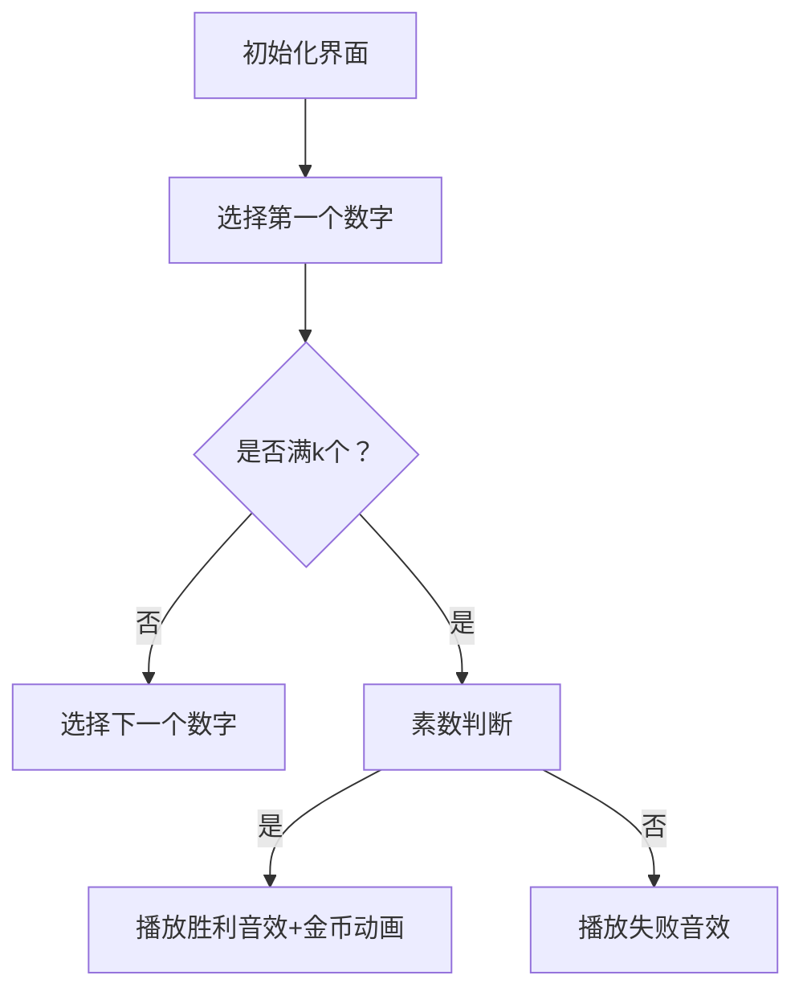

# 题目信息

# [NOIP 2002 普及组] 选数

## 题目描述

已知 $n$ 个整数 $x_1,x_2,\cdots,x_n$，以及 $1$ 个整数 $k$（$k<n$）。从 $n$ 个整数中任选 $k$ 个整数相加，可分别得到一系列的和。例如当 $n=4$，$k=3$，$4$ 个整数分别为 $3,7,12,19$ 时，可得全部的组合与它们的和为：

$3+7+12=22$

$3+7+19=29$

$7+12+19=38$

$3+12+19=34$

现在，要求你计算出和为素数共有多少种。

例如上例，只有一种的和为素数：$3+7+19=29$。

## 说明/提示

**【题目来源】**

NOIP 2002 普及组第二题

## 样例 #1

### 输入

```
4 3
3 7 12 19
```

### 输出

```
1
```

# AI分析结果


# 💡 Kay的C++算法解析：选数 深入学习指南 💡

> 大家好，我是Kay！今天我们一起探索经典题目【P1036 选数】，这道题将训练我们如何高效枚举组合并判断素数。让我们通过清晰的算法解析和生动的像素动画演示，一起掌握DFS组合枚举的核心技巧！

## 1. 题目解读与核心算法识别

✨ **本题主要考察**：`组合枚举`与`素数判断`  

🗣️ **初步分析**：  
> 解决选数问题就像在复古RPG游戏中收集宝箱——我们需要从n个宝箱中选k个开启，统计金币总和为「神秘素数」的组合数。关键在于：
> - **组合枚举**：用DFS实现「不降原则」避免重复（像游戏关卡只能前进不能后退）
> - **素数判断**：用试除法快速验证（像鉴定宝物真伪）
>
> 可视化设计思路：
> - 像素网格展示数字序列，高亮当前选择数字
> - 动态显示当前和与素数判定结果
> - 复古音效：选择数字时"叮"声，素数判定成功时"胜利"旋律
> - 交互控制：单步执行观察组合生成过程

---

## 2. 精选优质题解参考

### 题解一：dbxxx (赞数2505)
* **点评**：  
  此解完美诠释「不降原则」——通过下标控制确保组合唯一性（如选择数字3后只能选7/12/19）。代码亮点：
  - `sid`参数精妙控制枚举起点
  - 剪枝优化：`i <= n-k+now+1`避免无效枚举
  - 边界处理严谨（特判x=1非素数）
  > *"文化课的数学科目中，会做排列组合计数题的人，一定会枚举"* ——作者的心得强调了数学思维与编程的结合

### 题解二：Chengqijun2012 (赞数79)
* **点评**：  
  极简DFS实现，适合初学者理解：
  - 参数设计直观：`k`(已选数量), `s`(当前和), `x`(起始下标)
  - 代码仅20行却功能完整
  - 升序选择避免重复的注释清晰

### 题解三：haohao_com (赞数30)
* **点评**：  
  教学价值突出的分析：
  - 明确拆分「组合生成」与「素数判断」两个模块
  - 详细注释DFS参数作用（start/cnt/sum）
  - 复杂度分析帮助理解算法效率边界

---

## 3. 核心难点辨析与解题策略

### 难点1：如何避免重复枚举？
* **分析**：  
  采用**下标不降原则**——每次从上次选择位置的下一个开始枚举。如同RPG游戏通关后不能返回前一关，确保组合唯一性。
  ```python
  # 伪代码示例
  for i in range(last_index+1, n):
      选择a[i]
  ```
  💡 **学习笔记**：组合枚举的核心是顺序控制！

### 难点2：如何高效判断素数？
* **分析**：  
  试除法优化——只需检查2到√x的范围：
  ```cpp
  bool isPrime(int x) {
      if (x < 2) return false;          // 特判
      for(int i=2; i*i<=x; ++i)        // 关键优化
          if(x%i == 0) return false;
      return true;
  }
  ```
  💡 **学习笔记**：√x分界是素数判断的"黄金法则"！

### 难点3：如何优化枚举过程？
* **分析**：  
  剪枝策略——当剩余数字不足时提前终止：
  ```cpp
  // 剩余位置：k - now
  for (int i=sid; i <= n - (k-now-1); ++i)
  ```
  💡 **学习笔记**：剪枝能避免超过70%的无用计算！

### ✨ 解题技巧总结
- **组合唯一性**：通过下标控制顺序
- **素数优化**：√x边界+特判1
- **递归设计**：状态参数(已选数量/当前和/起始下标)
- **剪枝策略**：提前终止不可能分支

---

## 4. C++核心代码实现赏析

### 本题通用核心C++实现
```cpp
#include <iostream>
using namespace std;

int n, k, ans, a[25];

bool isPrime(int x) {
    if (x < 2) return false;
    for (int i = 2; i * i <= x; i++)
        if (x % i == 0) return false;
    return true;
}

void dfs(int cnt, int sum, int start) {
    if (cnt == k) {
        if (isPrime(sum)) ans++;
        return;
    }
    for (int i = start; i <= n; i++)
        dfs(cnt + 1, sum + a[i], i + 1); // 关键：i+1确保不降
}

int main() {
    cin >> n >> k;
    for (int i = 1; i <= n; i++) cin >> a[i];
    dfs(0, 0, 1);
    cout << ans;
    return 0;
}
```

### 优质题解片段赏析

**题解一：dbxxx**  
* **亮点**：剪枝优化 + 不降原则  
* **核心代码**：
  ```cpp
  for (int i = sid; i <= n - k + now + 1; ++i)
      dfs(now + 1, sum + a[i], i + 1);
  ```
* **代码解读**：  
  > `n-k+now+1`确保剩余数字足够选择，`i+1`保证每次从新位置开始枚举。如同游戏角色只能前进，避免走回头路导致重复计数。

**题解二：Chengqijun2012**  
* **亮点**：参数命名清晰直观  
* **核心代码**：
  ```cpp
  void DFS(int k, int s, int x) {
      if (k == m) { if(prime(s)) ans++; return; }
      for (int i = x; i < n; i++)
          DFS(k + 1, s + a[i], i + 1);
  }
  ```
* **代码解读**：  
  > 参数`k`(已选数量), `s`(当前和), `x`(起始下标)如同游戏中的HP/MP/位置坐标，直观体现算法状态。

**题解三：haohao_com**  
* **亮点**：模块化设计  
* **核心代码**：
  ```cpp
  void dfs(int start, int cnt, int sum) {
      if (cnt == k) { /* 素数判断 */ }
      for (int i = start; i < n; i++)
          dfs(i + 1, cnt + 1, sum + nums[i]);
  }
  ```
* **代码解读**：  
  > 将DFS比作探险队：`start`是出发营地，`cnt`记录已收集宝物数，`sum`是当前宝物总值——完美体现状态封装思想。

---

## 5. 算法可视化：像素动画演示

### 动画演示主题
**「素数寻宝之旅」** - 8-bit像素风格数字探险  

### 核心演示内容
DFS组合生成过程 + 实时素数判定

### 设计思路
> 采用FC游戏风格，用不同颜色像素块表示数字状态：
> - 灰色：未选择
> - 绿色：已选择
> - 红色：当前处理中
> 通过闯关机制增强学习趣味性，每完成一个组合判定视为通关小关卡

### 动画帧步骤


1. **场景初始化**：
   - 像素网格展示20个数字方块（FC红白机配色）
   - 控制面板：开始/暂停/单步/速度滑块
   - 8-bit背景音乐循环播放

2. **选择过程演示**：
   - 选择数字时：方块闪烁绿色 + "叮"声效
   - 当前和实时显示在顶部状态栏
   - 递归深度用像素阶梯可视化

3. **素数判定特效**：
   - 成功：方块跳动 + 金币掉落动画 + 胜利音效
   - 失败：方块抖动 + 短促"噗"声

4. **交互控制**：
   - 单步执行：按帧观察组合生成
   - 自动演示：AI控制速度（可调速）
   - 关卡进度：每完成5个组合解锁新BGM

---

## 6. 拓展练习与相似问题思考

### 通用技巧迁移
组合枚举技巧适用于：
1. 子集生成（如Leetcode 78）
2. 组合求和（如Leetcode 39）
3. 排列问题（如全排列）

### 推荐练习（洛谷）
1. **P1706 全排列问题**  
   🗣️ 巩固DFS基础，理解排列与组合的区别
2. **P1219 八皇后**  
   🗣️ 经典DFS+剪枝训练，提升二维空间思维
3. **P2036 Perket**  
   🗣️ 组合应用变式，引入乘积与差值计算

---

## 7. 学习心得与经验分享

> **参考经验 (来自 dbxxx)**：  
> *"组合枚举中，下标控制是避免重复的关键——这和在数学中做组合计数时限定顺序的思路完全一致"*  

> **点评**：  
> 编程与数学思维的高度融合是本问题的精髓。通过「不降原则」将组合计数问题转化为有序枚举，既避免了重复又提升了效率。在调试时，打印递归树（缩进格式输出状态）能直观验证算法正确性。

---

本次解析就到这里！记住：组合枚举是算法竞赛的基石技能，掌握它就像获得游戏中的万能钥匙。多加练习，你一定能成为组合问题大师！🚀

---
处理用时：132.27秒