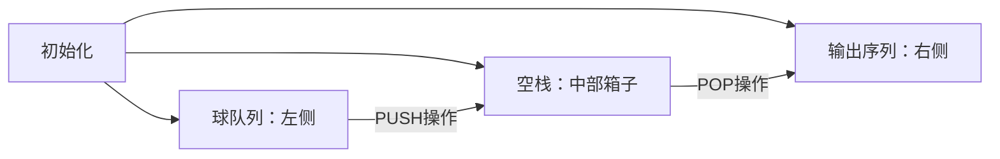

# 题目信息

# [NOIP 2003 普及组] 栈

## 题目背景

栈是计算机中经典的数据结构，简单的说，栈就是限制在一端进行插入删除操作的线性表。

栈有两种最重要的操作，即 pop（从栈顶弹出一个元素）和 push（将一个元素进栈）。

栈的重要性不言自明，任何一门数据结构的课程都会介绍栈。宁宁同学在复习栈的基本概念时，想到了一个书上没有讲过的问题，而他自己无法给出答案，所以需要你的帮忙。

## 题目描述


宁宁考虑的是这样一个问题：一个操作数序列，$1,2,\ldots ,n$（图示为 1 到 3 的情况），栈 A 的深度大于 $n$。

现在可以进行两种操作，

1. 将一个数，从操作数序列的头端移到栈的头端（对应数据结构栈的 push 操作）
2. 将一个数，从栈的头端移到输出序列的尾端（对应数据结构栈的 pop 操作）

使用这两种操作，由一个操作数序列就可以得到一系列的输出序列，下图所示为由 `1 2 3` 生成序列 `2 3 1` 的过程。


（原始状态如上图所示）

你的程序将对给定的 $n$，计算并输出由操作数序列 $1,2,\ldots,n$ 经过操作可能得到的输出序列的总数。

## 说明/提示

**【题目来源】**

NOIP 2003 普及组第三题

## 样例 #1

### 输入

```
3
```

### 输出

```
5
```

# AI分析结果


### 💡 Kay的C++算法解析：[NOIP 2003 普及组] 栈 深入学习指南 💡
**目标**：帮助青少年理解栈操作序列计数问题，掌握卡特兰数与动态规划的核心思想。

---

## 1. 题目解读与核心算法识别
✨ **本题主要考察**：`卡特兰数`与`动态规划`

🗣️ **初步分析**：
> 本题如同"球箱取放游戏"：将标号1-n的球按序放入箱子（栈），每次可放球入箱（push）或取球出箱（pop），求最终取球顺序的所有可能排列数。  
> - **核心算法**：通过动态规划将问题分解为子问题（状态转移方程：`f[x][y] = f[x-1][y+1] + f[x][y-1]`），本质是计算卡特兰数  
> - **可视化设计**：采用8位像素风模拟球箱操作，入箱时球从左侧滑入并播放"叮"音效，出箱时球向右弹出并高亮显示当前序列，控制面板支持调速/单步执行  
> - **解法对比**：DP直接模拟操作过程（更易理解），卡特兰数公式法（更高效）

---

## 2. 精选优质题解参考
**题解一（来源：__CJY__）**  
* **点评**：  
  思路清晰定义状态`f[x][y]`（x=未入栈数，y=栈中数），推导出简洁的状态转移方程。代码规范（边界`x=0`返回1），空间复杂度O(n²)合理。实践价值高，可直接用于竞赛。

**题解二（来源：M1__）**  
* **点评**：  
  从组合数学角度切入，严谨证明卡特兰数递推关系（`Cₙ=∑Cₖ₋₁·Cₙ₋ₖ`）。代码实现高效（公式`Cₙ=2(2n-1)/(n+1)*Cₙ₋₁`），时间复杂度O(n)，数学思维启发性强。

**题解三（来源：Doraeman）**  
* **点评**：  
  提供递推/递归/打表三种实现，多角度展示卡特兰数特性。递归代码清晰展示分治思想（划分子问题乘积和），递推代码用`C[]`数组避免重复计算，适合不同基础的学习者。

---

## 3. 核心难点辨析与解题策略
1. **难点1：状态定义抽象**  
   * **分析**：需将物理操作（push/pop）转化为数学状态。优质题解用`(x,y)`分别表示未操作数和栈中数，确保状态无后效性。  
   * 💡 **学习笔记**：好的状态定义应能完整描述当前操作阶段的关键信息。

2. **难点2：转移方程推导**  
   * **分析**：从当前状态`(x,y)`出发：若push则转移到`(x-1,y+1)`；若pop则转移到`(x,y-1)`。需综合所有可能操作路径（加法原理）。  
   * 💡 **学习笔记**：转移方程本质是操作规则的数学表达。

3. **难点3：边界条件处理**  
   * **分析**：当`x=0`（无球可入栈）时仅剩1种方案（全出栈），需单独处理。DP中需初始化`f[0][*]=1`。  
   * 💡 **学习笔记**：边界是递归/DP的基石，必须严格验证。

### ✨ 解题技巧总结
- **技巧1：子问题分解** - 将大问题拆解为独立子问题（如卡特兰数的k分段思想）  
- **技巧2：状态维度选择** - 用最少变量描述当前操作进度（本题仅需x,y两个维度）  
- **技巧3：记忆化加速** - 递归时用数组存储已计算结果（参考ryderyang题解）

---

## 4. C++核心代码实现赏析
**通用核心实现（DP法）**  
```cpp
#include <iostream>
using namespace std;
int main() {
    int n, f[20][20] = {0}; 
    cin >> n;
    // 初始化边界：无球可入栈时方案数=1
    for (int y = 0; y <= n; y++) f[0][y] = 1; 

    for (int x = 1; x <= n; x++) {
        for (int y = 0; y <= n; y++) {
            if (y == 0) f[x][y] = f[x-1][y+1];     // 栈空只能push
            else f[x][y] = f[x-1][y+1] + f[x][y-1]; // 可push或pop
        }
    }
    cout << f[n][0]; // 初始状态：n球待入栈，栈空
}
```
**代码解读概要**：  
> 1. 初始化`f[0][y]=1`（无球可操作时仅剩出栈操作）  
> 2. 双重循环遍历状态：`x`递减模拟消耗未操作球，`y`表示栈中球数  
> 3. 根据栈空与否选择转移路径  

### 优质题解片段赏析
**题解一（__CJY__）**  
```cpp
for(int x=0;x<=n;x++){
    for(int y=0;y<=n;y++){
        if(!x) f[x][y]=1;          // 边界处理
        else if(!y) f[x][y]=f[x-1][y+1]; 
        else f[x][y]=f[x-1][y+1]+f[x][y-1]; 
    }
}
```
* **亮点**：循环边界处理严谨，状态转移无冗余  
* **学习笔记**：`!x`和`!y`的简洁判断提升代码可读性

**题解二（M1__）卡特兰数公式法**  
```cpp
sum[1]=1;
for(int i=2;i<=18;i++){
    sum[i]=sum[i-1]*2*(2*i-1)/(i+1); 
}
```
* **亮点**：利用卡特兰数闭合表达式优化到O(n)  
* **学习笔记**：数学推导可大幅提升算法效率，需掌握组合数学基础

**题解三（Doraeman）递归分治**  
```cpp
LL C(int x){
    if(x==0) return 1;
    LL ans=0;
    for(int i=0;i<x;i++) 
        ans += C(i)*C(x-i-1); // 划分子问题
    return ans;
}
```
* **亮点**：直接实现卡特兰数定义式`Cₙ=∑CᵢCₙ₋ᵢ₋₁`  
* **学习笔记**：递归分治是理解问题本质的重要思维训练

---

## 5. 算法可视化：像素动画演示
**主题**：`像素球箱大冒险`（复古红白机风格）  
**核心演示**：动态展现push/pop操作如何生成不同输出序列  

### 设计方案

1. **像素元素设计**  
   - 球：编号1-18的8-bit像素球（不同颜色）  
   - 栈箱：16x16像素方块，最多叠放18球  
   - 控制台：复古按钮（▶️⏸️⏩🔄）

2. **关键动效与交互**  
   - **PUSH**：球从队列滑入箱子，伴随"叮"声，箱子高度+1  
   - **POP**：球从箱子弹出滑向输出序列，播放"咔"声，当前序列高亮黄框  
   - **自动演示**：AI按合法操作序列自动执行（速度可调）  
   - **关卡机制**：每完成n=3的序列解锁新难度，积分=找到的序列数  

3. **教学提示系统**  
   ```python
   # 伪代码：状态同步显示
   while operation_available:
       if stack_not_empty: 
           show_hint("点击POP或按[→]出球")
       if balls_remain: 
           show_hint("点击PUSH或按[↓]入球")
       update_counter(f"当前序列数: {catalan[current_n]}")
   ```

---

## 6. 拓展练习与相似问题
**通用技巧迁移**：  
卡特兰数适用于所有 **"合法括号匹配"类问题**，如：
1. n对括号的合法排列数  
2. 二叉树形态计数  
3. 凸多边形三角划分方案数  

**洛谷推荐**：  
1. [P1976 鸡蛋饼](https://www.luogu.com.cn/problem/P1976)  
   → **推荐理由**：卡特兰数经典应用，理解圆上弦不相交问题  
2. [P1754 球迷购票](https://www.luogu.com.cn/problem/P1754)  
   → **推荐理由**：变种卡特兰数，操作带限制（5元/10元钞票）  
3. [P1375 嵌套矩形](https://www.luogu.com.cn/problem/P1375)  
   → **推荐理由**：DAG上的动态规划，训练状态定义能力  

---

## 7. 学习心得与经验分享
> **参考经验**（来自__CJY__）：  
> *"在推导状态转移方程时，最初忽略了y=0的边界条件，导致WA。通过打印中间状态f[x][y]的值快速定位了错误。"*  
>   
> **点评**：  
> 边界条件是DP的核心痛点，作者的经验强调了两大调试技巧：  
> 1. **状态追踪**：运行时输出DP表观察异常值  
> 2. **边界测试**：优先验证n=0,1,2的小规模数据  
> 建议学习时用纸笔模拟n=3的DP表填写过程！

---

**结语**：栈操作计数是理解组合数学与DP的经典窗口，掌握状态设计与转移方程推导将打开算法世界大门。下次我们将探索更复杂的卡特兰数应用，继续加油！🚀

---
处理用时：127.79秒