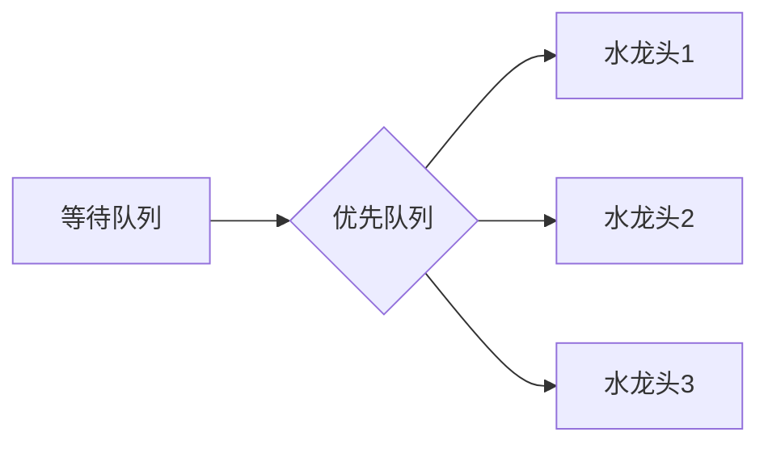

# 题目信息

# [NOIP 2010 普及组] 接水问题

## 题目描述

学校里有一个水房，水房里一共装有 $m$ 个龙头可供同学们打开水，每个龙头每秒钟的供水量相等，均为 $1$。

现在有 $n$ 名同学准备接水，他们的初始接水顺序已经确定。将这些同学按接水顺序从 $1$ 到 $n$ 编号，$i$ 号同学的接水量为 $w_i$。接水开始时，$1$ 到 $m$ 号同学各占一个水龙头，并同时打开水龙头接水。当其中某名同学 $j$ 完成其接水量要求 $w_j$ 后，下一名排队等候接水的同学 $k$ 马上接替 $j$ 同学的位置开始接水。这个换人的过程是瞬间完成的，且没有任何水的浪费。即 $j$ 同学第 $x$ 秒结束时完成接水，则 $k$ 同学第 $x+1$ 秒立刻开始接水。若当前接水人数 $n'$ 不足 $m$，则只有 $n'$ 个龙头供水，其它 $m - n'$ 个龙头关闭。

现在给出 $n$ 名同学的接水量，按照上述接水规则，问所有同学都接完水需要多少秒。


## 说明/提示

【输入输出样例 \#1 说明】

第 $1$ 秒，$3$ 人接水。第 $1$ 秒结束时，$1,2,3$ 号同学每人的已接水量为 $1,3$ 号同学接完水，$4$ 号同学接替 $3$ 号同学开始接水。

第 $2$ 秒，$3$ 人接水。第 $2$ 秒结束时，$1,2$ 号同学每人的已接水量为 $2,4$ 号同学的已接水量为 $1$。

第 $3$ 秒，$3$ 人接水。第 $3$ 秒结束时，$1,2$ 号同学每人的已接水量为 $3,4$ 号同学的已接水量为 $2$。$4$ 号同学接完水，$5$ 号同学接替 $4$ 号同学开始接水。

第 $4$ 秒，$3$ 人接水。第 $4$ 秒结束时，$1,2$ 号同学每人的已接水量为 $4,5$ 号同学的已接水量为 $1$。$1,2,5$ 号同学接完水，即所有人完成接水的总接水时间为 $4$ 秒。

【数据范围】

$1 \le n \le {10}^4$，$1 \le m \le 100$，$m \le n$；

$1 \le w_i \le 100$。

NOIP2010 普及组 第二题


## 样例 #1

### 输入

```
5 3
4 4 1 2 1
```

### 输出

```
4```

## 样例 #2

### 输入

```
8 4
23 71 87 32 70 93 80 76
```

### 输出

```
163```

# AI分析结果


### 💡 Kay的C++算法解析：接水问题 深入学习指南 💡

**引言**  
今天我们一起分析NOIP普及组经典题目"接水问题"。这道题考察了资源分配的核心思想，通过本指南你将掌握贪心策略的精髓和优先队列的妙用，还能通过像素动画直观理解算法执行过程。

---

## 1. 题目解读与核心算法识别

✨ **本题主要考察**：`贪心策略（优先队列应用）`  

🗣️ **初步分析**：
> 解决接水问题的核心如同快餐店安排多个收银台——每次选择最早空闲的柜台服务下一位顾客。在本题中：
> - **贪心思想**：用优先队列（小根堆）动态维护水龙头空闲时间，总是选择最早空闲的水龙头安排下位同学
> - **时间复杂度**：O(n log m) 远优于暴力模拟的O(max_time × m)
> - **可视化设计**：采用8位像素风格，水龙头显示倒计时条，队列用像素小人表示。关键操作用颜色高亮（蓝色=空闲水龙头，红色=接水中），伴随音效（"叮"=接水完成，"嗖"=同学入队）。控制面板支持调速和单步执行，AI模式自动演示贪心选择过程。

---

## 2. 精选优质题解参考

**题解一：WsW_（优先队列解法）**
* **点评**：思路清晰展现贪心本质，代码简洁有力：1) 用小根堆动态维护水龙头结束时间 2) 前m个直接入队 3) 剩余同学取堆顶更新。变量命名规范（`q`=优先队列，`t`=当前时间），空间复杂度O(m)完美。竞赛可直接套用，但需注意最后需遍历堆找最大值。

**题解二：kuaiCreator（堆优化解法）**
* **点评**：创新性初始化m个0值统一处理所有同学，避免前m/后n-m分类讨论。代码模块化（读入→初始化→更新→输出），突出"状态累加"本质。实践时注意`temp + p[i]`体现时间叠加思想，比题解一少最后遍历步骤。

**题解三：lk_liang（时间步进模拟）**
* **点评**：直白模拟每秒变化，适合算法初学者理解过程。亮点：1) `s[i]--`直观表现时间流逝 2) `t`指针控制队列推进。虽然O(max_time×m)效率较低，但边界处理严谨（`t<=n+m`），教学演示价值高。

---

## 3. 核心难点辨析与解题策略

1.  **贪心策略证明**
    * **分析**：为何选最早空闲的水龙头？假设两个水龙头，结束时间a<b。若新同学耗时c接在a后总时max(a+c,b)，接在b后为max(a,b+c)。因a+c < b+c 且a+c可能<b，故第一种方案更优
    * 💡 **学习笔记**：局部最优选择可推导全局最优解

2.  **优先队列应用**
    * **分析**：暴力找最早空闲需O(m)，优先队列降至O(log m)。需注意：1) 小根堆声明语法 2) 存结束时间而非剩余时间 3) 更新时做`push(top() + w[i])`
    * 💡 **学习笔记**：堆是动态极值问题的银弹

3.  **边界条件处理**
    * **分析**：当n≤m时直接取`max(w[i])`；时间累加时注意`earliest + w[i]`是绝对时间；最终答案需遍历堆找最大值
    * 💡 **学习笔记**：边界是代码健壮性的试金石

### ✨ 解题技巧总结
- **贪心选择**：资源分配类问题优先考虑"最早空闲"策略
- **数据结构升级**：O(m)查找→O(log m)用优先队列
- **时间抽象**：用绝对结束时间替代实时模拟
- **调试技巧**：打印堆状态验证贪心选择过程

---

## 4. C++核心代码实现赏析

**通用核心实现（贪心策略）**
```cpp
#include <iostream>
#include <queue>
#include <vector>
#include <algorithm>
using namespace std;

int main() {
    int n, m;
    cin >> n >> m;
    vector<int> w(n);
    for (int i = 0; i < n; i++) cin >> w[i];
    
    priority_queue<int, vector<int>, greater<int>> pq; // 小根堆
    for (int i = 0; i < min(n, m); i++) pq.push(w[i]);
    
    for (int i = m; i < n; i++) {
        int earliest = pq.top(); pq.pop();
        pq.push(earliest + w[i]); // 更新结束时间
    }
    
    int ans = 0;
    while (!pq.empty()) {
        ans = max(ans, pq.top());
        pq.pop();
    }
    cout << ans << endl;
    return 0;
}
```
**代码解读概要**：  
> 1. 读入时用vector存储接水量  
> 2. 声明小根堆存储水龙头结束时间  
> 3. 前min(n,m)个直接入堆  
> 4. 剩余同学取堆顶更新后入堆  
> 5. 遍历堆找最大结束时间  

**题解一（WsW_）核心片段**  
```cpp
priority_queue<int, vector<int>, greater<int>> q;
for(int i=1;i<=m;i++) q.push(w[i]); // 初始入队
for(int i=1;i<=n-m;i++) {
    int t=q.top(); q.pop();         // 取最早空闲
    scanf("%d",&w); 
    q.push(t + w);                 // 更新结束时间
}
while(q.size()>1) q.pop();          // 剩最大值
printf("%d",q.top()); 
```
**亮点**：极简风格展现算法骨架  
**学习笔记**：`t + w`体现时间叠加思想  

**题解二（kuaiCreator）核心片段**  
```cpp
priority_queue<int, vector<int>, greater<int>> tap;
for(int i=1;i<=m;i++) tap.push(0);   // 初始0值
for(int i=1;i<=n;i++) {
    int temp = tap.top(); tap.pop();
    tap.push(temp + p[i]);            // 统一处理
}
```
**亮点**：初始化0值避免分类讨论  
**学习笔记**：绝对时间从0开始累加  

**题解三（lk_liang）核心片段**  
```cpp
while(t<=n+m) {                      // 边界控制
    for(int i=1;i<=m;i++) {
        s[i]--;                       // 每秒减少
        if(s[i]==0) {                 // 接水完成
            s[i]=s[t]; t++;           // 换下一位
        }
    }
    ans++; 
}
```
**亮点**：直观模拟秒级变化  
**学习笔记**：`t`指针控制队列推进  

---

## 5. 算法可视化：像素动画演示

**主题**："像素水房大作战"（8-bit街机风格）  
**核心演示**：贪心策略下优先队列的动态决策过程  

### 动画设计


**关键交互设计**：  
1. **场景构建**：
   - 上排：m个像素水龙头（含倒计时条）
   - 中间：优先队列树状结构（实时显示结束时间）
   - 下排：n个像素小人队列（头顶接水量）

2. **动态过程**：
   - 初始：前m个小人跳入水龙头区，倒计时启动
   - 当某水龙头归零：  
     * 播放"叮"声+闪光特效  
     * 该位置小人消失，队列首小人滑入（"嗖"声）
     * 优先队列树结构调整（节点值更新+下沉动画）
   - 控制面板：  
     ```plaintext
     [▶️开始] [⏸️暂停] [⏭单步] [🔄重置] 速度：|-----●------|
     ```

3. **教学强化**：
   - 当前操作高亮黄色边框
   - 执行代码同步显示（如`pq.push(top()+w[i])`）
   - 旁白提示：”同学5接水10秒，将2号水龙头结束时间更新为35秒！”

4. **游戏化元素**：
   - 每完成5人触发"combo音效"
   - 通关显示：”挑战成功！最优时间：163秒”
   - 错误操作提示：”注意！未选最早空闲水龙头”

**实现要点**：Canvas绘制动态队列，requestAnimationFrame驱动动画，Web Audio API播放8-bit音效。

---

## 6. 拓展练习与相似问题思考

**通用技巧迁移**：  
贪心+优先队列适用于：  
1. 资源分配（会议室安排、机器调度）  
2. 合并类问题（哈夫曼编码）  
3. 实时系统任务调度  

**洛谷推荐**：  
1. **P1090 合并果子**  
   🗣️ 优先队列经典应用，巩固堆操作  
2. **P1223 排队接水**  
   🗣️ 贪心策略变种，需自定义排序规则  
3. **P1809 过河问题**  
   🗣️ 结合贪心与模拟，强化边界分析能力  

---

## 7. 学习心得与经验分享

**来自题解的经验**：  
> "初始结束时间设为0可统一处理所有同学" —— kuaiCreator  
> "`t<=n+m`确保所有同学都被处理" —— lk_liang  

**点评**：这些经验凸显两个关键点：1) 变量初始化的艺术 2) 循环边界的重要性。调试时建议输出优先队列状态，可视化验证贪心选择。

---

**结语**  
通过本次分析，我们掌握了贪心策略在资源分配问题中的核心应用。记住：优秀算法 = 正确策略 + 高效数据结构。下次遇到"最短时间"问题时，优先队列就是你的制胜利器！🚀

---
处理用时：213.36秒