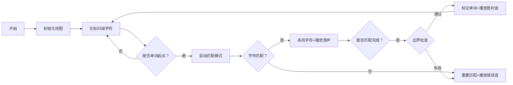

# 题目信息

# [NOIP 2011 普及组] 统计单词数

## 题目描述

一般的文本编辑器都有查找单词的功能，该功能可以快速定位特定单词在文章中的位置，有的还能统计出特定单词在文章中出现的次数。

现在，请你编程实现这一功能，具体要求是：给定一个单词，请你输出它在给定的文章中出现的次数和第一次出现的位置。注意：匹配单词时，不区分大小写，但要求完全匹配，即给定单词必须与文章中的某一独立单词在不区分大小写的情况下完全相同（参见样例 1），如果给定单词仅是文章中某一单词的一部分则不算匹配（参见样例 2）。


## 说明/提示

数据范围

$1\leq $ 第一行单词长度 $\leq10$。

$1\leq $ 文章长度 $\leq10^6$。

noip2011 普及组第 2 题


## 样例 #1

### 输入

```
To
to be or not to be is a question
```

### 输出

```
2 0

```

## 样例 #2

### 输入

```
to
Did the Ottoman Empire lose its power at that time```

### 输出

```
-1```

# AI分析结果


### 💡 Kay的C++算法解析：统计单词数 深入学习指南 💡

**引言**  
今天我们一起分析NOIP普及组经典题目《统计单词数》。本题考察字符串处理的核心能力，要求统计目标单词在文章中作为独立单词出现的次数和首次位置。我们将深入解析高效解法，并通过像素动画直观演示匹配过程。

---

## 1. 题目解读与核心算法识别

✨ **本题主要考察**：`字符串处理与边界控制`

🗣️ **初步分析**：
> 想象你在玩一个文字寻宝游戏——需要在迷宫中精确找到特定宝藏（目标单词），而宝藏必须独立存在（前后有围墙/空格）。解题关键在于：
> - **边界控制**：确保匹配的是完整单词（前有空格/开头，后有空格/结尾）
> - **高效扫描**：文章长度可达百万级，需线性时间复杂度
> 
> 优质题解采用两种策略：
> 1. **双指针实时匹配**：同步扫描文章和单词字符，动态检查边界
> 2. **预处理分割**：用空格拆分文章为单词列表再比较
>
> **可视化设计**：
> 我们将设计像素风文字冒险动画：
> - 文章显示为8-bit像素网格，光标逐字符移动扫描
> - 匹配时触发音效：字符匹配（"滴"声）、单词匹配成功（"叮咚"声）
> - 边界检查时高亮前后字符位置，匹配成功时标记单词位置
> - 控制面板支持单步/自动播放，速度可调

---

## 2. 精选优质题解参考

**题解一：suxy15 (赞154)**  
* **点评**：  
  采用**双指针实时匹配**策略，代码简洁高效。亮点在于：
  - **边界处理精巧**：通过`(i==0 || s[i-1]==' ' || j)`条件同步检查单词起始和连续匹配状态
  - **大小写转换优化**：宏定义`val(a)`统一字符比较，避免重复调用函数
  - **内存控制**：使用定长数组处理百万级输入，无额外内存开销
  - **实践价值**：竞赛标准代码，包含EOF处理等边界场景

**题解二：Eason_lyx (赞93)**  
* **点评**：  
  **预处理分割法**的典范：
  - **可读性极佳**：显式拆分单词再比较，逻辑直白易懂
  - **鲁棒性强**：`s+=' '`确保末单词处理，`tolower`标准化大小写
  - **教学价值**：完美演示string基本操作，适合初学者掌握

**题解三：Jelly_Goat (赞70)**  
* **点评**：  
  创新性使用**填充空格+find定位**：
  - **API妙用**：`string::find`替代手动扫描，代码极简
  - **多语言实现**：提供C++/Python双解，拓展思维
  - **算法迁移**：展示标准库函数在解题中的创造性应用

---

## 3. 核心难点辨析与解题策略

1.  **难点：独立单词的边界判定**  
    * **分析**：  
      匹配时需同时满足：  
      - 左侧：文章开头或前字符为空格  
      - 右侧：文章结尾或后字符为空格  
      双指针解法通过`(i==0 || s[i-1]==' ')`查左边界，`(s[i+1]=='\0' || s[i+1]==' ')`查右边界
    * 💡 **学习笔记**：独立单词=左隔离+精确匹配+右隔离

2.  **难点：大小写敏感处理**  
    * **分析**：  
      统一转小写是通用方案：  
      - 优化1：循环内联转换（`if(a>'A')a+=32`）避免额外遍历  
      - 优化2：宏/函数封装转换逻辑提高可读性
    * 💡 **学习笔记**：字符串比较必先标准化

3.  **难点：首尾单词的特殊处理**  
    * **分析**：  
      文章开头无前导空格，结尾无后续空格：  
      - 解法1：预处理时在首尾添加空格（如`" "+s+" "`）  
      - 解法2：代码特判起止位置（如`i==0`和`i==len-1`）
    * 💡 **学习笔记**：添加守卫空格可统一边界条件

### ✨ 解题技巧总结
- **技巧1：守卫空格法**  
  给文章首尾添加空格，使所有单词都有明确边界
- **技巧2：实时匹配状态机**  
  用变量`j`记录当前匹配进度，匹配失败时重置为0
- **技巧3：输入流控制**  
  用`getchar()`吸收换行符，避免`getline`读取空行
- **技巧4：复杂度优化**  
  双指针法仅需O(n)时间，O(1)额外空间

---

## 4. C++核心代码实现赏析

**本题通用核心C++实现参考**  
* **说明**：综合双指针法与守卫空格法的优化实现
* **完整核心代码**：
```cpp
#include <iostream>
#include <cctype>
using namespace std;

int main() {
    string word, text;
    getline(cin, word);
    getline(cin, text);
    
    // 标准化大小写
    for (char &c : word) c = tolower(c);
    for (char &c : text) c = tolower(c);
    
    // 添加守卫空格统一边界
    text = ' ' + text + ' ';
    word = ' ' + word + ' ';
    
    int count = 0, first = -1, pos = 0;
    while ((pos = text.find(word, pos)) != string::npos) {
        count++;
        if (first == -1) first = pos;
        pos++; // 继续查找重叠情况
    }
    
    if (count) cout << count << " " << first;
    else cout << -1;
}
```
* **代码解读概要**：  
  > 1. **标准化输入**：统一单词和文章为小写  
  > 2. **边界统一化**：首尾加空格使所有单词有明确边界  
  > 3. **线性扫描**：用`string::find`循环定位目标单词  
  > 4. **结果输出**：首次定位时记录位置，最后检测匹配数

---

**题解一：suxy15**（双指针法）
```cpp
// 标准化函数
#define val(a) (a<'a' ? a+32 : a)
for(i=0,j=0; s[i]; i++){
    if((i==0 || s[i-1]==' ' || j)  // 左边界或连续匹配
       && val(s[i])==val(w[j]) 
       && ++j>-1){
        if(w[j]=='\0' && (s[i+1]=='\0'||s[i+1]==' ')){ // 右边界
            if(first==-1) first = i+1-j;
            count++;
        }
    }else j=0; // 重置匹配状态
}
```
* **代码解读**：  
  > - **智能状态机**：`j`同时作为匹配进度和状态标志  
  > - **复合条件**：第4行整合三种合法匹配起点（开头/空格后/连续匹配中）  
  > - **边界同步检查**：第5行`w[j]=='\0'`确认单词匹配完成，`s[i+1]`检查右边界  
  > 💡 **学习笔记**：用单变量实现匹配状态机是空间优化的典范

**题解二：Eason_lyx**（单词分割法）
```cpp
s += ' '; // 关键！确保末单词被处理
for(int i=0; i<s.size(); i++){
    if(s[i]==' '){   // 单词分割点
        if(dan==ci){ // 完整单词匹配
            ans++;
            if(cur==-1) cur = i - ci.size(); // 首次位置计算
        }
        dan = ""; // 重置单词缓存
    }
    else dan += s[i]; // 构建当前单词
}
```
* **代码解读**：  
  > - **显式分割**：通过空格拆分文章为独立单词  
  > - **位置计算**：`cur = i - ci.size()`利用空格位置反推单词起点  
  > - **末尾处理**：第1行给文章末尾加空格，确保末单词触发检查  
  > 💡 **学习笔记**：缓存单词再比较的策略直观易调试

**题解三：Jelly_Goat**（守卫空格法）
```cpp
s1 = " " + s1 + " ";  // 单词加守卫空格
s2 = " " + s2 + " ";  // 文章加守卫空格
for(int i=0; i<s2.size(); i++) {
    string s = s2.substr(i, s1.size());
    if(s == s1) {   // 精确匹配
        if(!f) x = i, f = 1; // 首次出现位置
        ans++;
    }
}
```
* **代码解读**：  
  > - **空间换清晰度**：守卫空格消除所有特殊边界判断  
  > - **子串比对**：直接截取等长子串与目标比较  
  > - **首次标记**：`f`标记避免重复记录首次位置  
  > 💡 **学习笔记**：预处理是降低代码复杂度的有效手段

---

## 5. 算法可视化：像素动画演示

**主题**：8-bit文字冒险《单词寻宝记》  
**核心演示**：光标扫描文章，动态匹配单词并标记边界  



**动画实现细节**：
1. **像素艺术**：
   - 文章显示为16x16像素字符网格（FC游戏风格）
   - 光标：闪烁的蓝色方块，移动时有"咔嗒"音效
   - 匹配中字符：绿色高亮，匹配失败：红色闪烁

2. **关键交互**：
   ```javascript
   // 伪代码实现
   function matchWord(){
     while(pos < text.length){
        drawCursor(pos); // 绘制光标
        if(isWordStart(pos)){ 
          playSound('start'); // 播放开始音
          let j=0;
          while(matchChar(pos+j, word[j])){
            highlight(pos+j, GREEN); // 匹配字符绿色高亮
            j++;
          }
          if(j==word.length && isWordEnd(pos+j)){ 
            markWord(pos); // 标记单词位置
            playSound('win'); // 胜利音效
          }
        }
        pos++;
     }
   }
   ```

3. **游戏化设计**：
   - **关卡制**：每关匹配不同单词，匹配成功得金币
   - **音效系统**：
     * 匹配成功：8-bit胜利旋律
     * 匹配失败：短促"哔"声
     * 边界错误：振动提示
   - **数据可视化**：
     * 屏幕右侧实时显示：扫描位置、匹配计数
     * 底部控制台：当前执行代码行（高亮）

---

## 6. 拓展练习与相似问题思考

**技能迁移场景**：
1. 带通配符的单词匹配（如`h?llo`）
2. 多单词同时统计（哈希表应用）
3. 单词替换（字符串修改）

**洛谷推荐**：
1. **P1012 [拼数]**  
   🗣️ 练习字符串排序与拼接，巩固字典序比较技巧
2. **P1598 [垂直柱状图]**  
   🗣️ 文本统计进阶，需处理多行输入和字符频率统计
3. **P1305 [新二叉树]**  
   🗣️ 树形结构中的字符串处理，提升结构化数据处理能力

---

## 7. 学习心得与经验分享

> **suxy15的经验**：  
> *“输入有前导空格的测点卡了很久，改用getchar逐字符读取解决”*  
>   
> **Kay的总结**：  
> 调试输入边界时：
> 1. 打印`getchar()`的ASCII值检测不可见字符
> 2. 用`printf("|%s|", text)`可视化字符串边界
> 3. 测试数据需包含：空行、纯空格、首尾单词等特殊场景

---

**结语**  
通过本次分析，我们掌握了字符串匹配的核心技巧：边界控制、状态机和预处理。记住，优秀代码=正确性+可读性+高效性。尝试用可视化工具模拟算法流程，能大幅提升调试效率！下次挑战见！💪

---
处理用时：178.37秒