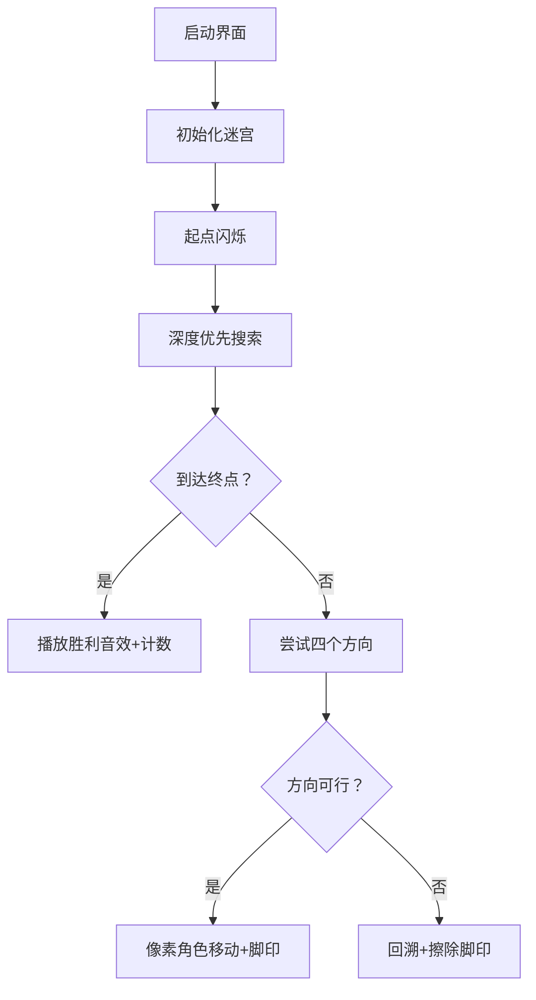

# 题目信息

# 迷宫

## 题目描述

给定一个 $N \times M$ 方格的迷宫，迷宫里有 $T$ 处障碍，障碍处不可通过。

在迷宫中移动有上下左右四种方式，每次只能移动一个方格。数据保证起点上没有障碍。

给定起点坐标和终点坐标，每个方格最多经过一次，问有多少种从起点坐标到终点坐标的方案。

## 说明/提示

对于 $100\%$ 的数据，$1 \le N,M \le 5$，$1 \le T \le 10$，$1 \le SX,FX \le n$，$1 \le SY,FY \le m$。

## 样例 #1

### 输入

```
2 2 1
1 1 2 2
1 2
```

### 输出

```
1```

# AI分析结果


# 💡 Kay的C++算法解析：迷宫 深入学习指南 💡

大家好！我是Kay，今天我们来一起探索经典的迷宫问题。这道题看似简单，但蕴含了深度优先搜索（DFS）的核心思想。本指南将帮助你理解DFS的精髓，掌握回溯技巧，并通过有趣的像素动画直观感受算法执行过程。

## 1. 题目解读与核心算法识别

✨ **本题主要考察**：`深度优先搜索（DFS）与回溯`

🗣️ **初步分析**：
> 解决迷宫问题就像在像素游戏《塞尔达传说》中探索地下城。DFS的核心思想是"不撞南墙不回头"——从起点出发，选择一个方向走到尽头，遇到死路就返回上一个路口尝试新路径。在本题中：
> - 我们用二维数组表示迷宫（1=可通行，0=障碍）
> - 通过方向数组(dx/dy)简化移动逻辑
> - 使用访问标记数组避免重复行走
> - 回溯时清除标记确保路径独立

可视化设计思路：
- **像素动画**：8-bit风格迷宫，绿色方块代表探索路径，红色闪烁表示回溯
- **关键变量**：用不同颜色高亮当前坐标、访问标记数组和路径计数器
- **游戏化元素**：每次到达终点播放经典《超级玛丽》过关音效

---

## 2. 精选优质题解参考

**题解一：(来源：ybb756032937)**
* **点评**：此解思路清晰，使用方向数组替代多重if判断是亮点。代码中`temp`数组标记已访问路径，`map`记录障碍，分离关注点。作者提供了DFS模板，对初学者友好。但变量命名可更直观（如total改为pathCount）。

**题解二：(来源：Billy●Herrington)**
* **点评**：该解强调了起点标记的重要性——这是许多40分代码的遗漏点。代码结构简洁，在DFS前就将起点设为已访问（`G[nx][ny]=true`），避免了重复计数。调试心得"起点未标记导致结果偏大"极具参考价值。

**题解三：(来源：拱垲)**
* **点评**：解法的回溯逻辑处理优雅，使用`const int nextx[4]`方向数组使代码更健壮。特别亮点是边界检查`(x<1||y<1||x>n||y>m)`前置，避免数组越界。学习笔记"回溯是DFS的灵魂"一语中的。

---

## 3. 核心难点辨析与解题策略

1.  **起点/终点特殊处理**
    * **分析**：起点需在DFS前标记为已访问，否则会重复经过。若终点有障碍（测试点陷阱），直接输出0
    * 💡 **学习笔记**：起点是探索的源头，终点是目标，需特殊关照

2.  **回溯的时机与实现**
    * **分析**：每次递归返回时需清除当前标记（`vis[x][y]=0`），否则会阻塞其他路径。就像在迷宫中留下可消失的面包屑
    * 💡 **学习笔记**：回溯是DFS的"时间倒流"，保证每条路径独立探索

3.  **方向数组的妙用**
    * **分析**：用`dx[4]={0,0,1,-1}`和`dy[4]={-1,1,0,0}`替代四个if分支，减少重复代码且易扩展（如八方向）
    * 💡 **学习笔记**：方向数组是网格类问题的"导航罗盘"

### ✨ 解题技巧总结
- **状态标记法**：访问数组与障碍数组分离（如解1的map/temp）
- **预处理优化**：初始化时设置虚拟边界（解3）避免边界检查
- **剪枝策略**：终点障碍特判提前返回（解2）
- **模块化设计**：将方向移动封装成循环（解3）

---

## 4. C++核心代码实现赏析

**本题通用核心C++实现参考**
* **说明**：综合优质题解优点，包含虚拟边界处理
* **完整核心代码**：
```cpp
#include <iostream>
#include <cstring>
using namespace std;

const int N = 7; // 虚拟边界
int dx[4] = {0,0,1,-1}, dy[4] = {1,-1,0,0};
int n, m, t, sx, sy, fx, fy, cnt;
bool vis[N][N], block[N][N];

void dfs(int x, int y) {
    if (x == fx && y == fy) { cnt++; return; }
    vis[x][y] = true;
    
    for (int i = 0; i < 4; i++) {
        int nx = x + dx[i], ny = y + dy[i];
        if (nx >= 1 && nx <= n && ny >= 1 && ny <= m && 
            !block[nx][ny] && !vis[nx][ny]) {
            dfs(nx, ny);
        }
    }
    vis[x][y] = false; // 回溯关键！
}

int main() {
    cin >> n >> m >> t >> sx >> sy >> fx >> fy;
    
    // 终点障碍特判
    while (t--) {
        int x, y; cin >> x >> y;
        block[x][y] = true;
    }
    if (block[fx][fy]) { cout << 0; return 0; }

    memset(vis, 0, sizeof vis);
    vis[sx][sy] = true; // 起点标记
    dfs(sx, sy);
    cout << cnt;
}
```
* **代码解读概要**：
  1. 定义方向数组和访问数组
  2. 预处理障碍并特判终点障碍
  3. 起点标记后开始DFS
  4. 递归中尝试四个方向，满足条件则继续搜索
  5. 回溯时清除访问标记

---

**题解一：(来源：ybb756032937)**
* **亮点**：方向数组替代多重if
* **核心代码片段**：
```cpp
int dx[4]={0,0,1,-1}, dy[4]={-1,1,0,0}; 

void walk(int x,int y) {
    if(x==fx&&y==fy) { total++; return; }
    temp[x][y]=1; // 标记已访问
    for(int i=0;i<4;i++) {
        int nx=x+dx[i], ny=y+dy[i];
        if(!temp[nx][ny] && map[nx][ny]==1) {
            walk(nx,ny);
        }
    }
    temp[x][y]=0; // 回溯
}
```
* **代码解读**：通过循环遍历四个方向，避免重复代码。`temp`数组记录路径防止重复，回溯时重置状态。就像在迷宫探索中，每走一步撒下面包屑，返回时清除痕迹。
* 💡 **学习笔记**：方向数组是网格类问题的黄金工具

**题解二：(来源：Billy●Herrington)**
* **亮点**：起点标记预处理
* **核心代码片段**：
```cpp
// main函数中
G[sx][sy] = true; // 关键起点标记
dfs(sx,sy);

// DFS函数中
if (l>=1&&r>=1&&l<=n&&r<=m&&!G[l][r]&&!VIS[l][r]) {
    VIS[l][r] = true;
    dfs(l,r);
    VIS[l][r] = false;
}
```
* **代码解读**：起点在DFS调用前就被标记，确保不会重复访问。VIS数组在递归中动态标记当前路径，递归返回后立即释放。
* 💡 **学习笔记**：起点标记是避免重复计数的防火墙

---

## 5. 算法可视化：像素动画演示

我们将设计一个**8-bit复古迷宫探索游戏**来演示DFS：



* **视觉设计**：
  - **16色调色板**：草地(#7AB420)，路径(#FFD700)，障碍(#C44D58)
  - **角色**：8-bit勇者像素精灵(16x16)
  - **动画效果**：
    1. 起点绿色闪烁3次后开始探索
    2. 每次移动显示脚印动画（0.2秒渐显）
    3. 遇到死路时路径变红闪烁后消失
    4. 到达终点时烟花动画+经典NES过关音效

* **交互控制**：
  ```html
  <canvas id="maze" width="320" height="320"></canvas>
  <div class="controls">
    <button onclick="step()">单步执行</button>
    <input type="range" id="speed" min="50" max="500">
    <button onclick="autoPlay()">AI演示</button>
  </div>
  ```
  - **速度调节**：实时改变动画间隔(50-500ms)
  - **AI演示模式**：自动播放完整搜索过程，类似《吃豆人》幽灵AI

* **音效设计**：
  - 移动：8-bit脚步声(chip-8音效)
  - 回溯：短促警示音(100Hz方波)
  - 到达终点：《超级玛丽》过关旋律片段

---

## 6. 拓展练习与相似问题思考

* **通用技巧迁移**：
  1. 棋盘类路径问题（如骑士巡游）
  2. 连通块检测（岛屿问题）
  3. 状态空间搜索（八数码问题）

* **推荐练习**：
  1. **P1219 八皇后**  
     🗣️ 使用DFS+回溯的经典，理解状态标记的维度扩展
  2. **P1501 迷宫问题进阶**  
     🗣️ 添加传送门机制，练习DFS在复杂状态转移的应用
  3. **P1601 迷宫问题变种**  
     🗣️ 引入钥匙门系统，掌握状态压缩技巧

---

## 7. 学习心得与经验分享

> **来自ybb756032937的经验**：  
> "在DFS中，`temp[x][y]=0`回溯语句就像时光机——让我们能回到过去尝试新选择。忘记回溯就像在迷宫中留下永久的墙"

> **Kay的总结**：  
> DFS本质是**系统栈支持的暴力枚举**，回溯是其灵魂。调试时可在关键位置输出访问矩阵，就像给迷宫拍快照。记住：起点标记+终点特判+方向数组+及时回溯=DFS迷宫四法则！

---

本次迷宫之旅就到这里！记住，编程就像走迷宫——每个死路都是通往理解的阶梯。下次我们将探索更复杂的搜索算法，继续挑战吧！💪

---
处理用时：127.19秒