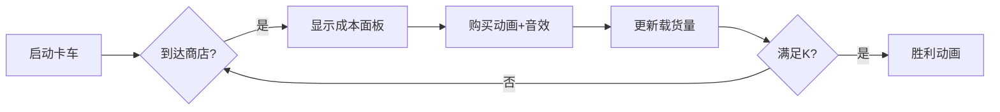

# 题目信息

# [USACO10JAN] Buying Feed, II S

## 题目描述

Farmer John needs to travel to town to pick up K (1 <= K <= 100) pounds of feed. Driving D miles with K pounds of feed in his truck costs D\*K cents.

The county feed lot has N (1 <= N <= 100) stores (conveniently numbered 1..N) that sell feed. Each store is located on a segment of the X axis whose length is E (1 <= E <= 350). Store i is at location X\_i (0 < X\_i < E) on the number line and can sell FJ as much as F\_i (1 <= F\_i <= 100) pounds of feed at a cost of C\_i (1 <= C\_i <= 1,000,000) cents per pound. Amazingly, a given point on the X axis might have more than one store.

FJ starts at location 0 on this number line and can drive only in the positive direction, ultimately arriving at location E, with at least K pounds of feed. He can stop at any of the feed stores along the way and buy any amount of feed up to the the store's limit.

What is the minimum amount FJ has to pay to buy and transport the K pounds of feed? FJ knows there is a solution.

Consider a sample where FJ needs two pounds of feed from three stores (locations: 1, 3, and 4) on a number line whose range is 0..5:

```
0   1   2   3   4   5 
+---|---+---|---|---+ 
    1       1   1      Available pounds of feed 
    1       2   2      Cents per pound 
```
It is best for FJ to buy one pound of feed from both the second and third stores. He must pay two cents to buy each pound of feed for a total cost of 4. When FJ travels from 3 to 4 he is moving 1 unit of length and he has 1 pound of feed so he must pay 1\*1 = 1 cents.

When FJ travels from 4 to 5 he is moving one unit and he has 2 pounds of feed so he must pay 1\*2 = 2 cents.

The total cost is 4+1+2 = 7 cents. 

FJ 开车去买 $K$ 份食物，如果他的车上有 $X$ 份食物。每走一里就花费 $X$ 元。FJ 的城市是一条线，总共 $E$ 里路，有 $E+1$ 个地方，标号 $0\sim E$。 FJ 从 $0$ 开始走，到 $E$ 结束（不能往回走），要买 $K$ 份食物。 城里有 $N$ 个商店，每个商店的位置是 $X_i$（一个点上可能有多个商店），有 $F_i$ 份食物，每份 $C_i$ 元。 问到达 $E$ 并买 $K$ 份食物的最小花费。

## 说明/提示


## 样例 #1

### 输入

```
2 5 3
3 1 2
4 1 2
1 1 1```

### 输出

```
7```

# AI分析结果


### 💡 Kay的C++算法解析：[USACO10JAN] Buying Feed, II S 深入学习指南 💡

#### 1. 题目解读与核心算法识别
✨ **本题主要考察**：`贪心算法` + `排序优化`  
🗣️ **初步分析**：  
> 这道题要求最小化购买饲料的成本（饲料费用+运输费用）。想象你在玩一款快递配送游戏，卡车每走一英里都要按当前载货量付费。贪心策略的核心是：**优先在单位总成本最低的商店购买**（饲料单价+到终点的运费）。通过排序快速找到最优购买点，就像在游戏中优先捡取性价比最高的道具。

- **核心流程**：  
  1. 计算每个商店的**单位总成本** = 饲料单价 + (终点位置 - 商店位置)  
  2. 按单位总成本升序排序  
  3. 从成本最低的商店开始购买，直到满足需求  

- **可视化设计**：  
  采用8位像素风格卡车模拟：  
  - 卡车从0向E移动，经过商店时暂停  
  - 当前载货量显示为卡车顶部的数字标签  
  - 购买时播放"叮"音效，成本增加显示为+$X像素动画  
  - 数据结构区实时显示排序后的商店列表（用不同颜色区分已购买/未购买）

---

#### 2. 精选优质题解参考
**题解一：幽界の冥神**  
* **点评**：思路直击本质——将运输成本融入购买成本后排序。代码简洁高效（时间复杂度O(n log n)），变量命名规范（`number`表剩余需求，`val`表单位成本）。亮点在于用`Min(number,f[i].num)`优雅处理购买量边界，避免冗余判断。

**题解二：tktp_AK**  
* **点评**：结构体使用规范（`node`含位置/存量/成本），逻辑分层清晰。独创性体现在用`t`累计已购量，通过`if(t+a[i].f>k)`自然处理最后购买分段。实践价值高，完整包含输入输出边界处理。

**题解三：SunsetLake**  
* **点评**：结构体设计合理（`tal`存储单位总成本），排序前预处理完整。虽然购买循环的`k>=0`判断稍显冗余，但对新手更易理解。特别值得学习的是题解包含完整思路分析，帮助建立解题思维框架。

---

#### 3. 核心难点辨析与解题策略
1. **难点1：成本统一建模**  
   *分析*：运输成本依赖当前载货量，而载货量随购买变化。优质题解通过**终点回溯法**化解：计算从商店到终点的运费并加入单价，使成本静态化。
   💡学习笔记：将动态成本转化为静态成本是贪心可行的关键

2. **难点2：购买顺序证明**  
   *分析*：若先买高价店，后续运输时仍需为这些饲料付费。数学可证按(单价+到终点距离)升序购买总成本最小。
   💡学习笔记：贪心选择必须确保前序决策不影响后序最优性

3. **难点3：边界处理**  
   *分析*：当最后一家店供应量>剩余需求时，优质解用`min(remaining, store[i].f)`精准控制购买量，避免超买。
   💡学习笔记：边界处理是贪心算法的常见陷阱点

✨ **解题技巧总结**  
- **成本转化技巧**：将路径依赖转化为位置属性（终点距离）  
- **贪心验证法**：通过交换相邻元素证明不会得到更优解  
- **实时更新**：循环中同步更新剩余需求`remaining -= buy`  

---

#### 4. C++核心代码实现赏析
**通用核心实现**  
```cpp
#include <iostream>
#include <algorithm>
using namespace std;

struct Store {
    int x, f, c, cost; // 位置/存量/单价/单位总成本
};

int main() {
    int K, E, N;
    cin >> K >> E >> N;
    Store stores[105];
    
    // 成本计算与输入
    for (int i = 0; i < N; ++i) {
        cin >> stores[i].x >> stores[i].f >> stores[i].c;
        stores[i].cost = stores[i].c + (E - stores[i].x);
    }
    
    // 贪心排序
    sort(stores, stores + N, [](Store a, Store b) {
        return a.cost < b.cost;
    });
    
    // 逐步购买
    int totalCost = 0, remaining = K;
    for (int i = 0; i < N && remaining > 0; ++i) {
        int buy = min(remaining, stores[i].f);
        totalCost += buy * stores[i].cost;
        remaining -= buy;
    }
    cout << totalCost << endl;
    return 0;
}
```
**代码解读概要**：  
1. 结构体整合商店属性  
2. 预处理阶段计算单位总成本  
3. 通过lambda表达式实现自定义排序  
4. 循环购买时精确控制购买量  

**题解一片段赏析**  
```cpp
ans += Min(number, f[i].num) * f[i].val;
number -= f[i].num;
```
**解读**：  
> 这里用`Min`函数实现双边界控制：当商店存量`f[i].num`小于剩余需求`number`时全买，否则只买所需量。`number`的实时更新确保下次循环时需求准确。

**题解二片段赏析**  
```cpp
if(t + a[i].f > k) {
    ans += (k - t) * a[i].c;  // 部分购买
    break;
}
```
**解读**：  
> 通过累计购买量`t`与总需求`k`的比较，自然处理最后购买分段。`break`确保不会超买，时间复杂度最优。

---

#### 5. 算法可视化：像素动画演示
**主题**：卡车配送大冒险（8-bit像素风）  
**核心交互设计**：  
  


**实现细节**：  
1. **场景构建**：  
   - 横向卷轴地图：0→E坐标轴，商店用█表示，卡车用▶表示  
   - 状态面板：顶部显示当前载货/总成本/剩余需求  

2. **动画触发**：  
   - 卡车移动：每帧移动1像素，速度可调  
   - 购买特效：选中商店闪烁黄色，饲料图标飞入卡车  
   - 音效设计：  
     * 购买成功：8-bit "叮"声  
     * 达到终点：超级马里奥过关音效  

3. **数据结构可视化**：  
   - 右侧面板实时显示排序后的商店列表：  
     ```
     商店A: $3 █████
     商店B: $5 ███
     ```

---

#### 6. 拓展练习与相似问题
**通用思路迁移**：  
1. 带权区间覆盖问题（如课程安排）  
2. 成本依赖路径的选择问题（如电网建设）  
3. 动态背包问题（容量线性变化）  

**洛谷推荐**：  
1. **P1090 合并果子**  
   🗣️ 同样需要排序+贪心选择，巩固成本累计计算能力  
2. **P1209 [USACO1.3]修理牛棚**  
   🗣️ 转化思路相似：将木板长度转化为"覆盖成本"  
3. **P4544 [USACO10NOV]Buying Feed G**  
   🗣️ 本题进阶版，需结合单调队列优化DP  

---

#### 7. 学习心得与经验分享
> **幽界の冥神**提到："贪心必排序"——强调排序是贪心算法的核心准备工作  
> **tktp_AK**调试经验："边界处理是贪心算法的常见陷阱，动手模拟很有效"  

💡 **Kay总结**：  
1. 贪心问题先尝试转化为静态决策模型  
2. 排序前必须确保比较规则与目标函数一致  
3. 循环购买时同步更新状态量可避免隐蔽错误  

---
本次分析就到这里！记住：算法学习就像玩像素游戏，把大问题分解为小关卡，逐步通关就是成长。下次见！🚚💨

---
处理用时：123.24秒