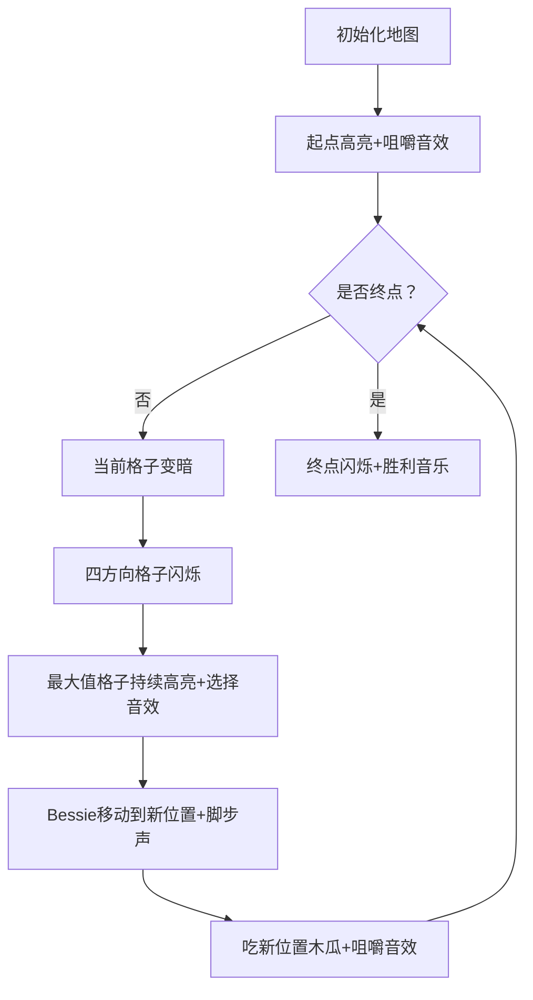

# 题目信息

# [USACO09OCT] Papaya Jungle G

## 题目描述

Bessie has wandered off the farm into the adjoining farmer's land. He raises delicious papaya fruit, which is a delicacy for cows. The papaya jungle is partitioned into a grid of squares with R rows and C columns (1 <= R <= 40, 1 <= C <= 40), as is popular in Wisconsin. Bessie can travel from a given square to any existing adjacent square whose route is parallel to the X or Y axis.  So in the

following diagram, if Bessie is at the square labeled 'B', she can travel to any of the squares labeled 'T':

.T.
TBT
.T.
Bessie always starts out by munching the papayas in square

(row=1,col=1).  After she's done with one square, Bessie always uses her trusty binoculars to count the low-hanging fruit in each of the adjacent squares. She then always moves to the square with the most visible uneaten fruit (a square that happily is always unique).

Sooner or later, following this rule, Bessie always ends up in square (R,C) and eats the fruit there.

Given the dimensions of the papaya jungle and the amount of fruit F\_ij in each square (1 <= F\_ij <= 100), determine the total number of fruit Bessie consumes for a given papaya jungle.

POINTS: 80

Bessie不小心游荡出Farmer John的田地，而走进了相邻的农民的地里。她举起一个木瓜，木瓜对奶牛来说可是不可多得得美味。这个木瓜林像一般的威斯康星州的田地一样被分割成一个R行C列的网格(1 <= R <= 40, 1 <= C <= 40)。Bessie可以从一个格沿着一条跟X轴或Y轴平行的直线走到邻接的另一个格。Bessie发现一开始她自己在木瓜林的(1,1)，也就是第一行第一列慢悠悠地咀嚼着木瓜。

Bessie总是用她最信赖地双筒望远镜去数每一个邻接的格里挂着的木瓜的数目。然后她就游荡到那个有最多没有被吃掉的木瓜的邻接的格子（保证这样的格子只有一个）。

按照这种移动方法，最终Bessie总是会在(R,C)停止然后吃掉那里的木瓜。

给定这个木瓜林的大小及每个格的木瓜数F\_ij(1 <= F\_ij <= 100), 要求Bessie一共吃了多少个木瓜。


## 说明/提示

Three rows; four columns. Bessie starts in upper left corner at the '3'.


Bessie eats the papayas in the order given by the letters next to the numbers below:

(1,1) ---> (1,C) 

(1,1) 3a  3   4g  5h  (1,C) 

|   4b  5c  3f  2i    |

(R,1) 1   7d  4e  2j  (R,C) 

(R,1) ---> (R,C) 

She declines to eat 4 of the papayas but consumes 39 (visiting all but two squares of the grid). 


## 样例 #1

### 输入

```
3 4 
3 3 4 5 
4 5 3 2 
1 7 4 2 
```

### 输出

```
39 
```

# AI分析结果


# 💡 Kay的C++算法解析：Papaya Jungle G 深入学习指南 💡

大家好！我是Kay，今天我们一起分析USACO经典题目「Papaya Jungle G」。这道题看似简单，却蕴含了重要的模拟思维和边界处理技巧，非常适合作为算法入门的训练题。让我们一步步拆解吧！

## 1. 题目解读与核心算法识别

✨ **本题主要考察**：`模拟应用` (编程技巧应用)

🗣️ **初步分析**：
> 这道题可以想象成Bessie在网格地图上探险：她站在某个格子时，会观察**上下左右**四个方向的相邻格子，选择木瓜最多的格子前进（题目保证唯一）。整个过程就像玩一个自动寻宝游戏，每一步都遵循确定的规则，直到终点。

- **核心思路**：使用循环或递归模拟Bessie的移动路径。每次移动包含三个关键操作：① 吃掉当前格子的木瓜 ② 比较四个相邻格子 ③ 移动到最大值格子
- **可视化设计**：在像素动画中，Bessie用奶牛图标表示，当前格子会变暗（已吃），相邻格子会闪烁提示，最大值格子会高亮黄色边框。移动时播放8-bit音效，到达终点时播放胜利音乐
- **核心变量**：当前位置坐标(x,y)、木瓜总和(sum)、方向数组(dx/dy)控制移动

---

## 2. 精选优质题解参考

我根据思路清晰度、代码规范性和实现效率，精选了3份优质题解：

**题解一（来源：zjj20051228）**
* **点评**：这份题解采用DFS递归实现，代码简洁有力（仅20行）。亮点在于：① 使用方向数组优雅处理移动逻辑 ② 递归结构自然体现移动过程 ③ 边界判断严谨。虽然递归深度最大1600层，但在题目限制下完全可行。特别适合学习递归思维。

**题解二（来源：荷叶下）**
* **点评**：创新性地使用BFS思想实现模拟过程。亮点：① 队列结构使状态转移更直观 ② 独立标记数组增强可读性 ③ 终点判断位置精准。虽然实际每次只移动一步，但这种结构为复杂路径问题提供了扩展思路。

**题解三（来源：鸿飞）**
* **点评**：最直接的while循环实现。亮点：① 无递归/无队列，内存效率高 ② 方向数组使用规范 ③ 边界处理完整。特别适合初学者理解模拟问题的本质，注意其终点处理需要额外补充。

---

## 3. 核心难点辨析与解题策略

### 难点1：移动规则的实现
**分析**：如何准确找到"未吃过的最大值相邻格子"？优质解法的共性是使用**方向数组+循环比较**。例如：
```cpp
int dx[4] = {0,0,1,-1}; // 右左上下
int dy[4] = {1,-1,0,0};
for(方向){
    计算新坐标(nx,ny)
    if(在网格内 && 值>当前最大值) 更新目标坐标
}
```
💡 **学习笔记**：方向数组是网格类问题的通用解决方案

### 难点2：终止条件处理
**分析**：循环应该在**到达终点且吃完终点木瓜后**终止。注意两种实现差异：
- 解法A：起点先吃 → 循环内移动+吃下一点 → 终点在循环内被吃
- 解法B：循环内吃当前点+移动 → 循环外补吃终点
💡 **学习笔记**：务必在纸上模拟起点/终点的处理流程

### 难点3：已吃格子标记
**分析**：防止重复吃的关键是将吃过的格子置0或使用标记数组。比较：
```cpp
// 方法1：直接置零（利用题目数值>0）
grid[x][y] = 0;  

// 方法2：独立标记数组
visited[x][y] = true;
```
💡 **学习笔记**：置零法更简洁，但标记数组在复杂场景更安全

### ✨ 解题技巧总结
- **方向数组技巧**：用dx/dy数组代替重复代码
- **边界防护**：判断新坐标满足 `1<=nx<=r && 1<=ny<=c`
- **状态初始化**：起点需单独处理
- **循环终止条件**：使用 `(x,y) == (r,c)` 作为终止标志
- **测试用例**：用样例验证终点是否被正确吃掉

---

## 4. C++核心代码实现赏析

### 本题通用核心C++实现参考
```cpp
#include <iostream>
using namespace std;

int main() {
    int r, c, total = 0;
    cin >> r >> c;
    int grid[45][45] = {0}; // 多开空间防越界

    // 读入网格数据
    for (int i = 1; i <= r; i++)
        for (int j = 1; j <= c; j++)
            cin >> grid[i][j];

    // 起点处理
    int x = 1, y = 1;
    total = grid[x][y];
    grid[x][y] = 0;

    // 方向数组：右、左、下、上
    int dx[4] = {0,0,1,-1};
    int dy[4] = {1,-1,0,0};

    // 主循环
    while (x != r || y != c) {
        int max_val = 0, next_x = 0, next_y = 0;
        
        // 寻找最大值相邻格子
        for (int i = 0; i < 4; i++) {
            int nx = x + dx[i], ny = y + dy[i];
            if (nx>=1 && nx<=r && ny>=1 && ny<=c && grid[nx][ny]>max_val) {
                max_val = grid[nx][ny];
                next_x = nx;
                next_y = ny;
            }
        }
        
        // 移动并吃木瓜
        x = next_x;
        y = next_y;
        total += grid[x][y];
        grid[x][y] = 0; // 标记已吃
    }
    
    cout << total << endl;
    return 0;
}
```
**代码解读概要**：
1. 网格多开空间防止边界检查越界
2. 起点(1,1)单独处理：计入总和并置零
3. 方向数组定义四个移动方向
4. 主循环通过比较相邻格子决定移动目标
5. 移动后立即吃掉新位置木瓜并更新总和

---

### 优质题解片段赏析

**题解一（zjj20051228）**
```cpp
void dfs(int x,int y) {
    sum += a[x][y];  // 吃当前格子
    a[x][y] = 0;     // 置零标记
    
    if(x==r && y==c) return; // 终止条件
    
    int mx, my, max_val = 0;
    // 四方向找最大值
    for(int i=0; i<4; i++) {
        int tx = x+dx[i], ty = y+dy[i];
        if(tx>=1 && tx<=r && ty>=1 && ty<=c && a[tx][ty]>max_val) {
            max_val = a[tx][ty];
            mx = tx; my = ty;
        }
    }
    dfs(mx, my); // 递归移动
}
```
**亮点**：递归结构自然体现移动过程  
**学习笔记**：递归深度=路径长度，最大40×40=1600，在允许范围内

---

**题解二（荷叶下）**
```cpp
void bfs() {
    while(!q.empty()) {
        int cx = q.front().x, cy = q.front().y;
        int max_val = 0, nx = 0, ny = 0;
        
        // 四方向搜索
        for(int i=0; i<4; i++) {
            int tx = cx+dx[i], ty = cy+dy[i];
            if(tx>=1 && tx<=r && ty>=1 && ty<=c 
               && !vis[tx][ty] 
               && grid[tx][ty] > max_val) {
                max_val = grid[tx][ty];
                nx = tx; ny = ty;
            }
        }
        
        // 处理新位置
        vis[nx][ny] = true;
        total += grid[nx][ny];
        q.pop();
        q.push({nx, ny});
        
        if(nx==r && ny==c) return; // 终止
    }
}
```
**亮点**：队列结构清晰记录移动路径  
**学习笔记**：虽然实际每次只移动一步，但队列结构为复杂路径问题留出扩展空间

---

**题解三（鸿飞）**
```cpp
while(x != r || y != c) {
    // 吃当前位置（注意起点已在循环外处理）
    total += grid[x][y];
    grid[x][y] = 0;
    
    int max_val = 0, nx = 0, ny = 0;
    // 四方向比较
    for(int i=0; i<4; i++) {
        int tx = x+dx[i], ty = y+dy[i];
        if(tx>=1 && tx<=r && ty>=1 && ty<=c 
           && grid[tx][ty] > max_val) {
            max_val = grid[tx][ty];
            nx = tx; ny = ty;
        }
    }
    x = nx; y = ny; // 移动
}
total += grid[x][y]; // 补吃终点
```
**亮点**：最简循环实现  
**学习笔记**：特别注意循环结束后需补吃终点木瓜，这是常见陷阱点

---

## 5. 算法可视化：像素动画演示

**动画主题**："Bessie的像素探险"（复古8-bit风格）  
**设计思路**：用FC红白机风格呈现网格世界，通过音效和动画强化算法理解

### 动画帧步骤：


### 关键交互设计：
1. **视觉编码**：
   - 当前格子：闪烁的奶牛图标
   - 已吃格子：灰暗色+枯萎木瓜图标
   - 候选格子：蓝色边框闪烁
   - 最大值格子：金色边框+放大效果

2. **控制面板**：
   - 速度滑块：0.5x~4x速度调节
   - 单步执行：Space键触发
   - 复位按钮：重新初始化地图
   - 模式切换：手动/自动演示

3. **音效系统**：
   - 移动：8-bit脚步声（不同地形不同音调）
   - 吃木瓜：清脆咀嚼声
   - 选择最大值："叮！"提示音
   - 到达终点：16和弦胜利音乐

4. **数据面板**：
   - 当前位置坐标：(x,y)
   - 已吃木瓜数：SUM=39
   - 当前步骤：Step 15/26

### 技术实现要点：
```javascript
// 伪代码示例
function drawFrame() {
  clearCanvas();
  drawGrid(); // 绘制网格
  drawBessie(currentPos); // 绘制Bessie
  if (highlightNeighbors) {
    flashNeighbors(); // 闪烁相邻格子
    highlightMax();   // 高亮最大值格子
  }
  updateInfoPanel(); // 更新数据面板
}
```

---

## 6. 拓展练习与相似问题思考

### 通用技巧迁移
网格模拟的核心技巧适用于：
1. 固定移动规则的路径问题（如：始终向右移动）
2. 状态转移明确的搜索问题（如：BFS最短路径）
3. 交互式模拟问题（如：游戏AI决策）

### 推荐练习（洛谷）：
1. **P1518 [USACO2.4]两只塔姆沃斯牛**  
   → 双角色移动模拟，练习状态同步
   
2. **P1032 [NOIP2002]字变换**  
   → 状态转移模拟，练习路径记录
   
3. **P1443 马的遍历**  
   → 复杂移动规则（象棋马步），练习BFS

---

## 7. 学习心得与经验分享

题解中值得注意的经验：
> "务必在纸上模拟起点/终点的处理流程" —— zjj20051228  
> "方向数组是网格问题的万能钥匙" —— 荷叶下

**Kay的总结**：
1. 模拟类问题要特别注意边界条件和终止位置
2. 递归解法简洁但需注意栈深度限制
3. 方向数组能大幅简化移动逻辑代码
4. 始终用样例验证起点/终点是否正确处理

---

通过这次分析，相信大家不仅掌握了「Papaya Jungle」的解法，更学会了如何系统分析模拟类问题。记住：编程能力=理解力+实践力，多写多练是进步的关键！下次见！💪

---
处理用时：236.76秒