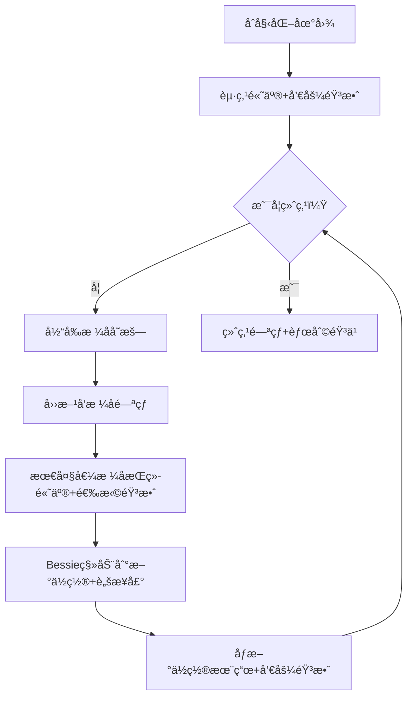

# 题目信æ¯

# [USACO09OCT] Papaya Jungle G

## 题目æè¿°

Bessie has wandered off the farm into the adjoining farmer's land. He raises delicious papaya fruit, which is a delicacy for cows. The papaya jungle is partitioned into a grid of squares with R rows and C columns (1 <= R <= 40, 1 <= C <= 40), as is popular in Wisconsin. Bessie can travel from a given square to any existing adjacent square whose route is parallel to the X or Y axis.  So in the

following diagram, if Bessie is at the square labeled 'B', she can travel to any of the squares labeled 'T':

.T.
TBT
.T.
Bessie always starts out by munching the papayas in square

(row=1,col=1).  After she's done with one square, Bessie always uses her trusty binoculars to count the low-hanging fruit in each of the adjacent squares. She then always moves to the square with the most visible uneaten fruit (a square that happily is always unique).

Sooner or later, following this rule, Bessie always ends up in square (R,C) and eats the fruit there.

Given the dimensions of the papaya jungle and the amount of fruit F\_ij in each square (1 <= F\_ij <= 100), determine the total number of fruit Bessie consumes for a given papaya jungle.

POINTS: 80

Bessieä¸å°å¿ƒæ¸¸è¡å‡ºFarmer John的田地，而走进了相邻的农民的地里。她举起一个木瓜，木瓜对奶牛æ¥è¯´å¯æ˜¯ä¸å¯å¤šå¾—å¾—ç¾å‘³ã€‚这个木瓜æ—åƒä¸€èˆ¬çš„å¨æ–¯åº·æ˜Ÿå·çš„田地一样被分割æˆä¸€ä¸ªRè¡ŒC列的网格(1 <= R <= 40, 1 <= C <= 40)。Bessieå¯ä»¥ä»ä¸€ä¸ªæ ¼æ²¿ç€ä¸€æ¡è·ŸX轴或Y轴平行的直线走到邻æ¥çš„å¦ä¸€ä¸ªæ ¼ã€‚Bessieå‘ç°ä¸€å¼€å§‹å¥¹è‡ªå·±åœ¨æœ¨ç“œæ—çš„(1,1)，也就是第一行第一列慢悠悠地咀嚼ç€æœ¨ç“œã€‚

Bessie总是用她最信赖地åŒç­’望远镜å»æ•°æ¯ä¸€ä¸ªé‚»æ¥çš„格里挂ç€çš„木瓜的数目。然å她就游è¡åˆ°é‚£ä¸ªæœ‰æœ€å¤šæ²¡æœ‰è¢«åƒæ‰çš„木瓜的邻æ¥çš„æ ¼å­ï¼ˆä¿è¯è¿™æ ·çš„æ ¼å­åªæœ‰ä¸€ä¸ªï¼‰ã€‚

按照这ç§ç§»åŠ¨æ–¹æ³•ï¼Œæœ€ç»ˆBessie总是会在(R,C)åœæ­¢ç„¶ååƒæ‰é‚£é‡Œçš„木瓜。

给定这个木瓜æ—的大å°åŠæ¯ä¸ªæ ¼çš„木瓜数F\_ij(1 <= F\_ij <= 100), è¦æ±‚Bessie一共åƒäº†å¤šå°‘个木瓜。


## 说æ˜/æ示

Three rows; four columns. Bessie starts in upper left corner at the '3'.


Bessie eats the papayas in the order given by the letters next to the numbers below:

(1,1) ---> (1,C) 

(1,1) 3a  3   4g  5h  (1,C) 

|   4b  5c  3f  2i    |

(R,1) 1   7d  4e  2j  (R,C) 

(R,1) ---> (R,C) 

She declines to eat 4 of the papayas but consumes 39 (visiting all but two squares of the grid). 


## 样例 #1

### 输入

```
3 4 
3 3 4 5 
4 5 3 2 
1 7 4 2 
```

### 输出

```
39 
```

# AI分æ结æœ


# 💡 Kayçš„C++算法解æ：Papaya Jungle G æ·±å…¥å­¦ä¹ æŒ‡å— ğŸ’¡

大家好ï¼æˆ‘是Kay，今天我们一起分æUSACOç»å…¸é¢˜ç›®ã€ŒPapaya Jungle Gã€ã€‚è¿™é“题看似简å•ï¼Œå´è•´å«äº†é‡è¦çš„模拟æ€ç»´å’Œè¾¹ç•Œå¤„ç†æŠ€å·§ï¼Œé常适åˆä½œä¸ºç®—法入门的训练题。让我们一步步拆解å§ï¼

## 1. 题目解读ä¸æ ¸å¿ƒç®—法识别

✨ **本题主è¦è€ƒå¯Ÿ**：`模拟应用` (编程技巧应用)

ğŸ—£ï¸ **åˆæ­¥åˆ†æ**：
> è¿™é“题å¯ä»¥æƒ³è±¡æˆBessie在网格地图上æ¢é™©ï¼šå¥¹ç«™åœ¨æŸä¸ªæ ¼å­æ—¶ï¼Œä¼šè§‚察**上下左å³**四个方å‘的相邻格å­ï¼Œé€‰æ‹©æœ¨ç“œæœ€å¤šçš„æ ¼å­å‰è¿›ï¼ˆé¢˜ç›®ä¿è¯å”¯ä¸€ï¼‰ã€‚整个过程就åƒç©ä¸€ä¸ªè‡ªåŠ¨å¯»å®æ¸¸æˆï¼Œæ¯ä¸€æ­¥éƒ½éµå¾ªç¡®å®šçš„规则，直到终点。

- **核心æ€è·¯**：使用循ç¯æˆ–递归模拟Bessie的移动路径。æ¯æ¬¡ç§»åŠ¨åŒ…å«ä¸‰ä¸ªå…³é”®æ“作：① åƒæ‰å½“å‰æ ¼å­çš„木瓜 â‘¡ æ¯”è¾ƒå››ä¸ªç›¸é‚»æ ¼å­ â‘¢ 移动到最大值格å­
- **å¯è§†åŒ–设计**：在åƒç´ åŠ¨ç”»ä¸­ï¼ŒBessie用奶牛图标表示，当å‰æ ¼å­ä¼šå˜æš—（已åƒï¼‰ï¼Œç›¸é‚»æ ¼å­ä¼šé—ªçƒæ示，最大值格å­ä¼šé«˜äº®é»„色边框。移动时播放8-bit音效，到达终点时播放胜利音ä¹
- **核心å˜é‡**：当å‰ä½ç½®åæ ‡(x,y)ã€æœ¨ç“œæ€»å’Œ(sum)ã€æ–¹å‘数组(dx/dy)æ§åˆ¶ç§»åŠ¨

---

## 2. 精选优质题解å‚考

我根æ®æ€è·¯æ¸…晰度ã€ä»£ç è§„范性和å®ç°æ•ˆç‡ï¼Œç²¾é€‰äº†3份优质题解：

**题解一（æ¥æºï¼šzjj20051228）**
* **点评**：这份题解采用DFS递归å®ç°ï¼Œä»£ç ç®€æ´æœ‰åŠ›ï¼ˆä»…20行）。亮点在äºï¼šâ‘  使用方å‘数组优雅处ç†ç§»åŠ¨é€»è¾‘ â‘¡ 递归结æ„自然体ç°ç§»åŠ¨è¿‡ç¨‹ â‘¢ 边界判断严谨。虽然递归深度最大1600层，但在题目é™åˆ¶ä¸‹å®Œå…¨å¯è¡Œã€‚特别适åˆå­¦ä¹ é€’å½’æ€ç»´ã€‚

**题解二（æ¥æºï¼šè·å¶ä¸‹ï¼‰**
* **点评**：创新性地使用BFSæ€æƒ³å®ç°æ¨¡æ‹Ÿè¿‡ç¨‹ã€‚亮点：① 队列结æ„使状æ€è½¬ç§»æ›´ç›´è§‚ â‘¡ 独立标记数组å¢å¼ºå¯è¯»æ€§ â‘¢ 终点判断ä½ç½®ç²¾å‡†ã€‚虽然å®é™…æ¯æ¬¡åªç§»åŠ¨ä¸€æ­¥ï¼Œä½†è¿™ç§ç»“æ„为å¤æ‚路径问题æ供了扩展æ€è·¯ã€‚

**题解三（æ¥æºï¼šé¸¿é£ï¼‰**
* **点评**：最直æ¥çš„while循ç¯å®ç°ã€‚亮点：① 无递归/无队列，内存效ç‡é«˜ â‘¡ æ–¹å‘数组使用规范 â‘¢ 边界处ç†å®Œæ•´ã€‚特别适åˆåˆå­¦è€…ç†è§£æ¨¡æ‹Ÿé—®é¢˜çš„本质，注æ„其终点处ç†éœ€è¦é¢å¤–补充。

---

## 3. 核心难点辨æä¸è§£é¢˜ç­–ç•¥

### 难点1：移动规则的å®ç°
**分æ**：如何准确找到"未åƒè¿‡çš„最大值相邻格å­"？优质解法的共性是使用**æ–¹å‘数组+循ç¯æ¯”较**。例如：
```cpp
int dx[4] = {0,0,1,-1}; // å³å·¦ä¸Šä¸‹
int dy[4] = {1,-1,0,0};
for(æ–¹å‘){
    计算新åæ ‡(nx,ny)
    if(在网格内 && 值>当å‰æœ€å¤§å€¼) 更新目标åæ ‡
}
```
💡 **学习笔记**：方å‘数组是网格类问题的通用解决方案

### 难点2：终止æ¡ä»¶å¤„ç†
**分æ**：循ç¯åº”该在**到达终点且åƒå®Œç»ˆç‚¹æœ¨ç“œå**终止。注æ„两ç§å®ç°å·®å¼‚：
- 解法Aï¼šèµ·ç‚¹å…ˆåƒ â†’ 循ç¯å†…移动+åƒä¸‹ä¸€ç‚¹ → 终点在循ç¯å†…被åƒ
- 解法B：循ç¯å†…åƒå½“å‰ç‚¹+移动 → 循ç¯å¤–è¡¥åƒç»ˆç‚¹
💡 **学习笔记**：务必在纸上模拟起点/终点的处ç†æµç¨‹

### 难点3：已åƒæ ¼å­æ ‡è®°
**分æ**：防止é‡å¤åƒçš„关键是将åƒè¿‡çš„æ ¼å­ç½®0或使用标记数组。比较：
```cpp
// 方法1：直æ¥ç½®é›¶ï¼ˆåˆ©ç”¨é¢˜ç›®æ•°å€¼>0）
grid[x][y] = 0;  

// 方法2：独立标记数组
visited[x][y] = true;
```
💡 **学习笔记**：置零法更简æ´ï¼Œä½†æ ‡è®°æ•°ç»„在å¤æ‚场景更安全

### ✨ 解题技巧总结
- **æ–¹å‘数组技巧**：用dx/dy数组代替é‡å¤ä»£ç 
- **边界防护**：判断新å标满足 `1<=nx<=r && 1<=ny<=c`
- **状æ€åˆå§‹åŒ–**：起点需å•ç‹¬å¤„ç†
- **循ç¯ç»ˆæ­¢æ¡ä»¶**：使用 `(x,y) == (r,c)` 作为终止标志
- **测试用例**：用样例验è¯ç»ˆç‚¹æ˜¯å¦è¢«æ­£ç¡®åƒæ‰

---

## 4. C++核心代ç å®ç°èµæ

### 本题通用核心C++å®ç°å‚考
```cpp
#include <iostream>
using namespace std;

int main() {
    int r, c, total = 0;
    cin >> r >> c;
    int grid[45][45] = {0}; // 多开空间防越界

    // 读入网格数æ®
    for (int i = 1; i <= r; i++)
        for (int j = 1; j <= c; j++)
            cin >> grid[i][j];

    // 起点处ç†
    int x = 1, y = 1;
    total = grid[x][y];
    grid[x][y] = 0;

    // æ–¹å‘数组：å³ã€å·¦ã€ä¸‹ã€ä¸Š
    int dx[4] = {0,0,1,-1};
    int dy[4] = {1,-1,0,0};

    // 主循ç¯
    while (x != r || y != c) {
        int max_val = 0, next_x = 0, next_y = 0;
        
        // 寻找最大值相邻格å­
        for (int i = 0; i < 4; i++) {
            int nx = x + dx[i], ny = y + dy[i];
            if (nx>=1 && nx<=r && ny>=1 && ny<=c && grid[nx][ny]>max_val) {
                max_val = grid[nx][ny];
                next_x = nx;
                next_y = ny;
            }
        }
        
        // 移动并åƒæœ¨ç“œ
        x = next_x;
        y = next_y;
        total += grid[x][y];
        grid[x][y] = 0; // 标记已åƒ
    }
    
    cout << total << endl;
    return 0;
}
```
**代ç è§£è¯»æ¦‚è¦**：
1. 网格多开空间防止边界检查越界
2. 起点(1,1)å•ç‹¬å¤„ç†ï¼šè®¡å…¥æ€»å’Œå¹¶ç½®é›¶
3. æ–¹å‘数组定义四个移动方å‘
4. 主循ç¯é€šè¿‡æ¯”较相邻格å­å†³å®šç§»åŠ¨ç›®æ ‡
5. 移动åç«‹å³åƒæ‰æ–°ä½ç½®æœ¨ç“œå¹¶æ›´æ–°æ€»å’Œ

---

### 优质题解片段èµæ

**题解一（zjj20051228）**
```cpp
void dfs(int x,int y) {
    sum += a[x][y];  // åƒå½“å‰æ ¼å­
    a[x][y] = 0;     // 置零标记
    
    if(x==r && y==c) return; // 终止æ¡ä»¶
    
    int mx, my, max_val = 0;
    // 四方å‘找最大值
    for(int i=0; i<4; i++) {
        int tx = x+dx[i], ty = y+dy[i];
        if(tx>=1 && tx<=r && ty>=1 && ty<=c && a[tx][ty]>max_val) {
            max_val = a[tx][ty];
            mx = tx; my = ty;
        }
    }
    dfs(mx, my); // 递归移动
}
```
**亮点**：递归结æ„自然体ç°ç§»åŠ¨è¿‡ç¨‹  
**学习笔记**：递归深度=路径长度，最大40×40=1600，在å…许范围内

---

**题解二（è·å¶ä¸‹ï¼‰**
```cpp
void bfs() {
    while(!q.empty()) {
        int cx = q.front().x, cy = q.front().y;
        int max_val = 0, nx = 0, ny = 0;
        
        // 四方å‘æœç´¢
        for(int i=0; i<4; i++) {
            int tx = cx+dx[i], ty = cy+dy[i];
            if(tx>=1 && tx<=r && ty>=1 && ty<=c 
               && !vis[tx][ty] 
               && grid[tx][ty] > max_val) {
                max_val = grid[tx][ty];
                nx = tx; ny = ty;
            }
        }
        
        // 处ç†æ–°ä½ç½®
        vis[nx][ny] = true;
        total += grid[nx][ny];
        q.pop();
        q.push({nx, ny});
        
        if(nx==r && ny==c) return; // 终止
    }
}
```
**亮点**：队列结æ„清晰记录移动路径  
**学习笔记**：虽然å®é™…æ¯æ¬¡åªç§»åŠ¨ä¸€æ­¥ï¼Œä½†é˜Ÿåˆ—结æ„为å¤æ‚路径问题留出扩展空间

---

**题解三（鸿é£ï¼‰**
```cpp
while(x != r || y != c) {
    // åƒå½“å‰ä½ç½®ï¼ˆæ³¨æ„起点已在循ç¯å¤–处ç†ï¼‰
    total += grid[x][y];
    grid[x][y] = 0;
    
    int max_val = 0, nx = 0, ny = 0;
    // 四方å‘比较
    for(int i=0; i<4; i++) {
        int tx = x+dx[i], ty = y+dy[i];
        if(tx>=1 && tx<=r && ty>=1 && ty<=c 
           && grid[tx][ty] > max_val) {
            max_val = grid[tx][ty];
            nx = tx; ny = ty;
        }
    }
    x = nx; y = ny; // 移动
}
total += grid[x][y]; // è¡¥åƒç»ˆç‚¹
```
**亮点**：最简循ç¯å®ç°  
**学习笔记**：特别注æ„循ç¯ç»“æŸå需补åƒç»ˆç‚¹æœ¨ç“œï¼Œè¿™æ˜¯å¸¸è§é™·é˜±ç‚¹

---

## 5. 算法å¯è§†åŒ–：åƒç´ åŠ¨ç”»æ¼”示

**动画主题**："Bessieçš„åƒç´ æ¢é™©"（å¤å¤8-bité£æ ¼ï¼‰  
**设计æ€è·¯**：用FC红白机é£æ ¼å‘ˆç°ç½‘格世界，通过音效和动画强化算法ç†è§£

### 动画帧步骤：


### 关键交互设计：
1. **视觉编ç **：
   - 当å‰æ ¼å­ï¼šé—ªçƒçš„奶牛图标
   - å·²åƒæ ¼å­ï¼šç°æš—色+æ¯è木瓜图标
   - 候选格å­ï¼šè“色边框闪çƒ
   - 最大值格å­ï¼šé‡‘色边框+放大效æœ

2. **æ§åˆ¶é¢æ¿**：
   - 速度滑å—：0.5x~4x速度调节
   - å•æ­¥æ‰§è¡Œï¼šSpace键触å‘
   - å¤ä½æŒ‰é’®ï¼šé‡æ–°åˆå§‹åŒ–地图
   - 模å¼åˆ‡æ¢ï¼šæ‰‹åŠ¨/自动演示

3. **音效系统**：
   - 移动：8-bit脚步声（ä¸åŒåœ°å½¢ä¸åŒéŸ³è°ƒï¼‰
   - åƒæœ¨ç“œï¼šæ¸…脆咀嚼声
   - 选择最大值："å®ï¼"æ示音
   - 到达终点：16和弦胜利音ä¹

4. **æ•°æ®é¢æ¿**：
   - 当å‰ä½ç½®å标：(x,y)
   - å·²åƒæœ¨ç“œæ•°ï¼šSUM=39
   - 当å‰æ­¥éª¤ï¼šStep 15/26

### 技术å®ç°è¦ç‚¹ï¼š
```javascript
// 伪代ç ç¤ºä¾‹
function drawFrame() {
  clearCanvas();
  drawGrid(); // 绘制网格
  drawBessie(currentPos); // 绘制Bessie
  if (highlightNeighbors) {
    flashNeighbors(); // é—ªçƒç›¸é‚»æ ¼å­
    highlightMax();   // 高亮最大值格å­
  }
  updateInfoPanel(); // æ›´æ–°æ•°æ®é¢æ¿
}
```

---

## 6. 拓展练习ä¸ç›¸ä¼¼é—®é¢˜æ€è€ƒ

### 通用技巧è¿ç§»
网格模拟的核心技巧适用äºï¼š
1. 固定移动规则的路径问题（如：始终å‘å³ç§»åŠ¨ï¼‰
2. 状æ€è½¬ç§»æ˜ç¡®çš„æœç´¢é—®é¢˜ï¼ˆå¦‚：BFS最短路径）
3. 交互å¼æ¨¡æ‹Ÿé—®é¢˜ï¼ˆå¦‚：游æˆAI决策）

### æ¨è练习（洛谷）：
1. **P1518 [USACO2.4]两åªå¡”姆沃斯牛**  
   → åŒè§’色移动模拟，练习状æ€åŒæ­¥
   
2. **P1032 [NOIP2002]å­—å˜æ¢**  
   → 状æ€è½¬ç§»æ¨¡æ‹Ÿï¼Œç»ƒä¹ è·¯å¾„记录
   
3. **P1443 马的éå†**  
   → å¤æ‚移动规则（象棋马步），练习BFS

---

## 7. 学习心得ä¸ç»éªŒåˆ†äº«

题解中值得注æ„çš„ç»éªŒï¼š
> "务必在纸上模拟起点/终点的处ç†æµç¨‹" —— zjj20051228  
> "æ–¹å‘数组是网格问题的万能钥匙" —— è·å¶ä¸‹

**Kay的总结**：
1. 模拟类问题è¦ç‰¹åˆ«æ³¨æ„边界æ¡ä»¶å’Œç»ˆæ­¢ä½ç½®
2. 递归解法简æ´ä½†éœ€æ³¨æ„栈深度é™åˆ¶
3. æ–¹å‘数组能大幅简化移动逻辑代ç 
4. 始终用样例验è¯èµ·ç‚¹/终点是å¦æ­£ç¡®å¤„ç†

---

通过这次分æ，相信大家ä¸ä»…æŒæ¡äº†ã€ŒPapaya Jungleã€çš„解法，更学会了如何系统分æ模拟类问题。记ä½ï¼šç¼–程能力=ç†è§£åŠ›+å®è·µåŠ›ï¼Œå¤šå†™å¤šç»ƒæ˜¯è¿›æ­¥çš„关键ï¼ä¸‹æ¬¡è§ï¼ğŸ’ª

---
处ç†ç”¨æ—¶ï¼š236.76秒