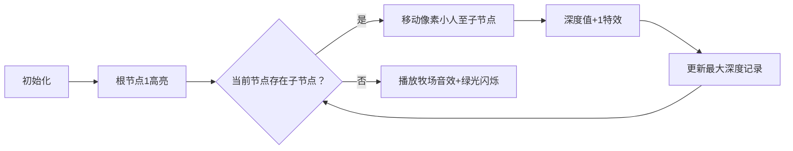

# 题目信息

# [USACO09OCT] The Leisurely Stroll G

## 题目描述

Bessie looks out the barn door at the beautiful spring day and thinks to herself, 'I'd really like to enjoy my walk out to the pastures for the tender spring grass.' She knows that once she leaves the barn, she will traverse a path for a while, take one of two choices that lead to other paths, follow one of them, take one of two other choices, and continue on until the path leads to a verdant pasture.

She decides to make the set of path choices that enables her to walk over the greatest number of cow paths on her way to breakfast. Given the description of these paths, determine how many cow paths she traverses, presuming that she commences choosing various paths as soon as she leaves the barn.

The farm has P (1 <= P <= 1,000) pastures that are lead to by P-1 choice-nodes (range 1..P-1) connected by paths. From the barn (which is node 1), only one set of path traversals exists to reach any choice-node or pasture.

Consider this set of paths (lines), pastures ('%'), and the highlighted ('#') route to a pasture on the right:

```cpp

                 %                             %
                /                             /
      2----%   7----8----%          2----%   7####8----%
     / \      /      \             # #      #      #
    1   5----6        9----%      1   5####6        9----%
     \   \    \        \           \   \    \        #
      \   %    %        %           \   %    %        %
       \                             \
        3-----%                       3-----%
         \                             \
          4----%                        4----%
           \                             \
            %                             %
```
The pasture reached from choice-node 9 is one of two that enable Bessie to traverse seven different cowpaths on the way to breakfast. These are the 'furthest' pastures from node 1, the barn.

Three integers describe each node: Cn, D1, and D2. Cn is the

nodenumber (1 <= Cn <= P-1); D1 and D2 are the destinations from that node (0 <= D1 <= P-1; 0 <= D2 <= P-1). If D1 is 0, the node leads to a pasture in that direction; D2 has the same property.

POINTS: 100

Bessie透过牛棚的大门向外望去。发现今天是一个美丽的春季早晨。她想，“我真的好想好想沐浴着春风，走在草地之中，感受嫩草温柔地抚摸四蹄地的感觉。”她知道一旦她离开了牛棚，她将沿着一条小径走一段路，然后就会出现一个三岔路口，她必须在两条小径中选择一条继续走下去。然后她又会遇到更多的三岔路口，进行更多的选择，知道她到达一个青翠的牧场为止。

她决定作一个选择使得她在去吃早草的路途中可以走过最多的小径。给你这些小径的描述，求出Bessie最多可以走过多少条小径。假定Bessie一出牛棚就有2条路径，Bessie需要从中选择一条。

农场中有P-1 (1 <= P <= 1,000) 个分岔节点（范围是1..P），引向P片草地，它们之间由小径连接。对任意一个节点来说，只有一条从牛棚（被标记为节点1）开始的路径可以到达。

考虑下面的图。线段表示小径，"%"表示草地。右边的图中的"#"表示一条到达草地的高亮的路径。

从分岔节点9到达的草地是两个可以让Bessie走过最多小径的草地之一。在去吃早草的路上Bessie将走过7条不同的小径。这些草地是离牛棚也就是节点1最“远”的。

由3个整数来表示每一个节点：Cn, D1和D2，Cn是节点的编号(1 <= Cn <= P-1); D1和D2是由该节点引出的两条小径的终点(0 <= D1 <= P-1; 0 <= D2 <= P-1)。如果D1为0，表示这条小径引向的是一片牧草地；D2也一样。


## 说明/提示

This input describes the example farm layout in the task description.


1-2-5-6-7-8-9-P is one of the longest routes.


## 样例 #1

### 输入

```
10 
7 8 0 
5 0 6 
9 0 0 
6 0 7 
3 4 0 
2 5 0 
8 0 9 
4 0 0 
1 2 3 
```

### 输出

```
7 
```

# AI分析结果


### Kay的C++算法解析：The Leisurely Stroll G 深入学习指南

#### 1. 题目解读与核心算法识别
✨ **本题主要考察**：`树形遍历` (DFS/BFS应用)  
🗣️ **初步分析**：  
> 本题本质是寻找二叉树中从根节点到叶子的最长路径边数。想象农场是一棵倒置的二叉树，牛棚是树根，分岔路口是树枝节点，牧场是树叶。核心在于通过**深度优先搜索（DFS）** 模拟Bessie的行走路径，每经过一个节点累加深度，遇到牧场时更新最大边数。  

- **核心难点**：理解节点数等于总边数（根节点初始深度1，每走一条边深度+1，最终深度即总边数）
- **算法流程**：从根节点(1)开始DFS，递归遍历非零子节点并更新深度，遇牧场时用当前深度更新答案
- **可视化设计**：采用8位像素风格，节点显示编号，牧场用绿色像素块表示。Bessie像素小人沿高亮边移动，遇牧场播放"叮"声效，更新最大深度时显示金色特效。控制面板支持单步执行和速度调节。

---

#### 2. 精选优质题解参考
**题解一（Alex_Wei）**  
* **亮点**：极致简洁（12行核心代码），DFS逻辑清晰，空间效率最优（O(1)额外空间）  
* **改进点**：变量名可读性可提升（如a/b→left/right）  

**题解二（zy小可爱ღ）**  
* **亮点**：完整注释+详细边界处理，独立比较函数提升可读性，调试友好  
* **特别价值**：作者强调"DFS新手友好"，帮助理解递归终止条件  

**题解三（chlchl）**  
* **亮点**：邻接表存储通用性强，father参数防环提升健壮性，适合图结构变形  
* **工程实践**：严格避免递归回头（虽本题树结构无需），培养安全编程习惯  

---

#### 3. 核心难点辨析与解题策略
1. **树形结构抽象**  
   - 分析：关键将农场抽象为二叉树（节点=分岔口，0=牧场）  
   - 策略：用left/right数组存储子节点，空间复杂度O(n)  
   - 💡 学习笔记：问题建模能力比代码实现更重要  

2. **深度累计逻辑**  
   - 分析：深度初始值1（根节点本身），递归+1传递  
   - 策略：遇牧场时当前深度即总边数（经数学证明depth=边数）  
   - 💡 学习笔记：递归参数传递是DFS的核心技巧  

3. **多路径最优解更新**  
   - 分析：需同步比较左右子树结果  
   - 策略：max实时更新全局答案，避免额外存储  
   - 💡 学习笔记：全局变量在DFS中可简化状态管理  

✨ **解题技巧总结**  
- 树遍历优先DFS：递归天然契合树形结构，代码更简洁  
- 边界处理前置：先判断0值（牧场）再递归，避免无效调用  
- 变量名语义化：如maxSteps替代n，提升可维护性  

---

#### 4. C++核心代码实现赏析
**通用核心实现**  
```cpp
#include <iostream>
#include <algorithm>
using namespace std;
const int MAXN = 1010;
int leftChild[MAXN], rightChild[MAXN], maxSteps;

void dfs(int node, int depth) {
    if(!leftChild[node]) maxSteps = max(maxSteps, depth);
    else dfs(leftChild[node], depth+1);
    if(!rightChild[node]) maxSteps = max(maxSteps, depth);
    else dfs(rightChild[node], depth+1);
}

int main() {
    int p; cin >> p;
    for(int i=1; i<p; i++) {
        int node, l, r;
        cin >> node >> l >> r;
        leftChild[node]=l; rightChild[node]=r;
    }
    dfs(1, 1);
    cout << maxSteps;
}
```
> **代码解读**：leftChild/rightChild存储子节点，DFS遇到0更新maxSteps。depth初始1保证计数逻辑正确。

**题解一核心片段**  
```cpp
void dfs(int m,int s){
    if(a[m]) dfs(a[m],s+1);
    if(b[m]) dfs(b[m],s+1);
    n=max(n,s);  // 遇0时更新
}
```
> **逐行解读**：  
> - `a[m]/b[m]`存储子节点（可读性优化点）  
> - 递归时`s+1`实现深度累加  
> - **精妙点**：遇0不递归但会执行`max(n,s)`，此时`s`即总边数  

**题解二核心片段**  
```cpp
void dfs(int t,int an){
    if(a[t][1]==0) ans=max(ans,an+1);  // 左路牧场
    else dfs(a[t][1],an+1);            // 左路递归
    if(a[t][2]==0) ans=max(ans,an+1);  // 右路牧场
    else dfs(a[t][2],an+1);            // 右路递归
}
```
> **设计亮点**：  
> - 显示`an+1`强调深度增量逻辑  
> - 独立比较函数`ma`提升性能（编译器通常自动优化）  
> - 牧场判断前置避免无效递归  

---

### 5. 算法可视化：像素动画演示
**主题**：`像素牧场大冒险`  
**核心交互设计**：  

**关键实现细节**：  
1. **像素艺术**：  
   - 节点：16x16像素块，棕色边框+白色编号  
   - 牧场：闪烁绿色草地图案  
   - Bessie：8x8牛仔像素精灵  

2. **动态效果**：  
   - 路径高亮：当前遍历边显示黄色脉冲光效  
   - 深度显示：右上角计数器实时更新  
   - 音效设计：  
     * 移动："嘀"声（8-bit脚步声）  
     * 牧场："叮"声（竖琴音效）  
     * 新记录：小号胜利旋律  

3. **游戏化元素**：  
   - 关卡进度：每5深度解锁新BGM  
   - 成就系统：破记录时显示"金牌牧场"奖杯  
   - AI演示模式：自动以最优速度遍历最长路径  

> **教育价值**：通过像素小人移动直观展示DFS递归与回溯过程，深度计数特效强化"节点数=边数"的核心概念。

---

### 6. 拓展练习与相似问题
**通用技巧迁移**：  
1. 树深度变形：加权边/多叉树  
2. 路径记录：回溯法存储完整路径  
3. 动态规划：结合树形DP求最优解  

**洛谷推荐**：  
1. **P4913 二叉树深度**  
   → 直接应用本题技巧，巩固DFS遍历  
2. **P5076 BST基本操作**  
   → 学习树结构扩展应用，培养数据结构思维  
3. **P3884 二叉树问题**  
   → 综合训练深度/宽度计算，提升树形问题解决能力  

---
### 结语  
通过DFS遍历树形结构是算法学习的重要里程碑。本题的精髓在于理解**深度累计**与**树形抽象**的关联。记住Kay的秘诀："遇牧场更答案，见分岔即递归"。尝试用像素动画可视化自己的代码，你会惊讶于算法的美感！下次我们将探索图论中的最短路径，继续加油！🚀

---
处理用时：319.56秒